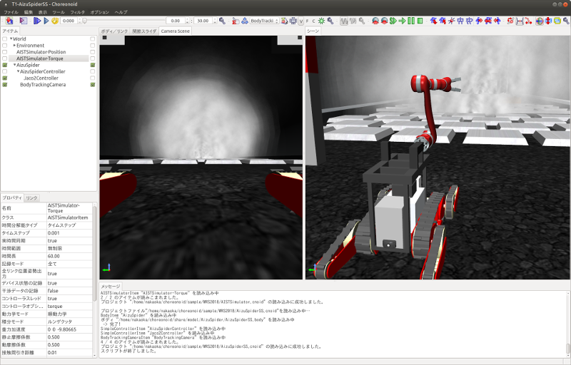
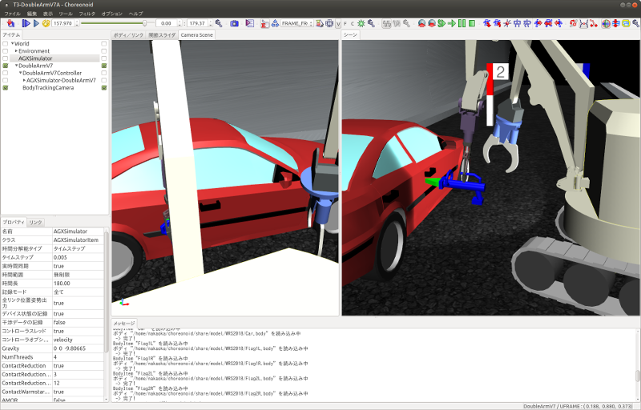

Simulation samples
==================

Here we will explain about the WRS2018 simulation samples.

.. contents::
   :local:

.. highlight:: sh

Overview
--------

Each of the WRS2018 tasks is carried out as a simulation that combines the following elements.

* Environment model
* Robot model
* Robot control software
* Robot operation interface
* Simulation settings

Different environmental models are available that correspond to tasks T1 to T6, respectively. By adding robots to these and configuring the simulation settings, it becomes possible to simulate the task.

This is where the robots change depending on each participating team in the competition. There may be some teams that use the standard robot model as is, while other teams may make changes to it or make use of their own models. Also, a robot will not work if all it has is a model. It also needs elements such as control software to move the robot and an interface for teleoperation. These are also important factors that greatly influence the outcome of the competition, and we expect that each team will build its own setup.

As such, the simulations actually carried out at the competition will be different for each team, so we are unable offer the same thing pre-bundled with Choreonoid.

Instead, we have prepared simulation samples, which we will introduce here. Running the samples and trying them out will give you an idea of what the actual competition is like.

However, the robot control software and operation interface in the samples are very basic. It would be difficult to score highly using just these, and many of the tasks are difficult to complete in the first place. The samples introduced here are simply to give you an idea of the tasks, and you should remember that you will need to have much more advanced control software and operation interface in the actual competition than those included in these samples. You could say that the competitive development of such elements is one of the purposes of this competition.

Project structure and importing
-------------------------------

The simulation sample :ref:`projects <basics_about_project>`  are stored in the directory named sample/WRS2018 in the Choreonoid source code.

In order to be able to use this, set **BUILD_WRS2018** to **ON** when building Choreonoid. By doing so, the following process will be carried out.

* The controllers required for the task simulation will be built. These controllers will be used not to control the robots but to control the behavior of the task environment models. For example, in task T5, the nozzle is connected to the hose, the valve is opened, the lever of the nozzle is pulled, and firefighting water is discharged from the nozzle. This behavior is achieved by using the controller HoseNozzleController.

* A symbolic link to the directory containing the WRS2018 samples is created in the share subdirectory inside the build directory. This makes it possible to execute the WRS2018 samples from Choreonoid in the build directory. (If the share directory is being built above the source directory, it becomes the source's share directory. If the build directory is separate, it will be a subdirectory of the build directory called share/choreonoid-x.x.)

* When installing, a subdirectory named WRS2018 will be created in the share directory of the installation destination (installation destination/share/choreonoid-x.x), and the samples will be installed there. This makes it possible to execute the WRS2018 samples from the installed Choreonoid.

The project is divided into several files written as Python scripts, and they are imported in combination. This is because, in addition to the fact that there are six tasks in total, there are also multiple robot models and simulation settings available for use, and if they were combined into project files as they are, it would require an enormous number of project files, including duplicates. In such a scenario, when modifying one element, you would need to modify the same thing in multiple project files, which would make management difficult.

Project files are made up of the following elements. These are stored under the WRS2018/project directory.

* Task environment model

 * Task T1: T1L.cnoid (for large robots), T1M.cnoid (for medium-size robots)
 * Task T2: T2.cnoid
 * Task T3: T3.cnoid
 * Task T4: T4.cnoid
 * Task T5: T5.cnoid
 * Task T6: T6.cnoid

 .. note:: In the actual competition, as you move from the qualifying round through the semi-finals and the final, the tasks become increasingly difficult. The above files are for the qualifying round models, and files for the semi-final and final stages are named as above, with the added suffixes “-2” and “-3”.

* Settings related to the robot models

 * AizuSpiderSS (single arm, simple track version): AizuSpiderSS.cnoid
 * AizuSpiderSA (single arm, AGX track version): AizuSpiderSA.cnoid
 * DoubleArmV7S (simple track version): DoubleArmV7S.cnoid
 * DoubleArmV7A (AGX track version): DoubleArmV7A.cnoid
 * WAREC-1: WAREC1.cnoid
 * Quadcopter: Quadcopter.cnoid

* Simulation settings

 * AIST Physics Engine (doesn’t require AGX Dynamics): AISTSimulator.cnoid
 * AGX Dynamics: AGXSimulator.cnoid

* View settings

 * For standalone execution (with multiple scene views): MultiSceneViews.cnoid
 * For teleoperated execution (with a single scene view): SingleSceneView.cnoid

To build a project by combining these, Python scripts with filenames in the format below are available. These are stored under the WRS2018/script directory.

* task-robotmodel.py

For example, for a project that uses a simple track version of the Aizu Spider robot to do task T1,

* T1-AizuSpiderSS.py

would be the file name.

The Python scripts corresponding to projects can be specified in the same way as project files, as command line parameters when launching Choreonoid.

For example, if you built Choreonoid by following the  :doc:`setup` / :ref:`wrs2018_install_choreonoid` , then by inputting  ::

 bin/choreonoid sample/WRS2018/script/T1-AizuSpiderSS.py

in the source directory, the above project will be imported. If you are using Choreonoid in the installation location, it will be run as ::

 choreonoid /usr/local/share/choreonoid-1.6/WRS2018/script/T1-AizuSpiderSS.py

. (This is an example where Choreonoid is installed under the /usr/local directory and /usr/local/bin is added to your PATH.)

Note that the scripts are available for the qualifying round models. For semi-final and final stage models, the scripts can be used by changing the parameters of WRSUtil.loadProject in each script. For example, for T1-AizuSpiderSS.py, the script is ::

 import WRSUtil
 WRSUtil.loadProject(
     "MultiSceneViews", "T1L", "AGXSimulator", "DoubleArmV7A")

and if you change “TL1” to “TL2”, it will import the model for the semi-final stage.

Each script is actually generated by generate-sample-projects.py stored under the WRS2018/script directory, so it is also okay to modify that file and execute it.

Carrying out Task T1
--------------------

First, let’s try out the sample for the first task, T1 (Traversing obstacles) The are several variations of this, so we will explain them in order below. We will also explain about details that are common to other tasks.

Running the AizuSpiderSS version
~~~~~~~~~~~~~~~~~~~~~~~~~~~~~~~~

First, let’s try a sample that can be run without an AGX Dynamics license. Launch Choreonoid and import the sample for AizuSpiderSS, as shown below. (From here on, it assumed that we are using Choreonoid built on the source directory.) ::

 bin/choreonoid sample/WRS2018/script/T1M-AizuSpiderSS.py

Then, you should see the screen shown below.

.. この図は競技開催前の暫定版のタスクモデルなので、現在のモデルに置き換える必要がある。

Now, let’s do the :ref:`simulation_start_simulation` . Then, you will be able to control the displayed Aizu Spider robot from the game pad. For how to operate it, refer to the summary in the  section, :ref:`wrs_sample_controller_aizu_spider` .

Maneuver the robot so that it traverses the rough terrain and avoids obstacles to get right inside the tunnel. After passing through the starting gate, this task will be cleared once the robot has passed through the gate at the end of the tunnel.

What you see here displayed in the center of the screen is the image of the camera installed in the robot. In this sample, teleoperation of the robot is performed while viewing this camera image. Meanwhile, displayed on the right side of the screen is the view of the robot as seen from diagonally behind. However, this is not a viewpoint of a camera that is fitted to the robot, so it cannot be used to teleoperate the robot. In the competition, this kind of viewpoint is displayed on the simulation PC, and it is used for audience viewing or to help the judges make decisions.

For this AizuSpiderSS robot model, the tracks being used are the simple type. It is possible to simulate this using the “AIST simulator” which is the standard Choreonoid :ref:`simulation_simulator_item`  and that is what it is set to in this sample. However, as you will find when you move it, the belt-like parts (tracks) do not actually rotate, and the robot progresses without the tracks moving. This is an application of the  :doc:`../simulation/pseudo-continuous-track` . In this case, the behavior of the tracks is not very close to the real machine and may become unstable depending on the contact with the environment, but please accept this as a limitation of this simulation method. One of the reasons for using AGX Dynamics in this competition is to overcome this limitation.

In the sample using the AIST simulator, two settings are available for the AIST simulator for testing purposes. One is the AISTSimulator-Torque simulator item, and its command value is the torque value. The other available setting is the AISTSimulator-Position simulator item, and the command values to sent the robot’s joints are the positional (joint angle) commands. The control software description method and the simulation behavior are somewhat different the two. We will not touch on the details here, but since the AIST simulator is not used in the competition, you don’t need to worry too much about it. However, you should remember that you will need to select one of the items when executing the simulation. By default, torque is selected.

About scene effects
~~~~~~~~~~~~~~~~~~~

In the T1 sample, smoke is generated in various places inside the tunnel, as shown in the image above. This may impair the robot’s visibility, so you will need to devise a way for the robot to carry out the task under these conditions.

This smoke is what is called a scene effect, and it will be enabled when :ref:`wrs2018_install_choreonoid` if BUILD_SCENE_EFFECTS_PLUGIN is turned ON and :doc:`../install/setup-renderer`  is done. If smoke is not displayed, it means something is missing in those settings, so you should check them again. Other scene effects include flames, flowing water, etc., which are also used in other tasks. Therefore, the scene effects feature needs to be enabled in order to reproduce the competition completely.

However, when scene effects is enabled, it increases the load on the PC. If the specifications of the PC on which the simulation will be executed are not equivalent to those shown in :ref:`wrs2018_overview_simulator` , the simulation may run slow or the display may not be smooth. If the extent of this is large and it is hindering your preparation for participating in the competition, you should turn off the scene effects feature before use.

.. note:: The scene effects feature is executed using the SceneEffects plugin. This will not be built unless BUILD_SCENE_EFFECTS_PLUGIN is set to ON during the :ref:`wrs2018_install_choreonoid` . However, if it has already been built, you will need to delete this plugin file after changing this setting. There is explanation about the plugin in the  :ref:`basics_plugin_files` section, so refer to this and delete the corresponding libCnoidSceneEffectsPlugin.so file. Even if you do not use the scene effects, you should enable  :doc:`../install/setup-renderer`  as much as possible.

About teleoperation
~~~~~~~~~~~~~~~~~~~

The sample introduced in this section is for operating on Choreonoid, on which all simulation including robot operation is performed, so it is not the teleoperation configuration introduced in :ref:`wrs2018_overview_operation` . First of all, in order to get an overview of the task and simulation, the configuration is simple and easy to handle.

Then, the remotely controlled samples are introduced in

* :doc:`teleoperation-rtm`
* :doc:`teleoperation-ros`

so refer to them if you want to create a configuration for teleoperation.

Running the AizuSpiderSA version
~~~~~~~~~~~~~~~~~~~~~~~~~~~~~~~~

Next, we will introduce a simulation that uses AGX Dynamics. This is what will be used in the actual competition. If you have an AGX Dynamics license and you have finished :ref:`wrs2018_install_agx` , you should also try this out.

The single-arm, AGX track version of the Aizu Spider model is AizuSpiderSA. You can import the corresponding T1 project with the following command. ::

 bin/choreonoid sample/WRS2018/script/T1-AizuSpiderSA.py

The control method is the same as for the simple track version, so try controlling this one using the gamepad.

With the AGX version, the track parts will actually propel the robot while rotating around the wheels. If you actually use this to try travelling over rough terrain, etc., you can see that the behavior of the tracks is closer to that of the real thing.

Running the DoubleArmV7 version
~~~~~~~~~~~~~~~~~~~~~~~~~~~~~~~

A sample is also available for the dual-arm construction robot model DoubleArmV7.

The simple track and AGX track versions are supported by the separate

* T1-DoubleArmV7S.py
* T1-DoubleArmV7A.py

Python scripts, so import and execute them in the same way as before.

Refer to the :ref:`wrs_sample_controller_doublearmv7` section for information on how to control it.

You will see that the robot is considerably larger than the Aizu Spider. So it can move over rough terrain more easily, but it has difficulty getting through narrow spaces. However, obstacles will be adjusted according to the size of the robot. Refer to the  :ref:`wrs2018_overview_rules` for details.

Running the WAREC-1 version
~~~~~~~~~~~~~~~~~~~~~~~~~~~

The sample supporting WAREC-1 is、

* T1-WAREC1.py

.

There is currently no sample controller available for this model.

While AizuSpider and DoubleArmV7 can at least move if commands are sent to the tracks, it is impossible for WAREC-1 to move unless you control the legs in an integrated way to make it walk, etc. So, using the controller is complicated, even just to get it moving. Please understand that, due to these circumstances, we cannot currently provide a sample controller.

Since the controller is not set up, when you launch the simulation with this sample, the robot will collapse due to gravity.

Due to this situation with WAREC-1, only the sample for task T1 is available.

Unlike Aizu Spider and DoubleArm V7, WAREC-1 does not have separate simple and AGX versions. For the sample, both the AIST simulator and the AGX simulator can be imported, so simulation is possible with either of them. If AGX Dynamics is installed, the AGX simulator will be selected by default.

Running the multicopter version
~~~~~~~~~~~~~~~~~~~~~~~~~~~~~~~

For the multicopter sample, the simulation project named

* T1-Quadcopter.py

is available, which uses the quadcopter model.

You can operate the robot with the gamepad in this project, also. The controller uses the :ref:`multicopter_plugin_sample_simulation` , so refer to that explanation for the operation method.

About tasks T2 to T6
--------------------

Sample projects are also available for tasks T2 onward. Projects are imported and executed in the same way as for task T1. Basically, it’s okay to just change where it says “T1” in the T1 project to “T2”, “T3”, etc. However, depending on the task, there will be some settings that are not the same as in T1. Please take note of that before you begin.

Task T2
~~~~~~~

Task T2 involves inspecting a vehicle.

The image below shows where T2-AizuSpiderSA.py has been imported and the simulation is running.

.. image:: images/T2-AizuSpiderSA.png

In T2, there is a vehicle inside the tunnel as shown. This door is opened and the inside of the vehicle is checked.

Open the door by grasping and pulling the door handle. In the sample, the door is slightly open. In the competition, it is likely that the door will initially be completely closed. Take into consideration that, in the AIST simulator, the hinges of the door are able to open beyond the movable range. In the AGX simulator, they move correctly.

In the actual competition, there will be several “target markers” inside the vehicle, which are used in judging.

The target markers are cylindrical objects as shown in the figure below.

.. image:: images/target-marker1.png

There is a QR code inside the cylinder.

.. image:: images/target-marker2.png

What you need to do is to find the target marker, use the camera to capture an image inside it, and decipher the QR code.

Although this is not something that would be done in the event of a real disaster, we decided to use such markers in the competition as a way of judging whether the interior of the vehicle has been inspected.

Task T3
~~~~~~~

Task T3 involves inspecting vehicles using tools and rescuing victims from inside vehicles.

The screenshot below shows where T3-DoubleArmV7A.py has been imported and the task is being carried out with DoubleArmV7.

At a glance, it looks like the same setup as in T2, but someone in need of rescue (a dummy target) is trapped inside the vehicle. The door cannot be opened normally. A hydraulic spreader is placed in the tunnel, which you can use to remove the door by operating it and pressing it against the door lock or hinges. (However, this simulation requires AGX Dynamics.) When you have removed the door, move it so that it does not get in the way, and carry the dummy target out of the car.

The dummy target is a model as shown below, and it is slumped in the driver’s seat.

.. image:: images/dummy-doll.png

Task T4
~~~~~~~

Task T4 involves securing the route. The screenshot below shows where T4-DoubleArmV7A.py has been imported and is running.

.. image:: images/T4-DoubleArmV7A.png

In the sample, there are several obstacles scattered inside the tunnel, so you need to operate the robot so that they push or lift these obstacles out of the way.

Task T5
~~~~~~~

Task T5 involves extinguishing fire. The screenshot below shows where T5-AizuSpiderSA.py has been imported and is running.

.. image:: images/T5-AizuSpiderSA.png

There is a fire hydrant installed inside the tunnel. Open the door to the fire hydrant and you will find a hose reel, nozzle and valve stored inside.

.. image:: images/FireCabinet2.png

Pull the end of the hose to unravel and pull it out. First, try out this maneuver. However, please be aware that AGX Dynamics is also required for the hose simulation.

For the task, pull out the hose, connect the end to the nozzle, turn the valve, pull the lever of the nozzle, and water will come out from the nozzle.

Once water is flowing, point it at the location of the fire. If your aim is good, the fire will die down. If you put it out completely and pass through the finish gate, the task is complete.

Task T6
~~~~~~~

Task T6 involves shoring and breaching. The screenshot below shows where T6-DoubleArmV7A.py has been imported and is running.

.. image:: images/T6-DoubleArmV7A.png

In this task, a collapsed wall panels (plate-shaped objects) are stacked on top of a vehicle. First of all, insert the wooden supports as shoring under the designated wall panels to stabilize them. Next, breaching involves using a drill to drill a hole in the wall panel from above. Once the hole has been opened, push a camera through the hole and check inside the vehicle. The window of the target vehicle is open, so insert the camera from there and investigate. The investigation method is the same as in T2, and involves reading the target marker QR codes.

Again, opening up the hole with a drill requires AGX Dynamics.
