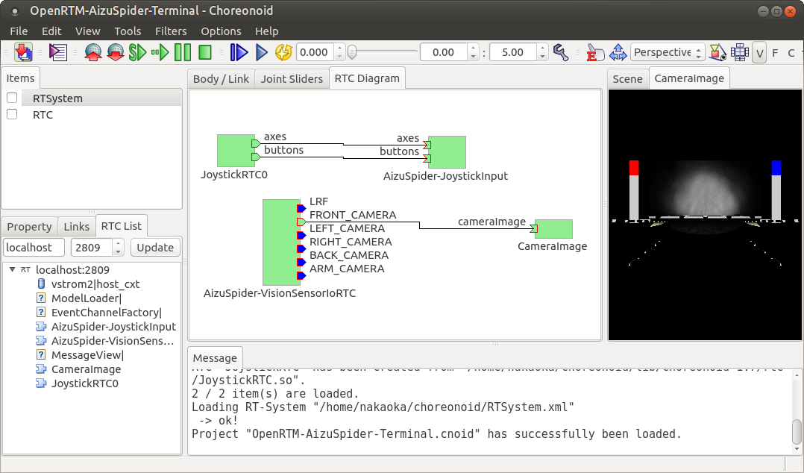

Teleoperation sample using OpenRTM
==================================

In the :doc:`simulation-samples` section, we introduced a sample that can also operate the robot directly from the simulator. However, in the actual competition, robot operation must be performed on a PC different from the simulation PC, and it must be operated remotely. To enable teleoperation as the means of operating your robot, here we will introduce a sample that uses OpenRTM.

.. contents::
   :local:

.. highlight:: sh

Preparing OpenRTM
-----------------

Preparing for teleoperation with OpenRTM requires first  :ref:`wrs2018_install_openrtm` . In the build of Choreonoid, enable

* ENABLE_CORBA
* BUILD_CORBA_PLUGIN
* BUILD_OPENRTM_PLUGIN
* BUILD_OPENRTM_SAMPLES

and build the features, samples, etc. related to OpenRTM.

Be sure to also :ref:`openrtmplugin_patch_for_version112` and check the :ref:`openrtmplugin_setup_corba` .

Running the teleoperation samples
---------------------------------

When teleoperation is performed with OpenRTM, we first introduce RTC on Choreonoid where the simulation will be run, so that input/output required for operation of the robot can be done via the RT Component.

A sample set up in this way is provided, with the suffix “-RTM” appended to the name of the sample introduced in the  :doc:`simulation-samples` section.

At the present time, the following projects are available.

* T1-AizuSpiderSA-RTM.py
* T1-AizuSpiderSS-RTM.py

Import one of the above projects in the same way as explained in the :doc:`simulation-samples` section. For example, from the Choreonoid source directory, it will be something like ::

 bin/choreonoid sample/WRS2018/script/T1-AizuSpiderSA-RTM.py

.

Next, we will prepare the teleoperation interface. In this sample, Choreonoid is also used for the teleoperation interface, so launch it. The project file for this is

* sample/OpenRTM/OpenRTM-AizuSpider-Terminal.cnoid

. With Choreonoid for the simulation launched, now launch the second Choreonoid. To do this, launch the command line terminal, as from the source directory as above, input something like ::

 bin/choreonoid sample/OpenRTM/OpenRTM-AizuSpider-Terminal.cnoid

. If you are using Choreonoid in the installation location, it will be run as ::

 choreonoid /usr/local/share/choreonoid-1.6/project/OpenRTM-AizuSpider-Terminal.cnoid

.

The Choreonoid for teleoperation should look like the screenshot below.

.. image:: images/openrtm-terminal1.png

In the center of the screen is what is called the RC Diagram View. This provides the same functionality as RT System Editor, which is a basic tool of OpenRTM.

In this Diagram, AizuSpider-JoystickInput is the RTC set up and generated in the Choreonoid for simulation.  It has an input port for the joystick and it is for conveying the state of the joystick to the control program of the robot.

Also, AizuSpider-VisionSensorIoRTC is of course the RTC which is set up and generated in the Choreonoid for simulation, and it has a port for outputting visual sensor data. The number of output ports is equal to the number of visual sensors fitted to the robot. The names of the ports correspond to the names of the sensors.

meanwhile, JoystickRTC0 is the RTC generated by the Choreonoid for teleoperation (ie. Choreonoid on this screen). This, as its name suggests, corresponds to the joystick, and it is the RTC which outputs the state of the joystick. By connecting this output port to the AizuSpider-JoystickInput input port, you will be able to let the robot know the state of the joystick.

CameraImage is the RTC that corresponds to the view displaying the camera image. This is the view named CameraImage on the right side of the screen. By connecting the ports, this also makes it possible to display the robot’s camera image on the terminal side.

In this state, because the simulation has not started yet (ie. the robot is not running), AizuSpider-JoystickInput and AizuSpider-VisionSensorIoRTC on the robot side are not activated and are displayed in blue. Meanwhile, JoystickRTC0 and CameraImage on the terminal side are already usable, the RTC is also in the activated state, and they are displayed in green.

So, let’s launch the simulation and perform the teleoperation. Launch the simulation of the simulation-side Choreonoid. (Note that if you do this on the Choreonoid for teleoperation, nothing will happen.)

Now, the Choreonoid for teleoperation should look like the screenshot below.

As the simulation has been launched, the RTC on the robot side has become active (green). Also, in the CameraImage view, the robot’s camera image should be displayed. Now you can operate the robot using the gamepad.

Remote communication using 2 PCs
--------------------------------

What you have tried out above was running the simulation (robot) side and the operation side on the same PC. Even in this case, communication is performed between the two using OpenRTM. But as originally described in  :ref:`wrs2018_overview_operation` , the simulation side and the operation side have to be on separate PCs and communication between them has to be done remotely.

In order to achieve this, first prepare 2 PCs with Choreonoid running on both. One will be the PC for simulation, the other will be the teleoperation PC. While it is advisable to perform the simulation on a high-spec PC, the operating side does not need high specifications (for this current sample), so if your two PCs have different specifications, use the higher-spec PC for the simulation. Connect the gamepad to the teleoperation PC.

Next, configure the communication settings. In order for RTCs that span multiple PCs to communicate with each other, they all need to know each other’s locations. In OpenRTM, this is usually achieved using a shared name server. If you have multiple PCs using the same name server, communication between the RTCs registered there is possible, regardless of where they actually are.

To share the name server, set the address of the name server on one of the PCs to the address of the other PC. There are various ways of doing this, but for now, let’s do it as follows. First, create a file named rtc.conf in the directory where the simulation Choreonoid is launched on the simulation PC, with the following content. ::

 corba.nameservers: teleoperation PC’s host name and IP address

In this way, the name server used on the simulation PC will become the name server for the teleoperation PC, and name server sharing will be established.

What often happens is that each PC is usually assigned an address by DHCP. In that case, you will need to look up the assigned IP addresses. In the case of DHCP, the address may change every time it connects to the network, so it might be a good idea to check the address each time.

.. note:: rtc.conf is the configuration file for OpenRTM. If this file is in the current directory, the settings described in the file will be applied. There are other files equivalent to rtc.conf. Refer to the OpenRTM manual for details.

It is okay if the above-described operations are divided between the simulation PC and the teleoperation PC. If it is the same project as above, first run the following on the simulation PC side: ::

 bin/choreonoid sample/WRS2018/script/T1-AizuSpiderSA-RTM.py

Next, on the teleoperation PC side, run the following: ::

 bin/choreonoid sample/OpenRTM/OpenRTM-AizuSpider-Terminal.cnoid

(both are examples of commands where the Choreonoid built on the source directory is being used.)

Launch the simulation in Choreonoid on the simulation PC.

Then as before, you should be able to operate with the gamepad while viewing the camera image in the Choreonoid for teleoperation.
