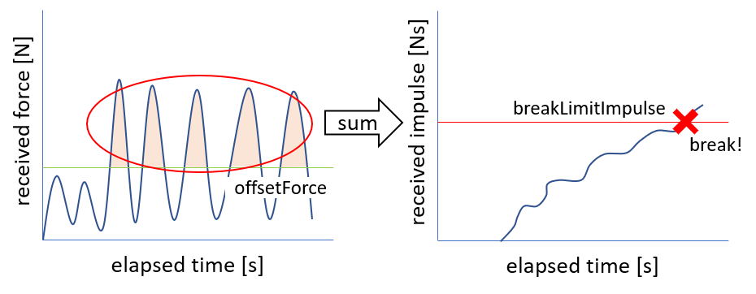

AGXBreakableJoint
===========================

| AGXBrekableJointはAGX Dynamicsをつかったジョイントで、一定の条件を満たすとジョイントが破壊(無効化)されます。
| 実装にはAGX DynamicsのHinge、Prismatic、LockJointを利用しています。

.. _agx_breaking_door:

.. image:: images/breakable_joint.png

.. contents::
   :local:
   :depth: 2

サンプル
------------

サンプルを使った利用方法の説明をします。サンプルプロジェクトは以下にあります。
DoubleArmを操作し、ドアを掴みながら引くとヒンジ拘束がなくなりドアが外れる様子を確認することができます。

* プロジェクトファイル: chorenoid/sample/AGXDynamics/agxBreakableJoint.cnoid
* ボデイファイル: chorenoid/sample/AGXDynamics/agxBreakableJoint.body

破壊条件
------------

冒頭で説明しました通り、AGXBreakableJointでは一定の条件を満たすと破壊がトリガーされます。
その条件は以下の2種類で、breakTypeパラメータで指定します。

* **一定時間一定以上の力を受け続けた時(breakType: force)**

.. image:: images/breakable_joint_breaklimitforce.png
   :scale: 70%

* **受けた力積が閾値を超えた時(breakType: impulse)**

breakTypeは力の受け方で使い分けをします。
例えば、ヒンジで取り付けられたドアを取り外すようなシーン( :ref:`agx_breaking_door` )ではforceが適しています。
一方でドリルで周期的に衝撃を受けるものについては一定以上の力を受け続けることは難しいため、impulseが適しています。

記述方法
------------

AGXMagneticJointは以下のように記述し、利用します。

.. code-block:: yaml

  links:
    -
      name: Door
      parent: PillarL
      jointType: free
      elements:
        -
          type: AGXBreakableJointDevice
          link1Name: PillarL
          link2Name: Door
          jointType: revolute
          jointRange: [ 0, 180 ]
          position: [ 0, 0, 0 ]
          jointAxis: [ 0, 0, 1 ]
          jointCompliance: 1e-6
          breakType: force
          period: 3.0                 # 3sec以上
          breakLimitForce: 3000       # 3000N以上の力を
          validAxis: [0, 1, 0]        # Y軸方向にかけると破壊

1. AGXBreakableJointで接続したいリンクをlinkNameに設定します
2. 関節タイプをjointTypeに設定します
3. 関節の位置と軸をpositionとjointAxisに設定します
4. breakTypeで破壊のタイプを設定します
  * breakType: forceの場合、breakLimitForceとperiodを設定します
  * breakType: impulseの場合、breakLimitImpulseを設定します
5. 必要に応じてバネの硬さ、ダンピングをjointCompliance、jointSpookDampingに設定します
6. 必要に応じてvalidAxisを設定します。validAxisは関節軸のどの軸をbreakLimitの計算に利用するかを指定することができます。例えば、下図ではvalidAxisを[0, 1, 0]とすることで、XZ軸方向のに加えられた力は考慮しないということになります。

.. image:: images/breakable_joint_validaxis.png
   :scale: 50%

パラメータの説明
------------
| 以下にパラメータの説明をします。

.. tabularcolumns:: |p{3.5cm}|p{11.5cm}|
.. list-table::
  :widths: 20,9,4,4,75
  :header-rows: 1

  * - パラメータ
    - デフォルト値
    - 単位
    - 型
    - 意味
  * - type: AGXBreakableJointDevice
    - \-
    - \-
    - string
    - AGXBreakableJointを使うことの宣言
  * - link1Name
    - \-
    - \-
    - string
    - リンク名
  * - link2Name
    - \-
    - \-
    - string
    - リンク名
  * - jointType
    - \-
    - \-
    - string
    - 関節タイプ: revolute, prismatic, fixed
  * - position
    - [ 0, 0, 0]
    - m
    - Vec3
    - link1の座標系からみた関節位置
  * - jointAxis
    - [ 0, 0, 1]
    - \-
    - Unit Vec3
    - 関節軸
  * - jointRange
    - [ -inf, inf ]
    - m or deg
    - Vec2
    - 関節可動範囲
  * - jointCompliance
    - 1e-8
    - m/N
    - double
    - 関節コンプライアンス
  * - jointSpookDamping
    - 0.33
    - s
    - double
    - 関節スプークダンパ
  * - breakType
    - force
    - \-
    - string
    - 破壊タイプ: force、impulse
  * - breakLimitForce
    - double_max
    - N
    - double
    - 関節破壊の力閾値
  * - period
    - 0
    - s
    - double
    - 時間閾値
  * - breakLimitImpulse
    - double_max
    - Ns
    - double
    - 関節破壊の力積閾値
  * - offsetForce
    - 0
    - N
    - double
    - オフセット力
