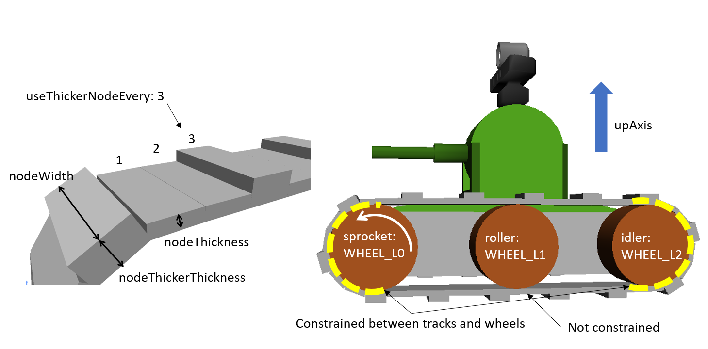

AGX Vehicle Continuous Track (AGXクローラ)
==========================================

AGXVehicleContinuousTrackはAGX Dynamicsを使ったクローラモデルです。
実装にはAGX DynamicsのモジュールagxVehicleを利用しています。

.. image:: images/continuous-track.png
   :scale: 70%

.. contents::
   :local:
   :depth: 1

AGXVehicleContinuousTrackの特徴
-------------------------------

* **クローラベルトの自動装着**

  シミュレーションを実行すると、ホイールにクローラベルトが自動的に装着されます。
  ユーザはホイールと各種パラメータを設定するのみで、幾何的な配置を考える必要がありません。

* **クローラベルトがホイールから外れにくい**

  クローラベルトがホイールから外れないように、内部でホイールとベルトのマージ(拘束を付加)しています。

* **性能向上のための最適化**

  クローラベルトは複数のプレート状のノードをヒンジでつなぎ合わせて表現をしています。
  ノード一つ一つが剛体であるため、クローラベルトが床に接触すると、複数の接触点が生成されます。
  AGX Dynamicsではこの接触点を利用して、クローラベルトが床に侵入しないように抗力の計算をします。
  接触点が増えると、抗力の計算量が増えることになります。
  計算量が増えると、実時間内で計算が終わらなくなり、パフォーマンスが劣化
  本モデルには複数のノードを一時的にマージし、接触点の数を減らすことで性能劣化を抑える機能を持っています。

サンプル
--------

サンプルを使った利用方法の説明をします。サンプルプロジェクトは以下にあります。

* タンクとLaboのシーン : chorenoid/Share/project/TankJoystickAGX.cnoid
* タンクと床のシンプルなシーン : chorenoid/Share/project/TankJoystickAGX_Floor.cnoid

サンプルプロジェクトで利用されているモデルは以下にあります。

* chorenoid/Share/project/tank_agx.body

| Choreonoidでサンプルプロジェクトをロードし、AGXSimulatorでシミュレーションを実行すると、タンクのホイールにクローラベルトが装着されます。
| PS4コントローラが接続されている場合は左スティックで、接続されていない場合はキーボードのE、D、S、Fでタンクを移動させることができます。

記述方法
--------

サンプルモデルは以下のリンク構成となっています。

.. code-block:: yaml

  links:
    -
      name: CHASSIS
    -
      name: TURRET_Y
    -
      name: TURRET_P
    -
      name: TRACK_L      # 左クローラ(内外フレームつき)
    -
      name: WHEEL_L0     # 左前ホイール(モータ駆動)
    -
      name: WHEEL_L1     # 左中ホイール(自由回転)
    -
      name: WHEEL_L2     # 左後ホイール(自由回転)
    -
      name: TRACK_R      # 右クローラ(内外フレームつき)
    -
      name: WHEEL_R0     # 右前ホイール(モータ駆動)
    -
      name: WHEEL_R1     # 右中ホイール(自由回転)
    -
      name: WHEEL_R2     # 右後ホイール(自由回転)

| TRACK_L、TRACK_R以外は通常のChoreonoidの記述方法に従って内容を記述します。
| TRACK_Lの詳細は以下のようになっており、内外のフレーム、AGXVehicleContinuousTrackの2種類が記述されています。

.. code-block:: yaml

  -
    name: TRACK_L
    parent: CHASSIS
    translation: [ 0, 0.16, -0.026 ]
    jointType: fixed
    centerOfMass: [ 0, 0, 0 ]
    mass: 1.0
    inertia: [
      0.02, 0,    0,
      0,    0.02, 0,
      0,    0,    0.02 ]
    elements:
      -
        type: AGXVehicleContinuousTrackDevice
        name: TRACK_L
        sprocketNames: [ WHEEL_L0 ]
        rollerNames: [ WHEEL_L1 ]
        idlerNames: [ WHEEL_L2 ]
        upAxis: [ 0, 0, 1 ]
        numberOfNodes: 42
        nodeThickness: 0.01
        nodeWidth:  0.09
        nodeThickerThickness: 0.02
        useThickerNodeEvery: 3
        material: TankTracks
        nodeDistanceTension: 2.0e-4
        stabilizingHingeFrictionParameter: 1e-6
        minStabilizingHingeNormalForce: 100
        hingeCompliance: 9.0e-10
        hingeSpookDamping: 0.01
        nodesToWheelsMergeThreshold: -0.01
        nodesToWheelsSplitThreshold: -0.009
        #enableMerge: false
        #numNodesPerMergeSegment: 3
        #contactReduction: 3
        #enableLockToReachMergeCondition: true
        #lockToReachMergeConditionCompliance: 0.1
        #lockToReachMergeConditionSpookDamping: 0.01
        #maxAngleMergeCondition: 1.0e-5
      -
        # 省略

1. AGXVehicleContinuousTrackはリンクのelements部分にAGXVehicleContinuousTrackDeviceとして追加します。AGXVehicleContinuousTrackDeviceは任意のリンクに追加することができます。
#. 駆動するホイールをsprocketNamesに設定します
#. クローラベルトと拘束をするホイールをidlerNamesに設定します
#. 必要に応じてベルトと拘束をしないホイールをrollerNamesに設定します
#. クローラの進行方向に対して垂直な単位ベクトルをupAxisに設定します
#. クローラベルトのノード数(numNodes)、幅(nodeWidth)、厚み(nodeThickness)を設定します
#. 必要に応じて、厚みのあるノードの厚み(nodeThickerThickness)を設定し、何個(useThickerNodeEvery)おきに配置するかを設定します
#. :ref:`agx_continous_track_material` を参考にマテリアルを設定します。
#. :ref:`agx_continous_track_stabilize` を参考にクローラベルトの巻きつけに関わるパラメータを設定します。

パラメータの説明
----------------
.. tabularcolumns:: |p{3.5cm}|p{11.5cm}|

必須
~~~~

.. list-table::
  :widths: 20,8,4,4,75
  :header-rows: 1

  * - パラメータ
    - デフォルト値
    - 単位
    - 型
    - 意味
  * - type: AGXVehicleContinuousTrackDevice
    - \-
    - \-
    - string
    - AGXVehicleContinuousTrackを使うことの宣言
  * - sprocketNames
    - \-
    - \-
    - string list
    - 駆動ホイール。ベルトとホイール間は拘束され、外れなくなります。
  * - rollerNames
    - \-
    - \-
    - string list
    - 拘束なしガイドホイール。ベルトとホイール間は拘束されません。複数の場合は [ WHEEL_L1, WHEEL_L3, WHEEL_L4 ]とカンマ区切りで記述します。
  * - idlerNames
    - \-
    - \-
    - string list
    - 拘束ありホイール。ベルトとホイール間は拘束され、外れなくなります。複数の場合は [ WHEEL_L2, WHEEL_L7, WHEEL_L8 ]とカンマ区切りで記述します
  * - upAxis
    - [ 0, 0, 1]
    - Unit Vector
    - Vec3d
    - モデルの上方向(クローラ進行方向に対して垂直)ベクトル
  * - numberOfNodes
    - 50
    - 個
    - unsigned int
    - ノード数
  * - nodeThickness
    - 0.075
    - m
    - double
    - ノードの厚み
  * - nodeWidth
    - 0.6
    - m
    - double
    - ノードの幅(基本はホイールの高さ)
  * - nodeThickerThickness
    - 0.09
    - m
    - double
    - 厚みのあるノードの厚み
  * - useThickerNodeEvery
    - 0
    - 個おき
    - unsigned int
    - 厚みのあるノードをxノードおきに配置します。厚みのあるノードを利用しない場合は0。
  * - material
    - \-
    - \-
    - string
    - クローラベルトに設定をするマテリアル

ほぼ必須
~~~~~~~~
.. list-table::
  :widths: 20,8,4,4,75
  :header-rows: 1

  * - パラメータ
    - デフォルト値
    - 単位
    - 型
    - 意味
  * - nodeDistanceTension
    - 5.0e-3
    - m
    - double
    - 初期ノード間距離。ノード間をつなぐ張力を調整するパラメータです。
  * - stabilizingHingeFrictionParameter
    - 1e-6
    - \-
    - double
    - ヒンジの内部摩擦係数。値を高くすると錆びた関節を回すような振る舞いになります。
  * - minStabilizingHingeNormalForce
    - 100.0
    - N
    - double
    - | ノード間をつなぐヒンジの内部摩擦計算のための最小抗力。ヒンジに摩擦を入れることで挙動の安定化をしています。
      | ヒンジ間の張力が高くなると、内部摩擦力が強くはたらきクローラベルトの高振動、共振を防ぎます。
      | 抗力が小さくなったり、負の値になることがあるため、その場合に最小値を利用します。
  * - hingeCompliance
    - 1.0e-10
    - rad/Nm
    - double
    - ノード間をつなぐヒンジのコンプライアンス
  * - hingeSpookDamping
    - 0.0333
    - s
    - double
    - ノード間をつなぐヒンジのスプークダンパ
  * - nodesToWheelsMergeThreshold
    - -0.1
    - \-
    - double
    - ノードをホイールにマージする時の閾値。進行方向ベクトルとホイール中心方向ベクトルの内積値。
  * - nodesToWheelsSplitThreshold
    - -0.05
    - \-
    - double
    - ホイールからノードのマージを解除する時の閾値。進行方向ベクトルとホイール中心方向ベクトルの内積値。

複数ノードのマージ(性能向上用のパラメータ)
~~~~~~~~~~~~~~~~~~~~~~~~~~~~~~~~~~~~~~~~~~

.. list-table::
  :widths: 20,8,4,4,75
  :header-rows: 1

  * - パラメータ
    - デフォルト値
    - 単位
    - 型
    - 意味
  * - enableMerge
    - false
    - \-
    - bool
    - ノードのマージ(統一化)機能のON/OFF
  * - numNodesPerMergeSegment
    - 0
    - \-
    - unsigned int
    - マージするノードの数
  * - contactReduction
    - 3
    - \-
    - 0 - 3
    - 接触点数削減レベルの指定 0(削減なし) - 3(最大)
  * - enableLockToReachMergeCondition
    - false
    - \-
    - bool
    - ヒンジをロックし、ノードをマージできるよう促すかどうか
  * - lockToReachMergeConditionCompliance
    - 1.0e-11
    - \-
    - double
    - ヒンジロック時のコンプライアンス
  * - lockToReachMergeConditionSpookDamping
    - 0.001
    - s
    - double
    - ヒンジロック時のダンパ
  * - maxAngleMergeCondition
    - 1.0e-5
    - rad
    - double
    - ノードをマージするかどうか判定するための閾値角度。ヒンジの角度 < 閾値角度になると、ノードがマージされる。

パラメータ設定の勘所
--------------------

.. _agx_continous_track_material:

クローラのマテリアルの設定
~~~~~~~~~~~~~~~~~~~~~~~~~~

| 現実にあるクローラやタイヤは進行方向とそれに直交する方向で摩擦が異なります。
| 同様の現象をシミュレーションで表現するためには、摩擦を分けて考える必要があります。
| AGX Dynamicsで良く利用される摩擦モデル(円錐モデルや箱モデル)は、方向毎に接触パラメータを分けることができません。
| そこで、専用の摩擦モデルを設定することになります。以下の手順で設定をします。
| :doc:`agx-material` も参考にしてください。

.. code-block:: yaml

  materials:
    -
      name: Ground
      roughness: 0.5
      viscosity: 0.0
    -
      name: TankTracks         # クローラベルトのマテリアル
      youngsModulus: 1e10
      roughness: 1.0
      viscosity: 0.3
    -
      name: TankWheel          # ホイールのマテリアル
      youngsModulus: 1e10
      roughness: 0.0
      viscosity: 0.0

  contactMaterials:
    -
      materials: [ Ground, TankTracks]         # 地面とクローラベルトのコンタクトマテリアル
      youngsModulus: 1e10
      friction: 0.7
      secondaryfriction: 0.5
      restitution: 0.0
      surfaceViscosity: 1e-7
      secondarySurfaceViscosity: 1e-5
      primaryDirection: [ 1, 0, 0 ]
      frictionModel: [ orientedBox, direct ]
      referenceBodyName: Tank
      referenceLinkName: CHASSIS
    -
      materials: [ TankWheel, TankTracks ]     # ホイールとクローラベルトのコンタクトマテリアル
      youngsModulus: 1e10
      friction: 0.0
      restitution: 0.0

1. マテリアルファイルにクローラベルトとクローラベルトを取り付けるホイールのMaterialを定義します
2. クローラベルト、ホイール、それぞれのMaterialについてyoungsModulus(ヤング率)、roughness(粗さ)、viscosity(反発粘性)を設定します。ここのパラメータはContactMaterialが設定されていない場合に利用されます。

  * クローラベルトはホイールに強い力で巻きつけられますので、お互いが侵入しにくくなるようにyoungsModulusは大きめに設定します
  * クローラベルトの粗さ、反発粘性は適当に設定をしてください
  * ホイールは基本的にクローラベルトとのみ接触します。安定に接触させるために、roughnessとviscosityを0にすると良いでしょう。
  * クローラベルトとsprocket、idlerホイール間は拘束されておりますので、roughnessを0にしても滑るようなことはありません。

3. 地面とクローラベルトは必ず接触するはずですので、そのContactMaterialをマテリアルファイルに定義します

  * youngsModulusはMaterialと同様に大きめに設定します
  * friction、secondaryFrictionは材質に合わせて設定します
  * surfaceViscosity、secondarySurfaceViscosityをクローラベルトが滑らない程度で大きめに設定します
  * 進行方向としてprimaryDirectionを設定します
  * 摩擦モデルとしてfrictionModel: [ orientedBox, direct ]を設定します。
  * referenceBodyNameにクローラベルトを取り付けるボディ名を設定します
  * referenceLinkNameにクローラベルトを取り付けるボディの本体のリンク名を設定します。これはメインシャーシや質量が大きいリンクを指定します

4. ホイールとクローラベルトのContactMaterialを定義します

  * youngsModulusはMaterialと同様に大きめに設定します
  * friction(摩擦係数)とrestitution(反発係数を)を0に設定します

5. 最後にマテリアルをボディファイルのリンクに設定します

  * クローラベルトマテリアルをAGXVehicleContinuousTrackDeviceのmaterialに設定します
  * ホイールマテリアルをリンクホイールに設定します

.. note::
  | orientedBoxは進行方向とその垂直方向とで接触パラメータを分けて扱うことができる摩擦モデルです。
  | ソルバとして、directソルバを選択することで摩擦の計算精度を高めます。
  | referenceBodyNameとreferenceLinkNameはorientedBoxを利用時に有効となります。
  | 摩擦力の計算に利用する抗力をreferenceLinkから推定し、-mu * Fn < Fp < mu * Fnとなるようにソルバで摩擦力の計算します。
  | muは摩擦係数、Fnは推定抗力、Fpは摩擦力です。
  | このようにすることで、十分な摩擦力をだせるようにします。

.. note::
  摩擦モデルをorientedBoxとして設定をしているマテリアルは基本的に使いまわしができません。
  orientedBoxはreferenceBodyNameとreferenceLinkNameをパラメータとして持っており、異なるモデルにこのマテリアルを設定した場合にはreferenceBodyとreferenceLinkが見つからず機能が有効とならないためです。

.. _agx_continous_track_stabilize:

クローラベルトの安定化
~~~~~~~~~~~~~~~~~~~~~~

1. シミュレーションのタイムステップを固定します。
   コンプライアンスやダンパなど、タイムステップによって大きく結果が変わるパラメータがあるので、タイムステップを固定します。
   ここでは以下の通りとします。

  .. code-block:: text

    dt = 0.005 (200Hz)

2. ノードのマージ機能をOFFにし、チューニングするパラメータ数を減らします。

  .. code-block:: text

    enableMerge: false
    enableLockToReachMergeCondition: false

3. チューニング対象のパラメータは以下に絞られます。
   まずは下記を全てコメントアウトをしてデフォルトの状態でクローラの動きを確認します。(下記はデフォルト値が入ってます)

  .. code-block:: text

    #nodeDistanceTension: 5.03-3
    #stabilizingHingeFrictionParameter: 1.5
    #minStabilizingHingeNormalForce: 100
    #hingeCompliance: 1.03-10
    #hingeSpookDamping: 0.0333
    #nodesToWheelsMergeThreshold: -0.1
    #nodesToWheelsSplitThreshold: -0.05

4. おそらくクローラベルトは硬く、針金のような見た目になると思います。ヒンジ摩擦が強すぎるので、摩擦係数を小さくします。

  .. code-block:: text

    nodeDistanceTension: 0.0                  # 初期ノード間距離（引張力)をなくし、調整しやすくします
    stabilizingHingeFrictionParameter: 1e-6   # 摩擦係数を小さく。1e-1以下は指数単位で調整していき、針金みたいな曲がり方にならない程度にします

5. このように設定すると、クローラベルトは若干たわみをもった状態になります。
   たわみを取るために引張力を調整します。
   引張力は初期ノード間の距離nodeDistanceTensionを設定することで調整することができます。
   nodeDistanceTensionが大きいと、ヒンジは強い力でノード間をつなげようとしますので、引張力が大きくなります。
   引張力が大きすぎるとベルトはホイールにくいこんでいきます(下図を参照)。
   ひとまずデフォルト値で様子をみると、引張力が強すぎるためか、ベルトが振動します。
   そこで振動しない程度にnodeDistanceTensionを小さくします。
   5.0E-4はベルトがホイールに食い込み、5.0E-5は引張があまり効いてないようみえます。
   この間で調整をかけて以下のようにします。

  .. code-block:: text

    nodeDistanceTension: 2.0e-4

.. image:: images/continuous-track-hinge.png
   :scale: 50%

6. これでクローラを前後方向はスムーズに動くと思います。
   しかし、信地旋回、超信地旋回をさせるとベルトが発振します。
   ここで、ヒンジのコンプライアンスとダンパを調整して発振を抑えます。
   コンプライアンスはまずは指数単位で大きくしていき、発振しない程度に調整します。
   この場合ですと、1.0e-10は発振し、1.0e-9は発振しなくなりましたので、その間で調整をします。

  .. code-block:: text

    hingeCompliance: 9.0e-10
    hingeSpookDamping: 0.01

7. 次にクローラベルトが交差したり、クローラが回転している時にホイールに侵入するようであればminStabilizingHingeNormalForceは値を小さくしていきます。
   たまに振動したりあばれるようでしたら、値を大きくします。

  .. code-block:: text

    minStabilizingHingeNormalForce: 100

8. 最後の仕上げです。
   ベルトのホイールへの巻きつけがずれているようであれば、nodesToWheelsMergeThresholdとnodesToWheelsSplitThresholdを調節します。
   この値はベルトとホイールをマージ(拘束)またはマージを解除するタイミングを決める閾値で、ベルトの進行方向ベクトルとホイールの中心方向ベクトルとの内積です(下図を参照)。
   この値を0に近づけると、2つのベクトルが垂直に近い状態でマージまたはマージを解除することになります。
   現実にあるクローラはホイールが歯車の形をしており、歯車とベルトをかませてベルトを送り出しています。
   この値はベルトと歯車をかませて送り出す角度、ベルトが歯車から外れる角度から逆算して与えても良いでしょう。

  .. code-block:: text

    nodesToWheelsMergeThreshold: -0.1    # 2つのベクトル間の角度が1.67rad(95.7deg)以上になった場合にマージ
    nodesToWheelsSplitThreshold: -0.05   # 2つのベクトル間の角度が1.62rad(92.7deg)以上になった場合にマージを解除

.. image:: images/continuous-track-merge-tracks-wheels.png
   :scale: 50%

パフォーマンスチューニング
--------------------------

シミュレーション速度が遅い、動作が安定しない場合には以下を参考にチューニングをしてみると良いでしょう。

モデルの簡略化
~~~~~~~~~~~~~~

| AGXVehicleContinuousTrackは複数のノードをヒンジジョイントで繋いだものをクローラベルトとして表現しています。
| これは、多くの剛体とジョイントを利用することになり、シミュレーションの計算量が増加します。
| 以下を参考にモデルを簡略すると、改善する可能性があります。

シミュレーション速度の向上

* ノード数を減らす
* ロボットのリンク数減らす
* rollerホイールを複数利用している場合には、rollerホイールの利用をやめる

  * プリミティブ形状のboxにまとめてに置き換える(下図を参照)
  * 摩擦、反発係数を0にする
  * シャーシとホイールをつなぐヒンジジョイントをなくし、fixedにかえる

安定性の向上

* ノードの厚さを厚くする

  * ノードの厚さが薄いと、地面と侵入しやすくなり、接触応答が不安定になる可能性がありますので厚くします

.. image:: images/continuous-track-replace-wheels-with-box.png
   :scale: 70%

ノードのマージ
~~~~~~~~~~~~~~

ノードのマージは複数のノードを一時的に一つのノードとみなし、計算量を削減します。
以下の手順で設定をします。

1. ノードのマージ機能を有効にします

  .. code-block:: text

    enableMerge: false

2. 次にマージするノード数を指定します。3以上から増やして確認していくことがおすすめです。また、ホイールに巻き付いていないノード数を求め、そのノードまとめる数を指定すると良いでしょう。

  .. code-block:: text

    numNodesPerMergeSegment: 3

3. 次にノードマージするタイミングを決める閾値を設定します。この閾値はノード間をつなぐヒンジジョイントの角度です。角度が閾値より小さい場合にノードをマージします。この値はロボットのスケールにより大きく異なります。

  .. code-block:: text

     maxAngleMergeCondition: 1.0e-5

4. 接触点削減レベルを指定します。ノードをマージした後の接触点をどの程度残すかを設定します。0ですと、マージをする前と接触点数は変わりませんので、2程度を指定することをおすすめします。

  .. code-block:: text

    contactReduction: 2

5. さらに、ノードのマージしやすくするために、ノードをつなぐヒンジをロックする機能を有効にします。

  .. code-block:: text

    enableLockToReachMergeCondition: true

6. 最後にヒンジロック時のヒンジをつなぐ硬さとダンパを設定します。この値に関してもロボットのスケールによって大きく異なります。また、硬くしすぎると、ベルトを段差に沿わせて変形させるようなことができなくなりますので注意してください。

  .. code-block:: text

    lockToReachMergeConditionCompliance: 1.0e-11
    lockToReachMergeConditionSpookDamping: 0.001

仕様
----

* クローラはシミュレーション実行時に自動で生成されます。bodyファイルロード時にクローラの描画はされません。
* AGXVehicleContinuousTrackは自動的に自己干渉が設定されます(下記表を参照)。

  * クローラベルトとホイールは必ず接触がONになっていないと、すり抜けが発生してしまうためです。
  * クローラベルトとその他の部分の接触はOFFにすることで性能劣化を抑えています。

  .. list-table::
     :widths: 15,15,15
     :header-rows: 1
     :stub-columns: 1

     * -
       - ホイール
       - クローラベルト
     * - ホイール
       - \-
       - 干渉ON
     * - その他のボディのリンク
       - 設定による
       - 干渉OFF
