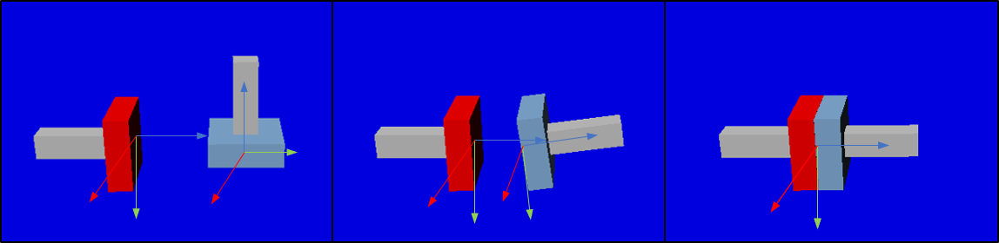

AGXMagneticJoint
===========================

| AGXMagneticJointはAGX Dynamicsをつかった磁石のような振る舞いをするジョイントです。
| 実装にはAGX Dynamicsのlock jointを利用しています。

.. contents::
   :local:
   :depth: 2

サンプル
------------

サンプルを使った利用方法の説明をします。サンプルプロジェクトは以下にあります。
Choreonoidでサンプルプロジェクトをロードし、シミュレーションを実行すると、上図のように青色のオブジェクトが自動的に赤色のオブジェクトに引き寄せられる挙動を確認することができます。

* プロジェクトファイル: chorenoid/sample/AGXDynamics/agxMagneticJoint.cnoid
* ボデイファイル: chorenoid/sample/AGXDynamics/agxMagneticJoint.body

記述方法
------------

AGXMagneticJointは以下のように記述し、利用することができます。

.. code-block:: yaml

  links:
    -
      name: Plug
      elements:
        -
          type: AGXMagneticJointDevice
          link1Name: Socket
          link2Name: Plug
          position1: [ 0, 0.25, 0 ]
          position2: [ 0, 0, -0.05 ]
          connectAxis1: [ 0, 1, 0 ]
          connectAxis2: [ 0, 0, 1 ]
          jointCompliance: 1e-6
          jointSpookDamping: 1.0
          validDistance: 1.0
          validAngle: 20

#. AGXMagneticJointで接続したいリンクをlinkNameに設定します

#. リンクのどの部分に接続したいのかをpositionとconnectionAxisに設定します

#. どのくらいの力、速度で接続するのかをjointCompliacne、jointSpookDampingに設定します

#. 接続が有効になる距離、角度をvalidDistance、validAngleに設定します

poistionはリンク座標系からみた相対位置、connectAxisはジョイントの接続方向です。
例として下図左のようにそれぞれconnectAxisを異なる方向に設定しますと、それぞれのconnectAxisが一致するように接続が行われます。

.. image:: images/magnetic_joint_detail.png

パラメータの説明
------------
| 以下にパラメータの説明をします。

.. tabularcolumns:: |p{3.5cm}|p{11.5cm}|
.. list-table::
  :widths: 20,9,4,4,75
  :header-rows: 1

  * - パラメータ
    - デフォルト値
    - 単位
    - 型
    - 意味
  * - type: AGXMagneticJointDevice
    - \-
    - \-
    - string
    - AGXMagneticJointを使うことの宣言
  * - link1Name
    - \-
    - \-
    - string
    - リンク名
  * - link2Name
    - \-
    - \-
    - string
    - リンク名
  * - position1
    - [0, 0, 0]
    - \-
    - Vec3
    - link1のローカル座標系からみたジョイント取り付け位置
  * - position2
    - [0, 0, 0]
    - \-
    - Vec3
    - link2のローカル座標系からみたジョイント取り付け位置
  * - connectAxis1
    - [0, 0, 1]
    - \-
    - Unit Vec3
    - link1のローカル座標系からみたジョイント取り付け向き
  * - connectAxis2
    - [0, 0, 1]
    - \-
    - Unit Vec3
    - link2のローカル座標系からみたジョイント取り付け向き
  * - jointCompliance
    - 1e-8
    - m/N
    - double
    - コンプライアンス
  * - jointSpookDamping
    - 0.33
    - s
    - double
    - スプークダンパ
  * - validDistance
    - 0
    - m
    - double
    - ジョイントが有効になる距離
  * - validAngle
    - 0
    - degree
    - double
    - ジョイントが有効になる角度
