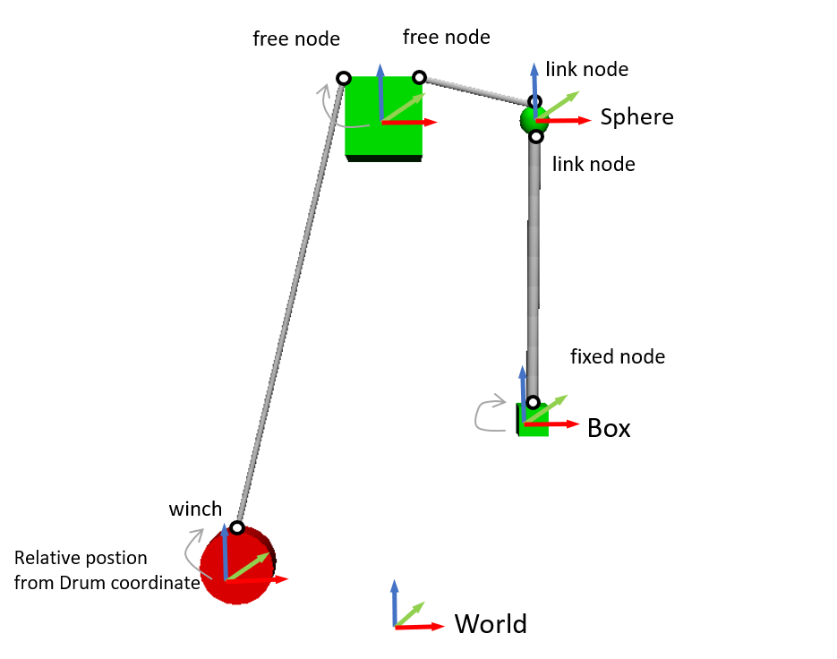

AGXWire
=======

.. image:: images/wire.png
   :scale: 60%

AGXWireはAGX Dynamicsを使ったワイヤーモデルです。
実装にはAGX DynamicsのモジュールagxWireを利用しています。

.. contents::
   :local:
   :depth: 1

.. _agx_wire_feature:

AGXWireの特徴
-------------

* **千切れにくい**

  ワイヤーが強い力で引っ張っられても千切れにくいです。例えば、クレーンでコンテナを吊り下げるような用途として有用です。

* **長くしてもシミュレーション速度が落ちにくい**

  | 一般的な物理エンジンでは複数のカプセルやシリンダといった複数の要素を関節でつなぎ合わせてケーブルやワイヤーを表現しますが、
  | 要素数が多くなると計算量が増加し、最終的には実時間内で計算が完了しなくなります。
  | 本モデルはシミュレーション実行中に自動的に要素数を増減させ、シミュレーションの実行速度低下を抑えることができます。

.. note::
  | AGXWireは速度を重視しており、干渉計算の精度は高くありません。ロボットが踏みつけたり、ドアに挟まれたりするようなタフなシーンには対応しておりません。
  | このような状況ではワイヤーが発振し、シミュレーションが止まる可能性があります。

サンプル
--------

サンプルを使った利用方法の説明をします。サンプルプロジェクトは以下にあります。
Choreonoidでサンプルプロジェクトをロードし、AGXSimulatorでシミュレーションを実行すると、ワイヤーが表示されます。

* ウィンチ、ワイヤー、ワイヤーリンク
   * プロジェクトファイル: chorenoid/sample/AGXDynamics/agxWireSample.cnoid
   * ボデイファイル: chorenoid/sample/AGXDynamics/agxWireSample.body
* 消火ホース
   * プロジェクトファイル : chorenoid/sample/AGXDynamics/FireHose.cnoid
   * ボディファイル: chorenoid/sample/AGXDynamics/FireHose.body

記述方法
--------

サンプルモデルは以下のリンク構成となっています。

.. code-block:: yaml

  links:
    -
      name: Drum
      parent: Root
      translation: [ -1.0, 0.0, -3.0 ]
      jointType: fixed
      elements:
        -
          type: Shape
          geometry: { type: Cylinder, radius: 0.25, height: 0.2 }
          appearance: { material: { diffuseColor: [ 1.0, 0, 0 ] }}
        -
          type: AGXWireDevice
          radius: 0.02
          resolutionPerUnitLength: 5
          collision: true
          selfCollision: true
          materialName: Wire
          #wireYoungsModulusStretch: 6E10
          #wireSpookDampingStretch: 0.075
          #wireYoungsModulusBend: 6E10
          #wireSpookDampingBend: 0.075
          Winch:
              linkName: Drum
              position: [ 0.0, 0.0, 0.27 ]
              normal: [1.0 , 0.0, 0.0 ]
              pulledInLength: 50
              haulForceRange: [ -50, 50 ]
          Nodes:
            -
              type: free
              linkName: Root
              position: [ -0.27, 0.0, 0.27]
            -
              type: free
              linkName: Root
              position: [ 0.27, 0.0, 0.27]
            -
              type: link
              linkName: Sphere
              position: [ 0.0, 0.0, 0.1]
              #twistStiffness: 1.0E10
              #bendStiffness: 1.0E10
              #superBendReplacedWithBend: true
    -
      name: Sphere
      parent: Root
      translation: [ 1.0, 0.0, 0.0 ]
      jointType: free
      mass: 1.0
      elements:
        -
          type: Shape
          geometry: { type: Sphere, radius: 0.1 }
          appearance: { material: { diffuseColor: [ 0.0, 1.0, 0 ] }}
        -
          type: AGXWireDevice
          radius: 0.04
          resolutionPerUnitLength: 5
          collision: true
          selfCollision: true
          materialName: Wire
          Nodes:
            -
              type: link
              linkName: Sphere
              position: [ 0.0, 0.0, -0.1]
            -
              type: fixed
              linkName: Box
              position: [ 0.0, 0.0, 0.1 ]
    -
      name: Box
      parent: Sphere
      translation: [ 0.0, 0.0, -2.0 ]
      jointType: free
      mass: 5
      elements:
        -
          type: Shape
          geometry: { type: Box, size: [ 0.2, 0.2, 0.2] }
          appearance: { material: { diffuseColor: [ 0.0, 1.0, 0 ] }}

1. AGXWireは任意のリンクのelements部分にAGXWireDeviceとして追加します
2. ワイヤーのパラメータを設定します

  * ワイヤーの半径をraidusに設定します
  * ワイヤーの解像度をresolutionPerUnitLengthに設定します
  * ワイヤーと他のリンク、環境との干渉を有効にするかどうかをcollisionに設定します
  * ワイヤーの自己干渉を有効にするかどうかをselfCollisionに設定します
  * ワイヤーの材質をmaterialNameに設定します。 :doc:`agx-material` を参考にしてください。
  * wireYoungsModulusStretchなどのパラメータについては直接記述することも可能ですが、マテリアルを利用することを推奨します

3. ワイヤーをウィンチから取り出すようにする場合には以下を設定します

  * ウィンチとして利用するリンク名をlinkNameに指定します。これはAGXWireDeviceを設定しているリンクである必要はなく、任意のリンクを指定することができます。
  * linkNameに設定をしたリンクの座標系に対して、ワイヤーを出す位置をpositionに設定します。
  * linkNameに設定をしたリンクの座標系に対して、ワイヤーを出す向きをnormalに設定します。
  * ウィンチにワイヤーを保管しておく長さをpulledInLengthに設定します
  * ウィンチからワイヤーを引き出す、収納にするのに必要な力をhaulForceRangeに設定します

4. 次にNodeハッシュを利用してワイヤーを空間に這わせます

  1. ワイヤーは3通りの方法で這わせることができ、這わせ方をtypeとして指定します

    * type: free     ワイヤーを指定の位置に這わせます。固定はされません。
    * type: fixed    ワイヤーを指定のpositionに固定します。固定部分は自由に回転します(ボールジョイント)。
    * type: link     ワイヤーと指定のリンクに接続します。接続部分はねじり硬さ、曲げ硬さを設定することができます。

  2. 次にどの座標系でワイヤーを這わせるかをlinkNameに設定します

    * linkNameが存在するリンク名の場合: リンク座標系
    * linkNameが空または存在しないリンク名の場合: ワールド座標系

  3. 最後に這わせる位置をpositionに設定します

パラメータの説明
----------------

| 以下にパラメータの説明をします。

ワイヤー

.. tabularcolumns:: |p{3.5cm}|p{11.5cm}|
.. list-table::
  :widths: 20,9,4,4,75
  :header-rows: 1

  * - パラメータ
    - デフォルト値
    - 単位
    - 型
    - 意味
  * - type: AGXWireDevice
    - \-
    - \-
    - string
    - AGXWireを使うことの宣言
  * - radius
    - 0.02
    - m
    - double
    - ワイヤーの半径
  * - resolutionPerUnitLength
    - \-
    - m
    - double
    - ワイヤーの最小解像度
  * - collision
    - \-
    - \-
    - bool
    - 他のオブジェクトとの干渉のON、OFF
  * - selfCollision
    - \-
    - \-
    - bool
    - 自己干渉のON、OFF
  * - materialName
    - \-
    - \-
    - string
    - マテリアルの設定
  * - wireYoungsModulusStretch
    - 6e10
    - N/m
    - double
    - 引張方向のヤング率
  * - wireSpookDampingStretch
    - 0.075
    - s
    - double
    - 引張方向のスプークダンパ
  * - wireYoungsModulusBend
    - 6e10
    - N/m
    - double
    - 曲げ方向のヤング率
  * - wireSpookDampingBend
    - 0.075
    - s
    - double
    - 曲げ方向のスプークダンパ
  * - twistStiffness
    - 0
    - N/m
    - double
    - type:linkのみで有効。ワイヤとリンク接続部分のねじり硬さ。
  * - bendStiffness
    - 0
    - N/m
    - double
    - type:linkのみで有効。ワイヤとリンク接続部分の曲げ硬さ。
  * - superBendReplacedWithBend
    - false
    - \-
    - bool
    - type:linkのみで有効。ワイヤとリンク接続部分を曲げやすくします。

ウィンチ

.. list-table::
  :widths: 20,9,4,4,75
  :header-rows: 1

  * - パラメータ
    - デフォルト値
    - 単位
    - 型
    - 意味
  * - linkName
    - \-
    - \-
    - string
    - ワイヤーを取り出すリンク名
  * - position
    -
    - \-
    - Vec3
    - ワイヤーの取り出し位置
  * - normal
    -
    - \-
    - Vec3
    - ワイヤーの取り出し向き
  * - pulledInLength
    -
    - m
    - double
    - ウィンチへのワイヤー収納量
  * - haulForceRange
    -
    - N
    - Vec2
    - ウィンチからワイヤーを取り出す、収納するために必要な力

ノード

.. list-table::
  :widths: 20,9,4,4,75
  :header-rows: 1

  * - パラメータ
    - デフォルト値
    - 単位
    - 型
    - 意味
  * - type
    - \-
    - \-
    - string
    - ワイヤーを這わせる方法: free, fixed, linkを指定
  * - linkName
    - \-
    - \-
    - string
    - type: linkの場合に有効。指定のリンクにワイヤーを取り付けます。
  * - position
    -
    - \-
    - Vec3
    - ワイヤーを這わせるまたは取り付ける位置

ワイヤーの干渉設定
------------------

.. image:: images/wire-collision.png
   :scale: 100%

| :ref:`agx_wire_feature` で説明いたしました通り、agxWireはロボットが踏みつけたりするようなケースに対応しておりません。
| しかし、このようなケースに遭遇しないようロボットを操作することは難しいと思います。
| ここでは対策として下記の方法を説明します。

ワイヤーとの指定のリンクとの干渉を無効にする
~~~~~~~~~~~~~~~~~~~~~~~~~~~~~~~~~~~~~~~~~~~~

上図左のように、ワイヤーと指定のリンクとの干渉を無効にします。
これは :doc:`agx-body` の干渉設定のexcludeLinksWireCollisionを設定することで実現できます。

.. code-block:: yaml

  collisionDetection:
    excludeLinksWireCollision: [ linkQ, linkR, ... ]

ワイヤーと干渉を回避したいリンクにガードをつける
~~~~~~~~~~~~~~~~~~~~~~~~~~~~~~~~~~~~~~~~~~~~~~~~

もう一つの方法としては、上図右のようにワイヤーと干渉を回避したいリンクにガードをつけることです。
これはボディファイルに下記のように記述することで実現できます。
ボディにガードとして利用するリンクを追加します。
しかし、このままでは他のリンクと干渉、自己干渉が発生しますので、excludeLinksDynamicを設定し、リンク間の干渉を無効化します。
すると、ガードはワイヤーのみと干渉するようになります。

.. code-block:: yaml

    -
      name: WIRE_GUARD_L
      parent: TFRAME
      jointType: fixed
      translation: [ -0.02, -0.595, 0.600 ]
      material: default
      elements: &WireGuard
        -
          type: Collision
          elements:
          -
            type: Shape
            geometry: { type: Box, size: [ 2.1, 1.5, 0.5 ] }

  collisionDetection:
    excludeLinksDynamic: [ WIRE_GUARD_L, WIRE_GUARD_R ]

仕様
----

* ワイヤーマテリアルのパラメータはマテリアルファイル < 直接記述の順番でオーバーライドされますのでご注意ください。
