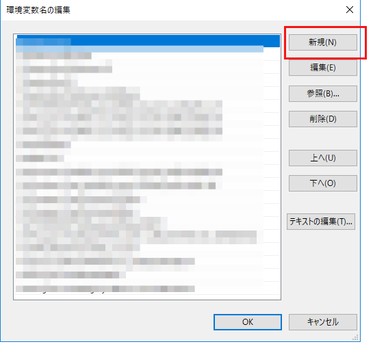

AGX Dynamicsのインストール(Windows編)
=========================================

.. contents::
   :local:
   :depth: 1

インストール
----------------------------

| AGX Dynamics Windows版のインストール方法について説明します。
| AGX Dynamicsダウンロードサイトから **x64**, **VS2015** または **VS2017** 用のファイルをダウンロードし、実行します。
| インストーラーが起動しますので、表示される指示に従ってください。
| デフォルトでは、c:\Program Files\Algoryx\AgX-<version>にインストールされます。<version>にはダウンロードしたファイルのヴァージョン番号が入ります。

| 次にAGX実行ライセンスファイル(agx.lic)をインストールディレクトリ c:\Program Files\Algoryx\AgX-<version> にコピーし、AGX Dynamicsを実行できるようにします。

動作確認
----------------------------

AGX Dynamicsのサンプルを実行して動作確認をします。コマンドプロンプトを開いて、以下のコマンドを順番に実行します。

.. code-block:: txt

   cd c:\Program Files\Algoryx\AgX-<version>
   setup_env.bat
   cd bin\x64
   tutorial_trackedVehicle.exe
   
.. _install-agx-windows-setenv:

環境変数の設定
---------------------

:ref:`環境変数の設定<build-windows-setenv>` の説明に従って、環境変数を表示させます。システム環境変数の中からPATHという項目を探し、ダブルクリックします。
編集用のダイアログが開きます。

**新規** ボタンを押すと新しい欄が追加されますので、c:\\Program Files\\Algoryx\\AgX-<version>\\bin\\x64 を入力します。

