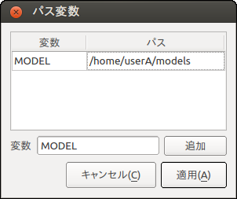

環境設定
========

概要
----

Choreonoidでは、以下のような設定項目は、ユーザーごとの設定項目として環境設定ファイルに保存され、Choreonoid起動時に以前の設定が引き継がれるようになっています。

* ウィンドウが最大化されているか
* ウィンドウサイズ
* ファイル読み込み、保存ダイアログにおけるカレントディレクトリ
* プロジェクトファイルのレイアウト保存／読み込みを有効にするか ( :ref:`basics_layout_save` 参照)

一方で、アイテムやツールバー、ビューの状態は、環境設定としては保存されませんので、現在の状態を引き継ぎたい場合は、プロジェクトファイルへの保存を行い、次回利用時にそれを読み込む必要があります。

環境設定ファイル
----------------

環境設定ファイルはOSのユーザアカウントごとにひとつ作成されます。ファイルの場所は、Unix系のOSではホームディレクトリの ".config/Choreonoid/Choreonoid.conf" というファイルになります。従って、このファイルを消去したりコピーしたりすることで、環境設定のクリアやコピーを行うことができます。また、設定内容はこのファイルにYAML形式のテキストで書き込まれますので、環境設定に何か問題が生じた場合はこのファイルを直接編集して問題解決を試みることも可能となっています。

.. _basics_project_pathset:

プロジェクトパス変数
--------------------

環境設定項目のひとつである「プロジェクトパス変数」は、プロジェクト読み込み時の関連ファイルの読み込みをポータブルにする仕組みです。この機能を活用することで、異なるディレクトリに格納されている様々なファイルから構成されるプロジェクトに関しても、プロジェクトファイルを保存したのとは異なる環境で読み込むことが可能となります。

一般的に、プロジェクトはプロジェクトファイル以外のファイルからも構成されます。例えば :ref:`basics_project_sr1walk` では、ロボットと床の２つのモデルがボディアイテム型のアイテムとして読みこまれていましたが、これらはそれぞれ "SR1.yaml"、"floor.wrl" というモデルファイルから読みこまれたものとなっています。プロジェクトファイルにおいてはそれらのモデルファイルへのパスのみが記録されるようになっており、プロジェクト読み込み時にはモデルファイル自体も読み込める状態になっている必要があります。

ところが、モデルファイルを格納するディレクトリは環境によって異なる可能性があります。例えばユーザAはモデルファイルを /home/userA/models 以下に格納していて、ユーザBは /home/userB/robots 以下に格納しているかもしれません。この場合、ユーザAの環境で保存されたプロジェクトファイルでは /home/userA/models 以下を参照するようになっていると、ユーザBの環境ではそのようなディレクトリにはモデルファイルを入れていないため、モデルが読み込めないことになってしまいます。

そこでChoreonoidでは、プロジェクトファイルにおける外部ファイルへの参照に関して、以下のようなルールで参照を記録します。

1. 外部ファイルがプロジェクトファイルと同じディレクトリかサブディレクトリにある場合、プロジェクトファイルのあるディレクトリからの相対パスとして記録する
2. 1が適用されない場合、外部ファイルへのパスに「パス変数」として登録されたディレクトリが含まれていれば、そのディレクトリに対応する部分を変数名に置き換えて記録する
3. 2も適用されない場合は、外部ファイルはルートディレクトリからの絶対パスで記録する

まず1のルールにより、プロジェクトを構成するファイル一式をプロジェクトファイルと同じディレクトリにまとめている場合には、そのディレクトリをそのままコピーすることで異なる環境でも問題なく読み込むことができます。

ただしモデルファイルは様々なプロジェクトで共有したい場合もあり、さらにChoreonoidのプロジェクトとは関係なく使いたい場合もあるため、モデルファイルはプロジェクトファイルとは異なるディレクトリに格納するのが一般的です。そのような場合には2のルールである「パスセット」の仕組みを活用できます。

パスセットはディレクトリにラベルをつけて登録する機能となっていて、必要なだけ登録することができます。上記のユーザーAとユーザーBの場合では、例えばそれぞれ以下のように登録をしておきます。

.. tabularcolumns:: |p{2.0cm}|p{2.0cm}|p{4.0cm}|

.. list-table::
 :widths: 24,25,50
 :header-rows: 1

 * - ユーザ
   - 変数名
   - ディレクトリ
 * - ユーザA
   - MODEL
   - /home/userA/models
 * - ユーザB
   - MODEL
   - /home/userB/robots

このように登録しておくと、例えば "SR1.yaml" が上記のディレクトリに格納されていれば、プロジェクトファイルでは "${MODEL}/SR1.yaml" といったかたちで変数名を介した記述になります。すると、読み込み時には ${MODEL} の部分が登録されている実際のディレクトリに展開されて、ユーザA、ユーザBのどちらの環境でも読み込めるようになります。

Choreonoidではデフォルトで、Choreonoidのインストール先のトップディレクトリを示す "PROGRAM_TOP" という変数と、shareディレクトリを示す "SHARE" という変数が登録されています。従って、インストール先やそのshareディレクトリ以下のどこかにファイルを置くようにしておけば、それだけでそのファイルを利用するプロジェクトファイルをポータブルにすることができます。

それ以外のパス変数を定義したい場合は、メインメニューの「ファイル」-「プロジェクトファイルオプション」-「パス変数の設定」を選択すると現れる以下のダイアログで設定を行います。

まず、「追加」ボタンの左側に「変数」とあるテキストボックスに、追加した変数名を入力します。ここでは "MODEL" という変数名を入れています。そして「追加」ボタンを押すと、この変数が上部の変数リストに追加され、その「パス」の部分が編集できるようになりますので、そこに実際のディレクトリを入力してください。ここではユーザAを想定して "/home/userA/models" を入力しています。

編集が終わったら「適用」ボタンを押すと編集内容が環境設定として記録されます。
