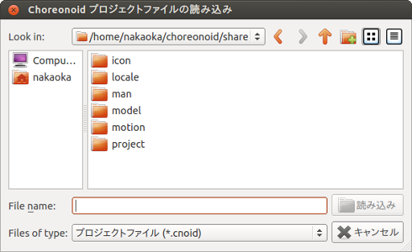
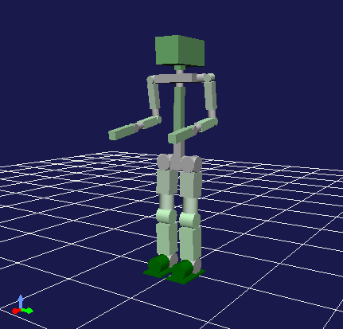
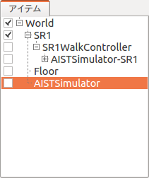
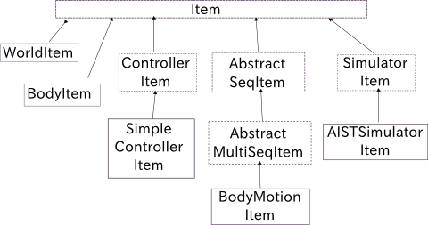
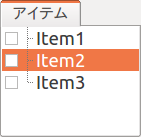
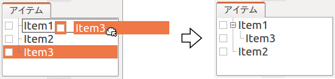
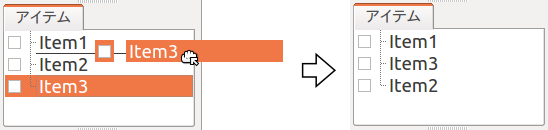
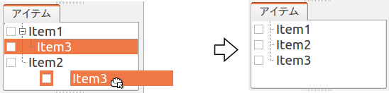
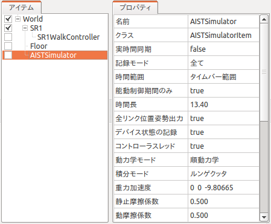

プロジェクトとアイテム
======================

.. contents::
   :local:
   :depth: 1

.. _basics_about_project:

プロジェクトとは
----------------

Choreonoidではロボットのシミュレーションや動作の振り付けといった様々な作業を行うことができますが、ある作業に必要なデータ一式をChoreonoid上で扱える状態にまとめたものを「プロジェクト」と読んでいます。Choreonoidを用いて何かをする場合には、まずこの「プロジェクト」を作成することになります。また、作成したプロジェクトの状態は「プロジェクトファイル」としてファイルに保存しておき、また必要になったときに読み込んで使うことができます。

プロジェクトアイテムとは
------------------------

Choreonoidでは、プロジェクトを構成する各々のデータのうち、ユーザの明示的な操作対象となるものを「プロジェクトアイテム」（略称「アイテム」）と呼んでいます。プロジェクトは一般的に複数のアイテムからなります。扱うデータの種類に応じて様々な種類のアイテムが定義されており、プロジェクトの目的に応じて構成するアイテムの種類（ :ref:`basics_itemclass` ）を使い分けることになります。また、プラグインを開発することで独自のアイテムクラスを追加することも可能です。

プロジェクトが複数のアイテムから構成される場合、それらのアイテムの間の関係を定義する必要が生じます。Choreonoidではこれをツリー構造で定義するようになっており、ツリーの構成はユーザが自由に編集することが可能です。これを :ref:`basics_item_tree` と呼んでいます。

プロジェクトの読み込み
----------------------

メインウィンドウの上部にあるメインメニューから「ファイル」‐「プロジェクトの読み込み」を実行してください。すると以下のような「Choreonoidプロジェクトファイルの読み込み」ダイアログが表示されます。

ここで読み込みたいプロジェクトファイルを指定してください。なお、プロジェクトファイルには通常 ".cnoid" という拡張子がついています。

Choreonoidをコマンドラインから起動している場合は、:doc:`launch` にて紹介した :ref:`basis_launch_projectfile` を用いてプロジェクトを読み込んでもOKです。

サンプルプロジェクト
--------------------

Choreonoidでは標準でいくつかのサンプルプロジェクトが付属しています。それらのサンプルはChoreonoidのshareディレクトリ以下の "project" ディレクトリに格納されています。（shareディレクトリの場所については :doc:`../install/directories` を参照してください。）

以下にいくつかのサンプルの概要を示しますので、興味があるものがあれば読み込んで試してみてください。

.. tabularcolumns:: |p{4.5cm}|p{10.5cm}|

.. list-table::
 :widths: 30,70
 :header-rows: 1

 * - プロジェクトファイル
   - 内容
 * - FallingBoxes.cnoid
   - 箱４つを落下させるシミュレーション
 * - SR1Walk.cnoid
   - サンプルの二足歩行ロボットモデル"SR1"の歩行シミュレーション
 * - SR1WalkHighGain.cnoid
   - AISTSimulatorItemの「ハイゲインモード」を用いたSR1ロボットの歩行シミュレーション
 * - SR1Walk2D.cnoid
   - AISTSimulatorItemの「2Dモード」を用いたSR1ロボットの歩行シミュレーション
 * - SR1Liftup.cnoid
   - SR1ロボットが箱をつかんで持ち上げるシミュレーション
 * - SR1WalkinHouse.cnoid
   - SR1ロボットが家の中を歩いてテーブルの上のビデオテープを持ち上げるシミュレーション
 * - PA10Pickup.cnoid
   - 三菱重工製のマニピュレータ"PA10"が箱をつかんで移動させるシミュレーション
 * - SampleCrawler.coid
   - クローラ機構によるモバイルロボットを駆動させるシミュレーション
 * - SampleCrawlerJoystick.coid
   - クローラ機構によるモバイルロボットをジョイスティックで操作するシミュレーション。USBのジョイスティック（LOGICOOL製ゲームパッドF310にて動作確認）を接続するとスティックを倒すことで操作できます
 * - TankJoystick.coid
   - 戦車風のモバイルロボットをジョイスティックで操作するシミュレーション。暗いプラント内をロボットのライトで照らして探索する設定となっており、移動の操作に加えて、砲塔（ライト）の向きを変えたり、ライトのON/OFFを行うことができます
 * - GR001Sample.cnoid
   - エイチ・ピー・アイ・ジャパン製の二足歩行ロボットキット"GR001"の動作振り付けのサンプル。キーフレームデータ"SampleMotion1"によってロボットを動かすことができます。また、GRobotプラグインをビルド・インストールしておくことにより、GR001の実機を動かすことも可能です
 * - RIC30Sample.cnoid
   - 株式会社アールティ製の二足歩行ロボットきっと"RIC30"の動作振り付けサンプル。内容はGR001と同様です
 * - ClosedLinkSample.cnoid
   - 閉ループ機構のモデル化とシミュレーションのサンプル
 * - ConveyorSample.cnoid
   - コンベアーベルト機構のシミュレーションサンプル

上に挙げたもののうち、ロボットの制御を含むサンプルについては、Choreooidビルド時に "BUILD_SIMPLE_CONTROLLER_PLUGIN" と "BUILD_SIMPLE_CONTROLLER_SAMPLE" を "ON" にしておく必要があります（デフォルトではONになっています）。また、ここに挙げたもの以外にも、オプションのプラグインを有効にした際などに追加されるサンプルがあります。

.. _basics_project_sr1walk:

SR1Walkプロジェクトの例
-----------------------

以下ではサンプルの中から "SR1Walk" というプロジェクトを読み込んで、実際のプロジェクトの例を見てみることにしましょう。まずこのサンプルのプロジェクトファイルである "SR1Walk.cnoid" を読み込んでください。するとプロジェクトが読みこまれて、以下のようなロボットが表示されるかと思います。

このロボットはサンプルモデルのひとつである "SR1" ロボットです。SR1Walkプロジェクトは、このSR1ロボットが二足歩行のシミュレーションを行うプロジェクトとなっています。

シミュレーションは、以下の「シミュレーションバー」の「シミュレーション開始ボタン」を押すと開始します。

ボタンを押すとロボットが歩行を始めるかと思います。このシミュレーションでは、ロボットの物理モデルが読みこまれており、それが歩行パターンに従ってPD制御されています。その結果が動力学計算によって計算され、アニメーションによって提示されます。

プロジェクト構成アイテム
------------------------

プロジェクトを構成するアイテムは、デフォルトではメインウィンドウの左上に配置されている「アイテムツリービュー」という領域で確認することができます。SR1Walkプロジェクトにおいては、アイテムツリービューは以下のように表示されているかと思います。

このようにアイテムツリービューに表示されている各項目がアイテムに対応します。

ここで、各アイテムの概要は以下のようになっています。

.. tabularcolumns:: |p{3.5cm}|p{3.5cm}|p{7.5cm}|

.. list-table::
 :widths: 20,20,60
 :header-rows: 1

 * - 名前
   - アイテムクラス
   - 内容
 * - World
   - WorldItem
   - シミュレーションにおけるひとつの仮想世界に対応。詳細は :ref:`model_collision_and_worlditem` を参照してください。
 * - SR1
   - BodyItem
   - ロボットモデル"SR1"に対応するアイテム。SR1モデルの形状、関節構造、物理パラメータ、現在状態等の情報を保持している。BodyItemクラスの詳細は :doc:`../handling-models/bodymodel` を参照してください。
 * - SR1WalkController
   - SimpleControllerItem
   - 歩行パターンに基づくPD制御を行うための制御プログラム（コントローラ）に対応するアイテム。シミュレーションの最中にこのアイテムに対応付けられた制御ルーチンが実行され、ロボットの制御が行われる。
 * - ASITSimulator-SR1
   - BodyMotionItem
   - SR1モデルの動作軌道を格納するアイテム。シミュレーション実行時にシミュレーション結果として生成される。
 * - Floor
   - BodyItem
   - 床のモデル
 * - AISTSimulator
   - AISTSimulatorItem
   - 産総研開発のシミュレーションエンジン。このアイテムに関連付けられた動力学計算ルーチンによってシミュレーション結果が計算される。

.. _basics_itemclass:

アイテムクラス
--------------

アイテムの種類を「アイテムクラス」もしくはアイテムの「型」と呼びます。プロジェクトを構成するアイテムは一般的に複数のアイテムクラスからなります。

アイテムクラスはChoreonoid内部のC++のクラスに対応していて、全てのアイテムはベースとなる "Item" 型を継承して実装されています。例えばSR1Walkプロジェクトに含まれるアイテムクラスについては、以下のような継承関係となっています。

あるアイテムクラスに対して設計された機能は、それを継承したアイテムクラスに対しても利用可能となっています。アイテムを扱う基本機能の多くはItem型を対象として設計されており、それらは全てのアイテムに対して利用可能です。

一方で、特定のアイテムクラスを対象とした機能もあります。例えば、ロボットや環境のモデルを対象とした機能は、モデルデータに対応する "BodyItem" 型のアイテムが対象となります。

そのように特定のアイテムクラスを対象とした機能は、そのクラスをさらに継承したアイテムクラスに対しても有効です。例えばシミュレーション機能を利用するためには、シミュレーションエンジンを抽象化した "SimulatorItem" 型のアイテムが必要となりますが、実際にはこれを継承した"AISTSimulatorItem"がSR1Walkプロジェクトでは使われています。シミュレーション機能はSimulatorItem型を継承した他のアイテムによっても実行できますので、そのようなアイテムクラスを導入することにより、シミュレーションの計算方法などを変えることもできます。

.. note:: この例として、「ODEプラグイン」や「Bulletプラグイン」をビルドしている場合、SR1Walkプロジェクトにおいても追加のSimulatorItem型である "ODESimulatorItem" 型や "BulletSimulatorItem" 型のアイテムが読み込まれるようになります。
 この場合、それらのアイテムを選択してシミュレーション開始ボタンを押すことで、それらのエンジンを用いたシミュレーションを行うことができます。
 （これらのプラグインのビルド方法については :doc:`../install/options` を参照してください。）

以上のように、汎用的な機能は上位のアイテムクラスに対して定義し、特殊な機能に対してはそのためのアイテムクラスを下位に定義していくことで、インタフェースをなるべく共通化しつつ個別の機能への対応も実現するという仕組みになっています。

.. _basics_item_tree:

アイテムツリー
--------------

SR1Walkプロジェクトにおいて、各アイテムは以下のような木構造で配置されています。

| + World
|   + SR1
|     + SR1WalkController
|       + AISTSimulator-SR1
|   + Floor
|   + AISTSimulator

この木構造は、アイテムの間の関係を定義するためのものです。SR1Walkプロジェクトでは、具体的に以下のような関係が表現されています。

まず、"World" の小アイテム（アイテムツリーにおける子ノード）としてロボットと床のモデルである "SR1" と "Floor" が配置されています。これは、SR1とFloorがどちらもこのWorldアイテムの仮想世界に存在する物体であることを示しています。これによって、例えばSR1とFloorの間の干渉が計算されることになります。(これに関する詳細は :ref:`model_collision_and_worlditem` を参照してください。）

また、シミュレーションエンジンである "AISTSimulator" もWorldの小アイテムとして配置されています。これによって、AISTSimulatorのシミュレーション対象となる仮想世界がWorldであることを示しています。

以上のようなWorldアイテムとの関係については、本プロジェクトのように仮想世界がひとつしか存在しない場合は大きな意味を持たないかもしれません。しかしWorldItem型のアイテムが複数存在する場合は、このようにモデルやシミュレータがどのWorldアイテムと関連付けられているかを示すことが必要になってきます。逆に言えばこの仕組みによって、Choreonoidでは同時に複数の仮想世界を扱えるようになっています。

次に、"SR1WalkController" はSR1の小アイテムとして配置されています。これによってこのコントローラの制御対象がSR1ロボットであることを示しています。複数のロボットとコントローラが存在する場合でも、この仕組みによってロボットとコントローラの関連付けを行うことができます。

ロボットの動作軌道データに対応するAISTSimulator-SR1については、SR1WalkControllerの小アイテムとして配置されています。これは以下の２つの関係を示しています。ひとつは、この動作軌道がSR1モデルの動作を表していることです。動作軌道のアイテムはSR1の直接の子ではありませんが、このように子孫であることによっても関連付けがなされます。ただしこの関係だけを示したいのであればSR1の直接の小アイテムとしても良いわけですが、２つ目の関係として、この動作軌道がSR1WalkControllerの制御の結果であることも示すために、このような配置となっています。

以上のように、アイテムのツリー構造によって、アイテム間の様々な関係が表現できています。また、ツリー内のアイテムの配置はユーザがいつでも自由に動かすことができるようになっていて、Choreonoidの各機能は、現在のツリーの状態からそれぞれのルールに従って関係性を抽出するようになっています。このようなアイテムとそのツリー構造に基づく統一的で動的なインタフェースによって、複雑なプロジェクトや機能に関してもシンプルかつ柔軟に扱うことが可能となっています。

.. _basics_itemtree_management:

アイテムツリーの管理
--------------------

.. _basics_selection_and_check:

選択とチェック
~~~~~~~~~~~~~~

アイテムツリービュー上にてアイテムは「選択」したり「チェック」したりすることができます。例えば、以下のようにアイテムが３つ存在するとします。

.. image:: images/noitemselection.png

この状態ではどのアイテムも通常の状態です。ここで "Item2" をマウスでクリックすると、Item2の領域が以下のような表示になります。

この状態を、「アイテムが選択された」状態と呼んでいます。

選択状態は他のアイテムを選択するか、ESCキーを押すことで解除されます。また、ShiftキーやCtrlキーを押しながらアイテムをクリックすることで、複数のアイテムを同時に選択状態にすることも可能です。そのような複数アイテムの選択はしばしば必要になりますので覚えておいてください。さらに、"Ctrl + A"（CtrlとAを同時に）押すと全てのアイテムが選択状態になります。

選択状態とは別に、アイテムの「チェック」状態もあります。これはアイテムの左端に表示されているボックスによって示されます。このボックス部分をクリックすると、下図のようにボックスにチェックが入ります。

.. image:: images/itemchecked.png

チェックされているボックスを再度クリックすることにより、チェック状態を解除できます。

以下のように、あるアイテムに対して選択とチェックを両方同時に行うことも可能です。

.. image:: images/itemselectedchecked.png

選択状態やチェック状態は、複数のアイテムが操作の対象となり得る場合に、どのアイテムが操作対象であるかをを明示する場面で使われます。少しややこしいのですが、それぞれの状態は独立して切り替えることが可能となっており、ある操作を行う際にどちらの状態が参照されるかは、厳密な規定があるわけではなく、各操作に依存したものとなっています。ですので選択状態とチェック状態のどちらの状態を使うかは、それぞれの操作に対して覚えておく必要があるのですが、
大まかな傾向としては、

* 選択状態
 * アイテムツリー上での基本操作
 * テンポラリな操作
 * 複数のアイテムが候補として競合する場合の選択
* チェック状態
 * 恒常的なON/OFF状態の切り替え
 * 複数の候補が同時に対象となり得る操作

といった使い分けとなっています。

選択状態の利用例としては、SimulatorItemクラスのアイテムが複数存在する場合に、どのアイテムでシミュレーションを行うかについて、シミュレーション開始ボタンを押す際のアイテムの選択状態で決定しています。

また、チェック状態の利用例として、モデルをシーンビュー上に表示するかどうかはチェック状態で切り替わるようになっています。SR1Walkの例では、ロボットと床の２つのモデルがアイテムとして読みこまれているのですが、デフォルトで表示されているのはロボットのモデルだけとなっています。そこで、床のモデルである "Floor" アイテムのチェックをつけてみてください。すると青い床のモデルがシーンビュー上に表示されるかと思います。逆にロボットのモデルである "SR1" アイテムのチェックを外すと、シーンビュー上のロボットの表示も消えることになります。( この操作については :doc:`sceneview` にて詳細を説明します。）

新規作成
~~~~~~~~

アイテムの新規作成はメインメニューの「ファイル」-「新規」から行うことができます。ここで新たに作成したいアイテムクラスを選ぶと、名前を決めるためのダイアログが出ますので、そこで適当な名前（デフォルトの名前でもOK）を入力して「生成」ボタンを押してください。（アイテムクラスによっては名前以外にも設定項目がある場合もあります。）するとアイテムが生成されてアイテムツリービューに表示されます。

なお、上記操作を行う際に、アイテムツリービュー上で既存のアイテムがひとつ選択されていると、そのアイテムの小アイテムとして新規作成アイテムが配置されます。

.. _basics_item_load:

読み込み
~~~~~~~~

ロボットモデルをはじめとして、ファイルから読み込むことで生成可能なアイテムもあります。この場合、メインメニューの「ファイル」-「読み込み」から読み込みたいファイルの種類を選びます。するとファイル読み込みのダイアログが出るので、それで読み込むファイルを選択してください。うまく読みこむことができれば、そのファイルに対応したアイテムが生成されます。新規作成と同様に、既存のアイテムが選択されていれば、そのアイテムの小アイテムとしてアイテムが読み込まれることになります。

また、このようにしてファイルから読み込んだアイテムについては、アイテムツリービュー上でそのアイテムを選択して "Ctrl + R" を押すことにより、その場でアイテムを読み込みなおすことができます。これはファイルが外部で更新された場合にそれをすぐにChoreonoid上に反映させたい場合に便利です。例えばモデルのファイルを外部で編集中に、その編集結果をすぐにChoreooid上で確認するといった場面で活用することができます。

名前の変更
~~~~~~~~~~

アイテムツリービュー上でアイテムをダブルクリックすると、アイテム名のテキストを編集できるようになります。そこで新しい名前を入力することで、アイテム名の変更が可能です。

カット、コピー、ペースト
~~~~~~~~~~~~~~~~~~~~~~~~

アイテムツリービュー上でアイテムを右クリックすると表示されるコンテキストメニューに、

* カット
* コピー（単独）
* コピー（サブツリー）
* ペースト

という項目がありますので、これを用いてカット、コピー、ペーストの操作を行うことができます。

コピーについては、対象のアイテムが小アイテムを有する場合に、「単独」と「サブツリー」で動作が変わり、「単独」の場合はそのアイテムのみのコピー、「サブツリー」の場合はアイテムが有する全ての子アイテム（子孫アイテム）を含むかたちでのコピーとなります。

ペーストについては選択状態となっているアイテムの小アイテムとしてペーストされますので、カット＆ペーストを用いてアイテムの配置を変更することができます。

.. _basics_item_move:

移動
~~~~

ItemTreeView上でアイテムをドラッグすることで、アイテムの位置を移動させることができます。

例えば以下の図のようにItem1〜Item3の3つのアイテムがあるとします。

.. image:: images/itemdrag0.png

ここでItem3をマウスでドラッグしてItem1に重なる位置まで持って行くと、以下の図の左側のようにItem1を囲う矩形が現れます。この状態でドラッグを完了すると、右側のようにItem3がItem1の小アイテムとなる位置へ移動します。

あるいは、Item3をドラッグしてItem1とItem2のちょうど中間の位置に持って行くと、今度はItem1とItem2の間に線が現れます。この状態でドラッグを完了すると、右側のようにItem1とItem2の間に挿入されるかたちでItem3が移動します。

以下の例では、Item1の小アイテムとなっているItem3を、下方の何も無い位置までドラッグしています。この場合、右側の図のようにツリーのRootに並ぶかたちでItem3が移動します。

このようにアイテムツリービュー上でアイテムのドラッグを行うことで、アイテムの配置を自由に変更することが可能です。

保存
~~~~

アイテムによっては、そのアイテムが有するデータをファイルに保存できるものもあります。そのようにアイテムについては、まずアイテムを選択状態にし、メインメニューの「ファイル」-「名前を付けて選択アイテムを保存」を実行することで、データのファイルへの保存を行うことができます。このようにして保存したファイルは、大抵の場合上記の :ref:`basics_item_load` の手順で再度Choreonoid上に読み込むことが可能です。これによってChoreonoidの他のプロジェクトでデータを利用することもできます。また、保存したデータを外部のプログラムで利用することも可能となります。

具体的な例として、SR1Walkサンプルでシミュレーション後に生成される"AISTSimulator-SR1"アイテムの保存を行ってみましょう。このアイテムはBodyMotionItem型のアイテムで、ロボットの動作軌道データを格納しており、そのデータをファイルとして保存可能です。まず、このアイテムを選択して、「名前を付けて選択アイテムを保存」を実行すると、以下のようなダイアログが出ます。

.. image:: images/itemsavedialog.png

ここで保存先やファイル名を指定しますが、それらに加えてダイアログの下部に "Files of type" というコンボボックスがあります。アイテムによっては複数のファイルタイプで保存可能となっていることもあり、その場合はこのコンボボックスでファイルタイプを選択できます。

ここでは標準のyaml形式で保存をすることにします。すると "AISTSimulator-SR1.yaml" といったフィアルとして保存されます。このファイルはメインメニューの「ファイル」-「読み込み」-「ボディモーション」から再度読み込むことが可能です。

さらに、ファイルへの保存に関しては「エクスポート」という項目もあります。「エクスポート」はファイルへの保存という意味では通常の保存と変わりないのですが、Choreonoidにおける標準形式ではないファイル形式については、この「エクスポート」に分類されることになります。保存したいファイル形式が「エクスポート」に存在する場合は、メインメニューの「ファイル」-「選択アイテムのエクスポート」を実行することで、その形式でのファイル保存を行うことができます。

.. _basics_composite_item:

複合アイテム
------------

アイテムの中には、そのアイテムに含まれるデータを自身の小アイテムとして格納しているものがあります。これを「複合アイテム(Composite Item)」と呼びます。

複合アイテムであるアイテムクラスの例としては、BodyMotionItem型が挙げられます。これはSR1Walkサンプルでもシミュレーション実行時に "AISTSimulator-SR1" として生成されていたもので、ロボットの動作軌道データを格納するアイテムです。このアイテムは実際には以下のような構成になっています。（括弧内は各アイテムのアイテムクラスを表しています。）

| + BodyMotionItem
|   + Joint (MultiValueSeqItem)
|   + Cartesian (MultiSE3SeqItem)
|   + Devices (MultiDeviceStateSeqItem)

ここで、"Joint" は関節角軌道データを格納するアイテム、"Cartesian" はリンク位置・姿勢の軌道データを格納するアイテム、"Devices" はセンサ等のデバイスの入出力データを格納するアイテムとなっています。（他にも :ref:`legged_model_zmp` 軌道等を格納するデータアイテムが必要に応じて追加されます。）

これらのアイテムはそれぞれ単体でも生成・利用可能なアイテムですが、ここでは複合アイテムのデータの一部を担う存在となっています。このようなアイテムを複合アイテムの「サブアイテム」と呼びます。サブアイテムとなったアイテムは、複合アイテムの本体から切り離すことはできなくなります。

アイテムツリー内でのアイテムの移動や、アイテムの読み込み、保存は、複合アイテムの本体に対して行います。その際に、サブアイテムについては本体とまとめて処理されるようになっています。

複合アイテムを導入するメリットは、以下のような点にあります。

* 既存のアイテムクラスを組み合わせることでより複雑なアイテムクラスを定義できる
* サブアイテムに対して利用可能な機能が、複合アイテム（のデータの一部）に対してもそのまま利用可能となる

これらのメリットにより、新たなアイテムクラスの導入をより効率的に行うことできます。すなわち、開発者にとっては新たに実装する部分が少なくて済みますし、ユーザにとっても新たに覚えなければいけない操作を少なくできるということです。

.. _basics_item_property:

アイテムのプロパティ
--------------------

アイテムには :ref:`basics_mainwindow_item_property_view` を通してアクセス可能な属性があり、これを「プロパティ」と呼んでいます。アイテムツリービュー上でアイテムをひとつ選択すると、そのアイテムのプロパティ一覧がプロパティビューに表示されます。例えばSR1Walkのサンプルで "AISTSimulator" を選択すると、下図のようにアイテムプロパティビューにAISTSimulatorのプロパティ一覧が表示されます。

プロパティにはただ閲覧するだけのものと、ユーザが編集可能なものとがあります。例えば、上図で上から２番めにある「クラス」というプロパティは、このアイテムのアイテムクラスを表していて、それがAISTSimulatorItem型であることが分かります。しかしアイテムのクラスはアイテム生成後に変更できるものではありません。一方他のプロパティについては、プロパティビュー上でプロパティ値（右側のカラム）のところをダブルクリックすることにより、値の編集が可能です。

例えばこのアイテムには「重力加速度」というプロパティがあり、重力加速度ベクトルの3要素が示されています。この値の部分をダブルクリックすると、下図のようになってキーボードから値が入力できるようになります。

.. image:: images/property_gravity.png

ここで例えば「0 0 0」と入力してみてください。すると、仮想世界の重力を無重力に設定したことになります。この状態でシミュレーションを再度行うと、ロボットが床から動かずに浮いているような動きになることが分かるかと思います。

この例ではベクトル値が対象だったのでテキストで３要素を入力するようになっていましたが、値の編集方式はプロパティの種類によって変化します。例えばモードのON/OFFを切り替えるような値の場合は、以下のように true / false というBoolean値の中から選択するコンボボックスになります。

.. image:: images/property_boolean.png

３つ以上の選択肢の中から選択するようなプロパティでは、選択肢を格納したコンボボックスになりますし、

.. image:: images/property_selection.png

通常の数値（スカラ値）については、数値入力のためのスピンボックス（値を増減させるボタン付きの入力ボックス）
で入力できます。

プロパティについては、どのアイテムクラスに対しても、プロパティビューという統一したインタフェースで操作できるのが利点となっています。ただしアイテムのもつ情報が全てプロパティというかたちで表示・編集できるとは限りませんので、そこは注意が必要です。例えば動作軌道データに関して、その軌道自体をプロパティビューで扱うことは難しいので、それは他にグラフビュー等の別のインタフェースで扱うことになります。

:ref:`basics_itemclass` で述べたように、アイテムにはクラスの継承関係がありますが、プロパティについても上位クラスで定義されたプロパティは下位のクラスに対しても有効となります。「名前」や「クラス」といったプロパティはItemクラスに対して定義されたものなので、全てのアイテムに対して有効です。また、AISTSimulatorアイテムのシミュレーションに関わるプロパティのいくつかはより上位のSimulatorItem型で定義されたプロパティとなっており、SimulatorItem型を継承する全てのアイテムに共通のものとなっています。

.. _basics_project_save:

プロジェクトの保存
------------------

Choreonoid上の現在のアイテムツリーの状態と、各アイテムのデータやプロパティ等の内容は、プロジェクトファイルとしてまとめて保存することができます。これを行うためには、メインメニューから「ファイル」‐「名前をつけてプロジェクトを保存」を実行してください。すると「Choreonoidプロジェクトファイルの保存」ダイアログが表示されますので、保存先のディレクトリやファイル名を指定して、保存を行なってください。プロジェクトファイルには通常 ".cnoid" という拡張子がつきます。

.. note:: プロジェクトファイルには、アイテムの状態だけでなく、ビューやツールバーについてもその状態の多くが保存されます。これにより、プロジェクトファイルを読みこめば、プロジェクトで行う作業を前回とほぼ同じ状態で再開することができます。

現在のプロジェクトが元々プロジェクトファイルから読みこまれたものである場合は、メインメニューの「ファイル」-「プロジェクトの保存」によって、上書き保存をすることできます。この上書き保存は、以下の図に示す「ファイルバー」の「プロジェクトを保存」ボタンを押すことによっても実行できます。

.. figure:: images/FileBar_x2.png

.. note:: Choreonoidはまだ開発途上の部分も多く、突然落ちてしまうこともあり得ますので、プロジェクト作成中はこまめにこのボタンを押すことが推奨されます。

元になるプロジェクトファイルが無いときに上書き保存を実行しようとすると、「名前をつけて保存」と同じ機能が実行されます。

プロジェクトファイルはYAMLという形式で保存されます。YAMLは構造化された情報をシンプルかつ可読性の高いテキストファイル形式で記述するフォーマットです。ここでは詳細は述べませんが、このYAML形式の採用により、プロジェクトファイルをテキストファイルとして閲覧して内容を確認したり、テキストエディタで内容を編集するといったことで比較的簡単にできるようになっています。

なお、プロジェクトのデータは必ずしも全てがプロジェクトファイル内に一括して格納されるわけではなく、部分的に他のファイルに保存し、そのファイルへの参照というかたちで保存するものもあります。例えばSR1Walkプロジェクトにおいては、ロボットや床のモデルは :doc:`../handling-models/modelfile/index` として別途保存されているものであり、プロジェクトファイルにはそれらのファイル名のみが記述されています。プロジェクト全体を記録しておくためにはそのように別ファイルとして保存されているものも管理する必要がありますので、
ご注意ください。

.. _basics_layout_save:

レイアウトの保存
----------------

ツールバーやビューの表示のオン／オフやレイアウトについても、プロジェクトファイルに保存することができます。そのようにして保存したプロジェクトファイルにはレイアウトの情報も含まれており、ファイルの読み込み時には保存していたレイアウトが復帰することになります。

これはデフォルトでは行われませんが、メインメニューの「ファイル」-「プロジェクトファイルオプション」-「レイアウト」のチェックを入れておくと行われるようになります。従って、プロジェクトの作業を進めるにあたってツールバーやビューのレイアウトが重要な場合には、このチェックを入れておくようにしてください。一度チェックを入れておけばその設定は :doc:`config` として保存され、Choreonoidを再度起動する際にも有効となります。
