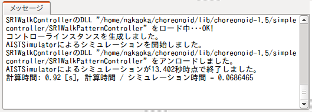
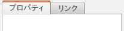
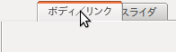

画面構成
========

メインウィンドウ
----------------

Choreonoidを起動すると表示される「メインウィンドウ」の構成は以下のようになっています。

.. image:: images/screen.png

メインウィンドウの位置やサイズの変更、最小化、最大化といった基本操作は、
OSのウィンドウシステムの流儀に従って操作できるようになっています。

以下ではメインウィンドウの各構成要素について解説します。

メインメニュー
--------------

メインメニューからは各種操作や設定にメニュー形式でアクセスできます。
メニュー項目は、「ファイル」、「編集」、「ツール」、「フィルタ」、「オプション」、「ヘルプ」といったカテゴリごとにまとめられています。
なお、Mac OS X や Ubuntu の Unityデスクトップ環境等においては、システムの流儀として、
メインメニューはメインウィンドウには表示されずに、
デスクトップ画面上部のバーに表示されるようになっています。

ツールバー
----------

ツールバーは一般的なアプリケーションソフトに見られるものと同様のもので、
ボタン等をコンパクトに並べたインタフェースとなっており、
これを介することで頻繁に使う機能に迅速にアクセスすることができます。
ツールバーはChoreonoidでも基本的なインタフェースとなっており、
様々なツールバーをメインウィンドウ上部のツールバー領域に並べて利用します。

具体的なツールバーとしては、例えば以下の「タイムバー」があります。

このツールバーでは、Choreonoid上の時間に関する操作を行います。
これを用いることで、時系列データの時間的な編集位置を指定したり、
アニメーションによる表示を行ったりすることが可能です。

Choreonoidではこの他にも様々なツールバーが用意されています。

ビュー
------

「ビュー領域」は、Choreonoidの中心的なGUI要素である「ビュー(View)」を表示する領域です。
ビューはパネル状の領域となっており、この上で各種データの表示や編集を行います。
Choreonoidでは様々な種類のビューが用意されており、複数のビューをビュー領域上に並べて利用するのが一般的となっています。
以下に基本的なビューの例を挙げます。

アイテムツリービュー
~~~~~~~~~~~~~~~~~~~~

.. image:: images/ItemTreeView.png

Choreonoid上で明示的な操作対象となるデータは通常「プロジェクトアイテム」として管理されます。
これを行うためのビューとして、上図に示す「アイテムツリービュー」が用意されています。
プロジェクトアイテムの詳細については、次節 :doc:`item`:doc:`item` で解説します。

アイテムプロパティビュー
~~~~~~~~~~~~~~~~~~~~~~~~

.. figure:: images/PropertyView.png

プロジェクトアイテムのプロパティを閲覧・編集するためのビューです。
アイテムツリービューで選択したアイテムのプロパティ一覧が表示されます。
編集可能なプロパティについてはクリックすることで値を入力することもできます。

メッセージビュー
~~~~~~~~~~~~~~~~

Choreonoidからのメッセージが出力されるビューです。
動作状況の確認に用いることができます。

シーンビュー
~~~~~~~~~~~~

.. figure:: images/SceneView.png

各種データを３次元コンピュータグラフィックス（3D-CG)によって表示するビューです。
ロボットや環境のモデルがこのビュー上に描画されます。
また、対象モデルの操作もこのビュー上でインタラクティブに行うことができます。

ステータスバー
--------------

メインウィンドウ下部のステータスバーは、Choreonoid上で現在進行中の処理内容を簡潔なメッセージで知らせるための領域で、
以下のようなメッセージが表示されます。

.. image:: images/statusbar.png

ステータスバーの領域は内部で２つに分かれており、基本的に左側では処理の開始や終了を告げるメッセージを表示し、
右側では作業中のビューでマウスカーソルが指しているオブジェクトの状態を表示するようになっています。

表示の切り替え
--------------

Choreonoidでは複数のビューやツールバーをメインウィンドウ上に並べて表示することができます。
ただし、利用可能なビューやツールバーを全て表示してしまうと、
使わないものまで表示されてしまって分かりにくくなったり、
よく使うビューに対して十分なサイズを確保できなくなったりして、使い勝手が悪くなってしまいます。
そこでChoreonoidではビューやツールバーの表示を切り替えられるようになっています。
この機能を用いて当面の作業に必要なものだけを表示することで、
快適に作業を進めていくことが可能になります。

重なっているビューの切り替え
~~~~~~~~~~~~~~~~~~~~~~~~~~~~

ビューは同じ領域に複数重ねておくことができます。
この場合、重なっているビューの一覧が下図のようにタブで表示されます。
（※タブが表示されていない場合は F12 キーを押すと表示されます。）

これについてはお分かりのように、タブをクリックすることでビューを表に出して表示することができます。
利用頻度はそれほどでもないがたまには使うというビューに関しては、
このように他のビューの裏に配置しておいて切り替えながら使うのが一般的です。

なお、タブの重ね合わせを変更する方法については、以下の「レイアウトの変更」にて解説します。

ビューの表示切り替え
~~~~~~~~~~~~~~~~~~~~

メインメニューから「表示」-「ビューの表示」とたどっていくと、下図のようなメニューが現れます。

.. image:: images/show_view_menu.png

ここに表示されているのは現在Choreonoid上で利用可能なビューの一覧です。
チェックがついているのは（タブで重ねられているものも含めて）既に表示されているもので、
チェックがついていないのはまだ表示されていないビューを示しています。
ここでビューを選択するとチェック状態が切り替わり、そのビューの表示／非表示を切り替えることができます。
今まで表示されていなかったビューを表示をする際には、既に存在するビュー領域のどれかに重ねるかたちで表示されます。

なお、まだ表示されていないビューは通常は内部的にも生成されておらず、表示されるときに生成されることになります。
その後はビューを非表示としただけでは内部的にはビューは消去されていないため、再表示の際には以前の状態を維持したものが表示されます。

そのような内部的な生成／非生成を明示的に行うのが「ビューの生成」と「ビューの消去」のメニューです。
これをどう使うかというと、一般的には同じ種類のビューを複数生成して表示する際に使います。
例えば、シーンビューはこの機能に対応しており、「ビューの生成」によって複数のシーンビューを同時に表示して、
それぞれで視点や描画方法を変えて表示するといったことも可能となっています。
「ビューの消去」では、ビューを非表示とした上で内部的な消去も行います。
生成したビューが必要でなくなった際にはこれを用いて完全に消去することが可能です。

.. _basics_show_toolbar:

ツールバーの表示切り替え
~~~~~~~~~~~~~~~~~~~~~~~~

ツールバーについても、ビューと同様に、メインメニューの「表示」-「ツールバーの表示」から表示状態を切り替えることができます。

レイアウトの変更
----------------

ビューやツールバーのレイアウトは自由に変更できるようになっており、
ユーザの好みや作業内容に応じて使い勝手のよいレイアウトを実現することができます。

ビューのレイアウト変更
~~~~~~~~~~~~~~~~~~~~~~

ビューのレイアウトは、「分割境界位置の変更」「タブ位置の変更」「分割の変更」「ビューの分離」といった操作で行います。

分割境界位置の変更
'''''''''''''''''''
隣り合うビューの間の境界をドラッグすることで、各ビューへのサイズの割り当てを変更することができます。
例えば下図では２つのビュー領域が横に並んでいます。

.. image:: images/view_size_change.png

ここでこの領域間の境界にマウスカーソルを持って行くと、カーソルの形状が図のような矢印形状に変わります。
マウスカーソルがこの形状になったところでマウスの左ボタンを押しながら左右にドラッグすることで、
この境界の位置を左右に変化させることができます。
その結果として、左右の領域へのサイズ配分を変えられます。
さらに、境界をどちらかの領域へずっとドラッグしていくことで、片方の領域を完全に閉じることもできます。
そのようにしたときでも境界線は残っていますので、再度境界線をドラッグすることで閉じた領域をまた表示させることも可能です。
以上の操作は上下に並ぶビュー領域の間でも同様に行うことができます。

タブ位置の変更
'''''''''''''''
ビューの重ね合わせをしている領域では、タブをドラッグすることでタブの並ぶ順番を変えることができます。
下図の例では、左側のタブを右側にドラッグすることで、２つのタブの順番を入れ替えています。

.. image:: images/tabmove1.png

.. image:: images/tabmove4.png

見た目の順番が入れ替わるだけなので絶対に必要な機能という訳ではないのですが、
例えば、重ねあわせた複数のビューで一連のデータをひとつずつ処理していく場合に、
データの順にタブを並べた方が分かりやすい、
といった場面では有用かと思います。

ビューの移動
''''''''''''
ビューのタブをタブ領域を越えてドラッグすることで、ビューを他の領域に移したり、
新たに分割された領域に移動したり、
さらにはメインウィンドウから独立したウィンドウにすることも可能です。

ビューのタブをドラッグしていくと、マウスカーソルが手のような形状になり、
ビューがドラッグ中であることを示します。
ここで下図のようにマウスカーソルを移動させたいビュー領域の中心付近に持っていくと、ビュー領域全体を囲う点線が表示されます。
（実際の画面上では白黒の点線になります。）
ここでドラッグを完了させると、その領域に重ねるかたちでビューが移動し、そのビューに対応する新たなタブが追加されます。

.. image:: images/view_drag_pane_center.png

また、移動先のビュー領域のエッジ付近にドラッグすると、そのエッジと接する新しい領域に挿入するかたちでビューが移動します。
例えば、ビュー領域の右端にドラッグすると、以下の図のような領域の分割が行われ、赤枠で示した右側の領域にビューが挿入されます。

.. image:: images/view_drag_pane_right.png

他のエッジについても同様に、以下の図のような領域分割が行われます。

.. image:: images/view_drag_pane_others.png

ビューの移動は、メインウィンドウのビュー領域全体を分割するかたちで行うことも可能です。
例えば、ビュー領域全体の上辺の部分にドラッグすると、以下の図のような領域分割が行われ、赤枠で示した部分にビューが挿入されます。

.. image:: images/view_drag_whole_top.png

同様にして、下図に示すような他の領域にも移動できます。

.. image:: images/view_drag_whole_others.png

さらに、下図のようにビューを全ビュー領域の外側へドラッグすることで、
メインウィンドウから独立したウィンドウとすることも可能です。

.. image:: images/view_drag_outer.png

独立したビューのウィンドウに関しても、上記の操作全てを適用することが可能です。
これによって、いくつかのビューを並べたウィンドウをメインウィンドウとは別に用意することもできます。
これはマルチディスプレイを使う際に活用できるかと思います。

また、独立させたビューを再度メインウィンドウの方にドラッグして戻すことも可能です。
ただし、ビューをひとつ独立させた状態ではタブが表示されていませんので、タブをドラッグすることができません。
この場合は、F12キーを押すとタブが表示されるので、そのタブをドラッグすることで他の領域に移動させることが可能です。

ツールバーのレイアウト変更
~~~~~~~~~~~~~~~~~~~~~~~~~~

ツールバー領域内での各ツールバーの位置は、ツールバーをドラッグすることで変えることができます。

下図の赤丸で囲った部分が、ツールバーをドラッグするためのハンドルです。

.. image:: images/toolbar_drag.png

ここにマウスカーソルを持っていくとカーソルが手の形状になります。そのままドラッグしていくと、ツールバーを上下左右に移動させることができます。
隣に他のツールバーがある場合でも、ドラッグを続けていくことでツールバーの位置を入れ替えることができます。
また上下についてはツールバー領域がない場合は領域を拡張します。

ビュー領域を広くする方法
------------------------

同時に表示するツールバーやビューが増えてくると、ディスプレイサイズによっては、ひとつひとつのビューに十分な領域を割り当てられない場合もあるかと思います。そのような場合には必要ではないツールバーやビューをなるべく表示しないようにする必要がありますが、
以下の方法で少しだけビューの領域を広くすることができます。

まず、フルスクリーン表示とすることで、メインウィンドウのタイトルバーやウィンドウシステムの管理領域に割り当てられていた分も使えるようになり、少しだけ表示領域が増えます。フルスクリーンへの切り替えは、メインメニューの「表示」-「フルスクリーン」か、F11キーで行うことができます。

また、メインメニューの「表示」-「ビュータブの表示」か、F12キーにより、ビュー選択用タブの表示ON/OFFを切り替えることもできます。タブを非表示とすると重なっているビューの切り替えはできなくなってしまいますが、当面切り替えが必要ない場合は、タブ領域の分だけビューの領域を広くして使うことができます。

.. 表示状態・レイアウトの保存
.. --------------------------

.. 今のところプロジェクトファイルに保存するしかないようので改良しておく
