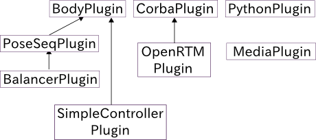

プラグインシステム
==================

プラグインとは
--------------

Choreonoidではプラグインという追加プログラムを導入することで新しい機能を追加できるようになっています。
より正確に言うと、Choreonoidというプラットフォームのベースとなる機能以外は、
多くの機能がプラグインとして実装されています。
機能と言ってもいろいろな形態が考えられますが、
一般的には新しい種類のアイテムやビュー、ツールバーといったものを追加して、
それらを用いて新しいデータを扱えるようにしたり、
新しい操作・編集インタフェースを使えるようにしたりするものだと思ってもらえればよいかと思います。

プラグインの例
--------------

以下にChoreonoidが標準で提供しているプラグインのいくつかを紹介します。
このように、基本的な機能から特殊な機能まで、多様な機能がプラグインとして提供されています。

============================ =============================
 プラグイン                   概要
============================ =============================
 BodyPlugin                  ロボットや物体のモデルを扱うための基本的な機能を提供するプラグイン。ロボットモデルの表示、位置や姿勢の編集、動力学シミュレーション等に関わるアイテムやビューを定義しています。
 PoseSeqPlugin               キーフレームによるロボットの動作振り付けを行う機能をまとめたプラグイン。
 BalancerPlguin              PoseSeqPluginによる動作振り付けに、二足歩行ロボットのためのバランス自動補正機能を追加するプラグイン。
 SimpleControllerPlugin      ロボットのシミュレーションのための独自のコントローラ形式を定義するプラグイン。コントローラのDLLを直接読み込んでダイレクトに接続するシンプルなコントローラ形式を提供しており、サンプルのシミュレーションでも使われています。
 CorbaPlugin                 通信ミドルウェアであるCORBAに関する基本的な機能を提供するプラグイン。
 OpenRTMPlugin               Choreonoid上でOpenRTMを扱うためのプラグイン。RTコンポーネントをコントローラに用いるシミュレーション等が可能になります。
 PythonPlugin                Choreonoid上でPythonスクリプトを実行するためのプラグイン。Pythonスクリプトにより、Choreonoidの操作を自動化したりすることができます。
 MediaPlugin                 Choreonoid上で音声や動画のファイルを再生するためのプラグイン。
============================ =============================

プラグイン間の依存関係
----------------------

プラグインの中には、他のプラグインの機能を必要とするものもあります。
この場合、プラグインの間に依存関係が生じます。
例えば上記のプラグインについて依存関係を図示すると以下のようになります。

ここでは矢印の向かう方向に依存があることを示しています。
例えばPoseSeqPluginはBodyPluginに依存しており、利用の際にはBodyPluginも読みこまれていなければなりません。
また、BalancerPluginはPoseSeqPluginに依存しているので、利用の際にはPoseSeqPluginとBodyPluginが必要になることになります。
一方で、BodyPlugin、CorbaPlugin、PythonPluginについてはそれら自体は他のプラグインを必要とせずに読み込むことが可能です。

プラグインの依存関係については、通常プラグインをビルドする際に依存しているプラグインもビルドされますので、
ユーザが特別気にする必要はありません。
ただしプラグインがうまく読み込めないといった時には、依存しているプラグインがうまくインストールされていないということも有り得ますので、
このような依存関係も知っておくとよいかと思います。

.. note:: そのためには、利用可能なプラグインの一覧やプラグイン間の依存関係を表示する機能がChoreonoidにあるとよいのですが、まだそのような機能はありませんので、今のところはそのような情報はマニュアルを通して知る必要があります。プラグイン情報を表示する機能については、今後実現したいと考えています。

プラグインの依存関係からも分かるように、
Choreonoidではプラグインが他のプラグインの機能を利用しながら、追加の機能を提供できるようになっています。
このようにすることで、新たな機能を効率的に開発することができますし、
開発した機能がユーザにとって既存の機能と同様に操作できるようになることも期待できます。

プラグインファイル
------------------

プラグインは「共有ライブラリ」もしくは「ダイナミックリンクライブラリ(DLL)」という形式のファイルとなっており、
通常Choreonoidのプラグインディレクトリに格納されています。
プラグインディレクトリは、Choreonoidインストール先( "/usr/local", "c:\Program Files\Choreonoid x.x" 等)、
もしくはビルドディレクトリの lib/choreonoid-x.x というディレクトリになります。
ここで x.x のところには Choreonoidのバージョン番号が入ります。

Linuxの場合、Choreonoidのプラグインファイルは "libCnoid" にプラグイン名が続き、共有ライブラリの拡張子である ".so" がつくファイル名となります。
例えば上述のBodyPluginについては、 libCnoidBodyPlugin.so というファイルになります。

Windowsでは"Cnoid"にプラグイン名が続き、拡張子が".dll"になります。従って、BodyPluginの場合は CnoidBodyPlugin.dll になります。

プラグインディレクトリに格納されているプラグインファイルは、Choreonoid起動時に読みこまれて利用可能になります。
所定のプラグインがうまく読みこまれない場合は、そのプラグインファイル（依存プラグインがあればそれも含めて）が
プラグインディレクトリにインストールされているかを確認してください。

.. note:: Choreonoidをソースからビルドして利用している場合、ソースを更新して再ビルド、インストールをする際には注意が必要です。
 以前ビルドしたプラグインが全て更新・インストールされるのならば問題ありません。
 しかし場合によってはプラグインが廃止になったり、名前が変わっていたりする場合もあり得ます。
 また、CMakeのビルド設定でビルドするプラグインの構成を変えることもあるかと思います。
 そのような場合に、ビルドしなくなったプラグインのファイルも、ビルドディレクトリやインストール先のディレクトリに残ってしまい、
 Choreonoid起動時に読みこまれてしまうことになります。
 しかしその内容は古くなっているため、Choreonoidのクラッシュを引き起こす等の問題を起こすことがあります。
 従って、ソースの更新後にビルドするプラグインの構成が変わる場合、特にChoreonoidの挙動がおかしくなった場合は、
 一度プラグインディレクトリ内のプラグインファイルを全て消去してからインストールをし直すことが推奨されます。

プラグインのビルド
------------------

Choreonoidではいくつかのプラグインが標準でビルド・インストールされますが、他にオプションで用意されているプラグインもあります。
また、Choreonoid本体とは別に配布されているプラグインを利用したい場合もあるでしょう。
そのような場合には、利用したいプラグインのビルド・インストールを行っておく必要があります。

Choreonoid本体に付属のプラグインについては、 :doc:`../install/install` の :doc:`../install/options` に説明がありますので、
そちらを参照の上ビルドを行なってください。
基本的にはビルド時のCMakeの設定を行う際に、ENABLE_XXX_PLUGIN というオプション(XXXはプラグイン名）をオンにしてビルドすればOKです。

本体とは別に配布されているプラグインについては、そちらの説明に従ってビルドとインストールを行なってください。

プラグインの開発
----------------

プラグインを開発することで、新たな機能をChoreonoidに追加することも可能です。
プラグインの開発方法については、本マニュアルの :doc:`../plugin-development/index` を参考にしてください。

実際にユーザが新たにプラグインを開発することで、今まで以下のような機能の実現や応用に利用されてきた実績があります。

* 二足歩行ヒューマノイドロボット "HRP-2" や "HRP-4C" 実機の操作インタフェース
* Darpa Robotics Challenge (DRC) 参加のための遠隔操作インタフェース
* Kinectで取得した人の姿勢をChoreonoid上のモデルに取り込む機能
* ROSノードと接続してシミュレーションを行う機能
* 新たなシミュレーションエンジンの研究開発
* 把持を含む作業計画をChoreonoid上で行う機能( `graspPlugin <http://choreonoid.org/GraspPlugin/>`_ )
* モーションキャプチャされた人の動作データをロボットに適用する手法の研究開発
