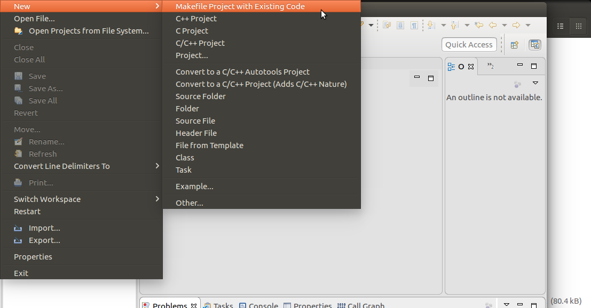
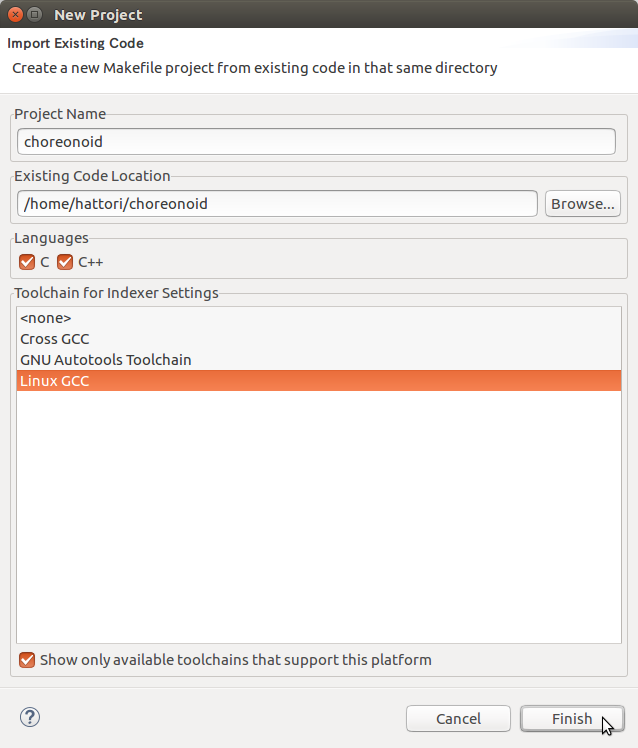
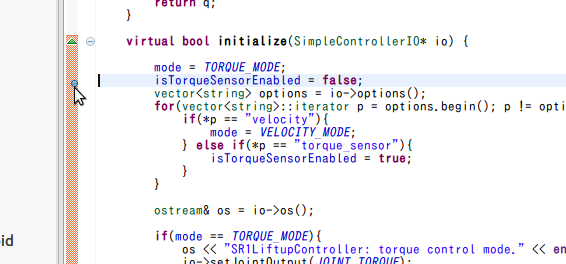
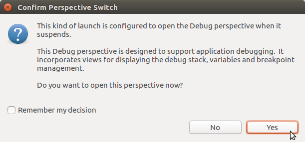

eclipseを用いてchoreonoidをデバッグする方法
==============================================================

eclipseを用いてchoreonoidのプログラムをデバッグする方法について解説します。
eclipse用のプロジェクトの作成方法はいくつかありますが、ここでは既にあるMakefileを用いる方法を解説します。

.. contents:: 
   :local:
   :depth: 1

準備
--------

デバッグ用のMakefileを作成するため、choreonoidのトップフォルダで、 ::

 ccmake .

を実行します。

**CMAKE_BUILD_TYPE** を **Debug** に変更し、**configure** , **generate** して終了します。

.. note:: `インストール <http://choreonoid.org/ja/install/build-ubuntu.html>`_ のページで説明しましたビルドディレクトリを使用した方法では、eclipseにソースファイルを認識させることができませんでしたので、トップフォルダで行ってください。

既に、トップフォルダでmakeを行っている方は、 ::

 make clean
 
を実行して、Releaseモードでビルドした内容を削除しておいてください。

eclipse のインストール
---------------------------------

既に使用している環境がある方は、それを使用して頂いて構いません。

ここでは ubuntu 64bit 上に eclipse Neon をインストールする場合を説明しています。

eclipseホームページ https://www.eclipse.org/ を開いて、ダウンロードのページから

**Get Eclipse Neon** のところの **Download** ボタンを押して、**eclipse-inst-linux64.tar.gz** をダウンロードします。

ファイルを適当な場所に展開し、**eclipse-inst** を起動します。

.. image:: images/Installer.png
   :scale: 50

**Eclipse IDE for C/C++ Developers** を選択すると先に進みます。

インストール先のフォルダを適宜入力して、インストールを開始します。

後はインストーラの指示に従ってください。

インストール先から、**eclipse** を起動します。workspaceを指定してください。デフォルトのままでも大丈夫です。

.. image:: images/Initial.png
   :scale: 50

図のような画面が開きます。初めて使用される方は、TutorialｓやSampleｓが参考になると思います。

**Welcome** のタグを閉じて先に進みます。

右下にある **Always Show ....** のチェックを外せば、次の起動からは表示されなくなります。

プロジェクトの作成
----------------------

タグを閉じると、C/C++のPerspectiveが開いていると思います。

開かない場合は、メニューの **Window - Perspective - Open Perspective - C/C++** で開いてください。

メニューから **File - New - MakeFile Project with Existing Code** を選択します。

ダイアログが開いたら、図の様に、Project Nameと、choreonoidのトップフォルダを設定し,終了します。

**Project Explorer** に **choreonoid** といプロジェクトが作成されます。これを選択し、メニューから **Project - Build Project** を選択します。

.. image:: images/Build1.png
   :scale: 70

Console画面に、メッセージが表示されて、終了します。

.. image:: images/Build2.png
   :scale: 80

ビルド時にエラーが起きたときもここに表示されます。

プログラムの実行
-----------------------------

まずは、何も設定せずにchoreonoidを起動します。

**Project Explorer** の **bin** フォルダを展開すると、虫のアイコンのついた **choreonoid** があると思います。

これを選択、右クリックして、ポップアップメニューから **Run As - Local　C/C++ Application** を選択します。

.. image:: images/Run.png
   :scale: 70

choreonoidが起動するので、なにかプロジェクトを開いてシミュレーションを実行してみてください。

デバッグモードで動作しているのでかなり遅くなります。動作が確認できましたら、choreonoidを終了して。元のウィンドウに戻ります。

図の様にツールバーの虫のアイコンの横の三角をクリックすると、choreonoidが登録されているのがわかります。

次回からは、この虫のアイコンをクリックすることでchoreonoidが起動できます。

.. image:: images/Debug.png
   :scale: 80

サンプルのデバッグ
-----------------------

次にSampleプログラムをデバッグします。

**Project Explorer** で、 **sample - SimpleController** のフォルダを展開し、**SR1LiftupController.cpp** をダブルクリックします。

.. image:: images/Source.png
   :scale: 70

図のようにプログラムが表示されます。ブレイクポイントを設定したい行の左側、図のところをダブルクリックします。

青い丸印がブレイクポイントが設定された表示です。

この状態でツールバーの虫のアイコンをクリックしてchoreonoidを起動します。

   
図のようなメッセージが出たらYesを選択してデバッグ用のPerspectiveを開きます。

デバッグ用の画面に切り替わって、プログラムの最初の行で止まっています。(最初の行で止まらないようにする設定は後で説明します。)

図の緑の三角アイコンをクリックするか、F8キーを押すと先に進みます。

.. image:: images/Resume.png
   :scale: 70

choreonoidが起動したら、SR1Liftup.cnoidプロジェクトを開き、シミュレーションを実行します。

先ほどブレイクポイントを設定した行でプログラムが止まります。

choreonoidのウィンドウの下にeclipseのウィンドウが隠れている場合は、前面に出してください。

図のアイコンをクリック、または **F6キー** を押すことで１行ずつのプログラムが実行できます。

.. image:: images/Step.png
   :scale: 70

左右のアイコンをクリック、または **F5,F7キー** で、関数の中に飛んだり、抜け出したりもできます。赤い四角アイコンで終了できます。

ブレイクポイントで止まっている時の変数の内容は、図のVariablesのところで見たり、設定したりできます。

.. image:: images/Variables.png
   :scale: 70

.. note:: デバッグ時に、AISTSimulatorのプロパティのコントローラスレッドがtrueに設定されていると、シミュレーション開始時にchoreonoidがフリーズしてしまうことがあります。そのようなときは、falseの設定にしてデバッグしてください。

プログラムの最初の行で止まらないようにする設定
-----------------------------------------------------------
メニューの **Window - Preferences** を選択して設定画面を開きます。

左側のリストから **C/C++ - Debug - GDB** と選択して画面を変更し、 **Stop on startup at:** という箇所のチェックを外します。

**Apply** して終了します。

