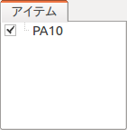
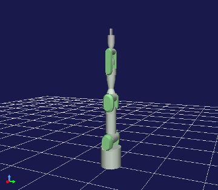
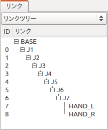
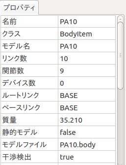

Bodyモデル
==========

BodyモデルとBodyアイテム
------------------------

コンピュータ上でロボットに関わる各種計算を行うためには、
ロボットや環境物体の形状や物理特性等をデータ化したモデルが必要となります。
Choreonoidではこのモデルを「Bodyモデル」と呼んでいます。
これは実際にはChoreonoidが利用している"Bodyライブラリ"にてC++のクラスとして定義されている"Bodyクラス"に対応しています。

このBodyモデルにChoreonoidのGUIからアクセスするためのプロジェクトアイテムとして、
「Bodyアイテム」が定義されており、Choreonoid上で行うロボットに関する操作の多くはこのBodyアイテムを介して行うことになります。

モデルファイル
--------------

Bodyアイテムは、ロボットや環境物体のモデルを記述した「モデルファイル」を読み込むことで生成します。
モデルファイルの形式には様々なものがありますが、現在のところChoreonoidで読み込み可能なモデルファイル形式として、
ロボットシミュレータOpenHRPで定義されたモデルファイル形式（OpenHRP形式）があります。
OpenHRP形式は3Dモデルを記述する標準規格である Virtual Reality Modeling Language (VRML) 97 形式を拡張して定義されており、
ファイルには通常 VRML97 の拡張子である "wrl" が拡張子としてつきます。
また、モデルファイルに対して追加の情報を記述したYAML形式(拡張子 yaml）のファイルを読み込むことも可能です。

.. note:: OpenHRP形式以外のモデルファイル形式への対応も進めており、その一環として現在のところ Collada Robot Extensions 形式の読み込みも可能です。ただしまだ実装が完全ではなく、うまく読み込めない場合もあるため、今のところは特別な理由がなければOpenHRP形式を使うようにしてください。

サンプルモデル
--------------

Choreonoidには標準で以下のようなサンプルモデルが付属していて、
share ディレクトリの model 以下に格納されています。
サンプルモデルとしては以下のようなモデルがありますので、
まずはこれらのモデルを読み込んでモデルの操作方法を確認するとよいでしょう。

================= ========================= =============================
 モデル           ファイル                  概要
================= ========================= =============================
 box1             misc/box1.wrl             長方形の剛体
 SR1              SR1/SR1.yaml              シンプルな二足歩行ロボットモデルのサンプル
 GR001            GR001/GR001.yaml          HPI社製二足歩行ロボット"GR001"のモデル
 PA10             PA10/PA10.yaml            三菱重工株式会社製マニピュレータ "PA10" のモデル
 Crawler          misc/crawler.wrl          シンプルなクローラ型モバイルロボットのモデル
 Tank             misc/tank.wrl             戦車型モデルのサンプル
 floor            misc/floor.wrl            床モデル
================= ========================= =============================

.. Tankのモデルファイルの名前を修正しておく

.. _loading_model:

モデルの読み込み
----------------

モデルファイルの読み込みは、メインメニューの「ファイル」-「読み込み」-「OpenHRPモデルファイル」から行います。
このメニューを実行するとファイル読み込みダイアログが表示されるので、モデルファイルを選んでください。
ファイルの読み込みに成功すると、読み込んだモデルの名前でBodyアイテムが生成されます。

例えばサンプルモデルの中から、PA10モデルを読み込んでみましょう。
モデルファイルの読み込みダイアログからPA10ディレクトリにある "PA10.yaml" を選択します。
ファイルが正常に読み込まれると、アイテムツリービュー上に以下のようにモデル名が表示されます。

.. image:: images/pa10item.png

この時、メッセージビューには以下のようなメッセージが出力されます。 ::

 OpenHRP モデルファイル "/usr/local/share/choreonoid-1.5//PA10/PA10.yaml" を読み込み中
 -> 完了!

もしモデルファイルに問題があれば、代わりにエラーメッセージが出力されますので、ファイルの内容を確認してください。

.. note:: アイテムツリービュー上でBodyアイテムを選択してCtrl + Rを押すと、Bodyアイテムの再読み込みを行います。この操作では再読込されたモデルがすぐにGUI上に反映されるので、モデルファイルの編集時などに使うと便利です。

シーンビュー上での表示
----------------------

Bodyアイテムとして読み込まれたモデルは、シーンビュー上に3Dグラフィックスで表示することができます。
これを行うには、アイテムツリービュー上で、表示したいBodyアイテムのチェックをONにします。

例えばPA10モデルについて、図のようにPA10アイテムのチェックを入れます。

するとシーンビュー上にPA10モデルのCGが表示されます。

モデルを表示させたくない時は、再度アイテムのチェックを外した状態にすればOKです。

モデルの構造
------------

ロボット工学では一般的にモデルを構成する個々のパーツ（剛体）を「リンク」と呼んでいます。
モデルとしては単一のリンクからなるものと複数のリンクからなるもの（マルチリンクモデル）があります。

単一の剛体とみなせるモデルについては、通常リンクがひとつとなります。
例えばサンプルモデルの"box1"はそのようなモデルです。

ロボットは通常マルチリンクモデルとなります。
マルチリンクモデルにおいて、リンクは「関節」によって接続され、関節の状態を変えることで様々な姿勢をとることが可能です。

モデルの構造は「リンクビュー」を用いて確認することができます。
リンクビューの表示は現在選択されているBodyアイテムに対してなされるので、
まずは構造を確認したいモデルのBodyアイテムをアイテムツリービュー上で選択してください。
例えばPA10のBodyアイテムを選択すると、リンクビューに以下のように表示されるかと思います。

.. image:: images/linkview_pa10links.png

PA10モデルについては、ここに表示されているように、"BASE"から"HAND_R"までの10個のリンクで構成されています。
さらに、"J1"から"HAND_R"については、関節も含むリンクとなっています。
"ID"に表示されているのは関節の識別番号で、0〜8までの9つの関節があることが分かります。
この表示では関節の接続関係まではよく分かりませんが、
リンクビュー上部のコンボボックスを「リンク一覧」から「リンクツリー」に変更すると以下のような表示となり、
関節の接続関係も確認することができます。

このツリーにおける親子関係は、親と子の間に関節が存在することを示しています。
この表示により、PA10モデルは"BASE"から"J7"まで直列にリンクが接続され、
最後の"HAND_L"と"HAND_R"はどちらも"J7"に接続されたリンクであることが分かります。
また、この例の"BASE"リンクのように、ツリーのルートとなるリンクを「ルートリンク」と呼びます。

.. note:: マルチリンクモデルの構造は基本的にはこのようにツリーで表現することができます。ただし、モデルに閉ループ構造がある場合はツリーだけでは表現できません。Choreonoidでは現在のところ閉ループ構造のモデルには完全には対応していませんので注意が必要です。

Bodyアイテムのプロパティ
------------------------

Bodyアイテムを選択状態にすると、プロパティビューに選択したBodyアイテムのプロパティ一覧が表示されます。
PA10の場合、以下のように表示されるかと思います。

Bodyアイテム特有のプロパティとしては以下のようなものがあり、
これらによってモデルの概要を確認したり、編集方法を変更したりすることが可能となっています。

================================ ===================================
 モデル名                        モデル自体の名前です。アイテム名はモデルの個々の実態を区別するために設定され、同一モデルに対しても異なる名前を設定することができますが、本プロパティは同じモデルに対しては常に同じとなります。
 リンク数                        モデルを有するリンク（関節で分けられる個々の部位）の数です。
 関節数                          モデルが有する関節の数です。
 デバイス数                      モデルが有するデバイス（各種センサ、ライト等）の数です。
 ルートリンク                    ルートリンクの名前です。
 ベースリンク                    姿勢変更操作においてベースとなるリンクを表しています。
 質量                            モデルの全質量です。
 静的モデル                      全く動かない（環境に固定されていて可動関節もない）モデルの場合、trueとなります。
 モデルファイル                  モデルファイルのファイル名です。
 干渉検出                        他の物体との干渉検出を行うかどうかを示しています。
 自己干渉検出                    自己干渉検出を行うかどうかを示しています。
 編集可能                        Sceneビュー上で位置や姿勢を編集可能かどうかを示しています。
================================ ===================================
