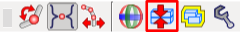

干渉検出
========

モデルを動かしていると、リンクが他のリンクと干渉（衝突）を起こすことがあります。Choreonoidはそのような干渉を検出する機能を備えており、ここではその利用法を説明します。

.. contents::
   :local:
   :depth: 1

.. _model_collision_and_worlditem:

干渉検出とWorldアイテム
-----------------------

干渉検出を行うためには、まず "WorldItem"型のアイテム（Worldアイテム）を導入する必要があります。

WorldアイテムはChoreonoid上でひとつの仮想世界(Virtual World)を表すアイテムです。このアイテムによって、

* Bodyモデルをある仮想世界に結びつける
* 仮想世界全体の設定を行う
* 複数の仮想世界を同時に扱う

といったことが可能となります。

干渉検出においても、

* どの物体とどの物体の干渉を検出するか
* 干渉検出結果をどのように表示するか

といった設定が必要となりますが、これらはある仮想世界と結びつけることが合理的です。そこで干渉検出の設定もWorldアイテムを介して行うようになっています。

Worldアイテムの作成
-------------------

Worldアイテムは、通常のアイテムの作成方法で作成することができます。具体的には、メインメニューの「ファイル」-「新規」-「ワールド」を実行すると現れる「新しいワールドアイテムの生成」ダイアログで「生成」ボタンを押して作成します。

Bodyモデルの関連付け
--------------------

Worldアイテムは、それにBodyモデルを関連付けることで初めて意味を成します。関連付けは、BodyアイテムをWorldアイテムの小アイテムとして配置することで行います。

ここでは、今まで扱ってきたPA10のモデルでこれを行ってみましょう。PA10モデルが読み込まれている状態で上記のWorldアイテムの作成を行うと、アイテムツリービューでは２つのアイテムが以下のように並んで表示されているかと思います。

.. image:: images/pa10_and_world.png

ここで、 :ref:`basics_itemtree_management` - :ref:`basics_item_move` の説明に従って "PA10" を "World" の上にドラッグすると、PA10がWorldの小アイテムに移動して以下のようになります。

.. image:: images/pa10_in_world.png

これでPA10モデルが仮想世界"World"と関連付けられたことになります。

.. note:: "PA10"が選択状態の時にWorldアイテムの生成を行うと、生成されたWorldアイテムはPA10の小アイテムとして配置されてしまい、親子関係が上の例とは逆になってしまいます。この場合はいったんWorldアイテムをアイテムツリービュー下部の何も無い領域にドラッグします。するとWorldアイテムがPA10の小アイテムでは無くなりますので、その後上記の操作を行うようにしてください。

.. note:: Worldアイテムを作成し、それを選択した状態でBodyモデルを読み込むと、モデルが最初からWorldアイテムの小アイテムとして読みこまれることになります。Worldアイテムを導入したプロジェクトを一から作成する際には、そのようにすることで操作を効率化できます。

複数Bodyモデルの関連付け
------------------------

通常はひとつの仮想世界に複数のBodyモデルを関連付けることになります。その場合、単純に複数のBodyアイテムが同じWorldアイテムの小アイテムとなっていればOKです。

ここでは先ほどのPA10モデルに加えて、 :ref:`bodymodel_samplemodels` の中から床のモデルを追加してみましょう。share ディレクトリの "misc/floor.wrl" を読み込んで、同じWorldアイテムへの関連付けを行なってください。アイテムツリーが以下のようになればOKです。

.. image:: images/pa10_floor_in_world.png

このようにFloorにもチェックを入れて、床のモデルもシーンビューに表示させてみましょう。PA10を標準姿勢にすれば、以下のようなシーンが表示されるかと思います。

.. image:: images/pa10_floor_scene.png

以下では干渉検出の例としてこのPA10と床のモデルの間の干渉を検出・表示させてみたいと思います。

干渉検出の設定
--------------

干渉検出を行うかどうかは、WorldアイテムとBodyアイテムのプロパティで切り替えることができます。関連するプロパティは以下のとおりです。

.. tabularcolumns:: |p{3.0cm}|p{4.0cm}|p{8.0cm}|

.. list-table::
 :widths: 20,35,45
 :header-rows: 1

 * - アイテム
   - プロパティ(true、false)
   - 概要
 * - Worldアイテム
   - 干渉検出
   - 仮想世界全体としてそもそも干渉検出を行うかどうか
 * - Bodyアイテム
   - 干渉検出
   - 各Bodyモデルに対して、他のBodyモデルとの干渉検出を行うかどうか
 * - Bodyアイテム
   - 自己干渉検出
   - 各Bodyモデルにおける自己干渉を検出するかどうか

まず干渉検出を行う根本的な設定として、Worldアイテムの「干渉検出」をtrueにしておく必要があります。その上で、各モデルに対して個別に干渉検出を行うかどうかを切り替えるために、Bodyアイテムの２つのプロパティを設定します。

Worldアイテムの「干渉検出」はデフォルトではfalseとなっているので、まずはこれをtrueに切り替えてください（:ref:`basics_item_property` 参照）。Bodyアイテムについては、「干渉検出」のプロパティはデフォルトでtrueとなっており、これはこのままでOKです。「自己干渉検出」については後ほど説明します。

.. note:: 干渉検出は一般的に比較的計算時間のかかる処理となります。特にモデルが複雑（ポリゴン数が多い等）になるとこの影響を大きくなり、場合によってはモデルの操作や表示が重くなる場合があります。このことを考えると、干渉検出が特に必要ではない作業を行う際には干渉検出の処理は省いた方が快適な場合もあります。これがWorldアイテムの「干渉検出」がデフォルトでfalseとなっている理由です。

上記の設定で内部の干渉検出計算は行われるようになりますが、さらにこれを表示するための設定が必要となります。干渉の表示の仕方は様々なものが考えらますし、それらを常に表示させたいとも限らないため、このようになっています。

干渉検出結果の表示
------------------

ここでは、干渉検出結果をシーンビュー上に表示する方法を紹介します。これを行うためには、まずアイテムツリービュー上でWorldアイテムのチェックをオンにします。

.. image:: images/pa10_floor_in_world_checked.png

これはBodyアイテムのチェック入れるとそのモデルがシーンビュー上に表示されるのと同様に、Worldアイテムが有する仮想世界の情報をシーンビュー上に表示するという意味になります。

さらに、シーンビューの設定として、 :ref:`basics_sceneview_scenebar` の「干渉線の表示」ボタン（以下の図で赤枠で囲った部分）もオンにします。
      

.. image:: images/collision-toggle.png

これにより、干渉が生じている場合はシーンビュー上で対応する箇所に「干渉線」が表示されることになります。

以上で干渉の検出と表示に関わる設定は完了です。干渉計算やその表示が必要でなくなった場合は、上記のうちの対応する設定を再度オフにすればOKです。

干渉検出の例
------------

ではPA10と床との間の干渉検出を行ってみましょう。:ref:`sceneview_inverse_kinematics` を用いて、アームの先端を床に向かって動かしてみてください。アームが床にめり込む位置まで動かすと、衝突している部分に下図のように緑の線が何本か表示されるかと思います。これが干渉線です。

.. image:: images/pa10_floor_collision.png

ここで干渉線の方向は干渉している面の法線を、長さは干渉の深さを表しています。このようにして、干渉検出の結果を確認することができます。

.. _collision_detection_penetration_block:

貫通ブロック機能
----------------

リンクを動かす最中に干渉を検出した場合に、それ以上干渉が深くならないように（貫通していかないように）ブロックすることもできます。これを行うには、運動学バーの「貫通ブロックモード」ボタン（以下に赤枠で示した部分）をオンにします。

この状態で、先ほどと同様にアームを床の方まで動かしていきましょう。ドラッグしているリンクが床に接触すると、それ以上はそちらの方向へ動かせなくなります。例えば"J7"リンクを動かしていくと下図のような状態でブロックされます。

.. image:: images/pa10_j7_blocked.png

ただしこの図でも分かるように、ブロックされるのはあくまでユーザが動かしているリンクです。それ以外のリンクに干渉が発生してもそちらはブロックされませんので、この点に注意する必要があります。この例で先端のグリッパの部分でブロックしてほしい場合は、運動学モードを逆運動学モードにして、先端のリンク（"HAND_L"や"HAND_R"）を動かすようにすればOKです。すると以下のような位置でブロックがかかります。

.. image:: images/pa10_HAND_L_blocked.png

自己干渉の検出
--------------

上の例では異なるBodyモデル間の干渉検出を行いましたが、ひとつのBodyモデルの中で生じる自己干渉を検出することもできます。この機能はデフォルトではオフとなっていますが、Bodyアイテムの「自己干渉検出」のプロパティをtrueとすることで利用可能となります。

PA10の例では、下図のようにアームの先端をベース部分に衝突させるなどすると、自己干渉が検出できていることが分かります。

.. image:: images/pa10_selfcollision.png

なお、貫通ブロック機能は自己干渉では効かないようになっています。

ボディ／リンクビューの干渉表示
------------------------------

干渉検出の結果は、 :ref:`model_body_link_view` の「干渉」表示領域でも確認することができます。ここでは、対象となっているリンクに干渉がある場合、干渉相手のリンク名を表示します。「干渉」の領域には他モデルのリンクが、「自己干渉」の領域には自己干渉しているリンクが表示されます。

例えばPA10モデルでJ7リンクを対象として選択し、J7リンクが床モデルと自身のBaseリンクに干渉している場合、表示は以下のようになります。

.. image:: images/collision-panel-pa10.png

干渉検出器の切り替え
--------------------------
 
干渉検出を行うアルゴリズムは様々なものが開発されています。それらを用途によって使い分けたり、より高速なアルゴリズムを利用したいといった要望に応えるため、Choreonoidでは干渉検出アルゴリズムを実装した「干渉検出器(Collision Detector)」をプラグインによって新たに追加し、それらを切り替えて使えるようになっています。

干渉検出器の切り替えは、Worldアイテムの「干渉検出器」プロパティを設定することによって行います。このプロパティは選択式になっており、利用可能な干渉検出器の一覧が表示されるので、そこから希望のものを選択します。Choreonoidが提供する標準の干渉検出器は"AISTCollisionDetector"で、デフォルトではこれが選択されています。"NullCollisionDetector"というのも有りますが、これは空の干渉検出器を表しており、これを選ぶと干渉検出が行われません。

プラグインを導入することで、これら以外の干渉検出器も利用可能となります。例えばChoreonoidのオプションのプラグインのひとつである"ODEPlugin"は、Open Dynamics Engineの干渉検出機能を用いた"ODECollisionDetector"という干渉検出器を提供しており、プラグインを導入すればこれが選択できるようになります。
