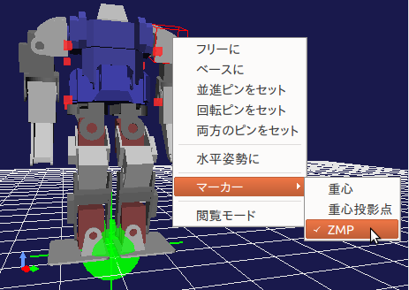

脚型モデルの操作
================

Choreonoidは二足歩行ヒューマノイドロボットをはじめとする脚型ロボット姿勢を操作するにあたって便利な機能を備えています。
ここではそのような機能について紹介します。

サンプルモデル
--------------

機能の紹介を行うためのサンプルとして、ここでは二足歩行ヒューマノイドロボット"GR001"のモデルを用いることとします。
このモデルはChoreonoidのshareディレクトリの "model/GR001" ディレクトリに "GR001.yaml" というファイルで格納されています。
また、このモデルを扱うサンプルプロジェクトとして、 "project/GR001Sample.cnoid" というプロジェクトファイルが用意されています。

準備として、このプロジェクトファイルを読み込んでください。
するとシーンビューに以下のようなGR001ロボットのモデルが表示されるかと思います。

.. image:: images/GR001Scene.png

プリセット運動学による腰の操作
------------------------------

脚型モデルの姿勢編集においては、足の接地位置を固定したまま腰の位置や姿勢を動かしたい場合があります。
固定する足がひとつだけで良い場合は通常の逆運動学（足をベースリンクとして腰を動かす）でこれを実現することができますが、
さらに複数の足を固定したまま腰を動かしたい場面も多いです。

実は脚型モデルにおいては通常「プリセット運動学モード」（ :ref:`model_kinematics_mode` 参照 ）で腰を動かせば、
そのように複数の足を固定したまま腰を動かす逆運動学となります。
これによって腰の位置や姿勢の編集を効率的に行うことができます。

重心の表示
----------

脚型モデルの姿勢編集においては、ロボットのバランスがとれているかを、
ロボット全体の重心位置を見ることで確認したいときがあります。
シーンビューではこのためのマーカーを表示することが可能です。

表示の切り替えはシーンビューのコンテキストメニューから行うことができます。
編集モードでマウスカーソルが対象モデルを指している状態で右クリックをすると、
以下のようなメニューが現れます。

.. image:: images/GR001_context_menu.png

ここで「マーカー」というサブメニューの中に、「重心」「重心投影点」という項目があるのが分かります。
項目をクリックすることでチェックが入り、表示をオンにすることができます。
（再度クリックするとチェックが消えて表示がオフになります。）

「重心」のチェックを入れると、重心位置が緑の十字線（交差している点が重心位置）で表示されます。
また、「重心投影点」では、重心の床面への投影点（Z=0となる点）を表示します。
これは、重心が足裏の領域に入っているかどうかをチェックする場合等で使います。

ゼロモーメントポイント（ZMP）
----------------------------

重心のマーカーと同様に、コンテキストメニューの「マーカー」-「ZMP」にチェックを入れることで、
「ゼロモーメントポイント（ZMP）」を表すマーカーも表示することができます。
これは以下の図で表示されている、緑色の球体と十字線からなるマーカーで、通常ロボットの足下付近に位置しています。

.. note:: ZMPは足裏が床面から受けるモーメントが0となる点（床反力の圧力中心）で、二足歩行制御における基本的な概念のひとつです。ZMPは実ロボットでは足裏接地面の凸包からなる「指示領域」内に存在しますので、この条件を目標動作軌道の計画や歩行安定化制御で用いることができます。詳細については `梶田秀司編著「ヒューマノイドロボット」 <http://www.amazon.co.jp/%E3%83%92%E3%83%A5%E3%83%BC%E3%83%9E%E3%83%8E%E3%82%A4%E3%83%89%E3%83%AD%E3%83%9C%E3%83%83%E3%83%88-%E6%A2%B6%E7%94%B0-%E7%A7%80%E5%8F%B8/dp/4274200582>`_ 等の文献をあたってください。

Choreonoidにおいて、ZMPマーカーは以下の２つの用途で使われます。

ひとつめは、ある動作軌道データから計算されるZMPや、実機のセンサの状態から得られるZMPを表示するという用途です。
これによって、動作軌道データや実機の状態が正常であるかを確認することができます。

ふたつめは、モデルの姿勢や動作の編集においてユーザがZMPの目標位置（目標ZMP)を与えるという用途です。
この場合、ユーザはZMPマーカーの位置を任意に設定することができます。

ZMPマーカーを動かすひとつの方法は、シーンビュー上でZMPマーカーをマウスで直接ドラッグすることです。
この場合、ZMPの垂直位置は床面上（Z=0）に固定しながら、床面上の２次元位置（X, Y座標）を変更することができます。

脚型ボディバー
--------------

脚型モデルの姿勢編集に便利な、重心やZMPマーカー等に関する操作をまとめたツールバーとして、以下の「脚型ボディバー」が用意されています。

.. image:: images/LeggedBodyBar.png

.. note:: 本ツールバーはデフォルトでは表示されていませんので、利用にあたっては :ref:`basics_show_toolbar` の説明に従ってまず表示を行なってください。

.. |i0| image:: ./images/center-cm.png
.. |i1| image:: ./images/zmp-to-cm.png
.. |i2| image:: ./images/cm-to-zmp.png
.. |i3| image:: ./images/right-zmp.png
.. |i4| image:: ./images/center-zmp.png
.. |i5| image:: ./images/left-zmp.png
.. |i6| image:: ./images/stancelength.png

各アイコンの機能は以下のようになっています。

===== ===============================================
|i0|  重心投影点が両足裏の中心に一致するように重心を水平移動します。
|i1|  重心投影点がZMPと一致するように重心を水平移動します。
|i2|  重心投影点の位置にZMPをセットします。
|i3|  ZMPを右足中心にセットします。
|i4|  ZMPを両足中心にセットします。
|i5|  ZMPを左足中心にセットします。
|i6|  両足間の幅を調整します。幅の長さは隣の数値入力ボックスで設定します。
===== ===============================================

ZMPを右足中心、左足中心にセットする機能と、重心投影点をZMPに一致させる機能を組み合わせることにより、
左右どちらかの足に重心を乗せた姿勢をセットすることもできます。

足裏の接地に関する操作
----------------------

脚型ロボットの姿勢編集では足裏を床面に接地させる必要が生じます。
ここではそのような操作を行う際のポイントを説明します。

まず、足裏を接地させたり、床上を動かす際に、足裏面を床面と並行にしておきたい場合があります。
この際に足裏面の元の姿勢が傾いているとすると、これが並行になるように修正しなければなりません。
姿勢の修正はシーンビュー上で直接ドラッグすることでも行うことができますが、
これだと希望の姿勢に正確に一致させるのは難しいです。

足裏を水平にすればよい場合は、シーンビュー上で足のリンクに対してコンテキストメニューの「水平姿勢に」を実行すればOKです。
また、床が傾いている場合でも、 :ref:`model_body_link_view` を使ってリンクのロール(R)、ピッチ(P)の値を調整すれば、
比較的簡単に床面と並行な足裏の姿勢を得ることができるかと思います。

また、足裏を接地させる際には、足裏の姿勢に加えて高さも床面と同じにし、床面にぴったりとフィットさせる必要が生じます。
これを行うには、 :doc:`collision-detection` で紹介した :ref:`collision_detection_penetration_block` を使えばOKです。

まず、干渉検出と貫通ブロック機能が有効となるように設定しておきます。
次に、上述の操作で足裏面が床面と並行になるように調整しておきます。
そして足のリンクを床面に向けて下げていきます。
すると足裏面が床面と接触した時点でそれ以上床面方向には動かせなくなりますので、
これによって足裏面を床面とぴったり一致する高さにセットできます。
足のリンクを床面に向けて下げる操作は、シーンビュー上で直接ドラッグしてもよいですし、
ボディ／リンクビュー上でZ座標値を減少させていってもOKです。
後者の場合は床面上での水平位置も調整しやすくなります。

床モデルと床グリッド
--------------------

シーンビュー上ではデフォルトで以下の図に示すような「床グリッド」が表示されています。

.. image:: images/floorgrid.png

これはZ=0の床面を想定したもの

.. image:: images/floor_model_grid.png

.. image:: images/floor_model.png

カスタマイザと解析解
--------------------

