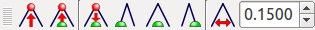

脚型モデルの操作
================

Choreonoidは二足歩行ヒューマノイドロボットをはじめとする脚型ロボット姿勢を操作するにあたって便利な機能を備えています。
ここではそのような機能について紹介します。

サンプルモデル
--------------

機能の紹介を行うためのサンプルとして、ここでは二足歩行ヒューマノイドロボット"GR001"のモデルを用いることとします。
このモデルはChoreonoidのshareディレクトリの "model/GR001" ディレクトリに "GR001.yaml" というファイルで格納されています。
また、このモデルを扱うサンプルプロジェクトとして、 "project/GR001Sample.cnoid" というプロジェクトファイルが用意されています。

準備として、このプロジェクトファイルを読み込んでください。
するとシーンビューに以下のようなGR001ロボットのモデルが表示されるかと思います。

.. image:: images/GR001Scene.png

プリセット運動学による腰の操作
------------------------------

脚型モデルの姿勢編集においては、足の接地位置を固定したまま腰の位置や姿勢を動かしたい場合があります。
固定する足がひとつだけで良い場合は通常の逆運動学（足をベースリンクとして腰を動かす）でこれを実現することができますが、
さらに複数の足を固定したまま腰を動かしたい場面も多いです。

実は脚型モデルにおいては通常「プリセット運動学モード」（ :ref:`model_kinematics_mode` 参照 ）で腰を動かせば、
そのように複数の足を固定したまま腰を動かす逆運動学となります。
これによって腰の位置や姿勢の編集を効率的に行うことができます。

重心の表示
----------

脚型モデルの姿勢編集においては、ロボットのバランスがとれているかを、
ロボット全体の重心位置を見ることで確認したいときがあります。
シーンビューではこのためのマーカーを表示することが可能です。

表示の切り替えはシーンビューのコンテキストメニューから行うことができます。
編集モードでマウスカーソルが対象モデルを指している状態で右クリックをすると、
以下のようなメニューが現れます。

.. image:: images/GR001_context_menu.png

ここで「マーカー」というサブメニューの中に、「重心」「重心投影点」という項目があるのが分かります。
項目をクリックすることでチェックが入り、表示をオンにすることができます。
（再度クリックするとチェックが消えて表示がオフになります。）

「重心」のチェックを入れると、重心位置が緑の十字線（交差している点が重心位置）で表示されます。
また、「重心投影点」では、重心位置に対して高さ（Z軸）を0とした点を表示します。
重心が足裏の領域に入っているかどうかをチェックする場合は後者の方が便利です。

ゼロモーメントポイント
----------------------

脚型ボディバー
--------------

足の操作
--------

干渉設定、貫通ブロック、BodyLinkビューの活用 etc.

床モデルと床グリッド
--------------------

カスタマイザと解析解
--------------------

