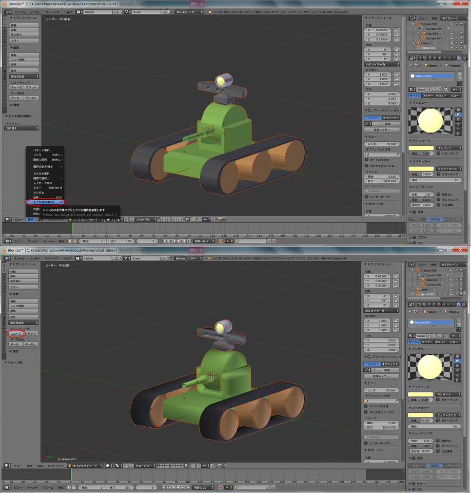
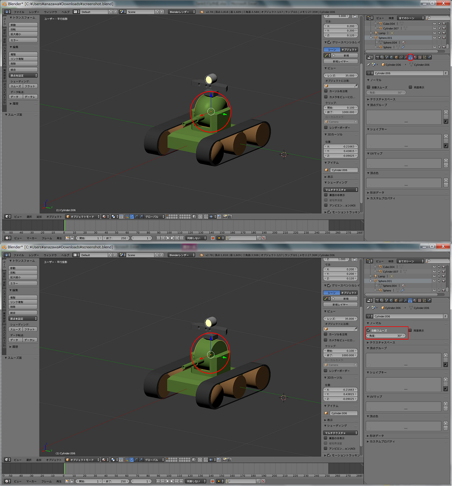

Blenderを使用したモデリング手順
===============================

.. contents::
   :local:
   :depth: 2
   
.. highlight:: YAML
   
Blenderインストール
-------------

下記のコマンドを実行し、Blenderをインストールします。 ::
   
 sudo apt-get install blender

Blenderの初期設定
------------

* **日本語化設定**

  Blenderのインターフェイスはデフォルトでは英語表記となっていますが、日本語表記に変更が可能です。
  まず、Blenderを起動したら、メニューバーより「File」⇛「User Preferencecs...」を選択し、「Blender User Preferences」ウィンドウを表示します。
  次にウィンドウの上部の「Sysytem」タブを選択し、右下にある「International Fonts」にチェックを入れます。 
  「Language」のリストボックスから「Japanese(日本語)」を選択し、「Translate」の「Interface」と「Tooltip」ボタンを選択します。
  ウィンドウの最下部にある「Save User Settings(ユーザー設定の保存)」ボタンを押下したら変更完了となります。
  
  .. image:: images/Initialize1.png
  
|

* **2ボタンマウスを使用する場合の設定**

  Blenderの操作は3ボタンマウスを前提に設計されていますが、Blenderのユーザー設定で2ボタンマウスを使用する場合の設定もあります。
  日本語化の場合と同様にして、「Blender User Preferences(Blenderユーザー設定)」ウィンドウを表示します。上部の「Input(入力)」タブを選択し、「Mouse(マウス)」の「Emulate 3 Button Mouse(3ボタンマウスの再現)」にチェックを入れ、
  ウィンドウの最下部にある「Save User Settings(ユーザー設定の保存)」ボタンを押下したら変更完了となります。
  これにより、「Alt」キー+マウス左ボタンでマウス中央のボタンを再現できます。
  
  .. image:: images/Initialize2.png
  
|

* **テンキーがない場合の設定**

  視点変更のショートカットが、デフォルトではテンキーに割り当てられています。ノートパソコンなどテンキーがない場合、テンキーをキーボード上部の「1」〜「0」キーに割り当てることができます。
  日本語化の場合と同様にして、「Blender User Preferences(Blenderユーザー設定)」ウィンドウを表示します。上部の「Input(入力)」タブを選択し、「Emulate Numpad(テンキーを模倣)」にチェックを入れ、
  ウィンドウの最下部にある「Save User Settings(ユーザー設定の保存)」ボタンを押下したら変更完了となります。
  これにより、テンキーがキーボード上部の「1」〜「0」キーに割り当てられます。

  .. image:: images/Initialize3.png

車体の作成
-----

1. 「3Dビューヘッダ」⇛「オブジェクト」⇛「スナップ」⇛「カーソル→原点」より3Dカーソルを原点に移動させます。 ※シーン内にて「Shift+S」キー⇛「カーソル→原点」でも3Dカーソルを原点に移動させることができます。

  .. image:: images/Chassis1.png

2. 「3Dビューヘッダ」⇛「メッシュ」⇛「立方体」よりモデルを追加します。 ※シーン内にて「Shift+A」⇛「メッシュ」⇛「立方体」でもモデル追加することができます。

  .. image:: images/Chassis2.png

3. 「3Dビューヘッダ」⇛「ビュー」⇛「プロパティ」を選択し、寸法(x:0.45, y:0.3, z:0.1)、位置(x:0.0, y:0.0, z:0.025)を設定します。

  .. image:: images/Chassis3.png

4. 「3Dビューヘッダ」⇛「オブジェクトモード」を「編集モード」に変更します。 ※シーン内にて「TAB」キー押下でも切り替えを行えます。

  .. image:: images/Chassis4.png

5. 「3Dビューヘッダ」⇛「頂点選択」を「辺選択」に変更し、「陰面処理」を選択します。

  .. image:: images/Chassis5.png

6. 面取りを行う4辺を「Shift+右クリック」で複数選択します。

  .. image:: images/Chassis6.png

7. 「3Dビューヘッダ」⇛「メッシュ」⇛「辺」⇛「ベベル」を選択し、面取りを行います。面取りを行う幅は、「ベベル」パネルの量:0.18を設定します。 ※シーン内にて「Ctrl+B」キー押下でもベベルを選択した状態となります。

  .. image:: images/Chassis7.png

8. 「3Dビューヘッダ」⇛「オブジェクトモード」を選択し、「プロパティエディターヘッダ」⇛「マテリアル」の「新規」ボタンを押下します。
   次に、ディフューズ(R:0.4, G:0.8, B:0.15)、スペキュラー(R:0.4, G:0.8, B:0.15)を設定したら、車体の作成が完了です。

  .. image:: images/Chassis8.png   

クローラの作成
-------

1. 「3Dビューヘッダ」⇛「追加」⇛「メッシュ」⇛「立方体」よりモデルを追加します。

  .. image:: images/Crawler1.png

2. 「プロパティ」⇛「トランスフォーム」パネルの寸法(x:0.5, y:0.1, z:0.16)、位置(x:0.0, y:0.22, z:0.0)を設定します。

  .. image:: images/Crawler2.png

3. 立方体を選択した状態で、「3Dビューヘッダ」⇛「オブジェクトモード」を「編集モード」に変更します。

  .. image:: images/Crawler3.png

4. 「3Dビューヘッダ」⇛「面選択」と「陰面処理」を選択し、上面、下面以外の4面を「Shift+右クリック」で複数選択します。

  .. image:: images/Crawler4.png

5. 「3Dビューヘッダ」⇛「オブジェクト」⇛「削除」⇛「面」を選択し、不要な面の削除をします。 ※シーン内にて面を選択し、「Delete」or「X」⇛「面」でも削除することができます。

  .. image:: images/Crawler5.png

6. クローラに丸みを付けるために、「3Dビューヘッダ」⇛「追加」⇛「円柱」よりモデルの追加をします。

  .. image:: images/Crawler6.png

7. 「円柱」パネルの頂点:32、半径:0.08、深度:0.1、位置(x:0.2505, y:0.22, z:0.0)、回転(x:90, y:0, z:0)に設定します。

  .. image:: images/Crawler7.png

8. 「3Dビューヘッダ」⇛「選択」⇛「円選択」を選択し、図の通りに半円以外の部分を選択したら、「右クリック」で確定します。 ※シーン内にて面を選択し、「C」キーでも円選択状態に変更できます。また、選択範囲の白い円はマウスホイールを回転することで変更ができます。

  .. image:: images/Crawler8.png

9. 「3Dビューヘッダ」⇛「メッシュ」⇛「削除」⇛「面」を選択し、選択した面の削除を行います。

  .. image:: images/Crawler9.png

10. 半円を選択し、「3Dビューヘッダ」⇛「メッシュ」⇛「複製を追加」で半円を複製します。
    次に、「3Dビューヘッダ」⇛「回転」を選択し、z軸周りに180°回転させたら、「3Dビューヘッダ」⇛「移動」を選択し、図の通りに移動させます。

  .. image:: images/Crawler10.png

11. 「3Dビューヘッダ」⇛「辺選択」に変更し、図の通りに長方形の辺と半円の辺を「Shift+右クリック」で選択します。
    次に、「3Dビューヘッダ」⇛「メッシュ」⇛「辺」⇛「辺ループのブリッジ」を選択し、2辺の間に面を作成します。
    同様の手順で残りの3箇所にも面を作成します。

  .. image:: images/Crawler11.png

12. 「3Dビューヘッダ」⇛「編集モード」から「オブジェクトモード」に変更します。

  .. image:: images/Crawler12.png

13. 「プロパティエディターヘッダ」⇛「モディファイアー」⇛「厚み付け」を選択し、厚み:0.1に設定したら適用ボタンを押下します。

  .. image:: images/Crawler13.png

14. 「3Dビューヘッダ」⇛「追加」⇛「メッシュ」⇛「円柱」よりモデルを追加します。

  .. image:: images/Crawler14.png

15. 「円柱」パネルの頂点:32、半径:0.075、深度:0.1に設定し、「プロパティ」⇛「トランスフォオーム」パネルより位置(x:0.25, y:0.22, z:0.0)、回転(x:90, y:0, z:0)を設定します。

  .. image:: images/Crawler15.png

16. 「3Dビューヘッダ」⇛「オブジェクト」⇛「オブジェクトの複製」を選択し、ホイールを2つ複製したら、「プロパティ」パネル⇛「トランスフォオーム」パネルより位置を設定します。

  .. image:: images/Crawler16.png

17. 左クローラ(ベルト部、ホイール部)を選択し、項番16と同様にオブジェクトの複製を行います。
    次に、「プロパティ」⇛「トランスフォオーム」パネルより位置を設定したら、右クローラの完成です。

  .. image:: images/Crawler17.png

18. 「3Dビューヘッダ」⇛「追加」⇛「メッシュ」⇛「立方体」よりモデルを追加します。
    次に、「プロパティ」⇛「トランスフォーム」パネルの寸法(x:0.55, y:0.02, z:0.12)、位置(x:0.0, y:0.16, z:0.0)を設定します。

  .. image:: images/Crawler18.png
  
19. 「3Dビューヘッダ」⇛「編集モード」に変更し、「3Dビューヘッダ」⇛「辺選択」を選択します。
    次に、図の通り4辺を「Shift+右クリック」で選択し、「3Dビューヘッダ」⇛「メッシュ」⇛「辺」⇛「ベベル」を選択したら、「ベベル」パネルの量:0.07、セグメント:1を設定します。

  .. image:: images/Crawler19.png
  
20. 「3Dビューヘッダ」⇛「オブジェクトモード」に変更し、プレートを「右クリック」で選択したら、「プロパティエディターヘッダ」⇛「マテリアル」の「新規」ボタンを押下したら、ディフューズ(R:0.8, G:0.8, B:0.8)、スペキュラー(R:0.8, G:0.8, B:0.8)を設定します。

  .. image:: images/Crawler20.png

21. 「3Dビューヘッダ」⇛「オブジェクト」⇛「オブジェクトの複製」を選択し、プレートを3枚複製します。
    次に、左右のクローラに付ける外側のプレートの寸法(x:0.55, y:0.01, z:0.12)に変更したら、ホイールの中心を通るように図の通りに残りの3枚のプレートの位置を設定します。

  .. image:: images/Crawler21.png

22. 左クローラのベルトを「右クリック」で選択し、「プロパティエディターヘッダ」⇛「マテリアル」の「新規」ボタンを押下したら、ディフューズ(R:0.128, G:0.128, B:0.128)、スペキュラー(R:0.128, G:0.128, B:0.128)を設定します。

  .. image:: images/Crawler22.png

23. 右クローラのベルトを「右クリック」で選択し、「プロパティエディターヘッダ」⇛「マテリアル」の「新規」ボタンの左にあるマテリアルアイコンを「左クリック」し、作成したマテリアル一覧から項番22で作成したマテリアルを設定します。

  .. image:: images/Crawler23.png

24. クローラのホイールを「右クリック」で選択し、「プロパティエディターヘッダ」⇛「マテリアル」の「新規」ボタンを押下し、ディフューズ(R:0.8, G:0.4, B:0.15)、スペキュラー(R:0.8, G:0.4, B:0.15)を設定します。

  .. image:: images/Crawler24.png

25. 残りのクローラのホイールも項番23と同様の手順で、作成したマテリアル一覧から項番24で作成したマテリアルを設定したら、クローラの作成が完了です。

  .. image:: images/Crawler25.png
  
26. 「Shift+右クリック」でクローラ(ベルト、ホイール、プレート)を選択した後に、車体を「Shift+右クリック」で選択します。
    次に、「3Dビューヘッダ」⇛「オブジェクト」⇛「親」⇛「オブジェクト」を選択し、「オブジェクト」を選択したら親子関係の設定が完了です。

  .. image:: images/Crawler26.png

砲塔(ヨー)の作成
---------

1. 「3Dビューヘッダ」⇛「メッシュ」⇛「立方体」よりモデルを追加します。

  .. image:: images/Turret_Y1.png

2. 砲台(ヨー)となる立方体の寸法(x:0.2, y:0.2, z:0.125)、位置(x:-0.04, y:0.0, z:0.1125)を設定します。

  .. image:: images/Turret_Y2.png

3. 「3Dビューヘッダ」⇛「オブジェクトモード」から「編集モード」に変更します。

  .. image:: images/Turret_Y3.png

4. 立方体上で「Ctrl+R」を押下すると、ループカットの方向がピンクの線で表示されるので、分割数:4となるようにマウスホイールを回転させ、左クリックで確定します。
   次に、オレンジ色の線に変わるので、右クリックを押下し均等にループを分割します。
   
  .. image:: images/Turret_Y4.png

5. 項番4と同様にして、分割数:3となるように設定を行い、左クリックで確定します。
   次に、オレンジ色の線に変わるので、右クリックを押下し均等にループを分割します。

  .. image:: images/Turret_Y5.png

6. 「3Dビューヘッダ」⇛「辺選択」を選択し、角の4辺を「Shift+右クリック」で選択します。

  .. image:: images/Turret_Y6.png

7. 「3Dビューヘッダ」⇛「メッシュ」⇛「辺」⇛「ベベル」を選択し、面取りを行います。面取りを行う幅は、「ベベル」パネルの量:0.165を設定します。

  .. image:: images/Turret_Y7.png

8. 「3Dビューヘッダ」⇛「面選択」を選択し、図の通りに削除する面を「Shift+右クリック」で複数選択します。

  .. image:: images/Turret_Y8.png

9. 「3Dビューヘッダ」⇛「メッシュ」⇛「削除」⇛「面」を選択し、面を削除します。

  .. image:: images/Turret_Y9.png

10. 「3Dビューヘッダ」⇛「辺選択」を選択し、図の通りに3辺を「Shift+右クリック」で複数選択します。

  .. image:: images/Turret_Y10.png

11. 「3Dビューヘッダ」⇛「メッシュ」⇛「面」⇛「辺/面作成」を選択し、面の作成をします。

  .. image:: images/Turret_Y11.png

12. 項番11と同様にして、反対側にも面を作成します。

  .. image:: images/Turret_Y12.png

13. 「3Dビューヘッダ」⇛「追加」⇛「円柱」よりモデルを追加し、「円柱」パネルの頂点:32、半径:0.14、深度:0.12、位置(x:-0.04, y:0.0, z:0.195)、回転(x:90, y:0, z:0)を設定します。

  .. image:: images/Turret_Y13.png

14. 「3Dビューヘッダ」⇛「面選択」を選択し、図の通りに円柱の不要な面を「Shift+右クリック」で複数選択します。
    次に、「3Dビューヘッダ」⇛「メッシュ」⇛「削除」⇛「面」を選択し、不要な面を削除します。

  .. image:: images/Turret_Y14.png

15. 「3Dビューヘッダ」⇛「辺選択」を選択し、図の通りに2辺を「Shift+右クリック」で選択したら、「3Dビューヘッダ」⇛「メッシュ」⇛「面」⇛「辺/面作成」を選択し、面を作成します。
    次に、反対側についても同様に面の作成をします。

  .. image:: images/Turret_Y15.png

16. 両側面も同様の手順で面の作成を行います。

  .. image:: images/Turret_Y16.png

17. 図の通りに円柱だった部分の前から2つ目の辺と後ろから2つ目の辺を選択し、「3Dビューヘッダ」⇛「メッシュ」⇛「トランスフォーム」⇛「移動」を選択したら、すぐに「z」キーを押下しマイナス方向に少し移動させ、滑らかな曲線にします。
    ※微調整等を行う際は、「Shift」キーを押下した状態でマウスを移動させると単位が制限されます。

  .. image:: images/Turret_Y17.png

18. 「3Dビューヘッダ」⇛「オブジェクトモード」を選択し、「プロパティエディターヘッダ」⇛「マテリアル」の「新規」ボタンの左にあるアイコンを選択します。
    次に、マテリアルの一覧が表示されるので、車体作成時に設定したマテリアルを選択したら、砲塔(ヨー)の作成が完了です。

  .. image:: images/Turret_Y18.png

19. 「右クリック」で砲塔(ヨー)を選択した後に、車体を「Shift+右クリック」で選択します。
    次に、「3Dビューヘッダ」⇛「オブジェクト」⇛「親」⇛「オブジェクト」を選択し、「オブジェクト」を選択したら親子関係の設定が完了です。

  .. image:: images/Turret_Y19.png

砲塔(ピッチ)の作成
----------

1. 「3Dビューヘッダ」⇛「オブジェクトモード」に変更し、「3Dビューヘッダ」⇛「追加」⇛「メッシュ」⇛「円柱」よりモデルを追加します。

  .. image:: images/Turret_P1.png

2. 「円柱」パネルの頂点:32、半径:0.1、深度:0.12に設定し、「プロパティ」⇛「トランスフォーム」パネルの位置(x:-0.04, y:0.0, z:0.16)、回転(x:90, y:0, z:0)を設定します。

  .. image:: images/Turret_P2.png

3. 「プロパティエディターヘッダ」⇛「マテリアル」の「新規」ボタンの左にあるアイコンを選択します。
   次に、マテリアルの一覧が表示されるので、車体作成時に設定したマテリアルを選択したら、砲塔(ピッチ)の作成が完了です。

  .. image:: images/Turret_P3.png

4. 「右クリック」で砲塔(ピッチ)を選択した後に、砲塔(ヨー)を「Shift+右クリック」で選択します。
   次に、「3Dビューヘッダ」⇛「オブジェクト」⇛「親」⇛「オブジェクト」を選択し、「オブジェクト」を選択したら親子関係の設定が完了です。

  .. image:: images/Turret_P4.png

砲身の作成
-----

1. 「3Dビューヘッダ」⇛「オブジェクトモード」を選択し、「3Dビューヘッダ」⇛「追加」⇛「メッシュ」⇛「円柱」よりモデルを追加します。

  .. image:: images/Barrel1.png

2. 「円柱」パネルの頂点:32、半径:0.02、深度:0.2、ふたのフィルタイプ:"なし"に設定し、「プロパティ」⇛「トランスフォーム」パネルの位置(x:0.16, y:0.0, z: 0.15)、回転(x:0, y:90, z:0)を設定します。

  .. image:: images/Barrel2.png

3. 「3Dビューヘッダ」⇛「編集モード」を選択し、円柱上で「Ctrl+R」キーを押下するとループカットの方向がピンクの線で表示されるので、分割数:1となるように設定し、左クリックで確定します。
   次に、オレンジの線に変わるので、砲身の根本から3分の1程度の位置で左クリックで分割位置を確定します。

  .. image:: images/Barrel3.png

4. 「3Dビューヘッダ」⇛「面選択」を選択し、「3Dビューヘッダ」⇛「選択」⇛「円選択」にて砲身の先端部の面を複数選択します。

  .. image:: images/Barrel4.png

5. 「3Dビューヘッダ」⇛「メッシュ」⇛「押し出し」⇛「領域」を選択し、右クリックで同じ位置にメッシュの押し出しをします。
   次に、「3Dビューヘッダ」⇛「メッシュ」⇛「トランスフォーム」⇛「収縮/膨張」を選択し、砲身の先端部を収縮させます。

  .. image:: images/Barrel5.png

6. 「3Dビューヘッダ」⇛「面選択」を選択し、砲身の先端に収縮されずに残った不要な面があるので、「3Dビューヘッダ」⇛「選択」⇛「円選択」を選択し、不要な面を選択します。
   次に、「3Dビューヘッダ」⇛「メッシュ」⇛「削除」⇛「面」を選択し面の削除を行います。

  .. image:: images/Barrel6.png

7. 「3Dビューヘッダ」⇛「オブジェクトモード」を選択し、「プロパティエディターヘッダ」⇛「モディファイアー」⇛「厚み付け」を選択します。
   次に、厚み:0.005に設定し、「適用」ボタンを押下します。

  .. image:: images/Barrel7.png

8. 「プロパティエディターヘッダ」⇛「マテリアル」の「新規」ボタンの左にあるアイコンを選択します。
   次に、マテリアルの一覧が表示されるので、車体作成時に設定したマテリアルを設定したら、砲身の作成が完了です。

  .. image:: images/Barrel8.png

9. 「右クリック」で砲身を選択し、砲塔(ピッチ)を「Shift+右クリック」で選択し、「3Dビューヘッダ」⇛「オブジェクト」⇛「親」⇛「オブジェクト」を選択し、「オブジェクト」を選択したら親子関係の設定が完了です。

  .. image:: images/Barrel9.png

カメラの作成
------

1. 「3Dビューヘッダ」⇛「オブジェクトモード」を選択し、「3Dビューヘッダ」⇛「追加」⇛「メッシュ」⇛「立方体」よりモデルを追加します。

  .. image:: images/Camera1.png

2. 「立方体」パネルの半径:0.038に設定し、「プロパティ」⇛「トランスフォーム」パネルの寸法(x:0.055, y:0.075, z:0.05)、位置(x:-0.04, y:0.0, z: 0.285)を設定します。

  .. image:: images/Camera2.png

3. 「3Dビューヘッダ」⇛「編集モード」を選択し、「3Dビューヘッダ」⇛「辺選択」を選択します。
   次に、立方体の上面の4辺を選択した状態で、「3Dビューヘッダ」⇛「メッシュ」⇛「辺」⇛「ベベル」を選択し面取りを行います。
   面取りを行う幅は、「ベベル」パネルの量:0.021を設定します。

  .. image:: images/Camera3.png

4. 項番3と同様に下面側についても面取りを行います。

  .. image:: images/Camera4.png

5. 「3Dビューヘッダ」⇛「追加」⇛「立方体」を選択し、「立方体」パネルの半径:0.1375、位置(x:-0.04, y:0.0, z:0.332)を設定します。
   次に、「3Dビューヘッダ」⇛「拡大縮小」を選択し、x軸上(赤線)でドラッグすると「拡大縮小」パネルが表示されるので、ベクトル(x:0.218)を設定します。
   同様にz軸上(青線)でもドラッグし、「拡大縮小」パネルのベクトル(z:0.109)を設定します。

  .. image:: images/Camera5.png

6. 立方体上で「Ctrl+R」キーを押下するとループカットの方向がピンクの線で表示されるので、分割数:1となるように設定し、左クリックで確定します。
   次に、オレンジの線に変わるので、土台上面の辺上で左クリックで分割位置を確定します。
   同様に残りの3辺上でもループカットを行い分割位置を確定します。
   
  .. image:: images/Camera6.png
   
7. 「3Dビューヘッダ」⇛「面選択」を選択し、土台上面と本体下面の中央の面を選択したら、「3Dビューヘッダ」⇛「メッシュ」⇛「削除」⇛「面」を選択し面を削除します。

  .. image:: images/Camera7.png

8. 土台上部の4辺と本体下部の4辺を選択し、「3Dビューヘッダ」⇛「メッシュ」⇛「辺」⇛「辺ループのブリッジ」を選択し土台部と本体部を結合します。

  .. image:: images/Camera8.png

9. 「3Dビューヘッダ」⇛「辺選択」を選択し、ループカットにより作成された2つの線を「Alt+Shift+右クリック」で選択し、「3Dビューヘッダ」⇛「メッシュ」⇛「削除」⇛「辺を溶解」を選択し辺の削除を行います。

  .. image:: images/Camera9.png

10. 「3Dビューヘッダ」⇛「「拡大縮小」を選択し、立方体の後方部の角の2辺を「Shift+右クリック」で複数選択します。
    次に、y軸上(緑線)でドラッグすると「拡大縮小」パネルが表示されるので、ベクトル(y:0.781)を設定します。

  .. image:: images/Camera10.png

11. 立方体の角4辺を「Shift+右クリック」で複数選択し、「3Dビューヘッダ」⇛「メッシュ」⇛「辺」⇛「ベベル」を選択し、面取りを行います。
    面取りを行う幅は、「ベベル」パネルの量:0.01を設定します。

  .. image:: images/Camera11.png

12. 「3Dビューヘッダ」⇛「オブジェクトモード」を選択し、「3Dビューヘッダ」⇛「追加」⇛「円錐」よりモデルを追加します。
    次に、「円錐」パネルの頂点:32、半径1:0.01、半径2:0.005、深度:0.01、「プロパティ」⇛「トランスフォーム」パネルの回転(x:0, y:-90, z:0)を設定します。

  .. image:: images/Camera12.png

13. 「3Dビューヘッダ」⇛「編集モード」に変更し、「3Dビューヘッダ」⇛「面選択」を選択し、半径2の面を「右クリック」で選択状態にしたら、「3Dビューヘッダ」⇛「メッシュ」⇛「押し出し」⇛「領域」を選択し、すぐに「X」キーを押下します。
    次に、「Shift」キーを押下した状態でマウスを移動させ押し出しを行います。

  .. image:: images/Camera13.png

14. 項番13で押し出した箇所で「Ctrl+R」キーを押下するとループカットの方向がピンクの線で表示されるので、分割数:1となるように設定し、左クリックで確定します。
    次に、オレンジの線に変わるので、右クリックで均等にループを分割します。

  .. image:: images/Camera14.png

15. 「3Dビューヘッダ」⇛「選択」⇛「円選択」を選択し、図の通りに面の選択を行います。
    次に、「3Dビューヘッダ」⇛「メッシュ」⇛「トランスフォーム」⇛収縮/膨張を選択し収縮します。
    ※シーン内にて「C」キー押下でも円選択状態に切り替わります。

  .. image:: images/Camera15.png

16. 「3Dビューヘッダ」⇛「オブジェクトモード」を選択し、「プロパティ」⇛「トランスフォーム」パネルの位置(x:-0.0145, y:-0.015, z:0.332)を設定します。
    次に、「3Dビューヘッダ」⇛「オブジェクト」⇛「オブジェクトの複製」により同様の円錐をもう2つ作成します。
    複製した円錐も同様に、「プロパティ」⇛「トランスフォーム」パネルの位置(x:-0.0145, y:0.015, z:0.332)、(x:-0.0145, y:-0.07, z:0.332)を設定します。

  .. image:: images/Camera16.png

17. 「右クリック」でカメラを選択し、「プロパティエディターヘッダ」⇛「モディファイアー」⇛「ブーリアン」を選択し、演算:"差分"、オブジェクト:"Cone"、重複のしきい値:0.0を設定します。
    次に、「コピー」ボタンを押下し、オブジェクトのみ"Cone.001"、"Cone.002"に変更したものを1つずつ作成し、「適用」ボタンを押下します。
    円錐の形に繰り抜かれたら、3つの円錐を「Shift+右クリック」で複数選択し、「3Dビューヘッダ」⇛「オブジェクト」⇛「削除」により円錐を削除します。

  .. image:: images/Camera17.png

18. 「3Dビューヘッダ」⇛「編集モード」を選択し、「3Dビューヘッダ」⇛「面選択」を選択します。
    次に、項番17で繰り抜いた面のレンズ部分以外の面を全て選択し、「3Dビューヘッダ」⇛「メッシュ」⇛「面」⇛「面を三角化」を選択し面が三角形で分割します。

  .. image:: images/Camera18.png

19. 「3Dビューヘッダ」⇛「オブジェクトモード」を選択し、「プロパティエディターヘッダ」⇛「マテリアル」の「新規」ボタンを押下します。
    次に、ディフューズ(R:0.25, G:0.25, B:0.25)、スペキュラー(R:0.25, G:0.25, B:0.25)を設定したら、カメラの作成が完了です。
    
  .. image:: images/Camera19.png

20. 「3Dビューヘッダ」⇛「オブジェクトモード」を選択し、「右クリック」でカメラを選択します。
    次に、砲塔(ピッチ)を「Shift+右クリック」で選択し、「3Dビューヘッダ」⇛「オブジェクト」⇛「親」⇛「オブジェクト」を選択し、「オブジェクト」を選択したら親子関係の設定が完了です。

  .. image:: images/Camera20.png

ライトの作成
------

1. 「3Dビューヘッダ」⇛「オブジェクトモード」を選択し、「3Dビューヘッダ」⇛「追加」⇛「UV球」よりモデルを追加します。
   次に、「UV球」パネルのセグメント:12、リング:8、サイズ:0.03に設定し、「プロパティ」⇛「トランスフォーム」パネルの位置(x:-0.055, y:0.0, z:0.375)、回転(x:0, y:90, z:0)を設定します。

  .. image:: images/Light1.png

2. 「3Dビューヘッダ」⇛「編集モード」を選択し、「3Dビューヘッダ」⇛「辺選択」を選択します。
   次に、「3Dビューヘッダ」⇛「選択」⇛「円選択」を選択し、UV球の前半分を選択したら、「3Dビューヘッダ」⇛「メッシュ」⇛「押し出し」⇛「領域」よりUV球を引き伸ばします。

  .. image:: images/Light2.png

3. 「3Dビューヘッダ」⇛「選択」⇛「円選択」を選択し、前方部の半球を選択したら、「3Dビューヘッダ」⇛「メッシュ」⇛「削除」⇛「面」より不要な半球部を削除します。

  .. image:: images/Light3.png

4. 「3Dビューヘッダ」⇛「選択」⇛「円選択」を選択し、後方部の半球を選択します。
   次に、「3Dビューヘッダ」⇛「メッシュ」⇛「押し出し」⇛「領域」を選択し、すぐに「X」キー、「S」キーを押下し「Shift」を押した状態でマウスを移動させ、半球を縮小させます。

  .. image:: images/Light4.png

5. 「3Dビューヘッダ」⇛「オブジェクトモード」を選択し、「プロパティエディターヘッダ」⇛「モディファイアー」⇛「厚み付け」を選択します。
   次に、厚み:0.005に設定し、「適用」ボタンを押下します。
   
  .. image:: images/Light5.png

6. 「3Dビューヘッダ」⇛「オブジェクトモード」を選択し、「3Dビューヘッダ」⇛「追加」⇛「UV球」よりモデルを追加します。
   次に、「UV球」パネルのセグメント:12、リング:8、サイズ:0.025に設定し、「プロパティ」⇛「トランスフォーム」パネルの位置(x:-0.055, y:0.0, z:0.375)、回転(x:0, y:90, z:0)を設定します。

  .. image:: images/Light6.png

7. 「3Dビューヘッダ」⇛「編集モード」を選択し、「3Dビューヘッダ」⇛「辺選択」を選択します。
   次に、「3Dビューヘッダ」⇛「選択」⇛「円選択」を選択し、UV球の前半分を選択したら、「3Dビューヘッダ」⇛「メッシュ」⇛「押し出し」⇛「領域」よりUV球を引き伸ばします。
   
  .. image:: images/Light7.png

8. 「3Dビューヘッダ」⇛「選択」⇛「円選択」を選択し、前方部の半球を選択します。
   次に、「3Dビューヘッダ」⇛「メッシュ」⇛「削除」⇛「面」を選択し、半球を削除します。
   
  .. image:: images/Light8.png
  
9. 「3Dビューヘッダ」⇛「選択」⇛「円選択」を選択し、後方部の半球を選択します。
   次に、「3Dビューヘッダ」⇛「メッシュ」⇛「押し出し」⇛「領域」を選択し、すぐに「X」キー、「S」キーを押下し「Shift」を押した状態でマウスを移動させ、半球を縮小させます。

  .. image:: images/Light9.png
  
10. 「3Dビューヘッダ」⇛「編集モード」を選択し、「3Dビューヘッダ」⇛「追加」⇛「UV球」よりモデルを追加します。
    次に、「UV球」パネルのセグメント:12、リング:8、サイズ:0.025、位置(x:-0.01, y:0.0, z:0.375)、回転(x:0, y:90, z:0)を設定します。
   
  .. image:: images/Light10.png
  
11. 「3Dビューヘッダ」⇛「選択」⇛「円選択」を選択し、前方部の半球を選択します。
    次に、「3Dビューヘッダ」⇛「メッシュ」⇛「削除」⇛「面」を選択し、半球を削除します。
   
  .. image:: images/Light11.png
  
12. 「Shift+Alt+右クリック」で図の通り半球の2辺を選択します。
    次に、「3Dビューヘッダ」⇛「メッシュ」⇛「辺ループ」⇛「辺ループのブリッジ」を選択し、2辺の間に面の作成をします。
    
  .. image:: images/Light12.png
  
13. 「3Dビューヘッダ」⇛「オブジェクトモード」に変更し、「3Dビューヘッダ」⇛「追加」⇛「メッシュ」⇛「UV球」を選択します。
    次に、「UV球」パネルのセグメント:32、リング:24、サイズ:0.015、位置(x:-0.02, y:0.0, z:0.375)、回転(x:0, y:90, z:0)に設定します。

  .. image:: images/Light13.png

14. 「3Dビューヘッダ」⇛「オブジェクトモード」を選択し、ライトのフレームを選択します。
    次に、「プロパティエディターヘッダ」⇛「マテリアル」の「新規」ボタンを押下し、ディフューズ(R:0.8, G:0.8, B:0.8)、スペキュラー(R:0.8, G:0.8, B:0.8)を設定します。

  .. image:: images/Light14.png
  
15. ライトの反射板を選択し、「プロパティエディターヘッダ」⇛「マテリアル」の「新規」ボタンの左にあるアイコンを選択します。
    次に、マテリアルの一覧が表示されるので、ライトのフレーム作成時に設定したマテリアルを設定します。
   
  .. image:: images/Light15.png

16. 「3Dビューヘッダ」⇛「オブジェクトモード」を選択し、ライト点灯部を選択します。
    次に、「プロパティエディターヘッダ」⇛「マテリアル」の「新規」ボタンを押下し、ディフューズ(R:1.0, G:1.0, B:0.4)、スペキュラー(R:1.0, G:1.0, B:0.4)、シェーディングの放射:1.0を設定したら、ライトの作成は完了です。

  .. image:: images/Light16.png

17. 「3Dビューヘッダ」⇛「オブジェクトモード」を選択し、「右クリック」でライトのフレームを選択します。
    次に、カメラを「Shift+右クリック」で選択し、「3Dビューヘッダ」⇛「オブジェクト」⇛「親」⇛「オブジェクト」を選択し、「オブジェクト」を選択したら親子関係の設定が完了です。

  .. image:: images/Light17.png

18. 「3Dビューヘッダ」⇛「オブジェクトモード」を選択し、「右クリック」でライトの反射板を選択します。
    次に、ライトのフレームを「Shift+右クリック」で選択し、「3Dビューヘッダ」⇛「オブジェクト」⇛「親」⇛「オブジェクト」を選択し、「オブジェクト」を選択したら親子関係の設定が完了です。

  .. image:: images/Light18.png

19. 「3Dビューヘッダ」⇛「オブジェクトモード」を選択し、「右クリック」でライト点灯部を選択します。
    次に、ライトの反射板を「Shift+右クリック」で選択し、「3Dビューヘッダ」⇛「オブジェクト」⇛「親」⇛「オブジェクト」を選択し、「オブジェクト」を選択したら親子関係の設定が完了です。

  .. image:: images/Light19.png

シェーディングの設定
----------

「3Dビューヘッダ」⇛「オブジェクトモード」を選択し、滑らかな表面にしたいオブジェクトを選択します。
次に、「3Dビューヘッダ」⇛「ビュー」⇛「ツールシェルフ」を選択し、ツールシェルフを表示させます。
ツールシェルフの「ツール」タブの「編集」パネルのシェーディング:"スムーズ"を選択することで、滑らかな表面を再現することができます。

また、「プロパティエディターヘッダ」⇛「データ」⇛「ノーマル」パネルの「自動スムーズ」にチェックを入れ、角度を設定すると指定した角度より大きい場合はシャープなエッジを生成し、
指定した角度より小さい場合は、表面を滑らかにします。

