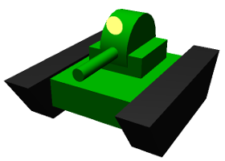
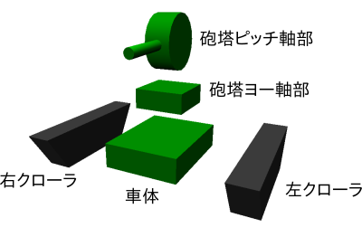
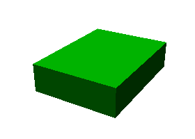
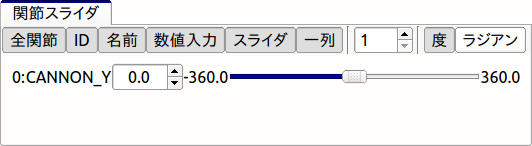
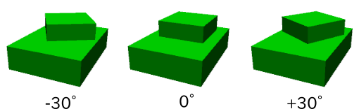
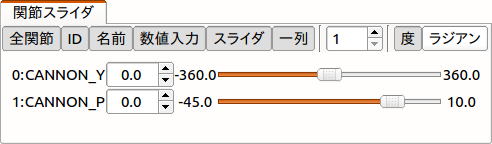
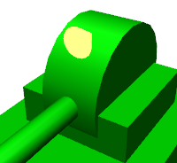
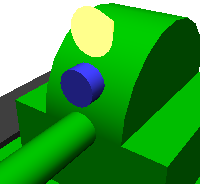
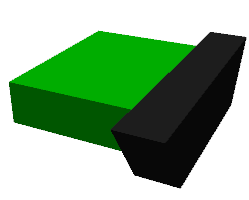

新YAML形式モデルファイルチュートリアル
======================================

.. contents::
   :local:
   :depth: 2

.. highlight:: YAML

概要
----

現在github上で開発中のバージョンでは、YAMLをベースとした新形式のモデルファイルの導入を進めています。これは従来のOpenHRP形式のモデルファイルと比較して、より簡潔に記述でき、記述可能な情報の自由度も高い形式となっており、今後OpenHRP形式を置き換えるべく開発を進めています。YAMLの形式については :doc:`modelfile-yaml` でも用いていましたが、本形式は追加情報だけでなくモデル本体も含む全ての情報を記述可能なものとしています。

本節ではこの新しい形式のモデルファイルについて、チュートリアルの形態で解説を行います。これにより、新形式の仕様に加えて、モデルファイルの編集をどのように進めていったらよいかも学ぶことができます。題材とするモデルは以下に示す"Tank"モデルとなります。

これは砲塔・砲身を動かす２軸の回転関節と、移動用の２つのクローラで構成されるモデルで、カメラとレーザーレンジセンサ、およびライトをデバイスとして備えています。このモデルはクローラ型モバイルロボットのサンプルとなるもので、これを用いたサンプルプロジェクトとして "TankJoystick.cnoid" や "OpenRTM-TankJoystick.cnoid" がChoreonoid本体に含まれています。

.. note:: ベースとなるYAML記法の詳細については、 `YAMLの仕様書 <http://www.yaml.org/spec/1.2/spec.html>`_ を参照して下さい。また、YAMLの解説記事としては、 `プログラマーのためのYAML入門（初級編） <http://magazine.rubyist.net/?0009-YAML>`_ という記事が分かりやすくまとまっていておすすめです。

Tankモデルの基本構造
--------------------

Tankモデルは下図に示す5つの部位で構成されています。

ベースとなる部分が車体です。車体の上部には砲塔・砲身が備わります。この部分は砲塔の土台となってヨー軸回転を行う部分と、その上部に砲身とともに取り付けられるピッチ軸回転を行う２つの部分からなります。車体の左右の側面にはそれぞれ移動用のクローラ機構が取り付けられます。

これら5つの部分が「リンク」としてモデリングされます。車体の部分はモデルの中心となる部分であり、これを「ルートリンク」としてモデリングします。ルートリンクは各モデルに対して必ずひとつだけ定義する必要があります。砲塔の2リンクについてはそれぞれ回転関節としてモデリングします。また、クローラ部分は :doc:`../../simulation/pseudo-continuous-track` に対応する関節タイプとしてモデリングします。

これらのリンクの間の階層構造（親子関係）は以下のようになります。 ::

 - 車体（ルート）
     + 砲塔ヨー軸部（回転関節）
            + 砲塔ピッチ軸部（回転関節）
     + 左クローラ
     + 右クローラ

なお、本チュートリアルでは各リンクの形状をモデルファイル本体にテキストで記述します。これにより、CADやモデリングツール等で作成した形状データを用いずに、テキストファイルだけでモデリングを完結しています。これに対して、CADやモデリングツール等で作成した形状データを用いることももちろん可能です。その方法については別途解説します。

モデルファイルの用意
--------------------

モデルファイルはYAML形式のテキストファイルとして作成します。YAML形式のファイルは通常 ".yaml" の拡張子をつけますが、モデルファイルについては ".body" の拡張子をつけます。

モデルファイルの作成を開始するにあたって、まずはテキストエディタを用いて空のテキストを作成し、拡張子 ".body" をつけた適当なファイル名で保存しておきましょう今回は "tank.body" というファイル名で保存することにします。このファイルはChoreonoidのshareディレクトリの"model/tank"ディレクトリに完成品が格納されています。今回はそのファイルの内容を解説しながら、完成に至るまでの作成手順の例を示すということになります。

なお、以下の記述をまとめたものは :doc:`tank` で参照することができます。

ヘッダの記述
------------

まずモデルファイルのヘッダとして、YAMLのマッピングを用いて以下のように記述します。 ::

 format: ChoreonoidBody
 formatVersion: 1.0
 angleUnit: degree
 name: Tank

最初の行の記述により、このファイルがChoreonoidのモデルファイルとして認識されるようになります。formatVersionは現在のところ1.0となります。今後仕様に変更があった場合に、新しい仕様と区別するためにバージョン番号を明示しておきます。

モデルファイルにおける関節角度の単位を指定する項目として、"angleUnit" があります。今回は "degree" を指定しているので、角度を度数法で記述します。ラジアンで記述したい場合は、ここに "radian" を指定します。通常は degree の方が記述がしやすいのではないかと思います。

モデルの名前は"name"に記述します。

.. _modelfile_yaml_links:

リンクの記述
------------

モデルが有するリンクの情報は、"links:" に以下のように記述します。 ::

 links:
   -
     リンク1（ルートリンク）の記述
   -
     リンク2の記述
   -
     リンク3の記述
   ...

このようにYAMLのリストとして任意個のリンクを記述することができます。各リンクの記述部分を「Linkノード」と呼びます。最初に記述するLinkノードは、モデルのルートリンクとみなされます。

.. _modelfile_yaml_link_node:

Linkノード
----------

LinkノードはYAMLのマッピング形式で記述します。マッピングの要素として、以下のようなパラメータが利用可能です。

.. list-table::
 :widths: 20, 80
 :header-rows: 1

 * - キー
   - 内容
 * - name
   - リンク名
 * - parent
   - 親リンク。親リンクの名前（nameに記述した文字列）で指定する。ルートリンクの場合は使用しない
 * - translation
   - 本リンクローカルフレームの親リンクからの相対位置。ルートリンクの場合はモデル読み込み時のデフォルト位置として使われる
 * - rotation
   - 本リンクローカルフレームの親リンクからの相対姿勢。姿勢は回転軸と回転角度に対応する4つの数値で表現(Axis-Angle形式）。ルートリンクの場合はモデル読み込み時のデフォルト位置として使われる
 * - jointType
   - 関節タイプ。 **fixed** (固定）、 **free** (非固定ルートリンク）、 **revolute** (回転関節）、 **prismatic** (直動関節）、 **pseudoContinousTrack** (簡易無限軌道）のどれかを指定
 * - jointAxis
   - 関節軸。3次元ベクトルの3要素のリストとして関節軸の向きを指定する。値は単位ベクトルとする。関節軸がリンクのローカル座標におけるX, Y, Zのいずれかに一致する場合は、対応する軸の文字(X, Y, Zのいずれか）によって指定することも可能。
 * - jointRange
   - 関節可動範囲。最小値、最大値の2つの値をリストとして列挙する。値をunlimitedと記述することで、可動範囲の制限を無くすことも可能。最小値と最大値の絶対値が同じでそれぞれ符号がマイナス、プラスとなる場合は、その絶対値をひとつだけ（スカラ値として）記述してもよい
 * - jointId
   - 関節ID値。0以上の整数値を指定する。モデル内で重複しない任意の値を指定可能。リンクが関節でない場合（ルートリンクやjointTypeがfixedの場合）や、ID値によるアクセスを必要としない場合は、指定しなくてもよい
 * - centerOfMass
   - 重心位置。リンクローカル座標で指定
 * - mass
   - 質量[kg]
 * - inertia
   - 慣性モーメント。慣性テンソルの9要素をリストとして列挙。慣性テンソルの対称性より、上三角部分の6要素のみを列挙してもよい。
 * - elements
   - リンクの構成要素となる子ノードを記述

車体リンクの記述
----------------

ではまず本モデルの車体部分に対応するルートリンクを記述しましょう。対応するLinkノードをlinks以下に次のように記述してください。 ::

 links:
   -
     name: CHASSIS
     translation: [ 0, 0, 0.1 ]
     jointType: free
     centerOfMass: [ 0, 0, 0 ]
     mass: 8.0
     inertia: [
       0.1, 0,   0,
       0,   0.1, 0,
       0,   0,   0.5 ]
     elements:
       Shape:
         geometry:
           type: Box
           size: [ 0.45, 0.3, 0.1 ]
         appearance: &BodyAppearance
           material:
             diffuseColor: [ 0, 0.6, 0 ]
             specularColor: [ 0.2, 0.8, 0.2 ]
             shinines: 0.6

YAMLでは各行のインデントがデータの構造も規定することになりますので、上記の記述でインデントが揃っているところはそのまま揃えて記述するように注意してください。

リンクの定義では、そのリンクを特定するための名前をまず設定します。 ここでは、 ::

 name: CHASSIS

という記述により、"CHASSIS" という名前に設定しています。

編集中のモデルの確認
--------------------

まだルートリンクしか記述していませんが、この時点でもモデルとしては成立しています。そこで、編集中のファイルをChoreonoid上で読み込んで表示させ、正しく記述ができているか確認してみましょう。これまでのモデルファイルをボディアイテムとして読み込んでチェックを入れると、シーンビュー上に以下のように表示されるかと思います。

アイテム読み込み時にエラーが出たり、読み込めてもうまく表示できなかったりした場合は、これまでの記述内容を確認してください。

モデルファイルの修正後にそれを再度読み込む場合、修正前のファイルが既にボディアイテムとして読み込まれているのであれば、アイテムの「再読み込み機能」を用いて簡単に読み込み直すことができます。これを行うためには、アイテムツリービュー上で対象のアイテムを選択し、**"Ctrl + R"** キーを押します。すると更新されたファイルが読み込み直されて、（読み込みエラーがなければ）現在のアイテムがそれに置き換わります。更新したファイルに形状等の変化があれば、シーンビュー上の表示も即座にこれを反映します。この機能を使えば、テキストファイルで直接モデルファイルを編集しながら、比較的効率的にモデルファイルの編集を進めていくことが可能です。この操作は本チュートリアルを進める上で何度も行うことになりますので、覚えておいてください。

ルートリンク特有の記述
----------------------

CHASSISリンクでは、 ::

 translation: [ 0, 0, 0.1 ]

という記述により、モデル読み込み時の初期位置を設定しています。（正確に言うとワールド座標系におけるルートリンク原点の位置となります。）

translationは通常親リンクからの相対位置を表すパラメータなのですが、ルートリンクに関しては親リンクがありません。その代わりに、モデル読み込み時におけるワールド座標原点からの相対位置とみなすわけです。なお、初期姿勢についても、rotation を用いることで設定可能です。また、初期位置を気にしないのであれば、これらのパラメータを設定する必要はありません。

ここではZ座標値を 0.1 とすることで、ルートリンクの初期位置をZ軸方向に0.1[m]上げた位置としています。これにより、ルートリンクの原点を車体の中心部にとりつつも、それを読み込んだ場合にクローラの下面がちょうどZ=0の面に一致するようにしています。環境モデルではここを床面にとることが多いため、それに合わせやすいよう上記の設定をしています。

次に、 ::

 jointType: free

という記述により、このモデルが空間中を自由に動けるモデルであることを設定しています。

jointTypeは通常親子リンク間を接続する関節のタイプを指定するパラメータですが、ルートリンクの場合は意味が少し異なり、リンクが環境に固定されるか否かを指定します。ここに"fixed"を指定するとリンクが固定されますので、ベース部分が床に固定されているマニピュレータ等に対してはそのように設定してください。一方、今回のモデルのように特定の箇所に固定さない場合は、ここに"free"を指定します。

.. _modelfile_yaml_rigidbody_parameters:

剛体パラメータの記述
--------------------

各リンクは通常剛体としてモデリングされます。この情報を記述する :ref:`modelfile_yaml_link_node` として、centerOfMass, mass, inertia があります。CHASSISリンクではこれらに関して以下のように記述しています。 ::

 centerOfMass: [ 0, 0, 0 ]
 mass: 8.0
 inertia: [
   0.1, 0,   0,
   0,   0.1, 0,
   0,   0,   0.5 ]

centerOfMass には、リンクのローカル座標における重心位置を記述します。CHASSISリンクのローカル座標原点は車体中央部に設定しており、重心もそこにに一致させています。

mass には質量を、inertiaには慣性テンソルの行列要素を指定します。

ここでは慣性テンソルに適当な値を設定していますが、適切な計算やCADツールなどを用いて、妥当な値を設定するようにしてください。

慣性テンソルは対称行列なので、上三角部分の6要素のみを記述してもOKです。この場合、上記の値は ::

 inertia: [
   0.1, 0,   0,
        0.1, 0,
             0.5 ]

と書けます。

なお、剛体のパラメータは"RigidBody"ノードを用いて独立して記述することも可能です。これについては後ほど説明します。

.. _modelfile_yaml_chassis_shape:

車体形状の記述
--------------

リンクの形状は、Linkノードの "elements" 以下に記述します。CHASSISリンクに関しては以下のように記述されています。 ::

 Shape:
   geometry:
     type: Box
     size: [ 0.45, 0.3, 0.1 ]
   appearance: &BodyAppearance
     material:
       diffuseColor: [ 0, 0.6, 0 ]
       specularColor: [ 0.2, 0.8, 0.2 ]
       shinines: 0.6

この部分は「Shapeノード」となります。先ほどモデルファイルを読み込んだ際にシーンビューに表示された形状は、ここで記述されています。

Shapeノードでは、geometryで幾何形状を記述し、appearanceで表面の見た目を記述します。

今回はgeometryのtypeに"Box"を指定し、箱型（直方体）の幾何形状を表現するBoxノードを記述しています。Boxノードでは size パラメータとして x, y, z軸方向の長さをリストとして記述します。この他にも球(Sphere)、シリンダ(Cylinder)、円柱(Cone)といった形状ノードを利用することが可能です。

appearancについては物体表面の材質を記述するmaterialを記述しています。materialでは以下のパラメータを設定可能です。

.. list-table::
 :widths: 20, 80
 :header-rows: 1

 * - キー
   - 内容
 * - ambientIntensity
   - 環境光に対する反射係数のスカラ値を指定します。値の範囲は0.0から1.0となります。デフォルトでは0.2となっています。
 * - diffuseColor
   - 拡散反射係数のRGB値を記述します。RGB値は赤、緑、青のの3成分をリストとして記述したもので、各成分の値の範囲は0.0から1.0となります。
 * - emissiveColor
   - 放射色のRGB値を指定します。デフォルトでは無効（全成分が0）となっています。
 * - specularColor
   - 鏡面反射係数のRGB値を記述します。デフォルトでは無効（全成分が0）となっています。
 * - shinines
   - 光沢度を0.0から1.0のスカラ値で指定します。この値が大きいと鏡面反射によるハイライトがシャープになります。デフォルトでは0.2となっています。
 * - transparency
   - 透明度を指定します。値は0.0から1.0のスカラ値で、0.0で完全に不透明となり、1.0で完全に透明となります。デフォルトでは0.0となっています。

ここではdiffuseColor、specularColor、shininessnoの3つのパラメータを設定することで、少し金属的な光沢のある緑色の材質を表現しています。

.. note:: このような形状の記述については、文法的には多少異なるものの、その構造や形状タイプ、パラメータ等について `VRML97 <http://tecfa.unige.ch/guides/vrml/vrml97/spec/>`_ で定義されているもの（ `Shape <http://tecfa.unige.ch/guides/vrml/vrml97/spec/part1/nodesRef.html#Shape>`_ 、 `Box <http://tecfa.unige.ch/guides/vrml/vrml97/spec/part1/nodesRef.html#Box>`_ 、`Sphere <http://tecfa.unige.ch/guides/vrml/vrml97/spec/part1/nodesRef.html#Sphere>`_ 、 `Cylinder <http://tecfa.unige.ch/guides/vrml/vrml97/spec/part1/nodesRef.html#Cylinder>`_ 、 `Cone <http://tecfa.unige.ch/guides/vrml/vrml97/spec/part1/nodesRef.html#Cone>`_ 、 `Appearance <http://tecfa.unige.ch/guides/vrml/vrml97/spec/part1/nodesRef.html#Appearance>`_ 、 `Material <http://tecfa.unige.ch/guides/vrml/vrml97/spec/part1/nodesRef.html#Material>`_ 等）を踏襲するようにしています。VRML97はOpenHRP形式のモデルファイルでベースとしていた形式なので、それの利用経験がある方でしたら勝手をつかみやすいのではないかと思います。

.. note:: 冒頭でも述べたように、本チュートリアルでは各リンクの形状について上記のような記述方式を利用してモデルファイル中にテキストとして記述します。これに関して、モデリングツールやCADツール等を用いて別途作成した形状データのファイルを用いることも可能です。そちらについては別のドキュメントで解説します。

.. _modelfile_yaml_anchor:

アンカーの設定
--------------

上記のコードでは、 ::

 appearance: &BodyAppearance

というように、appearanceの直後に "&BodyAppearance" という記述を付与しています。

これはYAMLの「アンカー」という機能に対応するもので、YAMLの特定の箇所に名前をつけ、後ほどその名前で参照するというものです。これにより、同じ記述が繰り返し現れる場合でも、最初の記述にアンカーをつけておけば、それを参照することで残りの記述を省略することが可能となります。なお、アンカーを参照する部分はYAMLでは「エイリアス」と呼ばれます。

ここでappearanceに設定した材質のパラメータについては、同じ内容を :ref:`modelfile_yaml_turret_pitch_shape` でも適用しますので、そこで再利用できるようにアンカーをつけています。 実際の利用方法は :ref:`modelfile_yaml_alias` で述べます。

.. _modelfile_yaml_elements:

elementsの記述
--------------

モデルファイルにおいては、ある構成要素の情報をまとめたものを「ノード」と呼びます。その例としてこれまでLinkノードやShapeノードを紹介してきました。

ノードの中には、その子ノードとして下位のノードを含むことが可能なものもあります。これにより、ノードは階層的に記述されます。これを行う一般的な方法として、 elements というキーがあります。

elementsでは、基本的にはYAMLのリスト表現を用いて以下のように子ノードを記述します。 ::

 elements:
   -
     type: ノードタイプ名
     key1: value1
     key2: value2
     ...
   - 
     type: ノードタイプ名
     key1: value1
     key2: value2
   ...

下位のノードがさらにelementsを含むことが可能な場合、以下のように階層を深くしていくことも可能です。 ::

 elements:
   -
     type: ノードタイプ名
     key1: value1
     elements:
       -
         type: ノードタイプ名
         key1: value1
         elements:
           ...

このように、elementsを用いることで、多様なタイプのノードを複数組み合わせた構造を記述することも可能となります。

なお、あるタイプのノードがelements以下にひとつしか含まれない場合は、以下のような簡略化記法も使用可能です。 ::

 elements:
   ノードタイプ名:
      key1: value1
      key2: value2
      ...

先のものと大きな違いはありませんが、こちらの方がリスト表現を使わない分少しだけシンプルな記述になっています。

Linkノードではこのelementsを用いることで、形状やセンサといった様々な要素を含むことが可能です。他にelementsが使用可能なノードとしては、TransformやRigidBodyといったノードもあります。

.. note:: モデルが複数のリンクを有する場合、リンク間の関係も一般的に階層的なものとなります。これをLinkノードのelementsを用いて記述することも考えられますが、本形式のモデルファイルではそのような記述は行いません。これは、そのような記述を行うと、リンクの階層構造が深くなるに従ってモデルファイル内のテキストの階層も深くなってしまい、テキストとしての確認や編集がしづらくなってしまうからです。リンクの階層構造は、Linkノードの"parent"キーを用いて記述します。

砲塔ヨー軸部リンクの記述
------------------------

次は砲塔の土台となるヨー軸部のリンクを記述しましょう。これまでの記述に以下を加えて下さい。 ::

  -
    name: TURRET_Y
    parent: CHASSIS
    translation: [ -0.04, 0, 0.08 ]
    jointType: revolute
    jointAxis: -Z
    jointRange: unlimited
    jointId: 0
    centerOfMass: [ 0, 0, 0.025 ]
    mass: 4.0
    inertia: [
      0.1, 0,   0,
      0,   0.1, 0,
      0,   0,   0.1 ]
    elements:
      Shape:
        geometry:
          type: Box
          size: [ 0.2, 0.2, 0.08 ]
        appearance: *BodyAppearance

ここまで記述してファイルを保存し、前述の "Ctrl + R" によるモデルの再読み込みを行って下さい。するとシーンビュー上のモデルの表示が以下のようになるかと思います。

.. image:: images/tank_turret_y.png

車体の上部に新たに追加された部分が、砲塔の土台部分となります。この部分はヨー軸回転をするようになっており、そのための関節も含んでいます。

nameに指定したように、本リンクの名前は "TURRET_Y" としています。これは砲塔(Turret)のYaw軸であることを表しています。また、CHASSISリンクと同様に、centerOfMass, mass, inertia の剛体パラメータも記述しています。

形状についても、CHASSISリンクと同様にBoxタイプのgeometoryを用いています。これの size パラメータを調整することで、砲塔の土台部分として適切なサイズの形状にしています。

.. _modelfile_yaml_alias:

エイリアスの利用
----------------

上記の形状記述において、appearanceについてはCHASSISリンクと同じでよいので、 :ref:`modelfile_yaml_chassis_shape` で設定した内容を再利用することにします。CHASSISリンクのappearanceには"BodyAppearance"という名前で :ref:`modelfile_yaml_anchor` を行いました。ここでその内容を ::

 appearance: *BodyAppearance

という記述によってYAMLのエイリアスとして呼び出しています。このようにアンカーでつけた名前に "*" をつけることで、エイリアスとして参照することが可能です。

.. _modelfile_yaml_offset_position:

リンク相対位置の記述
--------------------

TURRET_Yリンクは、CHASSISリンクの小リンクとしてモデリングします。

これを行うために、まず ::

 parent: CHASSIS

によってこのリンクの親リンクがCHASSISであることを明示します。

つぎに、このリンクの親リンクからの相対位置（オフセット）を指定します。これを行うのがtranslationパラメータで、本リンクでは ::

 translation: [ -0.04, 0, 0.08 ]

としています。これによって、CHASSISリンクの原点から後方へ5[cm]、上方へ8[cm]移動した位置に本リンクの原点を設定しています。この位置は親リンクの座標系に基づいています。

ここで相対位置の効果を確認するため、translationの記述をなしとしてみましょう。上記のtranslationの行を削除するか、行の先頭に#をつけてコメントアウトし、モデルの再読み込みを行なってください。

すると先ほど表示されていた砲塔の部分が見えなくなったかと思います。これは、砲塔の部分も車体の中心部に配置されてしまい、その中に埋まってしまったからです。そこで、シーンビューの :ref:`basics_sceneview_wireframe` をONにしてみてください。すると以下のように表示されるかと思います。

.. image:: images/tank_turret_y_0.png

このようにワイヤフレームにすると、車体の中に砲塔部が埋まっているのが確認できます。

これで分かるように、リンクの位置を適切に配置するためには、先程のようにtranslationの記述が必要となるわけです。この値もいろいろと変えてどうなるか試してみてください。

なお、相対姿勢（座標系の向き）についても、rotationパラメータを用いて指定することが可能です。 rotation は ::

 rotation: [ x, y, z, θ ]

の形式で記述します。これは姿勢（回転）を回転軸とその軸まわりの回転角度で指定するというもので、 x, y, z に回転軸の単位ベクトルを指定し、θに回転角度を指定します。

このパラメータの実際の使用例は後ほど紹介します。

関節の記述
----------

親子関係のある２つのリンクは通常関節によって接続されます。TURRET_Yリンクについても、親リンクCHASSISに対してヨー軸の関節で接続され、CHASSISに対するヨー軸向きを変えられるようになっています。これに関する情報は、TURRET_Yリンクの以下のパラメータによって記述されています。 ::

 jointType: revolute
 jointAxis: -Z
 jointRange: unlimited
 jointId: 0

ここではまずjointTypeにrevoluteを指定しています。これにより、親リンクとの間に回転関節が設定されることになります。（これは1自由度の回転関節であり、ヒンジとも呼ばれます。）

jointAxisには関節軸を指定します。ヒンジ関節の場合はその回転軸をここに指定します。指定の仕方は、X、Y、Zの文字で行う場合と、３次元ベクトルとして指定する方法があります。いずれの場合も、軸方向はリンクのローカル座標系で記述します。ここでは "-Z" を指定することで、Z軸のマイナス方向を回転軸としています。関節軸を3次元ベクトルで指定する場合は、 ::

 jointAxis: [ 0, 0, -1 ]

となります。この書き方だと、X、Y、Z軸以外にも任意の向きを軸に設定可能です。
  
Z軸は本モデルも含めて通常鉛直上向きに設定されるため、本関節はヨー軸回転を行う関節となります。向きはZ軸マイナス方向としているため、関節角度のプラス側が右方向への回転、マイナス側が左方向への回転となります。関節の位置はこのリンクの原点に設定されます。親リンクからみたこの位置は、先ほどtranslationで設定した位置になります。

jointTypeとしては他に直動関節に対応する"prismatic"も指定可能です。この場合jointAxisには直動方向を指定します。

関節可動範囲は jointRange を用いて設定します。ここではunlimitedを指定し、可動範囲の制限をなしとしています。可動範囲を設定したい場合は、 ::

 jointRange: [ -180, 180 ]

といったように、下限と上限の値を並べて記述します。この例のように下限と上限の絶対値が同じ場合は、その絶対値で ::

 jointRange: 180

と書くこともできます。

jointIdには、この関節に割り振るID値（0以上の整数）を設定します。ID値はChoreonoidのインタフェース上で参照したり、この値によって操作する関節を指定したりすることができます。また、ロボットを制御するプログラムからもこの値を用いて関節を特定することができます。この値は自動的には割り振られず、このようにモデル作成時に適当な値を明示的に割り振るようになっています。この際、必ずしも全ての関節にID値を割り振る必要はありません。ただし、関節角度等を配列に格納する際にそのインデックスとしてこの値が使われることもあるので、なるべく0から隙間なく連続する値を割り振るのが望ましいです。

このモデルは砲塔のヨー軸、ピッチ軸の２つの関節を持ちますので、関節IDとしてそれぞれ0と1を割り振ることにします。

関節動作の確認
--------------

関節が正しくモデリングできているかを確認する場合、ChoreonoidのGUI上で実際にモデルの関節を動かしてみることが有効です。 :doc:`../index` - :doc:`../pose-editing` で紹介した機能を用いてこれを試してみましょう。

まず、 :ref:`pose_editing_joint_slider_view` を行ってみましょう。作成中のモデルをアイテムツリービュー上で選択すると、関節スライダビューの表示はに以下のようになっているかと思います。

この表示により、関節IDが0のTURRET_Yという関節が定義できていることが分かります。そして、ここのスライダを操作してみてください。するとシーンビュー上でTURRET_Yに対応する直方体がヨー軸まわりに回転することが確認できるかと思います。例えば、関節角度が-30°、0°、+30°のときのモデルの姿勢はそれぞれ以下のようになります。

TURRET_Yについては関節可動範囲を無制限にしているのですが、この場合関節スライダでは-360°から+360°の範囲で動かすことが可能です。可動範囲に制限を加えている場合は、その範囲内でスライダを操作することが可能となります。

:ref:`sceneview_forward_kinematics` も可能です。シーンビューを編集モードに切り替えて、TURRET_Yの部分をマウスでドラッグしてください。するとマウスの動きを追従するように関節を回転できるかと思います。うまく行かない場合は、上記リンクページをみて設定等を確認してください。

.. _modelfile_yaml_TURRET_P_description:

砲塔ピッチ軸部の記述
--------------------

次に砲塔ピッチ軸部を記述していきましょう。まず以下をlinks以下に追加してください。 ::

  -
    name: TURRET_P
    parent: TURRET_Y
    translation: [ 0, 0, 0.04 ]
    jointType: revolute
    jointAxis: Y
    jointRange: [ -45, 10 ]
    jointId: 1
    elements:
      - 
        # Turnet
        type: RigidBody
        centerOfMass: [ 0, 0, 0 ]
        mass: 3.0
        inertia: [
          0.1, 0,   0,
          0,   0.1, 0,
          0,   0,   0.1 ]
        elements:
          Shape:
            geometry:
              type: Cylinder
              height: 0.1
              radius: 0.11
            appearance: *BodyAppearance

nameに指定したように、このリンクの名前は "TURRET_P" としています。

ここまで記述してモデルの再読み込みを行うと、モデルは以下のように表示されるかと思います。

.. image:: images/tank_turret_p.png

砲塔ピッチ軸の土台となる部分が追加されました。

RigidBodyノード
---------------

上記の記述において、 :ref:`modelfile_yaml_rigidbody_parameters` はLinkノードで行わずに、別途 RigidBody というノードを用いて行っています。

RigidBodyノードは剛体パラメータの記述に特化されたノードであり、centerOfMass, mass, inertia の3つのパラメータを記述することが出来ます。これらはLinkノードで用いていたものと同じ意味を持ちます。このノードをLinkノードのelements以下に記述することでも、剛体パラメータを設定できます。逆に、RigidBodyに代わる簡略的な記法として、Linkノードにも直接剛体パラメータを記述できるようになっていると考えることもできます。

剛体パラメータの記述にあえてRigidBodyノードを用いる利点としては、以下が挙げられます。

1. 剛体パラメータの共有が可能とする
2. 任意の座標系で記述できる
3. 複数の剛体を組み合わせるかたちで記述できる

まず、剛体パラメータを独立したノードとして記述できるので、これに :ref:`modelfile_yaml_anchor` や :ref:`modelfile_yaml_alias` を適用することで、同じ剛体パラメータの共有が可能となります。これは同じパーツが多数使われている機構をモデリングする際に便利です。

また、ノードが独立していると、 :ref:`modelfile_yaml_transform_node` も個別に適用することが可能となり、これを用いて任意の座標系で各剛体のパラメータを記述することが可能となります。

さらに、各リンクの記述に使用するRigidBodyノードの個数に制限はないため、リンク全体の剛体パラメータを複数の剛体を組み合わせるかたちで記述することも可能となります。この場合、リンクが含む全てのRigidBodyを反映した剛体パラメータがリンクの剛体パラメータとして設定されます。これを利点1,2と組み合わせれば、複数のパーツで構成される複雑な形状についても、効率的で保守性の高いなモデリングが可能となります。

TURRET_PリンクではRigidBodyノードの使用例として、2つのRigidBodyノードを組み合わせてリンクを構成しています。ひとつ目は先ほど読み込んだ砲塔ピッチ軸の土台部分で、ふたつ目はその先につながる砲身の部分です。

なお、RigidBodyも :ref:`modelfile_yaml_elements` に対応したノードであり、これを用いることで他のノードを含むことも可能です。ここでは以下で説明する形状部分をelementsの中に記述しています。このようにすることで、剛体の物理パラメータと形状をRigidBodyノードのもとにまとめることができ、モデルの構造がより分かりやすくなるかと思います。

.. _modelfile_yaml_turret_pitch_shape:

砲塔ピッチ軸土台部形状の記述
----------------------------

砲塔ピッチ軸土台部の形状は、以下のように記述しています。 ::

          Shape:
            geometry:
              type: Cylinder
              height: 0.1
              radius: 0.11
            appearance: *BodyAppearance

ここではgeometryにCylinderノードを用いることで、シリンダ形状を表現しています。Cylinderノードではパラメータとしてシリンダの高さ(height)と半径(radius)を指定します。シリンダの位置と姿勢は、原点を中心とするXZ平面上の設定半径の円をY軸正負の両方向に高さ分押し出した形状に対応しています。ここではこの姿勢を変更せずにそのまま使っています。

appearanceについては、先ほどと同様にBodyAppearanceをエイリアスとして参照し、これまでと同じ設定としています。

砲身部分の記述
--------------

次に砲身部分の記述も追加しましょう。以下のコードをTURRET_Pリンクのelementsに追加してください（インデントを合わせるよう注意して下さい）。 ::
	     
      - 
        # Barrel
        type: Transform
        translation: [ 0.2, 0, 0 ]
        rotation: [ 0, 0, 1, 90 ]
        elements:
          RigidBody:
            centerOfMass: [ 0, 0, 0 ]
            mass: 1.0
            inertia: [
              0.01, 0,   0,
              0,    0.1, 0,
              0,    0,   0.1 ]
            elements:
              Shape:
                geometry:
                  type: Cylinder
                  height: 0.2
                  radius: 0.02
                appearance: *BodyAppearance
	 
モデルの再読み込みを行うと、以下のように砲身部分も表示されるかと思います。
	   
.. image:: images/tank_turret_barrel.png

この部分も先ほどと同様に、RigidBodyノードを用いて記述し、形状もこのノードの中に含めています。形状としてはやはりシリンダを用いており、長さと半径を調整することで砲身を表現しています。

.. _modelfile_yaml_transform_node:

Transformノード
---------------

砲身部分の記述では、RigidBodyノードの上位に ::

 type: Transform
 translation: [ 0.2, 0, 0 ]
 rotation: [ 0, 0, 1, 90 ]
 elements:

という記述を挟んでいます。この部分をTransformノードと言います。

Transformノードは、そのelements以下に記述する内容の座標系を変換するためのノードです。これは :ref:`modelfile_yaml_offset_position` で述べた、Linkノードのtranslation、rotationパラメータと同様の効果を持ちます。ただし、対象がLinkノードのelements以下に記述するノードである点と、複数のTransformノードを組み合わせて使うことができるという点が異なります。

この効果をみるため、Transformノードを無効化してみましょう。Transformノード全体を取り除いてもよいのですが、 ::

 type: Transform
 #translation: [ 0.2, 0, 0 ]
 #rotation: [ 0, 0, 1, 90 ]
 elements:

として、translationとrotationの部分をコメントアウトすることでも、同じ結果を再現できます。この状態でモデルの再読み込みを行うと、結果は以下の図のようになるかと思います。

.. image:: images/tank_turret_barrel_no_transform.png

砲塔部分に埋まっているのが砲身として記述した部分です。これでは位置があっていませんし、向きも横向きになってしまっています。

これはCylinderノードによって生成されるシリンダ形状の座標系がもともとこのようにとられているからで、当然と言えば当然の結果です。先ほどの砲塔ピッチ軸土台部分についてはこの座標系で問題ありませんでしたが、砲身として使う場合は、この位置と姿勢を修正する必要があります。

それを行うために上記のTransformノードを挿入していたというわけです。ここでは ::

 rotation: [ 0, 0, 1, 90 ]

によって、まずZ軸まわりに90度回転させ、砲身の向きがモデルの前後方向(X軸）と一致するようにしています。そして ::

 translation: [ 0.2, 0, 0 ]

によってシリンダを前方に20cm移動させ、砲塔の前面に配置されるようにしています。

なお、TransformのelementsにはRigidBodyノードも含まれていることに注意してください。これにより、形状だけでなくRigidBodyノードに記述されている剛体のパラメータについても上記の座標変換が適用されます。逆に言えば、シリンダのローカル座標で剛体パラメータを記述できるわけで、その方が重心位置や慣性テンソル等の算出にかかる手間も減るかと思います。

.. _modelfile_yaml_transform_parameters:

Transformパラメータ
~~~~~~~~~~~~~~~~~~~

Transformノードを用いる代わりに、対象となるノードに直接 translation や rotation のパラメータを記述する方法もあります。これらのパラメータを「Transformパラメータ」と呼びます。

例えばRigidBodyノードもTransformパラメータに対応していますので、砲身部分は以下のように記述することも可能です。 ::

      - 
        # Barrel
        type: RigidBody:
        translation: [ 0.2, 0, 0 ]
        rotation: [ 0, 0, 1, 90 ]
        centerOfMass: [ 0, 0, 0 ]
        mass: 1.0
        inertia: [
          0.01, 0,   0,
          0,    0.1, 0,
          0,    0,   0.1 ]
        elements:
	  Shape:
            geometry:
              type: Cylinder
              height: 0.2
              radius: 0.02
            appearance: *BodyAppearance

Transformのtranslationとrotationを、そのままRigidBodyに持ってきただけです。こちらの方が記述がシンプルになります。内部的にはTransformノードを挿入するのと同じ処理が行われていますが、それを簡略化した記述方法だと考えてください。

Transformパラメータは、他にShapeノードや後ほど解説するデバイス関連のノードでも利用可能となっています。

砲塔ピッチ軸関節の記述
----------------------

砲塔ピッチ軸関節の記述についても確認しましょう。TURRET_Pリンクでは、以下の部分で関節を記述しています。 ::

 parent: TURRET_Y
 translation: [ 0, 0, 0.04 ]
 jointType: revolute
 jointAxis: -Y
 jointRange: [ -45, 10 ]
 jointId: 1

親リンクはTURRET_Yです。関節はこのリンクとの間に設置されます。また、translation によって、親リンクからのオフセットをZ軸方向に4cmとしています。

関節のタイプはTURRET_Yと同様にrevoluteを指定し、回転（ヒンジ）関節としています。ここでは回転軸をピッチ軸に対応するY軸としています。ただし軸の向きはマイナス方向としていて、関節角度マイナス方向を砲身の下方向への回転、プラス方向を上方向への回転としています。また、jointRangeにより可動範囲を上側に45°、下側に10°としています。jointIdには1を設定し、TURRET_Yで設定した0とは異なる値としています。

この関節の挙動も確認をしてみましょう。関節スライダビューで以下のようにTURRET_YとTURRET_Pに対応する関節２つ分のインタフェースが表示されているかと思います。

ここのスライダを使うか、シーンビュー上のドラッグを用いて、まずピッチ軸（TURRET_P）を動かしてみて下さい。これにより、で砲身の上下方向の向きを以下のように変えられるかと思います。

.. image:: images/tank_turret_p_rotation.png

また、ヨー軸についてはこれまでと同じですが、砲身のヨー軸向きも連動して変化することが確認できます。これはTURRET_PリンクがTURRET_Yリンクの子リンクとなっているためです。

デバイスの記述
--------------

Choreonoidで定義されるロボットモデルにおいて、ロボットに搭載されるセンサ等の機器は「デバイス」と呼ばれます。本Tankモデルでは、スポットライト、カメラ、レーザーレンジセンサの3つのデバイスを搭載することとします。以下ではこれらのデバイスの記述方法について解説します。

スポットライトの記述
~~~~~~~~~~~~~~~~~~~~

.. その砲塔ピッチ軸リンクに、
.. 各デバイスはそれが設置されるリンクの要素として定義されます。これについても、モデルファイル中で定義することが可能です。

まず、暗闇の中で活動するロボットのシミュレーションをできるように、ライト（光源）のデバイスを搭載することにしましょう。ライトについてはいくつかの種類がありますが、ここではロボットに搭載するライトとして一般的な、スポットライトを用いることとします。

デバイスはいずれかのリンクに搭載されることになりますので、リンクのelements以下にその定義を記述します。ライトの方向を変えられるように、ライトは砲塔ピッチ軸部に搭載することにしましょう。これにより、砲塔ヨー軸、ピッチ軸の動きと連動してライトの向きも変わることになります。

これを実現するため、TURRET_Pリンクのelementsに以下の記述を追加してください。 ::

      -
        type: SpotLight
        name: Light
        translation: [ 0.08, 0, 0.1 ]
        direction: [ 1, 0, 0 ]
        beamWidth: 36
        cutOffAngle: 40
        cutOffExponent: 6
        attenuation: [ 1, 0, 0.01 ]
        elements:
          Shape:
            rotation: [ 0, 0, 1, 90 ]
            translation: [ -0.02, 0, 0 ]
            geometry:
              type: Cone
              height: 0.04
              radius: 0.025
            appearance:
              material:
                diffuseColor: [ 1.0, 1.0, 0.4 ]
                ambientIntensity: 0.3
                emissiveColor: [ 0.8, 0.8, 0.3 ]

ここでは type: SpotLight により、スポットライトのデバイスに対応するSpotLightノードの記述としています。またライトに対応する形状を、SpotLightノードのelements以下に記述しています。記述内容のポイントを以下にまとめます。

* このデバイスの名前として"Light"を設定しています。デバイスを扱うプログラムからは名前を使ってデバイスにアクセスすることが多いため、デバイスにはこのように名前を設定するようにしてください。
* デバイスノードでも :ref:`modelfile_yaml_transform_parameters` が利用可能です。ここではtranslationによってライトの設置位置を指定しています。これはTURRET_Pリンク原点からの相対位置になります。
* SpotLightのdirectionパラメータで、光軸方向を指定しています。モデルの正面を向けたいので、X軸方向としています。
* beamWidth, cutOffAngle, cutOffExponent のパラメータでスポットライトとの照射範囲を設定しています。また、attenuationで光源からの距離に対する光の減衰具合を設定しています。
* ライトの形状としては円錐形状（Coneノード）を使用しています。これもデフォルトの座標系だと向きが合わないので、 :ref:`modelfile_yaml_transform_parameters` を利用して向きを変えています。また、光源がこの形状によって隠れてしまうことのないよう、少し後方にずらした位置としています。レンダリングにおいて影も発生させる場合にはこの点注意する必要があります。
* ライトのmaterialでemissiveColorも設定し、暗闇の中でもライトの部分が光って見えるようにしています。

ここまで記述してモデルの再読み込みを行うと、ライトの形状が以下のように表示されるかと思います。

.. note:: デバイスを搭載するにあたって、対応する形状は必ずしもなくても構いません。また、対応する形状があるとしても、必ずしもデバイスノードのelements以下に記述しなければいけないわけではありません。今回の例ではモデリングを分かりやすくするためにそうしましたが、デバイスは基本的に形状とは関係なく機能します。

.. デバイスノードだけで機能。形状はなくてもよい。

カメラの記述
~~~~~~~~~~~~

カメラのデバイスも追加しましょう。SpotLightノードと同様に、以下をTURRET_Pリンクのelements以下に追加します。 ::

              - 
                type: Transform
		translation: [ 0.1, 0, 0.05 ]
		rotation: [ [ 1, 0, 0, 90 ], [ 0, 1, 0, -90 ] ]
                elements:
                  -
                    type: Camera
                    name: Camera
                    format: COLOR_DEPTH
                    width: 320
                    height: 240
                    frameRate: 30

カメラはCameraノードを用いて記述します。

このノードでは、取得する画像の形式をformatで指定します。ここは以下の３つのいずれかを指定することができます。

* COLOR
* DEPTH
* COLOR_DEPTH

COLORを指定した場合は通常のカラー画像となります。DEPTHの場合は、距離画像が得られます。COLOR_DEPTHの場合、これら両方の画像を同時に取得することができます。これはKinect等のRGBDカメラのシミュレーションを想定しています。

また、画像のサイズ（解像度）をwidthとheightで指定します。ここでは横320 x 縦240の解像度としています。さらに、画像取得のフレームレートをframeRateに設定します。

カメラ位置姿勢の記述
~~~~~~~~~~~~~~~~~~~~

カメラの位置と姿勢はCameraノードの上位に挿入したTransformノードで設定しています。Cameraノードだけを考えればそこにTransformパラメータを記述してもよいのですが、今回は他にレーザーレンジセンサも搭載しますので、それらを同じ位置姿勢にまとめるため、Transformノードを使っています。

カメラの位置については ::

 translation: [ 0.1, 0, 0.05 ]

の記述により、ライトのやや下側に設定しています。

カメラの姿勢は、デフォルトではY軸正方向がカメラの上方向に対応し、Z軸負方向がカメラの正面（視線）方向となります。これとは異なる向きにカメラを向けたい場合は、 :ref:`modelfile_yaml_transform_node` もしくは :ref:`modelfile_yaml_transform_parameters` のrotationを用いて、カメラの姿勢を変更する必要があります。

今回のモデルでは、Z軸が鉛直上向きにとられていますので、デフォルトの向きだとカメラが下を向いてしまいます。そこで上位のTransformノードで ::

 rotation: [ [ 1, 0, 0, 90 ], [ 0, 1, 0, -90 ] ]

と記述することにより、カメラの向きを望みのものに設定しています。

rotationによる姿勢の指定方法は :ref:`modelfile_yaml_offset_position` で説明したように、回転軸と回転角度の組で指定します。ここではさらにその組が２つ与えられています。実はrotationはこのように複数の姿勢表現を列挙して記述することも可能となっています。この場合、姿勢値（回転指令）を右側から順番に適用していくことになります。（各要素を回転行列と考えて、行列の掛け算をこの順番で適用するのと同じとなります。）

ここではまず [ 0, 1, 0, -90 ] によってY軸まわりに-90度回転します。これでカメラは正面を向くことになります。ただしこの状態だとまだカメラの上向きがモデルの左方向となっており、カメラが横に倒れたような画像になってしまいます。そこでさらに [ 1, 0, 0, 90 ] によってX軸まわりに90度回転することにより、カメラを起こして、望みの画像が得られるようにしています。

この２つの回転をひとつの回転表現にまとめることも可能ですが、そのようにまとめた値は直観的に把握したり算出したりすることが困難です。これに対して上記のような複数の回転を組み合わせることで、このようなテキストによる記述も容易となります。

レーザーレンジセンサの記述
~~~~~~~~~~~~~~~~~~~~~~~~~~

レーザーレンジセンサも搭載しましょう。
以下をCameraと同階層のelementsに追加してください。 ::

  -
    type: RangeSensor
    name: RangeSensor
    scanAngle: 90
    scanStep:  0.5
    scanRate:  10
    maxDistance: 10

レーザーレンジセンサはこのようにRangeSensorタイプのノードとして記述します。ここで記述しているパラメータは、scanAngleが水平方向の計測視野角、scanStepが角度の分解能、scanRateが計測のフレームレート、maxDistanceが最大計測距離の指定となっています。

このセンサについても、デフォルトの姿勢（計測方向）はカメラと同じ座標系となっています。カメラと同じTransformノードを適用することで、カメラと同じ位置姿勢での設置としています。

センサ形状の記述
~~~~~~~~~~~~~~~~

上でも述べたように、デバイスを搭載するにあたって、必ずしもその形状は必要ありません。ただし形状があるとデバイスの設置位置が分かりやすくなるため、ここではカメラとレーザーレンジセンサに対応する形状を付与することにします。ただしそれらのセンサの形状を正確にモデリングするには手間がかかりますので、ここでは模式的な箱形状で対応することにします。以下を上記センサ群と同じ階層に追加してください。 ::

 -
   type: Shape
     geometry:
       type: Box
       size: [ 0.04, 0.015, 0.01 ]
     appearance:
       material:
         diffuseColor: [ 0.2, 0.2, 0.8 ]
         specularColor: [ 0.6, 0.6, 1.0 ]
         shininess: 0.6

これを追加してモデルを読み込み直すと、以下のように青い箱状の形状が追加されます。

この形状部分は上記センサと同じTransformノードに含まれていますので、センサがこの形状の位置にあることは保証されています。これにより、センサが正しい位置姿勢で設置されていることを確認できます。

.. _modelfile_yaml_crawlers:

クローラの記述
--------------

最後にクローラの部分を記述します。

左クローラの記述
~~~~~~~~~~~~~~~~

まずは左側のクローラから記述しましょう。 :ref:`modelfile_yaml_links` で述べたlinksの階層（インデント）に戻って、以下の記述を追加してください。 ::

 -
   name: TRACK_L
   parent: CHASSIS
   translation: [ 0, 0.2, 0 ]
   jointType: pseudoContinuousTrack
   jointId: 0
   jointAxis: [ 0, 1, 0 ]
   centerOfMass: [ 0, 0, 0 ]
   mass: 1.0
   inertia: [
     0.02, 0,    0,
     0,    0.02, 0,
     0,    0,    0.02 ]
   elements:
     Shape: &TRACK 
       geometry:
         type: Extrusion
         crossSection: [
           -0.2, -0.1,
            0.2, -0.1,
            0.3,  0.06,
           -0.3,  0.06,
           -0.2, -0.1
           ]
         spine: [ 0, -0.05, 0, 0, 0.05, 0 ]
       appearance:
         material:
           diffuseColor: [ 0.2, 0.2, 0.2 ]

この状態でモデルの再読み込みを行うと、以下のように左側のクローラがモデルに加わるかと思います。

クローラは車体に接続されるものなので、本リンクでは親リンクを再度CHASSISと指定しています。

また、親リンクからの相対位置として、 ::

 translation: [ 0, 0.2, 0]

を記述することで、本リンクの位置を車体の左側に設定しています。

クローラは本来、金属やゴムでできた履帯を繋ぎあわせたベルト状のものを内部のホイールで駆動して回すという機構ですが、そのような複雑な機構をシミュレートするのは一般的には難しい課題です。そこで今回モデリングするクローラは、リンクひとつで表される擬似的なクローラとします。リンクひとつなのでベルト状の履帯はなく、クローラ全体がひとつの剛体で表現されています。踏破能力は正確なクローラには全く及びませんが、クローラと環境との接触部分に推進力を与えることで、ある程度クローラに近い動きを実現することが可能です。この詳細は :doc:`../../simulation/pseudo-continuous-track` を参照してください。

このような擬似クローラ（簡易クローラ）は、リンクのjointTypeに "pseudoContinuousTrack" を指定することで利用可能となります。

この場合、jointAxis には想定されるクローラのホイールの回転軸方向を指定します。この軸に対して右ねじ正方向の回転が前進方向となります。ここではY軸を回転軸としています。

クローラの形状は "Extrusion"タイプの幾何形状ノードによって記述しています。これは押し出し形状とも呼ばれるもので、まず断面の形状をcrossSectionで指定し、それをspineの記述に従って押し出すようなかたちで立体形状を記述するものです。ここではクローラの断面を台形とし、それをY軸方向に押し出して幅を持たせた形状としています。この記述方式は本々VRML97で定義されているものであり、その詳細は `VRML97のExtrusionノードの仕様 <http://tecfa.unige.ch/guides/vrml/vrml97/spec/part1/nodesRef.html#Extrusion>`_ を参照いただければと思います。

ここで記述した形状にも :ref:`modelfile_yaml_anchor` を行います。ここでは "TRACK" というアンカーをつけて、右側のクローラの形状としても使い回すことにします。

右クローラの記述
~~~~~~~~~~~~~~~~

右側のクローラも記述しましょう。先ほど同様にlinksの階層に以下を追加してください。 ::

 -
   name: TRACK_R
   parent: CHASSIS
   translation: [ 0, -0.2, 0 ]
   jointType: pseudoContinuousTrack
   jointId: 1
   jointAxis: [ 0, 1, 0 ]
   centerOfMass: [ 0, 0, 0 ]
   mass: 1.0
   inertia: [
     0.02, 0,    0,
     0,    0.02, 0,
     0,    0,    0.02 ]
   elements:
     Shape: *TRACK 

このリンクの内容は、一部左右対称となっている以外は左クローラとほぼ同じ内容となっています。形状に関しては先ほど"CRAWLER"という名前で設定したアンカーをエイリアスとして参照しています。 ::

モデルの再読み込みを行って以下のようなモデルが表示されれば、これで完成です！

追加情報の記述について
----------------------

以上でモデル本体の記述は完了ですが、更に付加的な情報を追加記述することも可能です。

これは :doc:`modelfile-yaml` と同様に記述します。そこではOpenHRP形式のモデルファイルとYAMLファイルを組み合わせる方法を解説していますが、今回扱った形式のモデルファイルは元々YAMLで記述されていますので、 :doc:`modelfile-yaml` もそのまま同じファイルに含めることが可能です。
