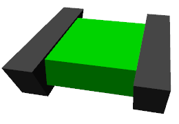

新YAML形式モデルファイルチュートリアル
==================================

.. contents::
   :local:
   :depth: 1

概要
----

現在github上で開発中のバージョンでは、YAMLをベースとした新形式のモデルファイルの導入を進めています。これは従来のOpenHRP形式のモデルファイルと比較して、より簡潔に記述でき、記述可能な情報の自由度も高い形式となっており、今後OpenHRP形式を置き換えるべく開発を進めています。YAMLの形式については :doc:`modelfile-yaml` でも用いていましたが、本形式は追加情報だけでなくモデル本体も含む全ての情報を記述可能なものとしています。

本節ではこの新しい形式のモデルファイルについて、チュートリアルの形態で解説を行います。これにより、新形式の仕様に加えて、モデルファイルの編集をどのように進めていったらよいかも学ぶことができます。題材とするモデルは以下に示す"Tank"モデルとなります。

.. image:: images/tank.png

これは砲塔・砲身を動かす２軸の回転関節と、移動用の２つのクローラで構成されるモデルで、カメラとレーザーレンジセンサ、およびライトをデバイスとして備えています。このモデルはクローラ型モバイルロボットのサンプルとなるもので、これを用いたサンプルプロジェクトとして "TankJoystick.cnoid" や "OpenRTM-TankJoystick.cnoid" がChoreonoid本体に含まれています。

Tankモデルの基本構造
--------------------

Tankモデルは下図に示す5つの部位で構成されています。

.. image:: images/tank_decomposed.png

ベースとなる部分が車体です。車体の上部には砲塔・砲身が備わります。この部分は砲塔の土台となってヨー軸回転を行う部分と、その上部に砲身とともに取り付けられるピッチ軸回転を行う２つの部分からなります。車体の左右の側面にはそれぞれ移動用のクローラ機構が取り付けられます。

これら5つの部分が「リンク」としてモデリングされます。車体の部分はモデルの中心となる部分であり、これを「ルートリンク」としてモデリングします。砲塔の２リンクについてはそれぞれ回転関節としてモデリングします。そして、クローラ部分は :doc:`../../simulation/pseudo-continuous-track` に対応する関節タイプのリンクとしてモデリングします。

これらのリンクの間の階層構造（親子関係）は以下のようになります。 ::

 - 車体
     + 砲塔ヨー軸部
            + 砲塔ピッチ軸部
     + 左クローラ
     + 右クローラ

なお、本チュートリアルでは各リンクの形状をモデルファイル本体にテキストで記述します。これにより、CADやモデリングツール等で作成した形状データを用いずに、テキストファイルだけでモデリングを完結しています。これに対して、CADやモデリングツール等で作成した形状データを用いることももちろん可能です。その方法については別途解説します。

モデルファイルの用意
--------------------

モデルファイルはYAML形式のテキストファイルとして作成します。YAML形式のファイルは ".yaml" の拡張子をつけることが多いですが、モデルファイルについては他のyamlファイルと区別しやすいよう、".body" の拡張子をつけることにします。

モデルファイルの作成を開始するにあたって、まずはテキストエディタを用いて空のテキストを作成し、上記の拡張子をつけた適当なファイル名で保存しておきましょう今回は "tank.body" というファイル名で保存することにします。このファイルはChoreonoidのshareディレクトリの model/misc 以下に完成品が格納されています。今回はそのファイルの内容を解説しながら、完成に至るまでの作成手順の例を示すということになります。

ヘッダの記述
------------

まずモデルファイルのヘッダとして、YAMLのマッピングを用いて以下のように記述します。 ::

 format: ChoreonoidBody
 formatVersion: 1.0
 angleUnit: degree
 name: Tank

最初の行の記述により、このファイルがChoreonoidのモデルファイルとして認識されるようになります。formatVersionは現在のところ1.0となります。今後仕様に変更があった場合に、新しい仕様と区別するためにバージョン番号を明示しておきます。

モデルファイルにおける関節角度の単位を指定する項目として、"angleUnit" があります。今回は "degree" を指定しているので、角度を度数法で記述します。ラジアンで記述したい場合は、ここに "radian" を指定します。通常は degree の方が記述がしやすいのではないかと思います。

モデルの名前は"name"に記述します。

リンクの記述
------------

モデルが有するリンクの情報は、"links:" に以下のように記述します。 ::

 links:
   -
     リンク1（ルートリンク）の記述
   -
     リンク2の記述
   -
     リンク3の記述
   ...

このようにYAMLのリストとして任意個のリンクを記述することができます。各リンクの記述部分を「Linkノード」と呼びます。最初に記述するLinkノードは、モデルのルートリンクとみなされます。

.. _modelfile_yaml_link_node:

Linkノードのパラメータ
----------------------

LinkノードはYAMLのマッピング形式で記述します。マッピングの要素として、以下のようなパラメータが利用可能です。

.. list-table::
 :widths: 20, 80
 :header-rows: 1

 * - キー
   - 内容
 * - name
   - リンク名
 * - parent
   - 親リンクを指定。親リンクのnameに記述した名前で指定する。ルートリンクの場合は使用しない。
 * - translation
   - 本リンクローカルフレームの親リンクからの相対位置。ルートリンクの場合はモデル読み込み時のデフォルト位置として使われる。
 * - rotation
   - 本リンクローカルフレームの親リンクからの相対姿勢。姿勢は回転軸と回転角度に対応する4つの数値で表現(Axis-Angle形式）。ルートリンクの場合はモデル読み込み時のデフォルト位置として使われる。
 * - jointType
   - 関節タイプ。 **fixed** (固定）、 **free** (非固定ルートリンク）、 **revolute** (回転関節）、 **slide** (並進関節）、 **pseudoContinousTrack** (簡易無限軌道）のどれかを指定。
 * - jointId
   - 関節ID値を指定。関節でない場合（ルートリンクや固定関節等）や非公開の関節としたい場合は、指定しなくてもよい。
 * - centerOfMass
   - 重心位置。リンクローカル座標で指定。
 * - mass
   - 質量[kg]
 * - inertia
   - 慣性モーメント。慣性テンソルの9要素をリストとして列挙。
 * - elements
   - リンクの他の構成要素を階層的に記述。

上記のキーを用いてリンクの情報を記述したマッピングの部分を、「Linkノード」と呼びます。

ルートリンクの記述
------------------

ではまず本モデルの車体部分に対応するルートリンクを記述しましょう。対応するLinkノードをlinks以下に次のように記述してください。 ::

 links:
   -
     name: CHASSIS
     translation: [ 0, 0, 0.1 ]
     jointType: free
     centerOfMass: [ 0, 0, 0 ]
     mass: 8.0
     inertia: [
       0.1, 0,   0,
       0,   0.1, 0,
       0,   0,   0.5 ]
     elements:
       Shape:
         geometry:
           type: Box
           size: [ 0.4, 0.3, 0.1 ]
         appearance: &GREEN
           material:
             diffuseColor: [ 0, 0.6, 0 ]

YAMLでは各行のインデントがデータの構造も規定することになりますので、上記の記述でインデントが揃っているところはそのまま揃えて記述するように注意してください。

リンクの定義では、そのリンクを特定するための名前をまず設定します。 ここでは、 ::

 name: CHASSIS

という記述により、"CHASSIS" という名前に設定しています。

編集中のモデルの確認
--------------------

まだルートリンクしか記述していませんが、この時点でもモデルとしては成立しています。そこで、編集中のファイルをChoreonoid上で読み込んで表示させ、正しく記述ができているか確認してみましょう。これまでのモデルファイルをボディアイテムとして読み込んでチェックを入れると、シーンビュー上に以下のように表示されるかと思います。

.. image:: images/tank_chassis.png

アイテム読み込み時にエラーが出たり、読み込めてもうまく表示できなかったりした場合は、これまでの記述内容を確認してください。

モデルファイルの修正後にそれを再度読み込む場合、修正前のファイルが既にボディアイテムとして読み込まれているのであれば、アイテムの「再読み込み機能」を用いて簡単に読み込み直すことができます。これを行うためには、アイテムツリービュー上で対象のアイテムを選択し、**"Ctrl + R"** キーを押します。すると更新されたファイルが読み込み直されて、（読み込みエラーがなければ）現在のアイテムがそれに置き換わります。更新したファイルに形状等の変化があれば、シーンビュー上の表示も即座にこれを反映します。この機能を使えば、テキストファイルで直接モデルファイルを編集しながら、比較的効率的にモデルファイルの編集を進めていくことが可能です。この操作は本チュートリアルを進める上で何度も行うことになりますので、覚えておいてください。

ルートリンク特有の記述
----------------------

CHASSISリンクでは、 ::

 translation: [ 0, 0, 0.1 ]

という記述により、モデル読み込み時の初期位置を設定しています。（正確に言うとワールド座標系におけるルートリンク原点の位置となります。）

translationは通常親リンクからの相対位置を表すパラメータなのですが、ルートリンクに関しては親リンクがありません。その代わりに、モデル読み込み時におけるワールド座標原点からの相対位置とみなすわけです。なお、初期姿勢についても、rotation を用いることで設定可能です。また、初期位置を気にしないのであれば、これらのパラメータを設定する必要はありません。

ここではZ座標値を 0.1 とすることで、ルートリンクの初期位置をZ軸方向に0.1[m]上げた位置としています。これにより、ルートリンクの原点を車体の中心部にとりつつも、それを読み込んだ場合にクローラの下面がちょうどZ=0の面に一致するようにしています。環境モデルではここを床面にとることが多いため、それに合わせやすいよう上記の設定をしています。

次に、 ::

 jointType: free

という記述により、このモデルが空間中を自由に動けるモデルであることを設定しています。

jointTypeは通常親子リンク間を接続する関節のタイプを指定するパラメータですが、ルートリンクの場合は意味が少し異なり、リンクが環境に固定されるか否かを指定します。ここに"fixed"を指定するとリンクが固定されますので、ベース部分が床に固定されているマニピュレータ等に対してはそのように設定してください。一方、今回のモデルのように特定の箇所に固定さない場合は、ここに"free"を指定します。

剛体パラメータの記述
--------------------

各リンクは通常剛体としてモデリングされます。この情報を記述する :ref:`modelfile_yaml_link_node` として、centerOfMass, mass, inertia があります。CHASSISリンクではこれらに関して以下のように記述しています。 ::

 centerOfMass: [ 0, 0, 0 ]
 mass: 8.0
 inertia: [
   0.1, 0,   0,
   0,   0.1, 0,
   0,   0,   0.5 ]

centerOfMass には、リンクのローカル座標における重心位置を記述します。CHASSISリンクのローカル座標原点は車体中央部に設定しており、重心もそこにに一致させています。

mass には質量を、inertiaには慣性テンソルの行列要素を指定します。

ここでは慣性テンソルにいい加減な値を設定していますが、適当な計算やCADツールなどを用いて、妥当な値を設定するようにしてください。

なお、剛体のパラメータは"RigidBody"ノードを用いて独立して記述することも可能です。これについては後ほど説明します。

リンク形状の記述
----------------

リンクの形状は、Linkノードの "elements" 以下に記述します。CHASSISリンクに関しては以下のように記述されています。 ::

 Shape:
   geometry:
     type: Box
     size: [ 0.4, 0.3, 0.1 ]
   appearance: &GREEN
     material:
       diffuseColor: [ 0, 0.6, 0 ]

この部分は「Shapeノード」となります。

Shapeノードでは、geometryでどのような幾何形状かを指定し、appearanceで色などの要素を記述します。ここではgeometryに x, y, z軸方向の寸法がそれぞれ0.4[m], 0.3[m], 0.1[m]である直方体を設定し、appearanceに緑色のマテリアルを設定しています。先ほどChoreonoid上でモデルファイルを読み込んだ際にシーンビューに表示されたのが、この形状です。

今回はgeometryに "type: Box" を指定することで直方体を表現しました。この場合、size というキーにx, y, z軸方向の長さを記述することで形状を指定します。この他にも球(Sphere)、シリンダ(Cylinder)、円柱(Cone)といったプリミティブ形状を利用することが可能です。

このような形状の記述については、書き方は多少異なるものの、その構造や形状タイプ、パラメータ等について `VRML97 <http://tecfa.unige.ch/guides/vrml/vrml97/spec/>`_ で定義されているもの（ `Shape <http://tecfa.unige.ch/guides/vrml/vrml97/spec/part1/nodesRef.html#Shape>`_ 、 `Box <http://tecfa.unige.ch/guides/vrml/vrml97/spec/part1/nodesRef.html#Box>`_ 、`Sphere <http://tecfa.unige.ch/guides/vrml/vrml97/spec/part1/nodesRef.html#Sphere>`_ 、 `Cylinder <http://tecfa.unige.ch/guides/vrml/vrml97/spec/part1/nodesRef.html#Cylinder>`_ 、 `Cone <http://tecfa.unige.ch/guides/vrml/vrml97/spec/part1/nodesRef.html#Cone>`_ 、 `Appearance <http://tecfa.unige.ch/guides/vrml/vrml97/spec/part1/nodesRef.html#Appearance>`_ 、 `Material <http://tecfa.unige.ch/guides/vrml/vrml97/spec/part1/nodesRef.html#Material>`_ 等）を踏襲するようにしています。VRML97はOpenHRP形式のモデルファイルでベースとしていた形式なので、それの利用経験がある方でしたら勝手をつかみやすいのではないかと思います。

appearance の後の "&GREEN" は、YAMLの「アンカー」という機能で、このように記述しておくとこれ以下の部分を後で使いまわせるようになります。緑色は他の部位でも使いますので、ここでこのようにアンカーを入れています。

.. note:: 冒頭でも述べたように、本チュートリアルでは各リンクの形状について上記のような記述方式を利用してモデルファイル中にテキストとして記述します。これに関して、モデリングツールやCADツール等を用いて別途作成した形状データのファイルを用いることも可能です。そちらについては別のドキュメントで解説します。

elementsの記述方法
------------------

モデルファイルにおいては、ある構成要素の情報をまとめたものを「ノード」と呼びます。その例としてこれまでLinkノードやShapeノードを紹介してきました。

ノードの中には、その子ノードとして下位のノードを含むことが可能なものもあります。これにより、ノードは階層的に記述されます。これを行う一般的な方法として、 elements というキーがあります。

elementsでは、基本的にはYAMLのリスト表現を用いて以下のように子ノードを記述します。 ::

 elements:
   -
     type: ノードタイプ名
     key1: value1
     key2: value2
     ...
   - 
     type: ノードタイプ名
     key1: value1
     key2: value2
   ...

下位のノードがさらにelementsを含むことが可能な場合、以下のように記述を深くしていくことも可能です。 ::

 elements:
   -
     type: ノードタイプ名
     key1: value1
     elements:
       -
         type: ノードタイプ名
         key1: value1
         elements:
           ...

このように、elementsを用いることで、多様なタイプのノードを複数組み合わせた構造を記述することも可能となります。

なお、あるタイプのノードがelements以下にひとつしか含まれない場合は、以下のような簡略化記法も使用可能です。 ::

 elements:
   ノードタイプ名:
      key1: value1
      key2: value2
      ...

先のものと大きな違いはありませんが、こちらの方がリスト表現を使わない分少しだけシンプルな記述になっています。

Linkノードではこのelementsを用いることで、形状やセンサといった様々な要素を含むことが可能です。他にelementsが使用可能なノードとしては、TransformやRigidBodyといったノードもあります。

.. note:: モデルが複数のリンクを有する場合、リンク間の関係も一般的に階層的なものとなります。これをLinkノードのelementsを用いて記述することも考えられますが、本形式のモデルファイルではそのような記述は行いません。これは、そのような記述を行うと、リンクの階層構造が深くなるに従ってモデルファイル内のテキストの階層も深くなってしまい、テキストとしての確認や編集がしづらくなってしまうからです。リンクの階層構造は、Linkノードの"parent"キーを用いて記述します。

砲塔ヨー軸リンクの記述
----------------------

次は砲塔の土台となるリンクを記述しましょう。これまでの記述に以下を加えて下さい。 ::

 -
   name: CANNON_Y
   parent: CHASSIS
   translation: [ -0.05, 0, 0.08 ]
   jointType: revolute
   jointId: 0
   jointAxis: [ 0, 0, 1 ]
   centerOfMass: [ 0, 0, 0.025 ]
   mass: 4.0
   inertia: [
     0.1, 0,   0,
     0,   0.1, 0,
     0,   0,   0.1 ]
   elements:
     Shape:
       geometry:
         type: Box
         size: [ 0.2, 0.2, 0.08 ]
       appearance: *GREEN

ここまで記述してファイルを保存し、前述の "Ctrl + R" によるモデルの再読み込みを行って下さい。するとシーンビュー上のモデルの表示が以下のようになるかと思います。

.. image:: images/tank_cannon_y.png

車体の上部に新たに追加された部分が、砲塔の土台部分となります。この部分はヨー軸回転をするようになっており、そのための関節も含んでいます。

nameに指定したように、本リンクの名前は "CANNON_Y" としています。また、CHASSISリンクと同様に、centerOfMass, mass, inertia の剛体パラメータも記述しています。

形状についても、CHASSISリンクと同様にBoxタイプのgeometoryを用いています。ただしappearanceについてはCHASSISの形状記述でアンカーとして定義した"GREEN"の部分をエイリアスとして呼び出しています。これにより記述も簡略化できますし、モデルの色の変更を一括して行うことも可能となります。

リンク相対位置の記述
--------------------

CANNON_Yリンクは、CHASSISリンクの小リンクとしてモデリングします。

これを行うために、まず ::

 parent: CHASSIS

によってこのリンクの親リンクがCHASSISであることを明示します。

つぎに、このリンクのローカル座標系について、CHASSISリンクからの相対位置を指定する必要があります。これを行うのがtranslationパラメータで、本リンクでは ::

 translation: [ -0.05, 0, 0.08 ]

によって、CHASSISリンクの原点から後方へ5[cm]、上方へ8[cm]移動した位置を座標系の原点にとっています。

ここで相対姿勢の効果を確認するため、translationの記述をなしとしてみましょう。上記のtranslationの行を削除するか、行の先頭に#をつけてコメントアウトし、モデルの再読み込みを行なってください。

すると先ほど表示されていた砲塔の部分が見えなくなったかと思います。これは、砲塔の部分も車体の中心部に配置されてしまい、その中に埋まってしまったからです。そこで、シーンビューの :ref:`basics_sceneview_wireframe` をONにしてみてください。すると以下のように表示されるかと思います。

.. image:: images/tank_cannon_y_0.png

このようにワイヤフレームにすると、車体の中に砲塔部が埋まっているのが確認できます。

これで分かるように、リンクの位置を適切に配置するためには、先程のようにtranslationの記述が必要となるわけです。この値もいろいろと変えてどうなるか試してみてください。

なお、モデリングによっては座標系の向き（相対姿勢）も指定したくなる場合があります。これを行う場合は、rotationパラメータを使用します。このパラメータについては、後ほど形状のモデリングでの使用方法を紹介します。リンクの場合もそれと同様に使用可能です。

関節の記述
----------

親子関係のある２つのリンクは通常関節によって接続されます。CANNON_Yリンクについても、親リンクCHASSISに対してヨー軸の関節で接続され、CHASSISに対するヨー軸向きを変えられるようになっています。これに関する情報は、CANNON_Yリンクの以下のパラメータによって記述されています。 ::

 jointType: revolute
 jointAxis: [ 0, 0, 1 ]
 jointId: 0

ここではまずjointTypeにrevoluteを指定しています。これにより、親リンクとの間に回転関節が設定されることになります。そしてjointAxisには関節の回転軸を単位ベクトルを指定します。本モデルではZ軸が上下方向となる座標系でモデリングしているため、これを指定することでヨー軸回転を行う関節としています。なお、関節の位置はこのリンクの原点に設定されます。

jointTypeとしては他にslideも指定可能です。この場合は並進関節となり、jointAxisには並進方向を指定します。

jointIdには、この関節に割り振るID値（0以上の整数）を設定します。ID値はChoreonoidのインタフェース上で参照したり、この値によって操作する関節を指定したりすることができます。また、ロボットを制御するプログラムからもこの値を用いて関節を特定することができます。この値は自動的には割り振られず、このようにモデル作成時に適当な値を明示的に割り振るようになっています。この際、必ずしも全ての関節にID値を割り振る必要はありません。ただし、関節角度等を配列に格納する際にそのインデックスとしてこの値が使われることもあるので、なるべく0から隙間なく連続する値を割り振るのが望ましいです。

このモデルは砲塔のヨー軸、ピッチ軸の２つの関節を持ちますので、関節IDとしてそれぞれ0と1を割り振ることにします。

.. ジョイントスライダーによるテスト

砲塔ピッチ軸部の記述
--------------------

::

 -
   name: CANNON_P
   parent: CANNON_Y
   translation: [ 0, 0, 0.04 ]
   jointType: revolute
   jointId: 3
   jointAxis: [ 0, 1, 0 ]
   elements:
     - 
       # Turnet
       type: RigidBody
       centerOfMass: [ 0, 0, 0 ]
       mass: 3.0
       inertia: [
         0.1, 0,   0,
         0,   0.1, 0,
         0,   0,   0.1 ]
       elements:
         Shape:
           geometry:
             type: Cylinder
             height: 0.1
             radius: 0.11
           appearance: *GREEN

砲身形状の記述
--------------

以下を砲塔ピッチ部のelementsに追加します。 ::

    - 
      # Cannon barrel
      type: RigidBody
      translation: [ 0.2, 0, 0 ]
      centerOfMass: [ 0.2, 0, 0 ]
      mass: 1.0
      inertia: [
        0.01, 0,   0,
        0,    0.1, 0,
        0,    0,   0.1 ]
      elements:
        Transform:
          rotation: [ 0, 0, 1, 90 ]
          elements:
            Shape:
              geometry:
                type: Cylinder
                height: 0.2
                radius: 0.02
              appearance: *GREEN

ライトの記述
------------

以下を砲身形状に続けて追加します。 ::

     -
       # Device Box
       type: Transform
       translation: [ 0.08, 0, 0.09 ]
       elements:
         -
           type: Transform
           rotation: [ 0, 0, 1, 90 ]
           elements:
             Shape:
               geometry:
                 type: Cone
                 height: 0.04
                 radius: 0.03
               appearance:
                 material:
                   diffuseColor: [ 1.0, 1.0, 0.4 ]
                   ambientIntensity: 0.3
                   emissiveColor: [ 0.8, 0.8, 0.3 ]
         -
           type: Transform
           translation: [ 0.02, 0, 0 ]
           elements:
             -
               type: SpotLight
               name: MainLight
               direction: [ 1, 0, 0 ]
               beamWidth: 36
               cutOffAngle: 40
               cutOffExponent: 6
               attenuation: [ 1, 0, 0.01 ]

カメラの記述
------------

以下をSpotLightノードと同階層に追加します。 ::

              - 
                type: Transform
                rotation: [ [ 0, 1, 0, -90 ], [ 0, 0, 1, -90 ] ]
                elements:
                  -
                    type: Camera
                    name: Camera
                    format: COLOR_DEPTH
                    width: 320
                    height: 240
                    id: 0
                    frameRate: 30

レーザーレンジセンサの記述
--------------------------

以下をCameraと同階層に追加します。 ::

                  -
                    type: RangeSensor
                    name: RangeSensor
                    id: 0
                    scanAngle: 90
                    scanStep:  0.5
                    scanRate:  10
                    maxDistance: 10

左クローラの記述
----------------

次はクローラの部分を記述しましょう。まずは左側から記述します。これまでの記述の下に以下を加えて下さい。 ::

 -
   name: CRAWLER_TRACK_L
   parent: CHASSIS
   translation: [ 0, 0.2, 0 ]
   jointType: pseudoContinuousTrack
   jointId: 0
   jointAxis: [ 0, 1, 0 ]
   centerOfMass: [ 0, 0, 0 ]
   mass: 1.0
   inertia: [
     0.02, 0,    0,
     0,    0.02, 0,
     0,    0,    0.02 ]
   elements:
     Shape: &CRAWLER 
       geometry:
         type: Extrusion
         crossSection: [
           -0.2, -0.1,
            0.2, -0.1,
            0.3,  0.06,
           -0.3,  0.06,
           -0.2, -0.1
           ]
         spine: [ 0, -0.05, 0, 0, 0.05, 0 ]
       appearance:
         material:
           diffuseColor: [ 0.2, 0.2, 0.2 ]

ここまで記述してファイルを保存し、前述の "Ctrl + R" によるモデルの再読み込みを行って下さい。するとシーンビュー上の表示に以下のように左側のクローラが加わるかと思います。

.. image:: images/tank_crawler_l.png

本リンクではまずparentをCHASSISと指定することで、このリンクがCHASSISリンク（車体部分）の子リンクであることを表現しています。

jointTypeには "pseudoContinuousTrack" を指定しています。このようにすることで、本リンクをクローラとして動かすことが可能となります。ただし実際にはこのクローラのシミュレーションは簡易的なものとなります。この詳細は :doc:`../../simulation/pseudo-continuous-track` を参照してください。

pseudoContinuousTrack の場合、jointAxis には想定されるクローラのホイールの回転軸方向を指定します。この軸に対して右ねじ正方向の回転が前進方向となります。ここではY軸を回転軸としています。

クローラの形状は "Extrusion" タイプのgeometryとして記述しています。これもVRML97で定義されている形状タイプで、まず断面の形状をcrossSectionで指定し、それをspineの記述に従って押し出すようなかたちで立体形状を記述するものです。ここではクローラの断面を台形とし、それをY軸方向に押し出して幅を持たせた形状としています。記述方法の詳細は `VRML97のExtrusionノードの仕様 <http://tecfa.unige.ch/guides/vrml/vrml97/spec/part1/nodesRef.html#Extrusion>`_ を参照してください。

ここで記述した形状には "CRAWLER" というアンカーをつけて、後ほど右側のクローラの形状としても使い回すことにします。

右クローラの記述
----------------

右側のクローラも記述しましょう。これまでの記述に続けて、以下を追加してください。 ::

 -
   name: CRAWLER_TRACK_R
   parent: CHASSIS
   translation: [ 0, -0.2, 0 ]
   jointType: pseudoContinuousTrack
   jointId: 1
   jointAxis: [ 0, 1, 0 ]
   centerOfMass: [ 0, 0, 0 ]
   mass: 1.0
   inertia: [
     0.02, 0,    0,
     0,    0.02, 0,
     0,    0,    0.02 ]
   elements:
     Shape: *CRAWLER 

この状態でモデルの再読み込みを行うと以下のように表示されるかと思います。

ここでは親リンクからの相対位置として、 ::

 translation: [ 0, -0.2, 0]

としています。これはY軸に関して左クローラとは反対方向の位置としており、これによって車体の右側に本リンクが配置されます。

また、形状に関しては ::

 elements:
   Shape: *CRAWLER

として、左クローラの記述において"CRAWLER"というアンカーをつけたShapeノードを再利用しています。これにより、同じ形状となる部分の記述をひとつにまとめることが出来ています。

追加情報の記述
--------------

OpenHRP形式のモデルファイルにおいて任意の情報を追記する手段として、 :doc:`modelfile-yaml` がありましたが、これは本形式のモデルファイルに関してはファイルの追加なしに行うことができます。モデルファイル本体自体がYAML形式ですので、YAML形式の情報はこの中にいくらでも書くことが可能というわけです。

