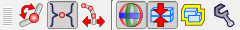
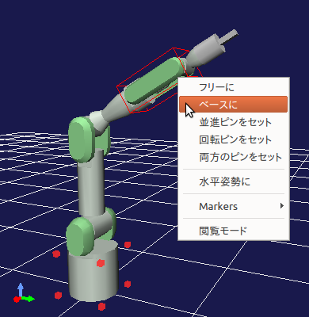
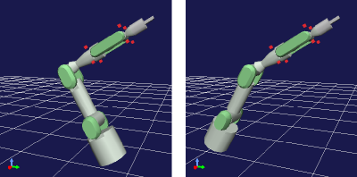
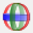
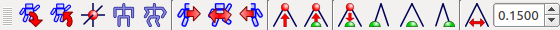
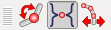

位置・姿勢の変更
================

本節では、Bodyモデルの位置や姿勢を変更する基本的な操作方法を説明します。

説明にあたっては、 :ref:`loading_model` において紹介したPA10モデルをここでも例として用いることにしますので、
Choreonoid上で操作方法を確認する際にはこのモデルを読み込んで表示させておいてください。

運動学バー
----------

本節で紹介する操作では、以下の「運動学（キネマティクス）バー」の状態によって挙動が変わります。

特に最初の3つのボタンが重要です。
これらのボタンはどれかひとつがONになるようになっていて、
「運動学モード」を切り替えるために使います。
これらは左から、

* 順運動学
* プリセット運動学
* 逆運動学

となっています。

当面はデフォルトの状態である「プリセット運動学」のボタンがONになっている状態であればOKです。
これらのモードの詳細や他のボタンの機能については、追って説明します。

関節スライダによる関節角の変更
------------------------------

モデルの姿勢を変更する際に基本となるのは、関節角度の変更です。
これは様々な機能で実現することができますが、
まずは基本となるビューのひとつである「関節スライダビュー」を用いて関節角を変更する方法を説明します。

準備として、PA10のボディアイテムをアイテムツリービュー上で選択状態にしてください。
これで関節スライダビューの対象モデルがPA10になります。

.. note:: 関節スライダビューに限らず、ビューやツールバーによるモデルの操作においては、対象となるBodyアイテムを選択状態にし、対象を特定しておく必要がありあます。これは一旦選択状態にすれば、その後選択を解除してもOKです。次に他のBodyアイテムが選択されるまでは、最後に選択したBodyアイテムが対象であり続けます。本節で出てくる他のビューやツールバーに関しても基本的にこの操作でBodyアイテムを特定しておく必要がありますので、ご注意ください。

すると関節スライダビューの表示が以下のようになるかと思います。

.. image:: images/jointslider_pa10_initial.png

このビューでは、最上部に表示切り替え用のボタンが並んでいます。
その下のメイン領域に、各関節の状態を表示・変更するためのインタフェースが上から関節IDの順番で並んでいます。
各関節ごとに左から、関節名、関節角現在値、最小角度、現在値のスライダ、最大角度と並んでいます。
上部の"ID"ボタンをONにすると、関節ID値も表示されます。

.. note:: ここでは関節「角度」という用語を使っていますが、これは関節が「回転関節」の場合に対応します。ロボットの多くの関節は回転関節になりますが、他に「直動関節」もあります。実際にPA10のモデルでも手先のグリッパに対応する関節 "HAND_L" と "HAND_R" は直動関節となっています。直動関節の場合、その現在位置は「角度」ではなく普通に「位置」などと呼ぶべき値になりますが、ここでは両者を含む一般的な説明には関節角度という用語をそのまま使うことにします。

ここで関節角度値やスライダ位置はユーザが変更することができ、その操作に同期してモデルの内部状態やシーンビュー上での表示も変化します。
例えば関節"J4"の値やスライダを操作してみましょう。
すると、PA10のアーム中央の関節が以下のように曲がるかと思います。

.. image:: images/pa10_j4.png

他の関節も同様に動かすことができますので、試してみてください。

.. _sceneview_forward_kinematics:

シーンビュー上での関節角の変更
------------------------------

関節角の変更は、シーンビュー上で関節位置をマウスで直接ドラッグすることによっても行えます。

この操作は :doc:`../basics/index` - :doc:`../basics/sceneview` の :ref:`sceneview_editmode` で説明した「編集モード」を用いて行います。
ここの説明に従って、まずはシーンビューを編集モードに切り替えてください。
そして、マウスカーソルを先ほど操作した"J4"リンクの位置までもっていくと、以下のような表示になるかと思います。

.. image:: images/j4_drag.png

ここでPA10モデルの最下部を囲う赤いマーカーは、この部分が現在のベースリンクであることを示しています。
これはシーンビューが編集モードになった際に表示されますので、この表示によっても編集モードであることを確認することができます。
そして、J4リンクを囲う赤いボックスは、マウスカーソルがJ4リンクを指しており、編集操作の対象リンクとなっていることを示しています。
これについては、カーソルが他のリンクを指せばそちらが囲われることになります。

この状態でマウスの左ボタンを押しながらドラッグしてみてください。
するとマウスのドラッグと連動してJ4関節が動くかと思います。
このようにして、シーンビュー上で直観的に関節をドラッグし、姿勢を変更することができます。

また、シーンビュー上で関節をドラッグした場合でも、先ほどの関節スライダビューの状態が同期して変化します。
これは関節スライダビューに限らず、Bodyモデルの状態を表示・編集する全てのビューについて言えることで、
そのようなビューの動作が互いに同期することで、GUI上での一貫性が常に保たれるようになっています。

ベースリンクについて
--------------------

PA10モデルの最下部を囲っている赤いマーカーは現在のベースリンクを示していると述べました。
ここでベースリンクというのは、運動学計算の起点となるリンクのことで、ユーザが自由に変更することができます。

この効果を確認するため、PA10のベースリンクを変更してみましょう。
ベースリンクの変更は、リンクを指している状態で右クリックをすると表示されるコンテキストメニューを用いて行います。
例えばリンク"J5"をマウスカーソルで指している状態で右クリックすると下図のような表示になるかと思います。

ここでコンテキストメニューの「ベースに」を選択すると、リンク"J5"がベースリンクとなります。
ベースリンクを示す赤いマーカーもJ5の箇所に移ります。

この状態で、再度ジョイントスライダビュー等を使ってJ4の関節角度を変えてみましょう。
するとJ4の関節角が変わるのは同じなのですが、最終的な姿勢は以下のように変わるはずです。

今までは固定されていたロボット最下部が今度は動くようになりました。
逆にベースリンクにしたJ5リンクの位置は固定されています。
これは関節角度から各リンクの位置を計算する順運動学計算が、ベースリンクを起点として行われるためです。

このように、ベースリンクを設定することで、姿勢において固定する部分を切り替えることができます。
PA10のようなマニピュレータでは通常床に固定される土台のリンクをベースとし、
他のリンクをベースとしたいことはあまり無いかもしれませんが、
ロボットの形態によってはベースリンクの切り替えを便利に活用することができるでしょう。

.. _model_move:
                  
モデルの移動
------------

Bodyモデル全体の移動は、ベースリンクをドラッグすることで行うことができます。
例えばPA10モデルの最下部リンク("BASE"リンク）がベースリンクとなっているときに、
このリンクをクリックすると、以下のような表示になります。

.. image:: images/pa10_move.png

このままマウスをドラッグすると、ドラッグに追従するようにモデル全体が移動します。

また、デフォルト設定では図のように3色の矢印とリングで構成されたマーカー（ポジションドラッガー）が表示されます。
これをドラッグすることでもモデルの移動や、さらには回転（姿勢の変更）も行うことができます。
具体的には、矢印部分をドラッグするとそれぞれの軸に沿った並進移動になり、
リング部分をドラッグすると、リングの外周に沿った姿勢の回転となります。
矢印やリングの赤、緑、青は、それぞれリンクのローカル座標系におけるX軸、Y軸、Z軸に対応しています。

なお、ポジションドラッガーを表示するかどうかは、運動学バーの以下のボタンで切り替えることができます。

このボタンはデフォルトではONとなっていますが、編集時にドラッガーが邪魔になるようなことがあれば、
このボタンを解除することで表示を行わないようにすることができます。

位置・姿勢変更操作のUndo・Redo
------------------------------

位置や姿勢の編集をしていると、直前の状態に戻したくなることがあります。
その際には、編集モードでマウスカーソルがモデルを指している状態で、Ctrl + Z を押してください。
すると直前の位置・姿勢が呼び出されます。
繰り返しUndoを行うことでさらにそれ以前の状態を呼び出すことも可能です。

また、Shift + Ctrl + Z を押すことにより、Redo となります。
これによって、Undoで戻した状態をキャンセルすることも可能です。
Redo も必要なだけ繰り返すことが可能です。

Bodyバー
--------

モデルの位置や姿勢の編集をしていると、
あるモデルの状態を記憶しておいてまた呼び出したり、
初期状態や標準状態に戻したくなることもあります。
これを行う機能が以下に示す「ボディバー」にて提供されています。

左から1番目のボタンを押すと、現在の位置・姿勢を記憶します。
そして、記憶しておいた状態は2番目のボタンを押すことで呼び出すことができます。

左から3番目のボタンは、モデルのルートリンクの位置を原点位置に移動し、
姿勢も初期状態（ローカル座標系がグローバル座標系と一致する状態）にします。

4番目のボタンは全ての関節角を0とした「初期姿勢」に戻すボタンです。
また、5番目のボタンでは、モデルの全関節をあらかじめ設定されている「標準姿勢」となるように変更します。
モデルの定義にもよりますが、一般的に標準姿勢は初期姿勢とは異なるものとなっています。
例えばPA10の例では、初期姿勢はアームが直立したものとなっていますが、標準姿勢としては以下の姿勢が登録されています。

.. image:: images/pa10_standard.png

このロボットが実際にマニピュレータとして稼働する際には、直立して真上の物体を操作することはあまりなく、
このような姿勢からロボット周囲の物体の操作に入ることが多いと思われます。
そのようなことを考慮して、PA10のモデルではこの姿勢を標準姿勢として登録し、初期姿勢とは区別しています。

.. _sceneview_inverse_kinematics:

逆運動学による姿勢の変更
------------------------

モデルの姿勢を変更する方法として、これまで特定の関節の関節角度を直接変える方法を説明しました。
この場合、「まず関節の角度を指定して、その結果各リンクの位置姿勢が変わる」という手順になっており、
このような処理を「順運動学」と呼びます。

順運動学は希望の姿勢を得るために有効な手法のひとつですが、
これを用いることである特定のリンク、例えばマニピュレータの先端を、希望の位置・姿勢にすることは大変難しい作業となります。
そこで順運動学とは逆の処理として、
「あるリンクの位置姿勢を指定して、それを実現する関節角度を得る」という処理を行いたい場合があります。
これを「逆運動学」と呼び、Choreonoidではこの手法によってモデルの姿勢を変えることも可能となっています。

逆運動学についてはこのように説明するより、実際に動かして試したほうが分かりやすいかと思います。
PA10のモデルでもこれをやってみましょう。
まず先ほど紹介したBodyバーの「標準姿勢」ボタンを押して、PA10を標準姿勢にしてください。
また、"BASE"リンクがベースリンクとなっている（デフォルトの状態）ことを確認してください。

そして、PA10の先端のリンク(J7)をドラッグしてみましょう。すると下図のような表示になり、
先端リンクがマウスカーソルに追従して動くかと思います。
（:ref:`model_move` と同様に、先端リンクに付与されたポジションドラッガーの各軸をドラッグすることでも、リンクを動かすことができます。）

.. image:: images/pa10_ik.png

先端リンクを動かす際に、途中の関節が追従して動いているのが分かるかと思います。
このようにして、逆運動学によってリンクの位置姿勢を直接変更することが可能となります。
ある特定のリンクを望みの位置姿勢に直観的に動かしたい場合に、この逆運動学操作を活用することができます。

.. note:: なぜここで一旦標準姿勢にしたかと言うと、マニピュレータが直立した状態の初期姿勢では、ロボットが「特異姿勢」になってしまっていて、先端リンクを逆運動学で動かす計算ができないからです。標準姿勢のように各関節がある程度曲がっているとそのような特異姿勢ではなくなります。逆運動学を利用する際にはこの点に注意する必要があります。ただし、ここでは詳細を解説しませんが、モデルによっては逆運動学の解析解が用意されているものもあり、その場合は特異姿勢をさほど気にせずに動かすことが可能です。

.. _model_kinematics_mode:

運動学モードの切り替え
----------------------

:ref:`sceneview_forward_kinematics` では、
シーンビュー上でPA10の"J4"リンクをドラッグして、順運動学による姿勢変更を行いました。
また、 :ref:`sceneview_inverse_kinematics` では、"J7"リンクをドラッグして、逆運動学による姿勢変更を行いました。
これらの操作では、順運動学と逆運動学を特に指定することはありませんでしたが、
これはドラッグするリンクによって運動学のタイプが自動で選択されるモードになっていたからです。
その一方で、"J4"リンクを逆運動学で動かしたかったり、"J7"リンクを順運動学で動かしたい場合もあるかもしれません。
そのようなときのために、運動学のタイプをユーザが明示的に切り替えることもできるようになっています。
これを行うのが、運動学バーの先頭にある以下の３つのボタンです。

デフォルトでは真ん中のボタンがONとなっていて、これは運動学のタイプがリンクによって自動で切り替わる「プリセット運動学モード」となっています。リンクと運動学タイプの対応はモデルごとにあらかじめ定義されており、例えばPA10モデルの場合は以下のような対応になっています。

======================= ===================
 リンク                 運動学タイプ       
======================= ===================
 BASE, J1〜J5           順運動学            
 J6〜J7                 逆運動学           
 HAND_L, HAND_R         順運動学           
======================= ===================

以上のようなプリセット運動学モードにおける対応関係は、逆運動学で動かすことが多いと思われるリンクについては逆運動学をセットする、という方針で決められており、多くの姿勢変更操作はこれで間に合うかと思います。

運動学タイプをマニュアルで指定したい場合は、残りの２つのボタンを使用します。
左側のボタンは「順運動学モード」、右側のボタンは「逆運動学モード」となっています。
これらどちらかのボタンがONになっていると、
ドラッグするリンクとは関係なく選択されている運動学タイプが適用されることになりますので、
必要に応じてこのようなモードの使い分けを行ってください。

逆運動学におけるベースリンクの指定
----------------------------------

「逆運動学モード」で逆運動学操作を行う場合は、順運動学のときと同様にベースリンクがどこに指定されているかで挙動が変わります。

例えば、まず逆運動学モードをONにして、PA10のベースリンクをドラッグしてみてください。
すると"BASE"リンクがベースリンクとなっているデフォルトの状態では、
:ref:`model_move` と同じ動作となり、モデル全体が移動するかと思います。
この場合、はベースリンクもドラッグするリンクも同じBASEであり、途中に逆運動学計算をする関節がないため、
このような結果になります。

そこで今度はベースリンクをアーム先端の"J7"リンク等に設定しなおして、BASEリンクをドラッグしてみてください。
すると今度はJ7リンクは固定されつつ、ロボットの姿勢が変化することで、BASEリンクが動いたかと思います。
これはBASEリンクをベースとしてJ7リンクを動かした場合のちょうど逆の操作となっています。
このように、逆運動学操作を思い通りに行うためには、ベースリンクがどこに設定されているかも重要になります。

ただし、デフォルトの運動学モードである「プリセット運動学モード」で逆運動学に設定されているリンクを動かす場合、ベースリンクの設定は影響を受けません。この場合は、ベースリンクをどこに設定して計算を行うかもプリセットされています。
PA10の例では、逆運動学に設定されている J6, J7 リンクについて、どちらもBASEをベースリンクとするように設定されています。
この設定が現在のベースリンクと異なっている場合は、元のベースリンク設定やマーカー表示については変更せずに、
逆運動学実行時に指定のリンクが一時的にベースリンクとして使われることになります。

.. _model_body_link_view:

ボディ／リンクビュー
--------------------

モデルの位置・姿勢の変更には、下図右の「ボディ／リンクビュー」を用いることもできます。

.. image:: images/LinkViewAndBodyLinkView.png

このビューは、図の左側の「リンクビュー」と組み合わせて使います。
リンクビュー上でリンクを選択することで、「ボディ／リンクビュー」の表示・編集の対象リンクを決定します。
ここではPA10モデルの"J7"リンクを選択した状態を表しています。

.. note:: リンクの選択は、シーンビュー上で編集モードとし、リンクをダブルクリックすることでも行えます。

最上部では、リンクのインデックス番号や関節ID、関節タイプ、関節軸ベクトルといった情報を表示しています。

その下の「リンク位置」の領域では、対象リンクの現在の位置と姿勢を表示しています。
位置はグローバル座標におけるX、Y、Z座標値で、姿勢はロール・ピッチ・ヨーの３軸回転量で表示されます。
ここでは現在値を確認するだけでなく、数値ボックスに値を入力することでリンクの位置や姿勢を動かすこともできます。
この際の動かし方は、現在のベースリンクからの逆運動学で計算されます。
（この場合、運動学モードによらず常に逆運動学が適用されます。）
この数値入力によるリンク位置の編集は、リンク位置を細かく調整したい場合や、正確にある軸に沿って動かしたい場合などに、
大変便利です。

「関節角」の領域では、関節スライダビューと同様に関節角の確認と編集が行えます。
選択されているリンクのみの表示・編集となる点が関節スライダビューとは異なります。

「関節角速度」の領域では、関節角速度の最小値と最大値、および現在の関節角速度が表示されます。
関節角速度については姿勢編集時などには更新されませんが、
関節角速度値を含む動作軌道等のデータをモデルに適用している際に更新されます。

「干渉」の領域については、対象リンクが他のリンクと干渉していれば、それらの干渉リンク名が表示されます。
詳しくは :doc:`collision-detection` にて解説します。

