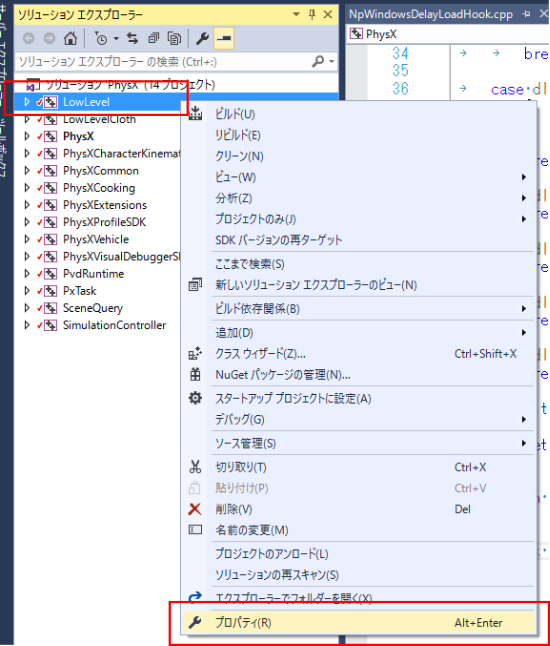
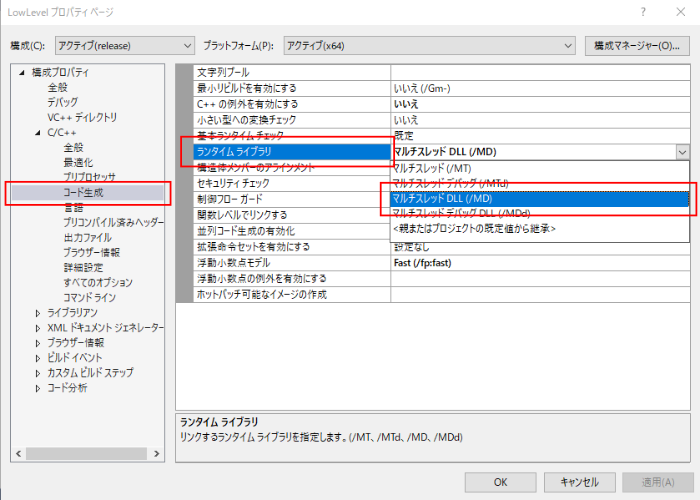

PhysXPluginのビルド
==========================

.. sectionauthor:: 中岡 慎一郎 <s.nakaoka@aist.go.jp>

.. contents:: 目次
   :local:

PhysXのインストール
--------------------------------------------------------

PhysXPluginを利用するためには、PhysX ライブラリをインストールしておく必要があります。 `PhysXのソース <https://developer.nvidia.com/physx-source-github>`_ をご参照ください。

まず、ソースコードを取得します。PhysXのソースコードはgithubで管理されていますが、アクセスするためには、上記のページに記載されている手順が必要です。手順としては、

1. developer.nvidia.comのアカウントを作成します。
2. そのアカウントでログインしてgithubのアカウントを登録します。
3. メールでgithubから招待状が届きますので、メールの指示に従います。

です。アカウント作成などのリンクは上記のページにありますので、その指示に従ってください。

これで、NVIDIAGameWorks/PhysX-3.3 のソースにアクセスできるようになったら、 git clone を実行して取得してください。 

Ubuntuの場合
~~~~~~~~~~~~~~~~

PhysXを保存したディレクトリの **physX/PhysX-3.3/PhysXSDK/Source/compiler/linux64** に移動して、 ::

  make release

を実行すると、ライブラリが作成されます。

Windowsの場合
~~~~~~~~~~~~~~~~~~

PhysXを保存したディレクトリの **physX/PhysX-3.3/PhysXSDK/Source/compiler/vc14win64** の中の PhysX.slnというソリューションファイルを開きます。

図のようにLowLevelプロジェクトを右クリックしてメニューを表示し、プロパティを選択します。

プロパティダイアログが開いたら、コード生成 ー ランタイムライブラリ を マルチスレッドDLL（/MD)に変更します。

全てのプロジェクトに対して、同じ変更を行います。

その後、ソリューションをビルドします。

プラグインのビルド
---------------------

choreonoidのビルドの際にCMakeの設定で、 **BUILD_PhysX_PLUGIN** という項目を "ON" にし、**PhysX_DIR** にPhysXを保存したディレクトリの **physX/PhysX-3.3/PhysXSDK** を指定してください。

シミュレーションの実行
-------------------------

PhysXPluginを用いたシミュレーションは :ref:`他の物理シミュレータ<simulation_creation_and_configuration_of_simulator_item>` を利用する方法と同様です。シミュレータアイテム「PhysXSimulator」を生成し、ワールドアイテムの子アイテムとして配置することで実行可能となります。

