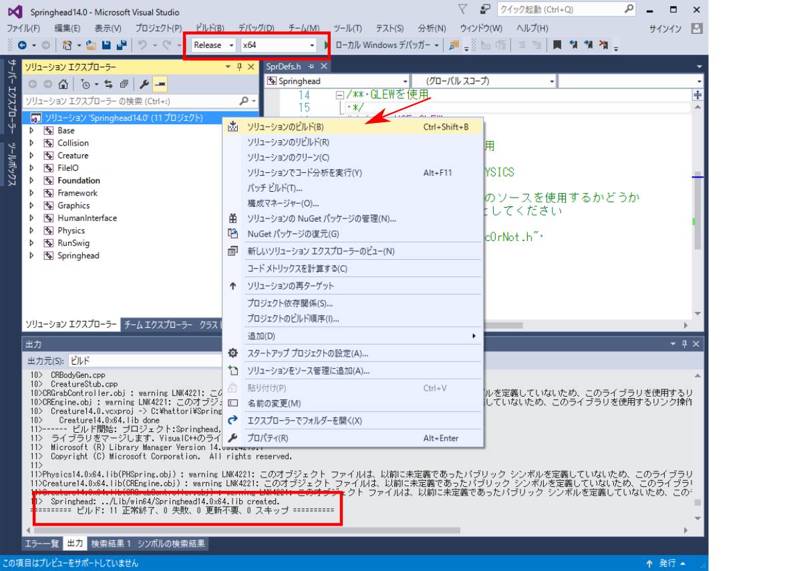

SpringheadPluginのビルド
==========================

.. sectionauthor:: 中岡 慎一郎 <s.nakaoka@aist.go.jp>

.. contents:: 目次
   :local:

Springheadのインストール
-----------------------------

SpringheadPluginを利用するためには、Springhead をインストールしておく必要があります。 `Springheadホームページ <http://springhead.info/wiki/>`_ に詳しい説明があります。

SpringHeadPluginの動作は、現在のところ、Windowsでのみ確認しております。

ソースコードの取得
~~~~~~~~~~~~~~~~~~~~~~~~~
まず、ソースコードを取得します。Springheadのソースコードはgithubによって管理されています。最新版を入手するためには、Springheadのホームページからダウンロードのリンクで移動できます。そこからダウンロードしてもいいですし、次のコマンドを実行して、ソースを取得することもできます。 ::

  git clone https://github.com/sprphys/Springhead.git 

Windowsでビルド
~~~~~~~~~~~~~~~~~

Springhead/core/src の中にVisual Studio 2015 のソルーションファイル Springhead14.0.sln がありますのでこれを開きます。

.. figure:: images/SpringheadEdit.png

図のように、ソリューションエクスプローラでSpringhead内のSprDefs.hをクリックして開きます。

エディタが開くので、最後の行の **#include "UseClosedSrcOrNot.h"** をコメントアウトし、ファイルを保存します。

図の赤枠部分を、 **Release**, **x64** に設定し、 **ソリューション｀Springhead14.0｀** を右クリックしますと、プルダウンメニューが表示されるので、 **ソリューションのビルド** を選択します。

ビルドが終了し、 **Springhead: ../Lib/win64/Springhead14.0x64.lib created.** と表示されれば、OKです。

プラグインのビルド
---------------------

choreonoidのビルドの際にCMakeの設定で、 **BUILD_SPRINGHEAD_PLUGIN** という項目を "ON" にし、**SPRINGHEAD_DIR** にSpringhead\\coreのパスを指定してください。

シミュレーションの実行
-------------------------

Choreonoidを起動する前に、環境変数Pathにライブラリへのパス（上記の場合は Springhead\\core\\bin\\win64)を設定します。設定方法は、コントロールパネルを開いてGUIで設定してもいいですし、コマンドプロンプトで、Setコマンドで行っても構いません。

SpringheadPluginを用いたシミュレーションは :ref:`他の物理シミュレータ<simulation_creation_and_configuration_of_simulator_item>` を利用する方法と同様です。シミュレータアイテム「SpringheadSimulator」を生成し、ワールドアイテムの子アイテムとして配置することで実行可能となります。

