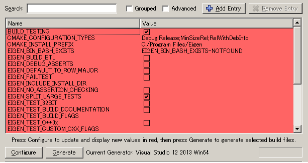
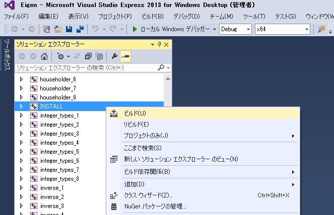
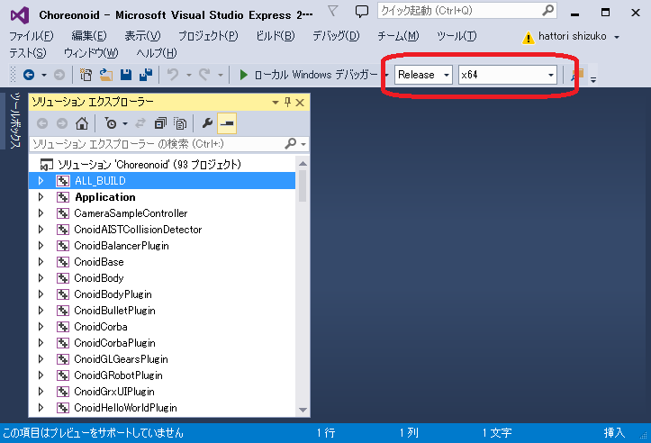
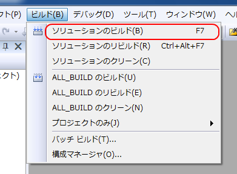
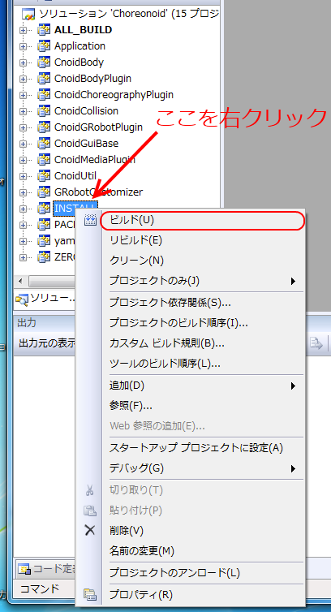

ソースコードからのビルドとインストール (Windows編)
==================================================

.. sectionauthor:: 中岡 慎一郎 <s.nakaoka@aist.go.jp>

.. contents:: 目次
   :local:

準備
----

コレオノイドをソースコードからインストールするには、ビルドに必要なツールとライブラリを予め準備する必要があります。

* 必要なツール

  * Visual C++ 2013
  * `CMake <http://www.cmake.org/>`_ (3.4)

- 必要なライブラリ

  * `Boost <http://www.boost.org/>`_ (1.59.0)
  * `Qt <http://www.qt.io/download-open-source/>`_ (5.5)
  * `Eigen <http://eigen.tuxfamily.org/>`_ (3.2.7)

まず、上記のツールとライブラリをインストールして下さい。各ライブラリの括弧内の数値は、当方で利用し動作を確認したバージョンで、2016年1月時点での目安となるものです。これらより古いバージョンのものに必ずしも対応しないわけではありませんし、一方でこれらよりバージョンが上のものでビルドに失敗することもあり得ます。（正確に対応バージョンを特定するのは困難ですので、このような記述をご容赦ください。）一般的にはバージョン番号の２番目の値までが同じであれば、同様に使えると考えてよろしいかと思います。

各ツール・ライブラリのインストールに関する補足を以下に述べます。

* **Visual C++ 2013**

 製品版でも結構ですし、無料で使用可能なExpress Editionも利用可能です。Visual C++ 2013のExpress Editionは `こちらのページ <https://www.visualstudio.com/downloads/download-visual-studio-vs>`_ からダウンロードできるようです。Visual Studio Express 2013 for Desktop を選択してください。

 現在、32ビットバイナリ、64ビットバイナリがビルドできることを確認しています。(64ビット版Windows上では32ビットバイナリでも動作可能です。）
 ですが、Pythonに関わるモジュールで、32ビットバイナリが作成できない不具合を認識しております。Python機能を使用したい場合は、64ビットバイナリを作成してください。

 なお、ビルドに必要なライブラリは、32ビット、64ビットを統一する必要があります。混在しないように注意してください。
 
 Visual C++ 2015 については現在対応を進めているところで、正式にはまだ未対応となっています。

* **CMake**

 `CMakeのダウンロードページ <https://cmake.org/download/>`_ より、Windows版のインストーラ"Windows (Win32 Installer)"をダウンロードして、実行します。後はインストーラの指示に従ってください。

* **Boost**

 ヘッダーファイルと、コンパイル済みのライブラリが必要になります。コンパイル済みライブラリの取得には、 `Boostホームページ <http://www.boost.org/users/download/>`_ からのダウンロードをお願いします。
 
 まず、ホームページの中ほどにある Prebuilt windows binaries.　をクリックしてリンク先に移動し、1.59.0を選択します。
 
 boost_1_59_0-msvc-12.0-64.exe(64ビット用）、またはboost_1_59_0-msvc-12.0-32.exe(32ビット用）をダウンロードして実行します。後はインストーラの指示に従ってください。インストール先を覚えておいてください。
 
* **Qt**

 `Qtのダウンロードページ <http://www.qt.io/download-open-source/>`_ を開くと、自動的にプラットフォームが選択されます。”Qt Online Installer for Windows”と表示されていることを確認して、ダウンロードを開始してください。ダウンロードしたファイルを実行し、インストーラの指示に従って進めます。途中、下図のようなコンポーネントの選択画面で、インストールするライブラリを選択します。Qt5.5のmsvc2013 64bit、またはmsvc2013 32bitを選択してください。インストール先を覚えておいてください。

 .. figure:: images/Qtsetup.png

* **Eigen**

 `Eigenの公式ページ <http://eigen.tuxfamily.org/>`_ からeigein-eigen-***.zipファイルをダウンロードして展開します。インストールにはCMakeを使用します。
 まず、スタートメニューからCMake(cmake-gui)を起動します。すると下記のようなダイアログが表示されます。

.. figure:: images/cmake0.png

 上図の赤枠①で示された "where is the source code" の右側の入力ボックスに展開したディレクトリを指定します。 "where is build the binaries" の右側の入力ボックスにビルドに使用するディレクトリを入力します。次に、赤枠②の "Configure" を押します。
 すると下図のようなダイアログが開きますので、コンパイラを選びます。

.. figure:: images/cmake1.png

"Visual Studio 12 2013 Win64"(64ビット用） または"Visual Studio 12 2013"（32ビット用）を選択し、"Finish" を押します。すると、CMakeのConfigureが進行し、下図の様に表示されます。

CMAKE_INSTALL_PREFIX にインストール先のディレクトリを記入し、もう一度"Configure" を押します。"Configuring done"と表示されたら"Generate" を押して、"Generating done"と表示されるまで待ちCMakeを終了します。インストール先を覚えておいてください。ビルドに使用するように指定したディレクトリにVisual StudioのソリューションファイルEigen.slnができていますので、それを開きます。

読み込みが終了したら、"ソリューションエクスプローラ" で "INSTALL" のプロジェクトの部分を右クリクし、メニューから "ビルド(U)" を選択します。すると、CMakeで指定したインストール先に必要なファイルがコピーされます。

ソースコードの取得
------------------

Choreonoid開発版のソースコードは現在 `git <http://git-scm.com/>`_ リポジトリとして管理されており、 `github <https://github.com/>`_ の以下のアドレスにて公開されています。

- https://github.com/s-nakaoka/choreonoid

ここからソースを取得するには2つの方法があります。

* **Gitツールをインストールする**

 リポジトリの利用にあたってはgit用ツールのインストールが必要です。公開されているツールがいくつかありますが、ここではコマンドプロンプトで使用するタイプのインストール方法を説明します。もちろん、使い慣れたツールがあればそれを御使用ください。

 `Windows用Git <https://git-for-windows.github.io/>`_ からファイルをダウンロードして実行してください。インストーラの指示に従って進めます。設定はデフォルトのままでよいと思いますが、途中下図の様に表示されたら"Use Git from the Windows Command Prompt"を選ぶと、PATHを通してくれます。

.. figure:: images/GitSetup.png

インストールが終了したら、コマンドプロンプトを開いて、choreonoidのソースを保存したいディレクトリに移動して、以下のコマンドを実行します。::

 git clone https://github.com/s-nakaoka/choreonoid.git

これによってリポジトリを格納した "choreonoid" というディレクトリが生成されます。以降はこのディレクトリ内で ::

 git pull

などとすることにより、その時点での最新のソースコードにアップデートできます。

以上でソースコードの取得はできますが、gitの詳しい使用方法についてはgitのマニュアルや解説記事を参照してください。

* **Zipファイルで取得する**

ウェブブラウザを使用して `Choreonoidのリポジトリ <https://github.com/s-nakaoka/choreonoid/>`_ を開くと、次のように表示されます。

.. figure:: images/downloadZip.png
   :width: 600px

赤枠で示したdownloadZipボタンをクリックすると、最新の内容がZip形式でダウンロードできます。ダウンロードしたファイルを展開してください。
 
 この方法は簡単ですが、git pullコマンドは更新されたファイルだけを取得できるのに対し、この方法は、毎回全てのファイルをダウンロードすることになります。
上記に従って作成したディレクトリを、本マニュアルでは今後 **「ソースディレクトリ」** と呼びます。

CMakeを実行
-----------

まず、スタートメニューからCMake(cmake-gui)を起動します。すると下記のようなダイアログが表示されます。

.. figure:: images/cmake0.png
   :width: 600px

次に、上図の赤枠①で示された "where is the source code" の右側の入力ボックスにコレオノイドのソースディレクトリを入力し、 "where is build the binaries" の右側の入力ボックスにコレオノイドをビルドするディレクトリを入力します。
ビルドするディレクトリはソースコードと同じでも構いませんが、わかりにくくなるかもしれませんので、ソースディレクトリの下にbuildというディレクトリを作成して、そこを入力することにします。
入力が終われば、赤枠②の "Configure" を押します。
すると下図のようなダイアログが開きますので、コンパイラを選びます。

.. figure:: images/cmake1.png

"Visual Studio 12 2013 Win64"(64ビット用） または"Visual Studio 12 2013"（32ビット用）を選択し、"Finish" を押します。

すると、CMakeのConfigureが進行し、コンパイラやライブラリ等の検出が行われます。

.. note:: この際に "The C compiler identification is unkown", "The CXX compiler identification is unkown" というメッセージが表示されるかもしれません。この場合は、Visual C++ のコンパイラが正しく検出されていません。原因は不明ですが、開発者の環境のひとつでこの症状が発生したことがあります。この場合、これ以降の処理を正しく進めることができません。

 これについては、CMakeを管理者権限で実行したところコンパイラも検出されるようになり、その後の処理も進めることができるようになりました。これを行うには、CMakeのアイコンを右クリックすると出るメニューで「管理者として実行」を選択するなどします。もしこの不具合が発生した場合は、この対処法を試してみてください。

その後下図のようなエラーダイアログで停止するかと思います。このとき、矢印のところにBOOSTの設定が見つけられなかったというエラーが表示されます。
（他のエラーが最初に出るかもしれません。これについては後ほど説明します。）
ここでは、 "OK" を押して下さい。

.. figure:: images/cmake2.png

次に、上部のEntry入力部の **BOOST_ROOT** の右の入力ボックスにBoostをインストールしたルートディレクトリを、**BOOST_LIBRARYDIR** の右の入力ボックスにBoostのライブラリ(*.lib,*.dll)が保存されているディレクトリを入力し、再度、"Configure" を押して下さい。

.. figure:: images/cmake3.png

 Eigenに関するエラーが表示されたら、 **EIGEN_DIR** に(Eigenのインストールディレクトリ)/include/eigen3 を入力してください。
 QT5に関するエラーが表示されたら、 **Qt5Core_DIR** に Qt5CoreConfig.cmake というファイルの保存場所（おそらく(Qtのインストール先)/5.5/msvc2013_64/lib/cmake/Qt5Coreにあります。）を入力してください。QT5の他のライブラリについてもエラーが表示されているかと思いますが、Coreの設定をして"Configure"ボタンを押すと、消えます。ワーニングは無視して大丈夫です。

.. note:: 他のライブラリに関しても、CMakeのバージョンやインストールしたライブラリのバージョン、インストール箇所などによっては、検出できずに同様のエラーが出ることがあります。また、以下で説明するオプションの選択によっても、エラーが出る場合があります。この場合、上記と同様に、手動でインストール先を入力するようにしてください。

必要なライブラリのインストール先が全て特定され、エラーが出なくなるまで、上記と同様の設定を繰り返してください。
それらが全て完了すると、"Configuring done"と最後に表示された、下図のような画面になります。

.. figure:: images/cmake4.png
   :width: 600px

後は、必要に応じてビルドに関する他の様々なオプションを設定することが可能となっています。
例えば、コレオノイドが備えているいくつかの機能はデフォルトではオフになっていますが、
BUILD_で始まるオプションを、必要に応じてそれらをオンにすることができます。

インストール先については、 **CMAKE_INSTALL_PREFIX** という項目で設定することが可能で、
デフォルトでは "c:\\Program Files\\Choreonoid" になっています。しかし、Windowsでは "c:\\Program Files" 以下は、管理者以外はアクセス不可になっているようですので、インストール時に失敗する可能性があります。管理者権限で実行してそこにインストールしてもよいのですが、他のディレクトリにインストールした方が扱いやすい場合もあります。
その場合は、 **CMAKE_INSTALL_PREFIX** に適当な、例えば "c:\\choreonoid\\program"といったディレクトリを
指定しておいてください。

必要な設定を終えたら、"Configure"を押してください。
設定を終えても、"Generate"のボタンが押せるようになっていない場合は、再度"Configure"を押します。
Configureが進行し、下図のように下部のメッセージ出力部に、 **“Configuring done”** と表示され、
"Generate"ボタンが押せるようになったら、設定は完了です。

.. figure:: images/cmake5.png
   :width: 600px

最後にVisual Studio のプロジェクトファイルを生成するために、"Generate" を押して下さい。

.. figure:: images/cmake8.png
   :width: 600px

ソリューションファイルの生成が終了すれば、メッセージ出力部に  **“Generating done”** と表示されて完了です。
エクスプローラ等で、コレオノイドをビルドするディレクトリにVisual Studio のソリューションファイル "Choreonoid.sln" が生成されていることを確認して下さい。

Visual Studio の起動とソリューションの読み込み
----------------------------------------------

CMake で Visual Studio のソリューションファイルが生成されていることが確認できれば、次はコレオノイドのビルドを行いますので、 "Choreonoid.sln" をダブルクリックして下さい。Visual Studio が起動し、ソリューションファイルがオープンされていると思います。
もし Visual Studio が起動しない場合には、インストール時に何かあったかもしれませんので、Visual Studio を再インストールするか、関連付けを修正してみてください。あるいは、まず Visual Studio を起動し、その後 Visual Studio のメニューからソリューションファイルを読み込めばうまくいくかもしれません。

コンパイル
----------

ソリューションの読み込みが終われば、下図のような画面になります。
ここで、赤枠の部分を **"Release"** に変更し、64ビットバイナリを生成するのであれば、 **x64** と、32ビットバイナリを生成するのであれば **Win32** と表示されていることを確認して下さい。
なお、"Debug"にすると、デバッグ可能なバイナリを生成することができます。ただしこれは"Relese"でコンパイルしたものと比べて圧倒的に遅くなってしまうので、デバッグが必要な時以外は、"Release"でコンパイルしたバイナリを使うようにします。

次に、コレオノイドのビルドを実行します。メニューのビルドをクリックすると下図のようなプルダウンメニューが出てきますので、赤枠にあるように "ソリューションのビルド(B)" を選択して下さい。
すると、コレオノイドのビルドが開始されます。
下部のメッセージウィンドウで最後に、 **“0 失敗”** と出てくればコンパイルは終了です。

インストール
------------

コレオノイドのビルドが終了したら、最後にインストールを実行します。
インストールは、下図にあるように、上段左の "ソリューションエクスプローラ" で "INSTALL" のプロジェクトの部分を右クリクするとメニューが表示されます。このメニューの最上部に "ビルド(U)" がありますので(下図の赤枠部分です)、それを選択して下さい。正常に終了すれば、CMakeの時の **CMAKE_INSTALL_PREFIX** で指定されたディレクトリの下に、コレオノイドのバイナリがコピーされます。CMakeによるソリューションファイル生成時に **INSTALL_DEPENDENCIES** の項目にチェックを入れておけば、依存ライブラリのバイナリもコピーされます。

以上でコレオノイド のインストールは終了です。

インストール先の bin ディレクトリにある choreonoid.exe をダブルクリックすることで、コレオノイドが起動します。

オプション機能のビルド
----------------------

コレオノイドでは、上記手順のデフォルト状態で有効になるもの以外にも、いくつかのモジュールやプラグイン、サンプル等があります。それらは、CMakeの設定で有効にすることで、ビルドすることができます。
ここではそれらオプション機能のうちいくつかのビルドについて述べます。
:doc:`options` にて他のオプションについてもまとめてありますので、そちらもご参照ください。

OpenRTMプラグイン
~~~~~~~~~~~~~~~~~

コレオノイド上でRTコンポーネントによるシミュレーションを行うためのプラグインです。
このプラグインを利用するためには、OpenRTM-aist 1.1.x をインストールしておく必要があります。

OpenRTM-aistのインストールは、公式サイトより配布されているインストーラを使うのが簡単です。
`OpenRTM-aistのダウンロードページ <http://www.openrtm.org/openrtm/node/5711#toc2>`_ より、
OpenRTM-aist-1.1.1-RELEASE_x86_64_vc12.msiまたは	OpenRTM-aist-1.1.1-RELEASE_x86_vc12.msi をダウンロードしてください。
このファイルをクリックすることで、インストーラが起動しますので、これでインストールを行なってください。

OpenRTM-aistがインストール出来ましたら、CMake上で **ENABLE_CORBA** 、 **BUILD_CORBA_PLUGIN** 、 **BUILD_OPENRTM_PLUGIN** をオンにして設定を進めます。OpenRTMプラグインはCorbaプラグインに依存していますので、これら全てをオンにしておく必要があります。また、 **BUILD_OPENRTM_SAMPLES** をオンにするとRTコンポーネントを用いたシミュレーションのサンプルもビルドされますので、最初はこちらもオンにしてサンプルを試してみてください。

CMakeのConfigureボタンを押した際にOpenRTM-aistが見つからないというエラーが出た場合は、 **OPENRTM_DIR** にOpenRTM-aistをインストールしたディレクトリを設定してください。上記のOpenRTM-aistインストーラでインストールした場合、デフォルトでは c:\\Program Files\\OpenRTM-aist\\1.1 といったディレクトリになります。

CMakeで以上の設定を行った上でGenerateボタンを押すとソリューションファイルが更新されます。このファイルを用いてVisual Studioでコンパイル、インストールを行うことでOpenRTMプラグインが生成されます。他のプラグインも同様ですので、CMakeでオプションの変更を行った後は、必ずコンパイル、インストールの作業を行ってください。

.. note:: **BUILD_** のオプションをオンにしてインストールしたプラグインは、その後オプションをオフにしてインストールしても削除されません。プラグインを追加して動作が不安定になった場合など、プラグインを削除したい場合は、手動でファイルを削除してください。プラグインは(コレオノイドのインストール先)/lib/choreonoid-1.5にCnoid***Plugin.dllとしてインストールされています。

ODEプラグイン
~~~~~~~~~~~~~

オープンソースーの動力学計算ライブラリである"Open Dynamics Engine (ODE)"を、コレオノイドのシミュレーション機能の計算エンジンとして利用できるよにするプラグインです。

本プラグインをビルドして利用するためには、ODEライブラリのインストールが必要です。ビルド済みのライブラリは公開されていないようなので、ソースからビルドする必要があります。
`Open Dynamics Engine <http://www.ode.org/>`_ のサイトからファイルをダウンロードして展開してください。現在当方でテストを行ったバージョンは0.12になります。（0.13では動作しない不具合が報告されています。）

ODEのビルドにはpremakeというコマンドを使用します。コマンドプロンプトを起動し、展開したディレクトリの下のbuildというディレクトリに移動します。
そこで、 ::

 premake4.exe --with-libccd vs2008

として実行します。すると、vs2008というディレクトリが作成され、中にode.slnが作成されます。(ode0.12ではvs2008までしかサポートされていないので、2008用のソリューションファイルを作成します。)
このファイルをVS2013で開くと、変換ウィザードが起動し2013用に変換してくれます。いくつかワーニングが表示されますが、無視しても大丈夫なようです。

変換されたソリューションファイルを用いて、ビルドします。ソリューション構成で **ReleaseDoubleDLL** を選択し、 **x64** , **Win32** の選択も確認してください。成功するとlib/ReleaseDoubleDLLにode_double.*というファイルが作成されます。

後はコレオノイドのビルドに関するCMakeの設定で、 **BUILD_ODE_PLUGIN** という項目を "ON" にし、 **ODE_DIR** にODEのlibの上のディレクトリを指定してください。

Bulletプラグイン
~~~~~~~~~~~~~~~~

オープンソースの動力学計算ライブラリである"Bullet Physics ライブラリ"を、コレオノイドのシミュレーション機能の計算エンジンとして利用できるようにするプラグインです。

本プラグインをビルドして利用するためには、Bullet Physics ライブラリのソースからのビルドが必要です。
`Bullet Physics Library <http://bulletphysics.org>`_ のサイトからソースが取得できます。当方でテストを行ったバージョンはbullet-2.82-r2704になります。

CMakeが使用できますので、いままでの説明と同様に行います。
CMakeの設定で、 **BUILD_**＿DEMOS** のすべてと、 **USE_DX11** をOFFにします。 **INSTALL_EXTRA_LIBS** 、 **INSTALL_LIBS** と **USE_DOUBLE_PRECISION** をONにします。 **CMAKE_INSTALL_PREFIX** でインストール先を指定できます。

.. note:: Extras\\HACD\\hacdICHull.cppで"error C2039: 'max' : 'std' のメンバーではありません。"というエラーが表示されたら、このファイルの先頭部分を以下のように修正してください ::

   #include "hacdICHull.h"
   #include <limits>
   #include <algorithm>  <--この行を追加

.. note:: BulletのバージョンによってCMakeのオプションに差異があるようです。ここでの解説は、対象バージョンでの例とお考えください。

後はコレオノイドのビルドに関するCMakeの設定で、 **BUILD_BULLET_PLUGIN** という項目を "ON" にし、**BULLET_DIR** にBulletライブラリのインストール先を指定してください。

Pythonプラグイン
~~~~~~~~~~~~~~~~
Pythonスクリプトの読み込み・実行や、コレオノイド上で動作するPythonコンソール等の機能を使用するためのプラグインです。

本プラグインをビルドして利用するためには、Pythonのインストールが必要です。当方でテストを行ったバージョンは2.7.9です。
`Python <http://www.python.org/>`_ のサイトからPythonの2.7のダウンロードページに移動して、Windows用のMSI Installerをダウンロードして実行してください。インストーラの指示に従って進め、途中、 **"Customize Python 2.7"** のところで、 **Add python.exe to Path** を **Will be installed on local hard drive** に変更してインストールします。

Pythonのインストールができたら、 **Numpy** もインストールします。公式サイトでは、Windowsの64ビット用の配布はないようです。非公式ですが `ここ <http://www.lfd.uci.edu/~gohlke/pythonlibs/>`_ からダウンロードできます。
numpy-1.10.4+mkl-cp27-none-win_amd64.whl、またはnumpy-1.10.4+mkl-cp27-none-win32.whlをダウンロードします。コマンドプロンプトを起動し、ダウンロードしたファイルが保存されているディレクトリに移動し、次のようにしてインストールします。 ::

 pip install ダウンロードしたファイル名

後はコレオノイドのビルドに関するCMakeの設定で、 **ENABLE_PYTHON** , **BUILD_PYTHON_PLUGIN** , **BUILD_PYTHON_SIM_SCRIPT_PLUGIN** という項目を "ON"にしてください。