ソースコードからのビルドとインストール (Windows編)
==================================================

.. sectionauthor:: 中岡 慎一郎 <s.nakaoka@aist.go.jp>

.. contents:: 目次
   :local:

準備
----

コレオノイドをソースコードからビルドしてインストールするには、ビルドに必要なツールとライブラリを予め準備する必要があります。

* 必要なツール

  * Visual C++ 2015　または　Visual C++ 2017（これより古いバージョンでは、ビルド出来ません。また、バージョン1.1.2のOpenRTMは2017用のライブラリが用意されていません。OpenRTMを使用する方は2015をご使用ください。）
  * `CMake <http://www.cmake.org/>`_ (3.12.0)

- 必要なライブラリ

  * `Boost <http://www.boost.org/>`_ (1.67.0)
  * `Qt <http://www.qt.io/download-open-source/>`_ (5.11　5.10以上必須)
  * `Eigen <http://eigen.tuxfamily.org/>`_ (3.3.5)

まず、上記のツールとライブラリをインストールして下さい。各ライブラリの括弧内の数値は、当方で利用し動作を確認したバージョンで、2018年7月時点での目安となるものです。最低のバージョンを指定しているライブラリ以外は、これらより古いバージョンのものに必ずしも対応しないわけではありませんし、一方でこれらよりバージョンが上のものでもビルドに失敗することもあり得ます。（正確に対応バージョンを特定するのは困難ですので、このような記述をご容赦ください。）一般的にはバージョン番号の２番目の値までが同じであれば、同様に使えると考えてよろしいかと思います。

各ツール・ライブラリのインストールに関する補足を以下に述べます。インストールは管理者権限を持つアカウントで行ってください。また、下図のようなユーザアカウントコントロールが表示された場合は、 **はい** をクリックして先に進めてください。

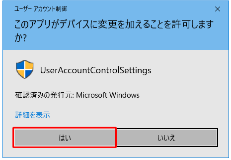

.. _install_visualc++:

Visual C++ 2015
~~~~~~~~~~~~~~~

ChoreonoidをコンパイルするためのC++コンパイラとして、Microsoft製のVisual C++を用いることができます。製品版でも結構ですし、無料版も利用可能です。

無料版のVisual Studio Community 2015 は `こちらのページ <https://www.visualstudio.com/ja/vs/older-downloads/>`_ からダウンロードできます。

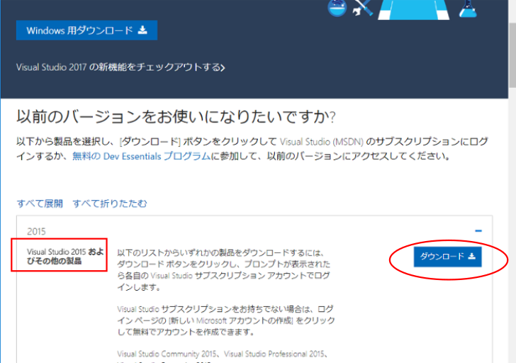

Visual Studio 2015 のところのダウンロードボタンをクリックします。次の画面でMicrosoftのアカウントでログインするよう求められますので、ログインしてください。既にログインしている場合は、そのままダウンロードページに移動します。アカウントをお持ち出ない方は、新たに作成してください。無料で作成出来ます。

.. figure:: images/VC2015Install2.png

"Visual Studio Community 2015 with Update 3" のところで、**x64**, **Japanese**, **EXE** と選択し、**Download** ボタンを押します。ダウンロードしたファイルを実行すると、インストールが開始されますので、表示されるメッセージに従ってください。

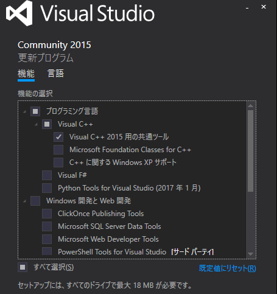

図のような、インストールするコンポーネントの選択画面になったら、**Visual C++ 2015 用の共通ツール** を選択してください。

Visual C++ 2017
~~~~~~~~~~~~~~~

無料版のVisual Studio Community 2017 は `こちらのページ <https://visualstudio.microsoft.com/ja/downloads/>`_ からダウンロードできます。

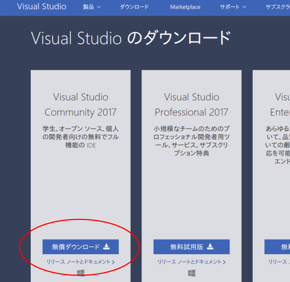

無償ダウンロードをクリックします。ダウンロードしたファイルを実行すると、インストールが開始されますので、表示されるメッセージに従ってください。

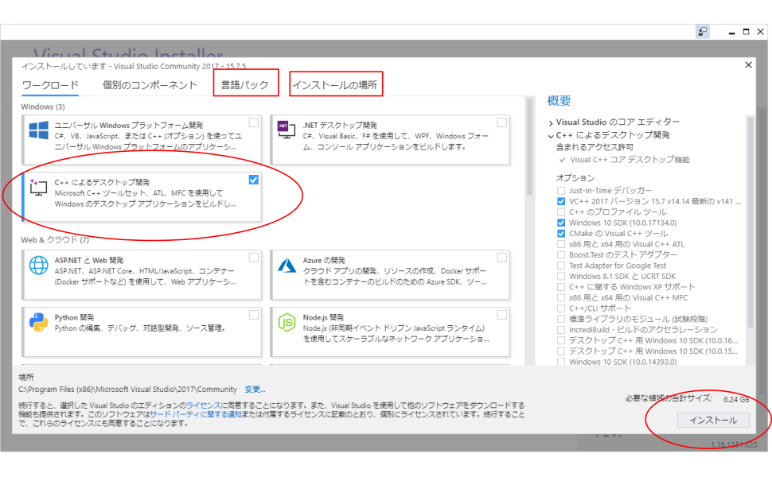

図のような画面になったら、 **C++によるデスクトップ開発** のところにチェックをいれ、言語パックのタグをクリックして日本語を選択します。インストールの場所を変更する場合もここで指定します。設定が終わったら、インストールボタンを押します。

CMake
~~~~~

ビルド方法を記述するためのツールです。Choreonoidのビルド方法は本ツールの形式で記述されており、WindowsにおいてはそこからVisual Studio のプロジェクトファイルを生成することが可能です。 

`CMakeのダウンロードページ <https://cmake.org/download/>`_ よりWindows版のインストーラ"Windows win64-x64 Installer"をダウンロードできます。現在、バージョン3.12.0で動作を確認しています。 

.. figure:: images/CMakeInstall1.png

**cmake-3.12.0-win64-x64.msi** をクリックしてダウンロードし、これを実行してインストールを行ってください。表示されるメッセージに従って進め、

.. figure:: images/CMakeInstall2.png

図のような画面になったら、 **Add CMake to the system PATH for all users** を選択してください。

他の設定はデフォルトのままで大丈夫です。

Boost
~~~~~

C++の便利なライブラリ集です。ダウンロードは `Boost Downloads <http://www.boost.org/users/download/>`_ のページから行うことができます。

.. figure:: images/boostInstall1.png

ソースをダウンロードした場合はコンパイルが必要となります。あらかじめWindows用にコンパイルされたバイナリを入れてくれるインストーラがありますので、そちらを使うのが簡単です。画面の **Windows Binaries** をクリックすると、ダウンロードページに移動するので、

* boost_1_67_0-msvc-14.0-64.exe (VC2015用） または
* boost_1_67_0-msvc-14.1-64.exe (VC2017用）
 
というファイルをダウンロードしてください。

ダウンロードしたファイルを実行することで、インストールを行うことができます。インストール先はデフォルトでは "C:\\local\\boost_1_67_0" といったフォルダになります。これを変更しなければ、この後の手順でCMakeが自動的にBoostを検出するようになります。変更する場合は、フォルダを手動で指定する必要があるので覚えておいて下さい。
 
Qt
~~

QtはGUIを含む総合的なフレームワークライブラリで、ChoreonoidでもGUIのベースとして使っています。

Qtのインストーラは `Qtのダウンロードページ <https://www.qt.io/download>`_ にて取得できます。下図のようにCommercial版とOpen Source版が選択できるページになります。Open Source版で大丈夫ですので、そちらを選択してください。

次のページに移動するとOSにあったインストーラが提示されます。

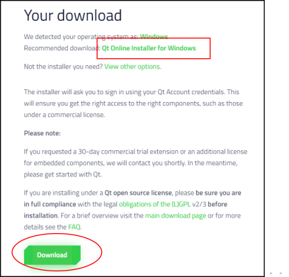

"Recommended download: Qt Online Installer for Windows" と表示されていることを確認して、"Download"のボタンを押してダウンロードを行ってください。ダウンロードしたファイルを実行すると、ログインを求められますが、skipボタンを押して先に進んでしまって大丈夫です。

インストール先はデフォルトでは "C:\\Qt" といったフォルダになります。これを変更しなければ、CMakeが自動的にQtを検出するようになります。変更する場合は、フォルダを手動で指定する必要があるので覚えておいて下さい。

途中、下図のようなコンポーネントの選択画面で、インストールするライブラリを選択します。

.. figure:: images/QtInstall3.png

最新バージョンの **5.11.1** の **MSVC2015 64bit** または **MSVC2017 64bit** を選択します。後は、インストーラの指示に従って進めます。

Eigen
~~~~~

行列・ベクトル等の演算に用いるライブラリです。`Eigenの公式ページ <http://eigen.tuxfamily.org/>`_ からダウンロードできます。

.. figure:: images/EigenInstall1.png

**Zip** の文字をクリックすると、最新版3.3.5のZipファイルがダウンロード出来ます。

本ライブラリはヘッダファイルのみのライブラリで、コンパイルの必要はないので、ダウンロードしたファイルを適当な場所に展開するだけでOKです。ただし、Eigenのファイルはアーカイブファイルや展開後のフォルダにバージョン番号ではない記号が使われており、そのままだとちょっと分かりづらいかもしれません。以下にフォルダ名を変えるインストールの例を示しますので、参考にしてください。

* Eigenのページから、利用するバージョンのzipファイルをダウンロードします。バージョン3.3.5の場合、"eigen-eigen-b3f3d4950030.zip" というファイルになります。このように、ファイル名からはバージョン3.3.5であることが分かりません。また、なぜかeigenの文字が２つも入っています。

* エクスプローラー等を使ってzipファイルを展開します。デフォルトのフォルダ名で展開すると "eigen-eigen-b3f3d4950030" というフォルダができ、その中にeigenの本体が入っています。

 | eigen-eigen-b3f3d4950030
 |   bench
 |   blas
 |   cmake
 |   ...

* フォルダの名前をバージョン番号を付けた名前に変更し、適当な場所に移動しましょう。boostがC:\\local以下に入るので、これに合わせてC:\\local以下に移すのでもよいかと思います。すると最終的にEigenは以下のようにインストールされます。この場所にインストールすれば、CMakeが自動的にEigenを検出するようになります。他の場所にインストールする場合は、フォルダを手動で指定する必要があるので覚えておいて下さい。

 | local
 |   boost_1_60_0
 |    ...
 |   eigen-3.3.4
 |     bench
 |     blas
 |     cmake
 |     ...

ソースコードの取得
------------------

リリース版
~~~~~~~~~~

Choreonoidのリリース版のソースコードは、 `ダウンロード <http://choreonoid.org/ja/download.html>`_ のページからダウンロードすることが可能です。このページにある「ソースパッケージ」の該当するバージョンをダウンロードしてください。ファイルはZIPファイルになっていますので、エクスプローラ等を用いて適当なディレクトリに展開してください。

展開すると choreonoid-1.6.0 といったディレクトリが生成されます。このディレクトリの中にソースコード一式が格納されており、本マニュアルではこれを今後 **「ソースディレクトリ」** と呼ぶことにします。

開発版
~~~~~~

Choreonoid開発版も利用可能です。これは `git <http://git-scm.com/>`_ リポジトリとして管理されており、 `github <https://github.com/>`_ の以下のアドレスにて公開されています。

- https://github.com/s-nakaoka/choreonoid

ここからソースを取得するには2つの方法があります。

* Gitツールで取得する
* Zipファイルで取得する

Gitツールで取得する
^^^^^^^^^^^^^^^^^^^

リポジトリの利用にあたってはgit用ツールが必要です。無料で公開されているツールがいくつかありますが、ここではVisual Studioのgitツールを使用する方法と、コマンドプロンプトタイプのツールを使用する方法を説明します。もちろん、使い慣れたツールがあればそれを御使用ください。

Visual Studio を使用する
^^^^^^^^^^^^^^^^^^^^^^^^

Visual Studio を起動し、メニューの **表示** ー **チームエクスプローラー** を選択して、表示させます。

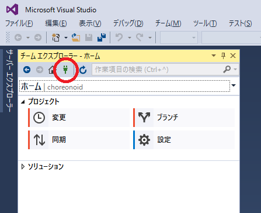

図の赤丸で示したアイコンをクリックします。

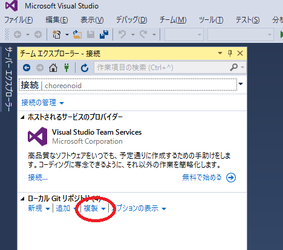

ローカルGitリポジトリで、 **複製** をクリックします。

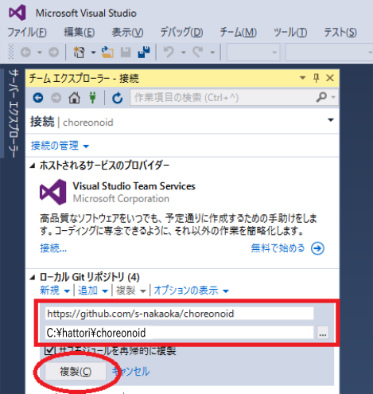

赤枠で示した上段にchoreonoidのリポジトリのURLを入力し、下段にソースを置くディレクトリを入力して、複製ボタンを押します。

ソースがクローンされます。

一度、クローンした後は、下図のようにchoreonoidを選択し右クリック、プルダウンメニューより開くを選択します。

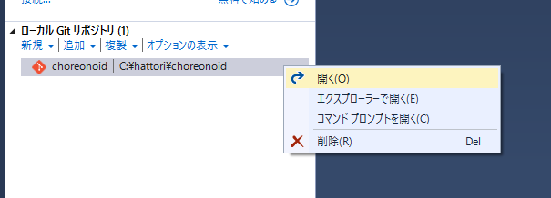

表示が下図のように変わったら、同期を選択し、プルをクリックすると、その時点での最新のソースコードにアップデートできます。

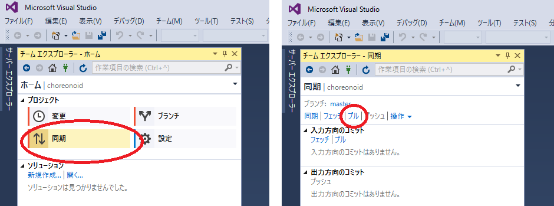

git for windows を使用する
^^^^^^^^^^^^^^^^^^^^^^^^^^

次にコマンドプロンプトタイプのツールについて説明します。

`Windows用Git <https://git-for-windows.github.io/>`_ からファイルをダウンロードして実行してください。インストーラの指示に従って進めます。設定はデフォルトのままでよいと思いますが、途中下図の様に表示されたら"Use Git from the Windows Command Prompt"を選ぶと、PATHを通してくれます。

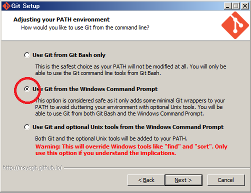

インストールが終了したら、コマンドプロンプトを開いて、choreonoidのソースを保存したいディレクトリに移動して、以下のコマンドを実行します。::

 git clone https://github.com/s-nakaoka/choreonoid.git

これによってリポジトリを格納した "choreonoid" というディレクトリが生成されます。以降はこのディレクトリ内で ::

 git pull

などとすることにより、その時点での最新のソースコードにアップデートできます。

以上でソースコードの取得はできますが、gitの詳しい使用方法についてはgitのマニュアルや解説記事を参照してください。

Zipファイルで取得する
^^^^^^^^^^^^^^^^^^^^^

ウェブブラウザを使用して `Choreonoidのリポジトリ <https://github.com/s-nakaoka/choreonoid/>`_ を開き、赤四角で示した緑の **Clone or download** ボタンをクリックすると、次のように表示されます。

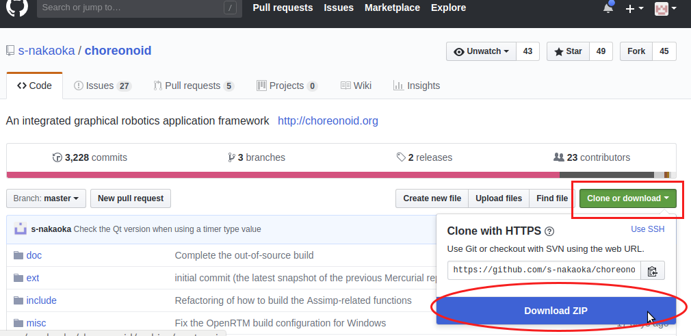

赤丸で示した、青の **Download ZIP** をクリックすると、最新の内容がZip形式でダウンロードできます。ダウンロードしたファイルをソースを置くディレクトリに展開します。
 
この方法は簡単ですが、 **git pull** コマンドは、二回目以降は更新されたファイルだけを取得できるのに対し、この方法は、毎回全てのファイルをダウンロードすることになります。

.. _build-windows-cmake:

CMakeによるビルド設定
---------------------

まず、スタートメニューからCMake(cmake-gui)を起動します。すると下記のようなダイアログが表示されます。

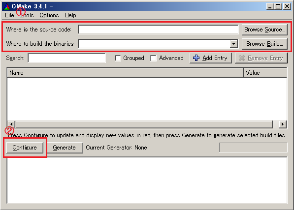

次に、上図の赤枠①で示された **where is the source code** の右側の入力ボックスにコレオノイドのソースディレクトリを入力します。 **Browse Source...** をクリックすると、ディレクトリ選択ダイアログが開くので、そこから選択してもいいです。次に **where is build the binaries** の右側の入力ボックスにコレオノイドをビルドするディレクトリを入力します。ビルドするディレクトリはソースコードと同じでも構いませんが、わかりにくくなるかもしれませんので、ソースディレクトリの下にbuildというディレクトリを作成して、そこを入力することにします。入力したら、赤枠②の "Configure" を押します。

ビルドするディレクトリが予め作成されていない場合、ここで作成するか否かの確認のダイアログが表示されます。

次に、下図のようなダイアログが開きます。赤枠のプルダウンメニューから、コンパイラを選びます。

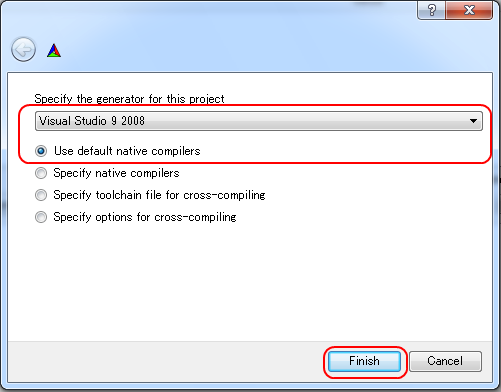

**"Visual Studio 14 2015 Win64"** または **"Visual Studio 15 2017 Win64"** を選択し、 **Finish** ボタンを押します。

すると、CMakeのConfigureが進行し、コンパイラやライブラリ等の検出が行われます。

.. note:: この際に "The C compiler identification is unkown", "The CXX compiler identification is unkown" というメッセージが表示されるかもしれません。この場合は、Visual C++ のコンパイラが正しく検出されていません。原因は不明ですが、開発者の環境のひとつでこの症状が発生したことがあります。この場合、これ以降の処理を正しく進めることができません。

 これについては、CMakeを管理者権限で実行したところコンパイラも検出されるようになり、その後の処理も進めることができるようになりました。これを行うには、CMakeのアイコンを右クリックすると出るメニューで「管理者として実行」を選択するなどします。もしこの不具合が発生した場合は、この対処法を試してみてください。
 
.. note:: Windows環境に、pkg-config.exe というプログラムがインストールされている場合、この作業中にエラーが起きることがあります。そのような場合は、pkg-config.exeをアンインストールして頂けますようお願いいたします。

ライブラリのインストールで、デフォルトのディレクトリを選択している場合、自動的にライブラリが検出され、次のように最後の行に **Configuring done** と表示されると思います。

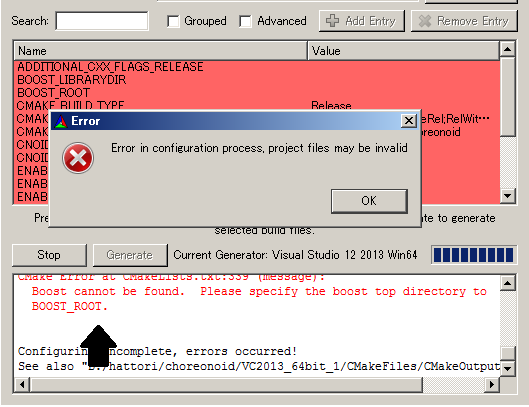

（他のディレクトリにインストールしている場合は、エラーが表示されると思います。その場合の設定は、後で説明します。）

次にインストール先を設定します。 下図のように中央の表示をスクロールして **CMAKE_INSTALL_PREFIX** という項目を表示します。

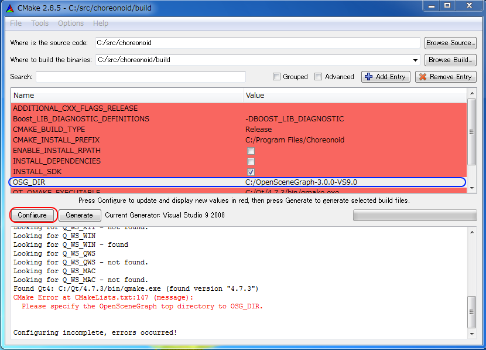

デフォルトでは "c:\\Program Files\\Choreonoid" になっています。しかし、Windowsでは "c:\\Program Files" 以下は、管理者以外はアクセス不可になっているようですので、インストール時に失敗する可能性があります。管理者権限で実行してそこにインストールしてもよいのですが、他のディレクトリにインストールした方が扱いやすい場合もあります。
その場合は、 **CMAKE_INSTALL_PREFIX** に適当な、例えば "c:\\choreonoid\\program"といったディレクトリを指定してください。

設定を終えたら、**Configure** ボタンを押して、再度 **Configuring done** と表示されることを確認してください。

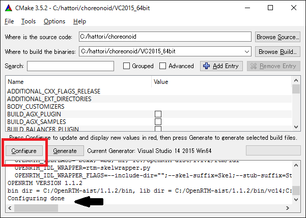

次にVisual Studio のプロジェクトファイルを生成するために、"Generate" を押します。"Generate"のボタンが押せるようになっていない場合は、再度"Configure"を押します。

ソリューションファイルの生成が終了すれば、メッセージ出力部に “Generating done” と表示されます。

次にエラー表示が出た場合や、他の設定を変更したい場合の手順について説明します。ここまで、エラーが表示されなかった方は、 :ref:`build-windows-visualstudio` に進まれた後に読んでくださっても結構です。

ライブラリの検出が自動で出来なかった場合、図のようなエラーダイアログが表示されます。

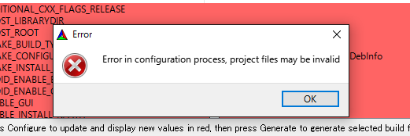

**OK** を押してダイアログを消します。下の段のメッセージが表示されているウィンドウを上からスクロールして、Errorが表示されているところをみつけます。Warningは
無視してください。下の方に表示されているエラーは上のエラーが原因でおきていることがあるので、上から探してください。

下図では、Eigenライブラリがみつからなかったエラーが出ています。

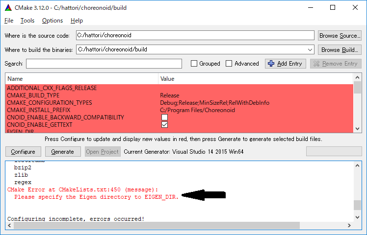

上の設定項目から、 **EIGEN_DIR** を探し、インストール先のディレクトリを設定します。

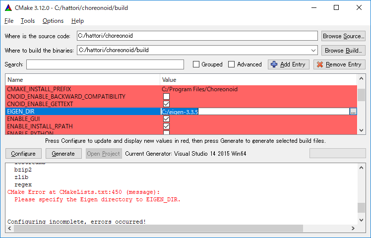

**Configure** ボタンを押して、エラーが消えたことを確認します。

下図では、Boostライブラリがみつからなかったエラーが出ています。

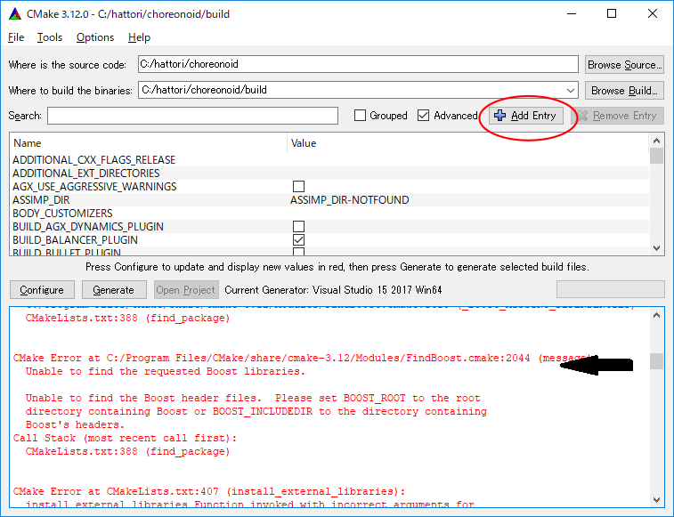

上の設定項目にはBOOST_ROOTがありません。この場合は、赤丸で示した **Add Entry** ボタンを押します。ダイアログが表示されるので下図のように入力します。

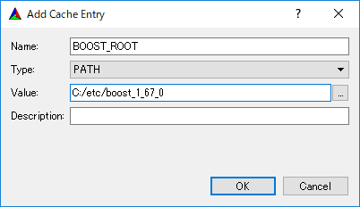

**Value** の欄にBoostライブラリのインストールディレクトリを指定します。 **OK** を押してダイアログを閉じ、下図のようにBOOST_ROOTが追加されていることを確認してください。

.. figure:: images/cmake8.png

**Configure** ボタンを押して下さい。

QT5に関するエラーが表示されたら、 **Qt5Core_DIR** に Qt5CoreConfig.cmake というファイルの保存場所（おそらく(Qtのインストール先)/5.11/msvc2015_64/lib/cmake/Qt5Coreにあります。）を入力してください。QT5の他のライブラリについてもエラーが表示されているかと思いますので、同じように入力してください。ワーニングは無視して大丈夫です。

後は、必要に応じてビルドに関する他の様々なオプションを設定することが可能となっています。
例えば、コレオノイドが備えているいくつかの機能はデフォルトではオフになっていますが、
BUILD_で始まるオプションを、必要に応じてそれらをオンにすることができます。

必要なライブラリのインストール先が全て特定され、エラーが出なくなるまで、上記と同様の設定を繰り返してください。

必要な設定を終えたら、"Generate" を押して下さい。

.. note:: 他のライブラリに関しても、CMakeのバージョンやインストールしたライブラリのバージョン、インストール箇所などによっては、検出できずに同様のエラーが出ることがあります。また、以下で説明するオプションの選択によっても、エラーが出る場合があります。エラーがでる順番も、インストールの状況によってかわります。この場合、上記と同様に、エラー箇所を探し、手動でインストール先を入力するようにしてください。

.. note:: 設定した内容は、 **Where to build the binaries** で指定した箇所に、 **CMakeCache.txt** というファイルで保存されています。設定を初めからやり直したい場合は、このファイルを削除してください。CMakeのメニューから **File** - **Delete Cache** としても削除されます。

.. _build-windows-visualstudio:

Visual Studio の起動とソリューションの読み込み
----------------------------------------------

次はコレオノイドのビルドを行います。 

これまでの操作で、**CMake** の **where is build the binaries** で指定した場所に Visual Studio のソリューションファイル **Choreonoid.sln** が生成されているはずです。これをダブルクリックして下さい。

Visual Studio が起動し、ソリューションファイルがオープンされていると思います。

もし Visual Studio が起動しない場合には、インストール時に何かあったかもしれませんので、Visual Studio を再インストールするか、関連付けを修正してみてください。あるいは、まず Visual Studio を起動し、その後 Visual Studio のメニューからソリューションファイルを読み込めばうまくいくかもしれません。

Visual Studio 2015 と 2017 でのビルド操作は同じですので、以下の説明では、どちらのバージョンかを特定していません。従いまして、画面デザインなどは異なる場合があります。

コンパイル
----------

ソリューションの読み込みが終われば、下図のような画面になります。
ここで、赤枠の部分を **"Release"** に変更し、 **x64** と表示されていることを確認して下さい。
なお、"Debug"にすると、デバッグ可能なバイナリを生成することができます。ただしこれは"Relese"でコンパイルしたものと比べて圧倒的に遅くなってしまうので、デバッグが必要な時以外は、"Release"でコンパイルしたバイナリを使うようにします。

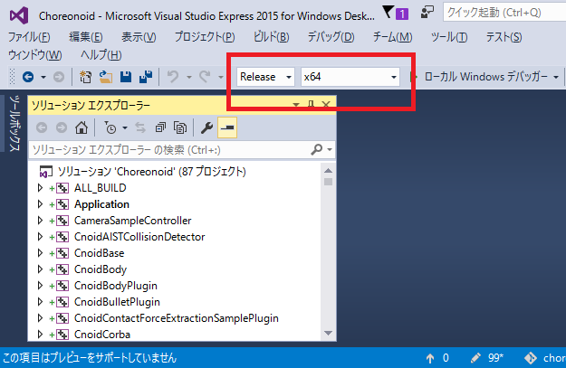

次に、コレオノイドのビルドを実行します。メニューのビルドをクリックすると下図のようなプルダウンメニューが出てきますので、赤枠にあるように "ソリューションのビルド(B)" を選択して下さい。
すると、コレオノイドのビルドが開始されます。
下部のメッセージウィンドウで最後に、 **“0 失敗”** と出てくればコンパイルは終了です。

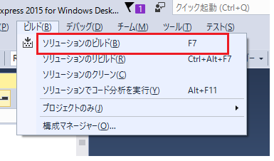

.. _build-windows-install:

インストール
------------

コレオノイドのビルドが終了したら、最後にインストールを実行します。
インストールは、下図にあるように、上段左の "ソリューションエクスプローラ" で "INSTALL" のプロジェクトの部分を右クリクするとメニューが表示されます。このメニューの最上部に "ビルド(U)" がありますので(下図の赤枠部分です)、それを選択して下さい。正常に終了すれば、CMakeの時の **CMAKE_INSTALL_PREFIX** で指定されたディレクトリの下に、コレオノイドのバイナリがコピーされます。CMakeによるソリューションファイル生成時に **INSTALL_DEPENDENCIES** の項目にチェックを入れておけば、依存ライブラリのバイナリもコピーされます。

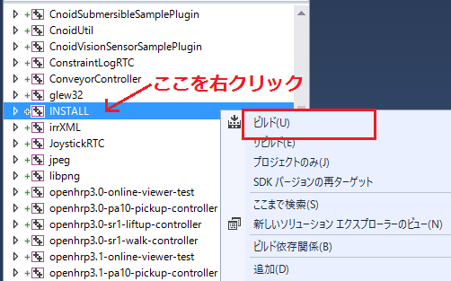

以上でコレオノイド のインストールは終了です。

インストール先の **bin** ディレクトリにある **choreonoid.exe** をダブルクリックすることで、コレオノイドが起動します。

オプション機能のビルド
----------------------

コレオノイドでは、上記手順のデフォルト状態で有効になるもの以外にも、いくつかのモジュールやプラグイン、サンプル等があります。それらは、CMakeの設定で有効にすることで、ビルドすることができます。
ここではそれらオプション機能のうちいくつかのビルドについて述べます。
:doc:`options` にて他のオプションについてもまとめてありますので、そちらもご参照ください。

各プラグインが使用しているライブラリのインストール方法も簡単に説明していますが、ライブラリのバージョンアップなどにより大きく変更されている場合もあります。
また、開発元のホームページが更新され、リンク先が変更されている場合もあります。
そのような場合は、ライブラリ名、「インストール」、等をキーワードにしてネット検索して頂くと、新しい情報を見つけることができるかと思います。

.. note:: CMakeでオプション機能の設定を行った上で **Configure**, **Generate** ボタンを押すとソリューションファイルが更新されます。このファイルを用いてVisual Studioでコンパイル、インストールを行うことでオプションのプラグインが生成されます。CMakeでオプションの変更を行った後は、必ずコンパイル、インストールの作業を行ってください。

Assimpプラグイン
~~~~~~~~~~~~~~~~

様々な形式の３次元モデルデータを読み込むためのライブラリ **Open Asset Import Library (Assimp)** をコレオノイドで使用するためのプラグインです。
このプラグインを利用するためには、Assimpライブラリをソースからビルドしてインストールしておく必要があります。

`githubのassimp <https://github.com/assimp/assimp/>`_ のページをブラウザで開きます。

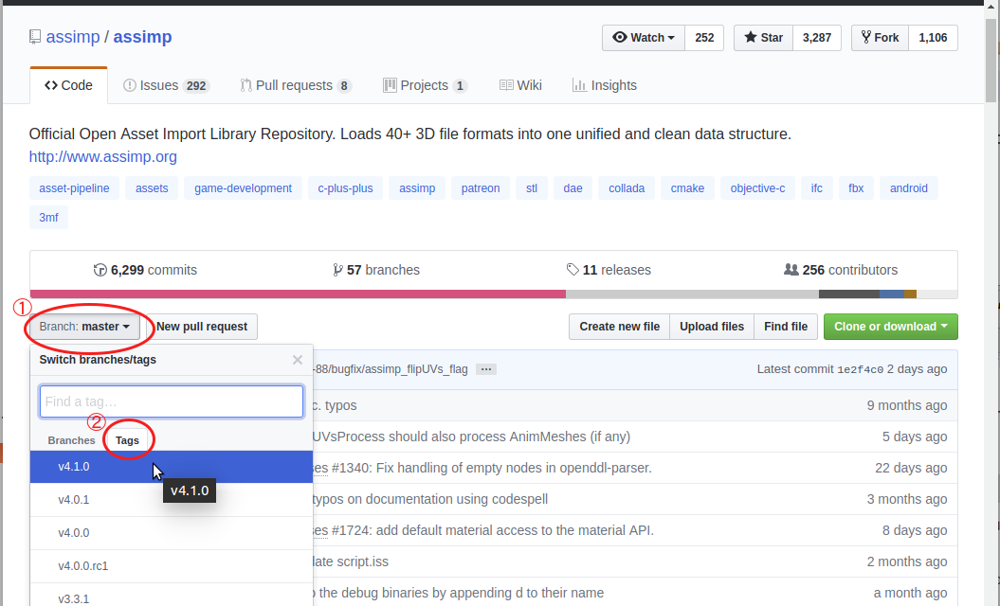

①ので示す、 **Branch: master** をクリックし、②の **Tags** をクリック、バージョンを選択します。現在動作確認しているバージョンは、4.1.0になります。図ではv4.1.0を選択しています。

.. figure:: images/assimp2.png
   :width: 800px

**Tag: v4.1.0** に表示が変わったことを確認し、 **Clone or download** をクリック、 **Download ZIP** をクリックして、Zip形式のソースファイルをダウンロードします。

Zipファイルを展開します。

CMakeが利用できますので、Choreonoidのビルドの説明と同様にCMakeを操作し、Visual Studio のプロジェクトファイルを作成します。CMakeのオプション設定の変更は必要ありません。

インストール先 **CMAKE_INSTALL_PREFIX** は **c:\\Program Files\\Assimp** になっていますが、 **c:\\local** 以下にしておけば、自動で検出しますので、なるべく **c:\\local\\Assimp** と指定してください。

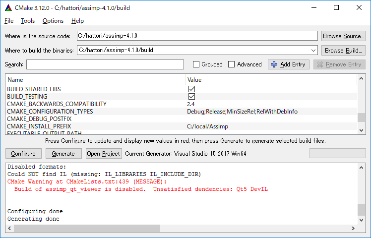

Visual Studioでのコンパイル、インストール操作も、Choreonoidの場合と同様に行ってください。

Assimpのインストールが出来ましたら、再びCMakeを起動して、Choreonoidのソースとビルドのディレクトリを指定します。

前回設定した内容は保存されているので、今回はAssimpに関する設定だけをすれば大丈夫です。（新たにビルドディレクトリを指定した場合など、保存されている設定がない場合は、次の操作はしないで **Configure** を押してください。）

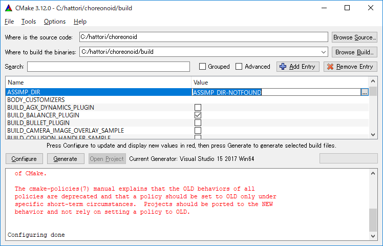

図のように **ASSIMP_DIR** の値は **ASSIMP_DIR-NOTFOUND** と表示されているかと思います。

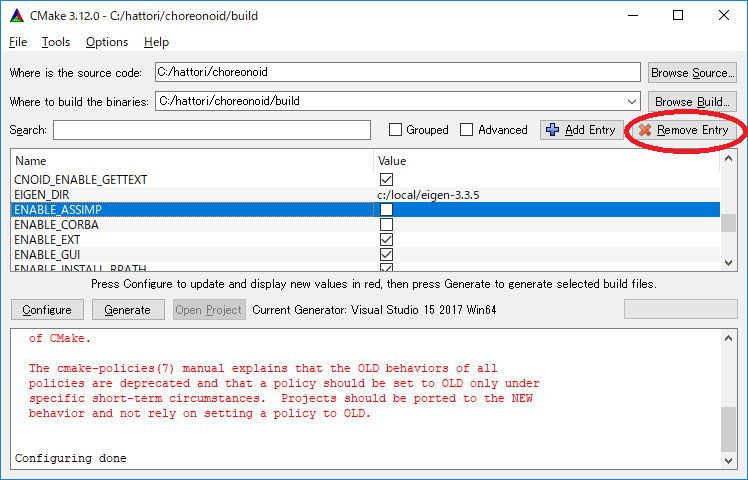

その下の方に **ENABLE_ASSIMP** という項目があるのでこれを選択し、**Remove Entry** ボタンを押して、この項目を削除します。その後、 **Configure** を押すと、Assimpが自動で検出されるはずです。

自動検出に失敗する場合は、**ENABLE_ASSIMP** を **ON** にして **ASSIMP_DIR** に手動で入力します。この時、Assimpのインストール先のトップディレクトリではなく、AssimpのCMakeファイルが入っているディレクトリを指定する必要があります。 **インストール先\\Assimp\\lib\\cmake\\assimp-4.1** にあると思います。

後は、choreonoidのビルド手順を行ってください。

.. _build_windows_openrtm_plugin:

OpenRTMプラグイン
~~~~~~~~~~~~~~~~~

コレオノイド上でRTコンポーネントによるシミュレーションを行うためのプラグインです。このプラグインを利用するためには、OpenRTM-aist 1.1.2 と、Pythonをインストールしておく必要があります。（OpenRTM-aist 1.1.2には、VC++2017用のライブラリが用意されていませんので、このプラグインは2017ではビルドできません。）

.. note:: OpenRTM 1.2.0 については、プラグインのビルドはできるようなのですが、まだ正常に動作しない部分があるようですので、現状では使用を控えるようにしてください。

Pythonのインストール
^^^^^^^^^^^^^^^^^^^^

OpenRTM-aist 1.1.2のインストールには、Python2が必要ですので、まず、 **Python2** をインストールします。 

`Python <http://www.python.org/>`_ のサイトにアクセスします。

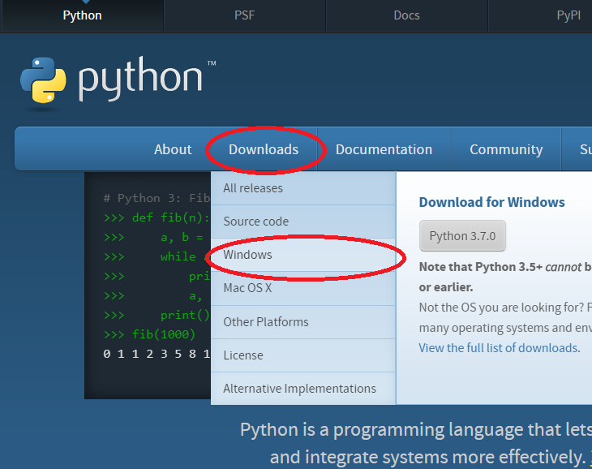

**Downloads** にカーソルを合わせるとプルダウンメニューが表示されるので、 **Windows** を選択します。

.. figure:: images/python2_2.png
   :width: 500px

最新バージョンの **Latest Python 2 Release-Python 2.7.15** をクリックします。

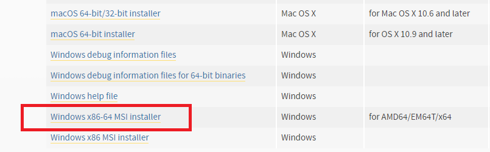

Windows 64bit 用のインストーラをクリックすると、ダウンロードできます。ファイルを実行すると、インストールが開始されますので、表示される指示に従ってください。

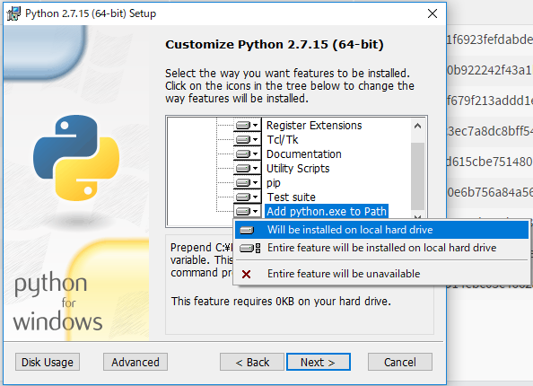
   
途中、図のように表示されたら、**Add python.exe to Path** を **Will be installed on local hard drive** に変更して続けてください。

OpenRTMのインストール
^^^^^^^^^^^^^^^^^^^^^

次に、OpenRTM-aist-1.1.2をインストールします。OpenRTM-aist-1.1.2は、`公式サイト <http://openrtm.org/>`_ よりダウンロード出来ます。なお、このサイトは、セキュリティアップデートのため、臨時に公開されているサイトになります。

Windows 64bit用のインストーラをダウンロードします。

.. figure:: images/openRTM1.png
   :width: 500px

このファイルを実行すると、インストールが開始されます。途中、図のような画面になったら、標準を選択してください。

.. figure:: images/openRTM2.png

.. _build-windows-setenv:

インストールが終了したら、環境変数の確認と設定を行います。以下にWindows10での方法を説明します。

タスクバーの「ここに入力して検索」と表示されているところに **コントロールパネル** と入力し、表示されたコントロールパネルをクリックして開きます。

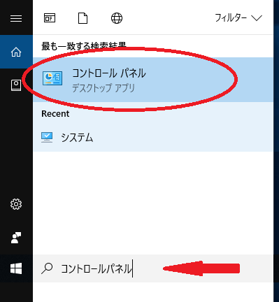

**システムとセキュリティ** - **システム** - **システムの詳細設定** とクリックして、 **システムプロパティ** を開きます。
 
.. figure:: images/windowsSet2.png
   :width: 900px

**環境変数** ボタンを押すと、環境変数が表示されます。下の段のシステム環境変数に、**OMNI_ROOT** , **RTM_BASE** などの変数があることを確認してください。

これらの変数がない場合、Windowsを再起動してください。

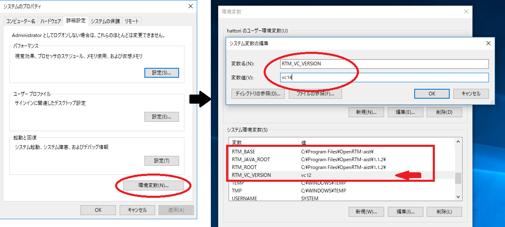

インストール直後は、変数 **RTM_VC_CERSION** がvc12になっていると思います。この欄をダブルクリックすると、編集用ダイアログが開くので **vc14** （VC++2015の意味です。）に変更してください。**OK** ボタンを押して、全てのダイアログを閉じます。

他に、:doc:`../openrtm/install` で説明していることについても適用しておきます。 :ref:`openrtmplugin_patch_for_version112` として、OutPort.h の更新も必ず行ってください。上記方法でOpenRTMをインストールすると、OpenRTMのヘッダファイルは "\\windows\\Program Files\\OpenRTM-aist\\1.1.2\\rtm" といったディレクトリに格納されていますので、ダウンロードした OutPort.h をこのディレクトリにコピーして上書きするようにします。

ビルド設定
^^^^^^^^^^

OpenRTM-aistがインストール出来ましたら、再びCMakeを起動して、Choreonoidのソースとビルドのディレクトリを指定します。 **ENABLE_CORBA** 、**BUILD_CORBA_PLUGIN** 、 **BUILD_OPENRTM_PLUGIN** をオンにして **Configure** を押します。OpenRTMプラグインはCorbaプラグインに依存していますので、これら全てをオンにしておく必要があります。また、 **BUILD_OPENRTM_SAMPLES** をオンにするとRTコンポーネントを用いたシミュレーションのサンプルもビルドされますので、最初はこちらもオンにしてサンプルを試してみてください。

上記のOpenRTM-aistインストーラでインストールした場合、デフォルトでは c:\\Program Files\\OpenRTM-aist\\1.1.2 といったディレクトリにインストールされ、自動で検出されるはずです。OpenRTM-aistが見つからないというエラーが出た場合は、 **OPENRTM_DIR** にOpenRTM-aistをインストールしたディレクトリを設定してください。

Mediaプラグイン
~~~~~~~~~~

メディアファイルの再生を行うプラグインです。CMake上で **BUILD_MEDIA_PLUGIN** をONにしてください。

MPEG-4ファイルなどメディアファイルの形式によっては、再生できないものがありますが、ファイル形式に対応したコーデックパックをインストールすることで、できるようになります。コーデックパックは、ネット上で検索すれば無料のものが、すぐに見つかると思いますが、他の動画ソフトなどに影響を与えるものもあるようなので、ここでは特に指定しません。ご自身のシステムにあったものをご利用ください。

ODEプラグイン
~~~~~~~~

オープンソースーの動力学計算ライブラリである"Open Dynamics Engine (ODE)"を、コレオノイドのシミュレーション機能の計算エンジンとして利用できるよにするプラグインです。

本プラグインをビルドして利用するためには、ODEライブラリのインストールが必要です。ビルド済みのライブラリは公開されていないようなので、ソースからビルドする必要があります。
`Open Dynamics Engine <http://www.ode.org/>`_ のサイトからファイルをダウンロードして展開してください。現在当方でテストを行ったバージョンは0.12になります。（0.13では動作しない不具合が報告されています。）

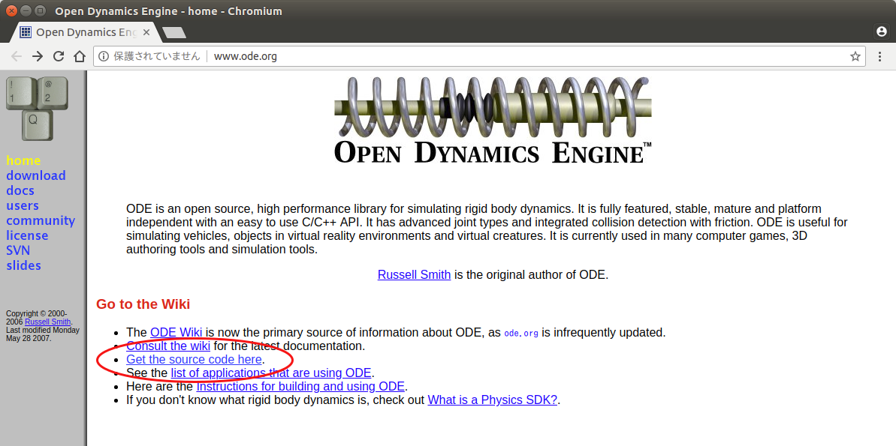

**Get the source code here.** をクリックします。

.. figure:: images/ODEinstall2.png
   :width: 800px

**ODE** - **0.12** と進んで、 **ode-0.12.tar.gz** をクリックすると、ファイルがダウンロードされます。

(tar.gz形式のファイルですので、windowsでは解凍用のソフトが必要です。インストールされていない場合は、 **Lhaplus** など無料で使用できるソフトがありますので、インストールしてください。)

ファイルを展開して、ビルドします。

ODEのビルドにはpremakeというコマンドを使用します。コマンドプロンプトを起動し、展開したディレクトリの下のbuildというディレクトリに移動します。
そこで ::

 premake4.exe --with-libccd --platform=x64 vs2008
 
を実行します。すると、vs2008というディレクトリが作成され、中にode.slnが作成されます。(ode0.12ではvs2008までしかサポートされていないので、2008用のソリューションファイルを作成します。)
VS2015（またはVS2017)を起動して、このファイルを開くと、ソリューションを変換するダイアログが開きます。**OK** ボタンを押して実行してください。

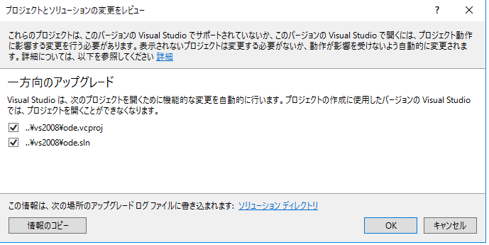

いくつかワーニングが表示されますが、無視しても大丈夫なようです。

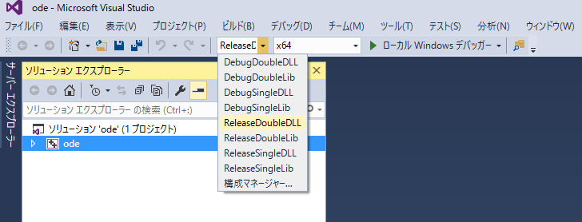
   
変換されたソリューションファイルを用いて、ビルドします。ソリューション構成で **ReleaseDoubleDLL** と **x64** を選択、確認してください。ビルドが成功すると **lib\\ReleaseDoubleDLL** に **ode_double.*** というファイルが作成されます。

後はコレオノイドのビルドに関するCMakeの設定で、 **BUILD_ODE_PLUGIN** という項目を "ON" にし、 **ODE_DIR** にODEのlibの上のディレクトリを指定してください。

Bulletプラグイン
~~~~~~~~~~~

オープンソースの動力学計算ライブラリである"Bullet Physics ライブラリ"を、コレオノイドのシミュレーション機能の計算エンジンとして利用できるようにするプラグインです。

本プラグインをビルドして利用するためには、Bullet Physics ライブラリのソースからのビルドが必要です。
`githubのbulletphysics <https://github.com/bulletphysics/bullet3>`_ からソースが取得できます。当方でテストを行ったバージョンはbullet-2.83.7になります。これ以降のバージョンでは動作確認できていません。

Assimpプラグインのところで説明したのと同様の手順で、ブラウザでページを開いて、バージョンを選択してから、ZIPファイルをダウンロードします。

CMakeが使用できますので、いままでの説明と同様にCMakeを操作し、Visual Studio のプロジェクトファイルを作成します。
以下のオプションはONに切り替えておきます。

* **BUILD_EXTRAS**
* **INSTALL_EXTRA_LIBS**
* **INSTALL_LIBS**
* **USE_DOUBLE_PRECISION**
* **USE_MSVC_RUNTIME_LIBRARY_DLL**

また、以下のオプションはOFFにしておいた方が無難です。

* **BUILD_XXX_DEMOS** のすべて
* **BUILD_BULLET3**
* **BUILD_UNIT_TESTS**

インストール先は  **CMAKE_INSTALL_PREFIX** で設定します。

Visual Studioでのコンパイル、インストール操作も同じように行います。

Bulletのインストールが出来ましたら、再びCMakeを起動し、コレオノイドのビルドに関するCMakeの設定で、 **BUILD_BULLET_PLUGIN** という項目を "ON" にし、**BULLET_DIR** にBulletライブラリのインストール先を指定してください。

Pythonプラグイン
~~~~~~~~~~~
Pythonスクリプトの読み込み・実行や、コレオノイド上で動作するPythonコンソール等の機能を使用するためのプラグインです。

本プラグインをビルドして利用するためには、Pythonのインストールが必要です。動作確認しているバージョンは2.7.15と3.6.3になります。

OpenRTMプラグインを使用している方は、OpenRTMのインストールと同時にバージョン2.7.15のPythonがインストールされています。そのPythonを使用する場合は、CCMakeの設定で **USE_PYTHON3** を"OFF"に設定してください。

Python3を使用したい場合は、Python3をインストールします。

OpenRTMプラグインでの説明と同様に、`Python <http://www.python.org/>`_ のサイトから、Python3のダウンロードページに移動します。 **Windows x86-64 executable installer** をダウンロードし、実行します。

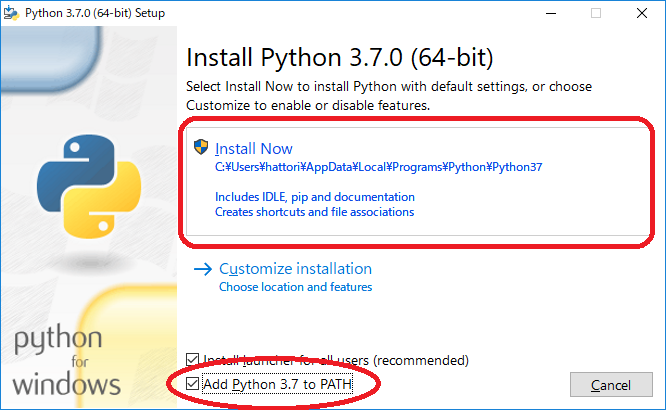

Python2.7をインストールしていない場合は、 **Add Python 3.7 to PATH** にチェックを入れます。Python2.7をインストールしている場合は入れないでください。 **Install Now** をクリックして、インストールします。

次に、**Numpy** をインストールします。

Numpyは、Choreonoidから使用するPythonに対してインストールします。Python2, Python3の片方だけをインストールしている場合は、そこにPATHが通っていますので、コマンドプロンプトを開いて次のコマンドを実行します。 ::

  python -m pip install numpy
 
両方インストールしている場合、Python2にPATHが通っています。Python3にインストールするために、Python3がインストールされているディレクトを指定してコマンドを実行します。コマンドプロンプトを開いて、 ::

  C:\Users\(ユーザ名)\AppData\Local\Programs\Python\Python37\python -m pip install numpy
  
のようにします。C:\\Users\.... はデフォルトのインストール先ですので、必要に応じて変更してください。

インストールが終了したら、再度choreonoid用のCMakeを開き、 **ENABLE_PYTHON** , **BUILD_PYTHON_PLUGIN** , **BUILD_PYTHON_SIM_SCRIPT_PLUGIN** という項目を "ON"にしてください。

.. note:: Python3にPATHが通っていない場合、choreonoidの起動時にPATHを通す必要があります。 ::

              set PATH=(Python3のインストール先);%PATH%
              choreonoid
          
          のように記述したバッチファイルを準備して、これを実行するようにすると簡単かと思います。

プラグインのアンインストール
~~~~~~~~~~~~~~

**BUILD_XXX_PLUGIN** のオプションをオンにしてインストールしたプラグインは、その後オプションをオフにしてインストールしても削除されません。プラグインを追加して動作が不安定になった場合など、プラグインを削除したい場合は、手動でファイルを削除してください。プラグインは(コレオノイドのインストール先)/lib/choreonoid-1.7にCnoid***Plugin.dllとしてインストールされています。
