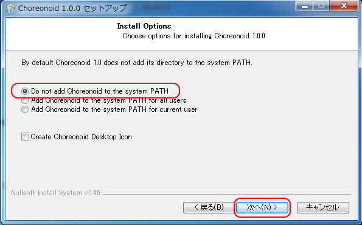

インストーラを用いたインストール (Windows編)
=============================================

インストーラを用いてコレオノイドをWindowsへインストールする方法を解説します。

最初に :doc:`../../download` のページからインストーラをダウンロードして下さい。Choreonoid-x.x.x-win64.exe というファイルがWindows版のインストーラになります。（以下の文中・図中では、バージョン番号は適宜インストール対象のものと置き換えててください。）

.. figure:: images/InstallerIcon.png

このインストーラのアイコンをダブルクリックすると、下図のようにWindows７では、ユーザアカウント制御のアラートが現れますので、 :guilabel:`[はい(Y)]` をクリックして下さい。

.. figure:: images/Install1.png

次に、コレオノイドのセットアップウィザードが起動しますので、 :guilabel:`[次へ(N)]` をクリックします。

.. figure:: images/Install2.png

すると、下図のようにコレオノイドとコレオノイドで使用しているライブラリのライセンス条件が表示されます。
同意いただける場合には、 :guilabel:`[同意する(A)]` をクリックして下さい。
それ以外であればインストーラは終了し、コレオノイドはインストールされません。

.. figure:: images/Install3.png

すべてのライセンスに同意して頂けた場合には、次のようにインストールオプションの選択画面になります。
通常はそのまま :guilabel:`[次へ(N)]` を押下するだけでよいと思います。

次に、コレオノイドをインストールするフォルダ指定の画面に移ります。
通常、デフォルトのままで問題ないと思いますが、別のフォルダにインストールしたい場合にはここで指定して下さい。
インストール先のフォルダの選択が終了したら、 :guilabel:`[次へ(N)]` をクリックします。

.. figure:: images/Install5.png

次に、スタートメニューのフォルダ指定の画面に移ります。
ここは、特に変更しなくても大丈夫だと思いますが、お好みにあわせてスタートメニューのフォルダ等を指定します。
ここまでの作業が終われば :guilabel:`[インストール]` をクリックすればインストールが開始されます。

.. figure:: images/Install6.png

すべてインストールが終了すると下記の画面が表示されますので、 :guilabel:`[完了(N)]` をクリックしコレオノイドのインストールはすべて終了です。

.. figure:: images/Install8.png

コレオノイドを起動する場合には、スタートメニューから選択することができます。
以上で、コレオノイドのWindowsへのインストールは終了です。

デスクトップアイコンやスタートメニューから、コレオノイドを起動することができます。また、インストーラでインストールすると、自動でコレオノイドのプロジェクトファイル(拡張子 .cnoid)との関連付けが行われます。この場合、エクスプローラ上でプロジェクトファイルをダブルクリックすることで、コレオノイドの起動とプロジェクトの読み込みを同時に行うことができます。

