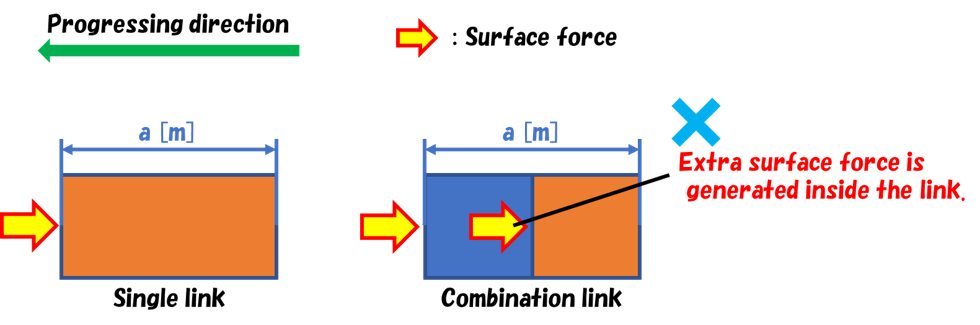
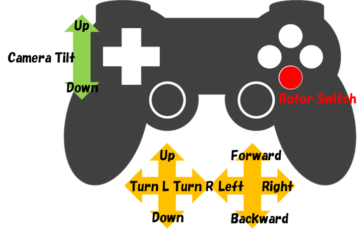

マルチコプタシミュレーションプラグイン
======================================
マルチコプタシミュレーションプラグインは、空中を飛行するマルチコプタの挙動を簡易的にシミュレーションすることができます。
本プラグインは主に、以下の2つの機能で構成されています。

1. マルチコプタに搭載されるロータデバイスを模擬する機能
2. マルチコプタが飛行時に受ける空気の影響（浮力、付加質量、付加慣性モーメント、表面力）を模擬する機能

ここでは、

* マルチコプタシミュレーションプラグインの導入
* Bodyモデルの設定
* MulticopterSimulatorItemの設定

について説明します。

マルチコプタシミュレーションプラグインの導入
------------------------------------------------------
Choreonoidをソースコードからビルドしている場合は、ビルド時のCMakeの設定で、以下のオプションをONにするようにしてください。

* BUILD_MULTICOPTER_PLUGIN

Bodyモデルの設定
--------------------
マルチコプタシミュレーションを行うには、Bodyモデルに以下の設定を追記します。

* MulticopterTargetBody
* MulticopterTargetLink
* RotorDevice

サンプルモデルがchoreonoid/share/model/Multicopter/にあります。各設定の記述方法はそちらを参考にしてください。

MulticopterTargetBodyの設定
^^^^^^^^^^^^^^^^^^^^^^^^^^^
MulticopterTargetBodyは、これを記述しているBodyモデルがマルチコプタシミュレーションの対象Bodyモデルであることを表すノードです。
本ノードを記述することで、対象Bodyモデルに記述したMulticopterTargetLinkノードおよびRotorDeviceノードが有効となります。

MulticopterTargetBodyの記述例） ::

 format: ChoreonoidBody
 formatVersion: 1.0
 angleUnit: degree
 name: Multicopter
 
 MultiCopterTargetBody:
 　　cutoffDistance: -1
 　　normMiddleValue: -1

以下はMulticopterTargetBodyノードの定義です。

.. csv-table:: MulticopterTargetBody
    :header: "キー", "単位", "内容"
    :widths: 16, 16, 64

    "cutoffDistance", "[m]", "”カットオフ処理に用いる距離を指定します。-1を指定した場合、カットオフ処理は実行されません。"
    "normMiddleValue", "[-]", "カットオフ処理に用いる中央値を指定します。-1を指定した場合、カットオフ処理は実行されません。"

子項目のcutoffDistanceとnormMiddleValueは、Bodyモデルのリンク毎に与えられる表面力が重複しないようにするためパラメータです。
表面力は、マルチコプタのボディが空気と接触しているときに空気とマルチコプタのボディの間に作用する摩擦力と、マルチコプタのボディ表面に作用する圧力を考慮したもので、
本プラグインではこの表面力をリンク表面毎に計算しており、下図（左）のようにBodyモデルが単一のリンクで構成されている場合、1つの表面力が与えられますが、例えば下図（右）のように任意のBodyモデルが2つのリンクが連結（内包を含む）するようにして構成されている場合、それぞれのリンクに対して表面力が与えられるため、Bodyモデルの内部にも表面力が発生してしまいます。

そこで本プラグインでは、リンク同士の表面間距離を参考に、リンク表面が他のリンク表面に近接・内包されている場合は、表面力は対象のリンクに与えないようにする処理（この処理をカットオフ処理と呼んでいます）をしています。当該処理では、リンク表面間の距離がcutoffDistance[m]で指定した値より小さい場合は、割合的に表面力を与えます。normMiddleValueは、リンク表面間の距離がcutoffDistance以下のときにリンクに与える表面力の割合を決定するためのパラメータで0〜1の値を設定するものとしています。通常は、0.5を設定してください。これによって、リンク表面間の距離に応じて表面力が割合的に決定されます。

しかしながら、これらの処理は複雑な構成のBodyモデルを使用する場合を考慮して組み込んだものであるため、通常は設定する必要はありません。その場合は、cutoffDistanceおよびnormMiddleValueに-1を指定して当該処理を実行しないように設定してください。

MulticopterTargetLinkの設定
^^^^^^^^^^^^^^^^^^^^^^^^^^^
MulticopterTargetLinkは、これを記述しているリンクがマルチコプタシミュレーションの対象リンクであることを表すノードです。
本ノードを記述したリンクは、シミュレーション実行中に浮力、付加質量、付加慣性モーメント、表面力を計算し、外力として与えられます。なお、本ノードを記述しない場合は、
計算されません。

MulticopterTargetLinkの記述例） ::

 MultiCopterTargetLink:
   applyForce: [ true, true, true, true ] 
   density: 250
   centerOfBuoyancy: [ 0.0, 0.0, 0.0 ]
   additionalMassCoef: 0.1
   additionalInertiaMatrix: [
     0.00041, 0, 0,
     0, 0.00041, 0,
     0, 0, 0.00066 ]

以下はMulticopterTargetLinkノードの定義です。

.. csv-table:: MulticopterTargetLink
    :header: "キー", "単位", "内容"
    :widths: 16, 16, 64

    "applyForce", "[-]", "浮力、付加質量、付加慣性モーメント、表面力の有効／無効をtrue/falseで指定します。本パラメータは省略することができますが、省略した場合は、浮力、付加質量、付加慣性モーメント、表面力全てがtrueに設定されます。"
    "density", "[kg/m^3]", "リンクの密度を指定します。"
    "centerOfBuoyancy", "[m, m, m]", "浮心をリンクのローカル座標系で指定します。本パラメータは省略することができますが、省略した場合は、リンクの重心に浮力が与えられるようになります。"
    "additionalMassCoef", "[-]", "付加質量係数を指定します。"
    "additionalInertiaMatrix", "[-]", "付加慣性モーメントの行列を指定します。"

RotorDeviceの設定
-----------------
RotorDeviceノードは、ロータデバイスを定義します。
RotorDeviceノードも他のデバイスと同様に、Bodyモデルを構成するリンク毎に搭載することができ、
リンクのelements以下にその定義を記述することで利用することができます。

RotorDeviceの記述例） ::

 elements:
   -
     type: RotorDevice
     name: droneRotor1
     position: [ 0, 0, 0 ]
     direction: [ 0, 0, 1 ]
     valueRange: [ -10, 10 ]
     torqueRange: [ -10, 10 ]
     effectParameter:
       wallDistance: 1.0
       wallNormMiddleValue: 0.5
       wallMaxRate: 0.5
       groundDistance: 1.0
       groundNormMiddleValue: 0.5
       groundMaxRate: 0.5

以下はRotorDeviceノードの定義です。

.. csv-table:: RotorDevice
    :header: "キー", "内容"
    :widths: 16, 64

    "type", "”RotorDevice”を指定します。"
    "name", "任意のロータデバイス名を指定します。"
    "position", "ロータデバイスの推進力[N]の作用点をリンク原点に対して指定します。[0,0,0]を指定した場合は、リンクの原点に推進力が作用します。"
    "direction", "ロータデバイスの推進力[N]の向きを指定します。[0,0,1]を指定した場合は、ローカル座標系でZ軸方向上向きに推進力が作用します。"
    "valueRange", "ロータデバイスの推進力[N]の最小値と最大値を指定します。"
    "torqueRange", "ロータデバイスによる反トルク[Nm]の最小値と最大値を指定します。"
    "effectParameter", "本タグはマルチコプタが天井・床や壁に接近した際に生じると考えられる、吸い付く、引き寄せられるといった影響を模擬する際に設定するものです。本タグが設定されない場合は、当該模擬の処理を行わないため、以下のwallDistance、wallNormMiddleValue、wallMaxRate、groundDistance、groundNormMiddleValue、groundMaxRateの設定は不要です。"
    "wallDistance", "本パラメータ以下の距離[m]にBodyモデルが壁モデルに接近すると、壁モデルの方向に引き寄せられるようにロータデバイスに水平方向の力が与えられます。"
    "wallNormMiddleValue", "wallDistance以下にBodyモデルが壁モデルに接近したときの水平方向の力の与え方を決定するパラメータです。通常は、0.5を設定してください。これによって、距離に応じてロータデバイスに与えられる水平方向の力が割合的に決定されます。"
    "wallMaxRate", "ロータデバイスに与えられる水平方向の力の比率を指定します。1.0のとき、ロータデバイスに与えられる水平方向の力はロータデバイスの出力と等しくなり、0.5のときはロータデバイスの出力の半分になります。"
    "groundDistance", "本パラメータ以下の距離[m]にBodyモデルが天井・床モデルに接近すると、天井モデルに対しては天井モデルの方向に引き寄せられるように、床モデルに対しては床モデルから遠ざけられるようにRotorデバイスに鉛直方向の力が与えられます。"
    "groundNormMiddleValue", "groundDistance以下にBodyモデルが天井・床モデルに接近したときの鉛直方向の力の与え方を決定するパラメータです。通常は、0.5を設定してください。これによって、距離に応じてロータデバイスに与えられる鉛直方向の力が割合的に決定されます。"
    "groundMaxRate", "ロータデバイスに与えられる鉛直方向の力の比率を指定します。1.0のとき、ロータデバイスに与えられる鉛直方向の力はロータデバイスの出力と等しくなり、0.5のときはロータデバイスの出力の半分になります。"

RotorDeviceの入出力
-------------------
Bodyモデルに設定したRotorDeviceへの入出力を行うには、コントローラのプログラムに以下のヘッダをインクルードしてください。 ::

 #include <cnoid/RotorDevice>

また、RotorDeviceノードは、名前空間“Multicopter”に定義されているため、 ::

 using namespace Multicopter;

としておくと便利です。

次に、個々のRotorDeviceクラスのポインタを作成します。 ::

 RotorDevice* rotordevice;

次に、作成したポインタにBodyモデルに設定したRotorDeviceのポインタを格納します。以下の例では、BodyクラスのfindDeviceメソッドを使用して、“RotorDevice1”のポインタを格納しています。 ::

 rotordevice = io->body()->findDevice<RotorDevice>("RotorDevice1");

次に、ロータデバイスに推力とトルクを入力します。以下の例は、推力1.0[N]、トルク1.0[Nm]を入力しています。 ::

 rotordevice->setValue(1.0);
 rotordevice->setTorque(1.0);

最後に、 ::

 rotordevice->notifyStateChange();

を実行することで、入力した推力とトルクがシミュレーションに反映されます。

MulticopterSimulatorItemの設定
------------------------------
マルチコプタシミュレーションでは、MulticopterSimulatorItemを使用します。
メインメニューの「ファイル」-「新規」から「MulticopterSimulator」を選択し、MulticopterSimulatorItemを生成してください。デフォルトの名前は”MulticopterSimulator”となります。これをアイテムツリービュー上でシミュレータアイテムの子アイテムとして1つ配置してください。なお、マルチコプタシミュレーションはAISTシミュレータ、AGXシミュレータにのみに対応しています。

MulticopterSimulatorItemの設定例） ::

 [ ] - World
 [/]   + Multicopter
 [/]   + floor
 [ ]   + AISTSimulator
 [ ]     + MulticopterSimulatorItem

MulticopterSimulatorの設定項目
^^^^^^^^^^^^^^^^^^^^^^^^^^^^^^
マルチコプタシミュレーションを行うには、MulticopterSimulatorItemのプロパティの設定が必要です。各プロパティの内容を以下に示します。

.. csv-table::
    :header: "プロパティ", "単位", "意味"
    :widths: 16, 16, 64

    "Fluid Density", "[kg/m^3]", "空気の密度を指定します。"
    "Viscosity", "[Pa*s]", "空気の粘性を指定します。"
    "Fluid Velocity", "[m/s, m/s, m/s]", "シミュレーション空間内の定常流速(x, y, z)を指定します。"
    "Air Definition File", "[-]", "シミュレーション空間内に領域を指定して部分的に空気の密度、空気の粘性、定常流速を与える定義ファイル(AirDefinitionFile)を指定します。当該ファイルで指定した領域外は“Fluid Velocity”で設定した定常流速が与えられます。"
    "Wall Effect", "[-]", "壁に引き寄せられる効果の有効／無効を指定します。"
    "Ground Effect", "[-]", "地面効果の有効／無効を指定します。"
    "Output Parameter", "[-]", "パラメータ（位置、速度、加速度、外力）のMulticopterMonitorビューへの出力の有効／無効を指定します。"
    "Output Time Step", "[s]", "パラメータをMulticopterMonitorビューに出力する時間間隔を指定します。"

AirDefinitionFileの概要
^^^^^^^^^^^^^^^^^^^^^^^^^^^
マルチコプタシミュレーションでは、MulticopterSimulatorItemのプロパティでAirDefinitionFileを指定することで、シミュレーション空間内の任意の領域に空気の密度、空気の粘性、定常流速を与えることができます。以下の例のAirDefinitionFileでは、X方向に1[m/s]の定常流速を与えます。 ::

 AirEnvironment,1.0.0
 X,-7.5,15,1
 Y,-7.5,15,1
 Z,0,5,1
 "Index(X,Y,Z)",Density,Velocity(X),Velocity(Y),Velocity(Z),Viscosity
 "0,0,0",1.293,1,0,0,0.000017
 "1,0,0",1.293,1,0,0,0.000017
 "0,1,0",1.293,1,0,0,0.000017
 "1,1,0",1.293,1,0,0,0.000017
 "0,0,1",1.293,1,0,0,0.000017
 "1,0,1",1.293,1,0,0,0.000017
 "0,1,1",1.293,1,0,0,0.000017
 "1,1,1",1.293,1,0,0,0.000017

.. csv-table:: AirDefinitionFile
    :header: "キー", "内容"
    :widths: 16, 64

    "AirEnvironment", "ファイルのバージョンを示しています。通常、本項目の編集は必要ありません。"
    "X, Y, Z", "指定する領域の各軸方向の設定です。左から順に「グローバル座標系での基準座標[m]」、「計算格子の間隔[m]」、「計算格子の数[個]」を示しています。例では、グローバル座標(-7.5,-7.5,0)を基準点としてX方向に15[m]、Y方向に15[m]、Z方向に5[m]の空間を定義しています。"
    "Index", "計算格子の座標のインデックスです。インデックスに計算格子の間隔を掛けたものを基準点に加えたものがインデックスが指している計算格子点のグローバル座標になります。以上の例の場合では、インデックス[0,0,0]は(-7.5,-7.5,0)、インデックス[0,0,1]は(-7.5,-7.5,5)のグローバル座標での計算格子点を指しています。"
    "Density", "計算格子点に与える密度[kg/m^3]を設定します。"
    "Velocity", "計算格子点に与える速度[m/s]を設定します。"
    "Viscosity", "計算格子点に与える粘性[Pa*s]を設定します。"

サンプルの導入
^^^^^^^^^^^^^^
MulticopterPluginを利用したサンプルプロジェクトがchoreonoid/samples/MulticopterRTMにあります。実行して試してみてください。
なお、本サンプルでは、OpenRTMを使用してRotorDeviceへの入力を行っているため、Choreonoidをソースコードからビルドしている場合は、ビルド時のCMakeの設定で、以下のオプションをONにするようにしてください。

* BUILD_CORBA_PLUGIN
* BUILD_MULTICOPTER_RTM
* BUILD_OPENRTM_PLUGIN
* BUILD_OPENRTM_SAMPLES
* BUILD_VISION_SENSOR_RTM_SAMPLE
* ENABLE_CORBA

本サンプルのマルチコプタの動作は、PS4のDUAL SHOCK4を使用して操縦する場合、
次のとおりに設定されています。

