OpoenRTMプラグインの詳細
=======================

OpenRTMプラグインの全体構成を以下に示します。

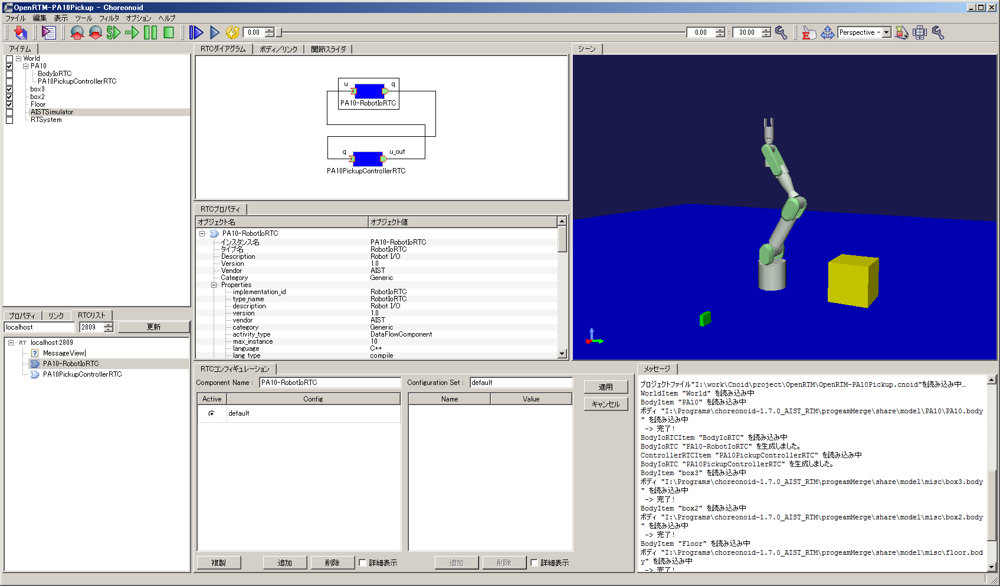

OpenRTMプラグインは、以下のビューから構成されています。

* RTCリスト
 指定したネームサービスに登録されているRTCをツリー表示するためのビューです。OpenRTM-aistではRTCを管理・公開するためにネームサービスが使用されています。RTCリストは、RTシステムを構築する際に使用可能なRTCの一覧をツリー表示します。

* RTCダイアグラム
 RTシステムを構築するためのビューです。RTシステムで使用するRTCや各RTCが持つポート情報を確認/編集したり、ポート間の接続関係を確認/編集するために使用します。

* RTCコンフィギュレーション
 RTCのコンフィギュレーション情報を確認/編集するためのビューです。RTCの｢コンフィギュレーション情報｣とは、各RTCがコアロジック内部で使用しているパラメータの事です。本ビューを用いることで、ユーザがコンフィギュレーション情報を変更することができます。

* RTプロパティ
 RTCの詳細情報や、RTCダイアグラムで設定したポート間の接続情報を表示するためのビューです。

各ビューを開く際には、画面上部のツールバーから｢表示｣-｢ビューの表示｣を選択してください。また、ビューの操作方法の詳細については、 :doc:`../basics/mainwindow` の｢ビュー｣の部分を参照してください。

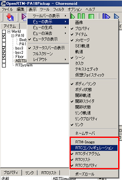

RTCリスト
----------------------------

OpenRTM-aistではRTCを管理・公開するためにネームサービスが使用されています。RTCリストは、指定したネームサービスに登録されているRTCをツリー形式で表示するためのビューです。本ビューに表示されたRTCを使用して、RTシステムの構築を行います。

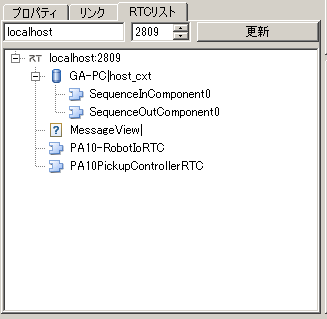

.. note:: OpenRTMプラグインを組み込んだ状態でChoreonoidを起動すると、ネームサービスが自動的にデフォルト設定(IPアドレス:localhost、ポート番号:2809)で起動されます。このため、ネームサービスを明示的に起動する必要はありません。

ネームサーバへの接続
,,,,,,,,,,,,,,,,,,,,,,,
| ネームサーバーに接続するには、RTCリスト上部の｢Add｣ボタンをクリックします。そして、｢ネームサーバ接続ダイアログ｣で、接続対象のネームサーバのIPアドレスおよびポート番号を設定します。
| ｢OpenRTMで設定されているネームサーバ｣のチェックボックスをONにすると、Choreonoidが使用しているOpenRTMのManagerに設定されている情報を使用してネームサーバ(デフォルト・ネームサーバ)への接続を行います。デフォルト・ネームサーバは，RTCリスト内では｢Default｣という接頭語付きで表示されます。

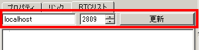

指定したネームサーバにコンポーネントが登録されていると、登録内容がツリー形式で表示されます。各アイコンの意味は以下の通りです。

.. .. tabularcolumns:: |p{3.5cm}|p{11.5cm}|

.. list-table::
  :widths: 8,15,75
  :header-rows: 1

  * - アイコン
    - 種類(KIND)
    - 詳細
  * - .. image:: images/View/Server.png
    - host_cxt
    - ホストコンテキスト
  * - .. image:: images/View/ManagerNamingContext.png
    - mgr_cxt
    - マネージャコンテキスト
  * - .. image:: images/View/CategoryNamingContext.png
    - cate_cxt
    - カテゴリコンテキスト
  * - .. image:: images/View/ModuleNamingContext.png
    - mod_cxt
    - モジュールコンテキスト
  * - .. image:: images/View/Folder.png
    - 上記以外
    - フォルダ(上記以外にコンテキスト)
  * - .. image:: images/View/NSRTC.png
    - なし
    - RTコンポーネント
  * - .. image:: images/View/Question.png
    - なし
    - オブジェクト(RTコンポーネント以外のオブジェクト)
  * - .. image:: images/View/NSZombi.png
    - なし
    - ネームサーバーにエントリされてはいるが、実体のオブジェクトにアクセスできないゾンビオブジェクト

| RTCリストがActiveとなっていない状態で、プロジェクトの読込を行った場合などに、以下のようにネームサーバの表示がDeactiveとなる場合があります。このような表示となったネームサーバは、登録内容の取得に失敗していますので後述の｢更新｣処理を行ってみてください。

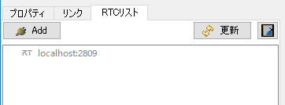

ネームサーバの情報更新
,,,,,,,,,,,,,,,,,,,,,,,
| ネームサーバーに接続した後に、新規RTCを起動した場合など、RTCリストの内容を更新したい場合には｢更新｣ボタンをクリックしてください。ツリーの内容が最新の情報に更新されます。なお、更新処理実行中は「更新」ボタンが｢更新キャンセル｣ボタンに変化します。更新処理を途中で中断したい場合には、この｢更新キャンセル｣ボタンをクリックしてください。
| RTCリストのツリー中に存在するゾンビ・オブジェクトを削除したい場合には、右端の｢ゾンビクリア｣ボタンをクリックしてください。ツリー中の各要素に対して生存確認を行い、応答がない要素はツリーから削除します。

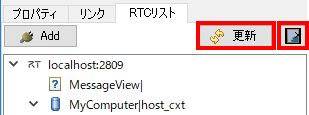

ネームサービスへのエントリ/オブジェクトの追加，削除
,,,,,,,,,,,,,,,,,,,,,,,

| RTCリストでは、ネームサービスにネーミングオブジェクトやオブジェクトのエントリを追加、削除することができます。
| ネーミングオブジェクトを追加する場合には、追加元のエントリを選択し、コンテキストメニューから｢コンテキストを追加｣を選択してください。そして、表示された設定画面で、追加対象コンテキストの｢名前｣｢種類｣を設定してください。

.. note::  コンテキストの追加は、ホストコンテキスト、マネージャコンテキスト、カテゴリコンテキスト、モジュールコンテキスト、その他のコンテキストに対して行うことができます。また、各コンテキストは｢名称｣+｢種類｣で識別されています。このため、あるコンテキストの直下に｢名称｣｢種類｣が重複するコンテキストを追加することはできません。

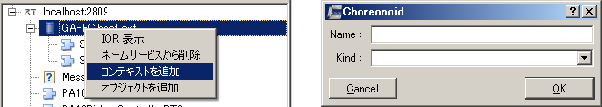

| オブジェクトを登録する場合には、追加元のエントリを選択し、コンテキストメニューから｢オブジェクトを追加｣を選択してください。
| そして、表示された設定画面で、追加対象オブジェクトの｢名前｣｢種類｣｢IOR｣を設定してください。
.. note::  オブジェクトの追加は、ホストコンテキスト、マネージャコンテキスト、カテゴリコンテキスト、モジュールコンテキスト、その他のコンテキストに対して行うことができます。

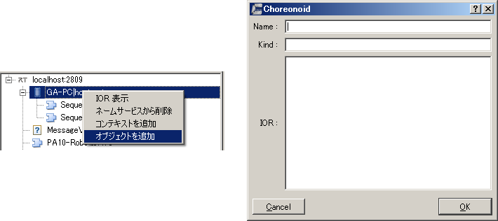

| また、コンテキストメニューの｢IOR表示｣を選択することで、対象エントリのIORを確認することができます。

.. image:: images/View/ShowIOR.png

| RTCリストに表示されているネームサーバ、エントリもしくはオブジェクトを削除したい場合には、削除対象の要素を選択し、コンテキストメニューから｢ネームサービスから削除｣を選択してください。

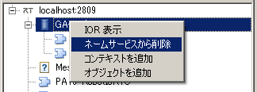

RTCの状態変更
,,,,,,,,,,,,,,,,,,,,,,,

| RTCリストでは、登録されているRTCの状態を変更することができます。操作対象のRTCを選択し、コンテキストメニューから実行する操作を選択してください。

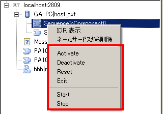

| 各アクションの意味は以下の通りです。

.. .. tabularcolumns:: |p{3.5cm}|p{11.5cm}|

.. list-table::
  :widths: 15,75
  :header-rows: 1

  * - アクション名
    - 詳細
  * - Activate
    - 対象RTCを活性化する。RTCの状態がDeactiveの場合のみ実行可能。
  * - Deactivate
    - 対象RTCを非活性化する。RTCの状態がActiveの場合のみ実行可能。
  * - Reset
    - 対象RTCをエラー状態からリセットする。RTCの状態がErrorの場合のみ実行可能。
  * - Exist
    - 対象RTCを停止し、終了する。
  * - Start
    - 対象RTCの実行コンテキスト(EcecutionContext:EC)の動作を開始する。ECが停止している場合のみ実行可能。
  * - Stop
    - 対象RTCの実行コンテキスト(EcecutionContext:EC)の動作を停止する。ECが起動している場合のみ実行可能。

RTCダイアグラム
----------------------------

| RTシステムを構築するためのビューです。対象システムを構築するRTCを、RTCリストからドラッグ＆ドロップで配置してRTシステムの構築を行います。
| 本ビューでは、RTCとそのポートが模式的な図形で表示されるとともに、それらの状態がリアルタイムで表示されます。また、ポート間の接続状況がポート間を結ぶ線として表示されます。
| 本ビュー上でRTシステムを構築するためには、まずRTシステムアイテムを生成しておく必要があります。

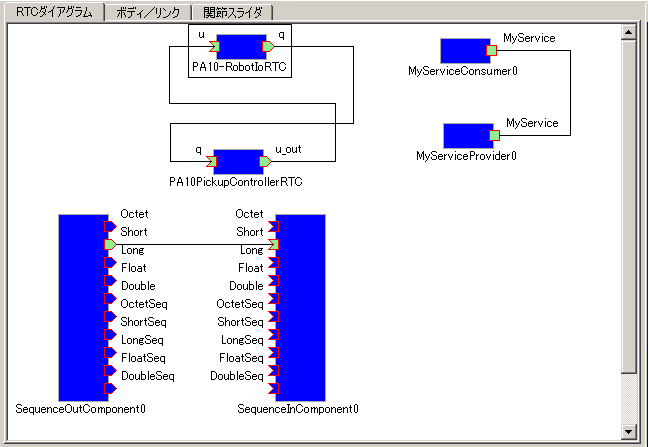

RTCの追加、削除
,,,,,,,,,,,,,,,,,,,,,,,

RTシステムを構築するRTCを追加するには、対象RTCをRTCリストからRTCダイアグラムへドラッグ＆ドロップします。

.. note:: 同一RTCを複数回配置することはできません。ただし、RTCリスト上で同一IORを持つRTCを別パスとして登録している場合は、それぞれのRTCを追加することができます(同一RTCであるかどうかは、IORではなくRTCリスト上のフルパスで判断しています)。

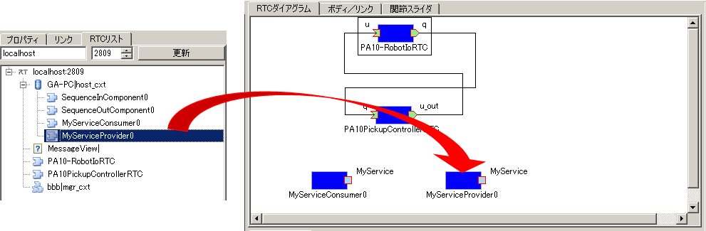

| RTCダイアグラムに配置されたRTCは矩形で表示されます。また各RTCに定義されているポートは、その矩形の周りに表示されます。
| RTC本体および各ポートの状態は色で表現されます。RTCダイアグラム上でのアイコンおよび色の意味を以下に示します。

.. image:: images/View/RTC_Desc.png

| 配置したRTCの場所を移動したい場合には、対象RTCを選択し、マウスでドラッグしてください。任意の位置に移動させることができます。
| RTCダイアグラムは、各RTCの状態を指定された周期で監視(ポーリング)し、リアルタイムに状態を表示します。監視を行う周期は、設定画面の｢ポーリング周期｣で設定することができます。
|
| RTCダイアグラムから、RTCを削除する場合には、対象RTCを選択した状態で｢Delete｣キーを押下するか、コンテキストメニューから｢Remove｣を選択してください。

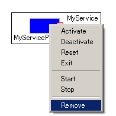

RTシステムの状態更新
,,,,,,,,,,,,,,,,,,,,,,,
| RTシステムアイテムの｢状態検知方法｣が｢Polling｣に設定されている場合は、RTCダイアグラム上の各要素の状態は、設定されたポーリング周期毎に自動で更新されます。
| 一方､RTシステムアイテムの｢状態検知方法｣が｢Manual｣に設定されている場合に、RTCダイアグラム上の各要素の状態を更新したい場合には､RTCダイアグラムの背景を右クリックし､表示されたメニューから｢状態更新｣を選択してください。

.. image:: images/View/Update_Status.png

RTCの状態を変更
,,,,,,,,,,,,,,,,,,,,,,,

RTCダイアグラムでは、配置されているRTCの状態を変更することができます。操作対象のRTCを選択し、コンテキストメニューから実行する操作を選択してください。

.. image:: images/View/RTC_ActionD.png

| 各アクションの意味は以下の通りです。

.. .. tabularcolumns:: |p{3.5cm}|p{11.5cm}|

.. list-table::
  :widths: 15,75
  :header-rows: 1

  * - アクション名
    - 詳細
  * - Activate
    - 対象RTCを活性化する。RTCの状態がDeactiveの場合のみ実行可能。
  * - Deactivate
    - 対象RTCを非活性化する。RTCの状態がActiveの場合のみ実行可能。
  * - Reset
    - 対象RTCをエラー状態からリセットする。RTCの状態がErrorの場合のみ実行可能。
  * - Start
    - 対象RTCの実行コンテキスト(EcecutionContext:EC)の動作を開始する。ECが停止している場合のみ実行可能。
  * - Stop
    - 対象RTCの実行コンテキスト(EcecutionContext:EC)の動作を停止する。ECが起動している場合のみ実行可能。

.. note:: RTシステムアイテム配下のRTCは、シミュレーション開始時に自動的に活性化され、終了時に自動的に非活性化されます。

ポート間の接続、切断
,,,,,,,,,,,,,,,,,,,,,,,

| RTCのポート間を接続するには、接続対象のポート間でドラッグ＆ドロップを行います。
| 接続元のポートからドラッグを開始すると、配置されたRTC内で接続可能なポートの枠線の色が変化します。
| 接続先のポートが接続できないポートの場合、マウスを持っていった際にアイコンが禁止マークに変化し、ドラッグ＆ドロップを行うことができなくなります。

.. note:: ポートの接続可否判断では、次のチェックを行います。｢接続対象ポートの種類(データポート、サービスポート)が同一か？｣接続対象がデータポートの場合は、更に次のチェックを行います。｢接続対象のポートの向き(in/out)が逆になっているか？｣｢接続対象のポートに設定されている｢データ型｣｢インターフェースタイプ｣｢サブスクリプションタイプ｣に共通の要素が存在するか？｣

.. image:: images/View/Connect_Port.png

|
| 接続可能なDataPort間でドラッグ＆ドロップを行うと、以下のダイアログが表示されます。

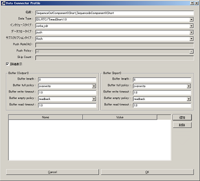

各設定項目の意味は以下の通りです。

.. .. tabularcolumns:: |p{3.5cm}|p{11.5cm}|

.. list-table::
  :widths: 25,75
  :header-rows: 1

  * - 項目名
    - 詳細
  * - 名前
    - コネクションの名称です。任意の名前を設定することができます。
  * - Data Type
    - ポート間で送受信するデータの型。接続対象のポートで定義されている内容から選択。
  * - インタフェースタイプ
    - データを送受信するポートの型。接続対象のポートで定義されている内容から選択。
  * - データフロータイプ
    - データの送受信方法。
  * - サブスクリプションタイプ
    - | データの送信タイミング。以下から選択。データフロータイプが｢Push｣の場合のみ有効。
      |   New : バッファ内に新規データが格納されたタイミングで送信
      |   Periodic : 一定周期で定期的にデータを送信
      |   Flush : バッファを介さず即座に送信
  * - Push Rate
    - データ送信周期(単位:Hz)。サブスクリプションタイプが｢Periodic｣の場合のみ有効
  * - Push Policy
    - | データ送信ポリシー。以下から選択。サブスクリプションタイプが｢New｣｢Periodic｣の場合のみ有効
      |   all : バッファ内のデータを一括送信
      |   fifo : バッファ内のデータをFIFOで１個づつ送信
      |   skip : バッファ内のデータを間引いて送信
      |   new : バッファ内のデータの最新値を送信(未送信の古いデータは捨てられる)
  * - Skip Count
    - 送信データスキップ数。Push Policyが｢Skip｣の場合のみ有効
  * - Buffer length
    - バッファの大きさ
  * - Buffer full policy
    - | データ書き込み時に、バッファがフルだった場合の処理。以下から選択。
      |   overwrite : 上書き
      |   block : 書き込みをブロック
      |   do_nothing : なにもしない
  * - Buffer write timeout
    - データ書き込み時に、タイムアウトイベントを発生させるまでの時間(単位:秒)。｢0.0｣を設定した場合には、タイムアウトは発生しない。
  * - Buffer empty policy
    - | データ読み出し時に、バッファが空だった場合の処理。以下から選択。
      |   readback : 最後の要素を再読み出し
      |   block : 読み出しをブロック
      |   do_nothing : なにもしない
  * - Buffer read timeout
    - データ読み出し時に、タイムアウトイベントを発生させるまでの時間(単位:秒)。｢0.0｣を設定した場合には、タイムアウトは発生しない。

上記で規定された項目以外を接続プロファイルに設定したい場合には、画面下部の一覧表を使用することで、任意のプロパティを設定する事が可能です。

.. note:: ｢Data Type｣｢インターフェースタイプ｣｢データフロータイプ｣｢サブスクリプションタイプ｣は、接続対象ポートのPortPrfileを取得し、接続先ポート/接続元ポートで一致した項目のみが表示されます。PortProfileの情報は、RTCを作成する際に定義する情報であるため、実行時に項目を追加する事はできません。もしも、希望する項目が表示されない場会には、対象RTCの定義内容を確認してください。

.. note:: Buffer Policyを｢block｣に設定し、timeout時間が指定されている場合、指定された時間分読み出し/書き込みが不可能な場合にタイムアウトが発生します。

| 接続可能なServicePort間でドラッグ＆ドロップを行うと、以下のダイアログが表示されます。

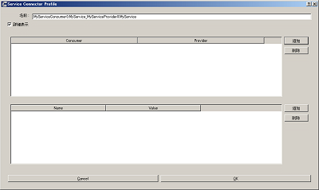

| ｢名前｣の部分には、コネクションの名称を指定します。任意の名前を設定することができます。
| ServicePortを接続する場合、各ポートに定義されているサービスインターフェースのうち、対応するものが自動的に接続されます。しかし、中段の一覧表を使用することで、ユーザが接続するサービスインターフェースを明示的に指定する事も可能です。｢追加｣ボタンをクリックすると、それぞれのサービスポートで定義されているサービスインターフェースがドロップダウン表示されますので、接続対象のサービスインターフェースを選択してください。
| ユーザ固有の接続情報を接続プロファイルに設定したい場合には、画面下部の一覧表を使用してください。ユーザが定義した任意のプロパティを設定する事が可能です。
|
|
| 表示された接続線の位置を移動したい場合には、接続線上に表示される黒点をドラッグして移動してください。マウスの動きに応じて、縦線は横方向に、横線は縦方向に移動することができます。

.. image:: images/View/Move_Line.png

| ポート間の接続を解除したい場合には、接続線を選択して｢Delete｣ボタンを押下するか、コンテキストメニュー中の｢Delete｣を選択してください。

.. image:: images/View/Delete_Connection.png

RTCコンフィギュレーション
----------------------------

RTCのコンフィギュレーション情報を表示/編集するためのビューです。RTCリストやRTCダイアグラムで選択したRTCの情報を表示します。画面左側ではConfigurationSetのリストが、右側ではConfigurationSet内のプロパティをそれぞれ表示します。

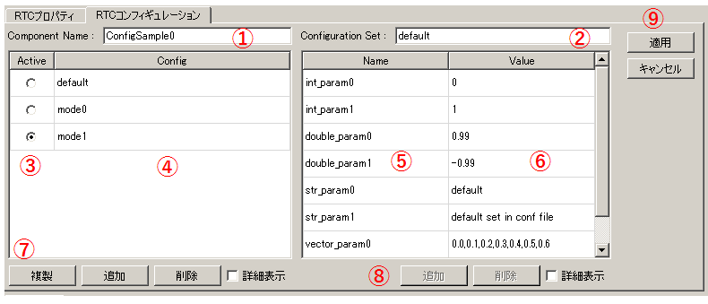

各項目の内容は以下の通りです。

.. .. tabularcolumns:: |p{3.5cm}|p{11.5cm}|

.. list-table::
  :widths: 5,95
  :header-rows: 1

  * - 番号
    - 内容
  * - ①
    - 選択されているRTCの名称。
  * - ②
    - 選択されているConfigurationSetの名称。
  * - ③
    - アクティブになっているConfigurationSet。ラジオボタンを使用することで、アクティブなConfigurationSetを変更することができる。
  * - ④
    - ConfigurationSetのリスト
  * - ⑤
    - 左側で選択しているConfigurationSetのプロパティの名称。
  * - ⑥
    - 左側で選択しているConfigurationSetのプロパティの値。
  * - ⑦
    - ConfigurationSetを複製/追加/削除するボタン。
  * - ⑧
    - プロパティを追加/削除するボタン。
  * - ⑨
    - 変更内容を適用/キャンセルするボタン。
| 左右のグリッドは編集可能となっています。設定値を修正したい場合には、各グリッドを直接編集してください。
| また、左側のグリッド再左列のラジオボタンでアクティブなConfigurationSetを変更する事も可能です。
| 
| 編集された項目は、背景が薄赤色となります。なお、編集された内容は｢適用｣ボタンがクリックされるまで、RTCには反映されません。(背景が薄赤色の項目は、実際のRTCには反映されていない項目となります。)

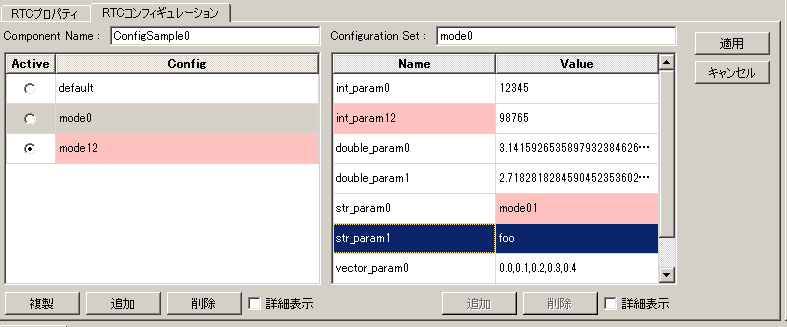

左右グリッド下部の｢詳細表示｣チェックボックスをONにすると、ConfigurationSetに設定されている全ての情報が表示されます。

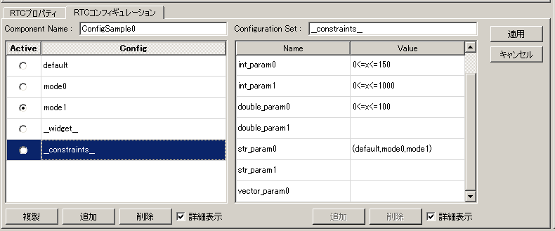

.. note:: ConfigurationSetには、通常の動作に仕様する情報と、各プロパティの制約などを定義した｢隠し要素｣があります。｢詳細表示｣チェックボックスをONにすると、｢隠し要素｣が表示されるようになります。｢隠し要素｣の定義方法、内容につきましては、OpenRTM-aist公式サイトのRTCBuilderのページを参照してください。

RTCプロパティ
----------------------------

RTCの詳細情報や、ポート間の接続情報を表示するためのビューです。RTCリストやRTCダイアグラムで選択したRTC/ポート間接続線の情報を表示します。

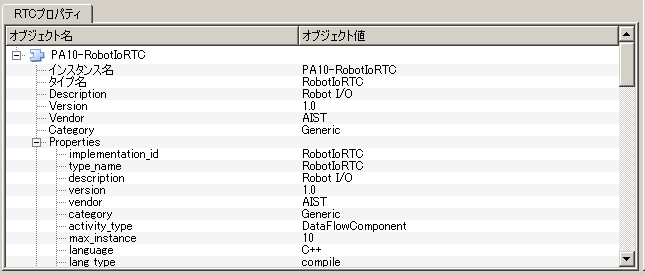

| RTCを選択している場合は、対象RTCの基本情報(インスタンス名、タイプ名、バージョン番号など)や、対象RTCが関連するExecutionContextの情報、ポートの定義情報などを確認することができます。
| ポート間の接続線を選択している場合は、設定された接続プロファイルや、関連している入力ポート・出力ポートの詳細を確認することができます。
| あるRTCが持つポートで使用可能な型の確認や、ポート間を接続する際に設定したプロパティの情報などを確認する際に使用します。

設定画面
----------------------------

上部ツールバーの｢ツール｣-｢OpenRTM｣-｢設定画面｣を選択することで、OpenRTMプラグインに関連した設定画面が表示されます。

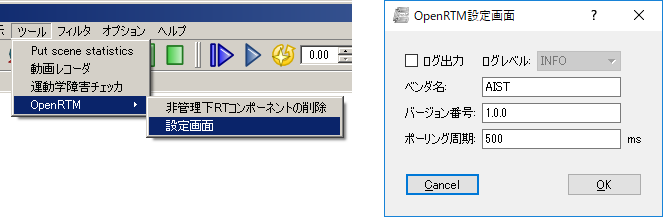

各設定項目の意味は以下の通りです。

.. .. tabularcolumns:: |p{3.5cm}|p{11.5cm}|

.. list-table::
  :widths: 25,75
  :header-rows: 1

  * - 項目名
    - 詳細
  * - ログ出力
    - 各RTCのログ情報を出力するかどうかをチェックボックスで指定します。
  * - ログレベル
    - RTCのログレベルを設定します。｢ログ出力｣がONの場合のみ設定可能です。
  * - 設定ファイル
    - Choreonoidで使用しているOpenRTM-aistのマネージャの設定ファイルを指定します。使用するネームサーバ指定する方法の例を以下に示します。設定可能な情報および設定方法の詳細については、OpenRTM-aist公式サイトを参照してください。
  * - ベンダ名
    - RTシステムの｢ベンダ名｣のデフォルト値を設定します。RTシステムアイテムを新規作成した際に設定されます。
  * - バージョン番号
    - RTシステムの｢バージョン番号｣のデフォルト値を設定します。RTシステムアイテムを新規作成した際に設定されます。

::

 corba.nameservers: 192.168.0.11:2809

