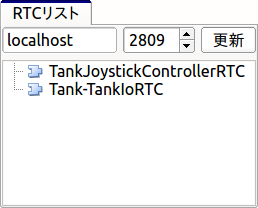
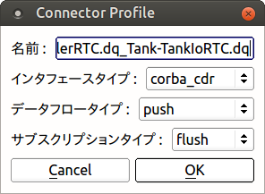
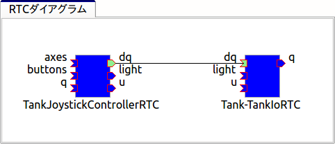
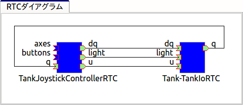
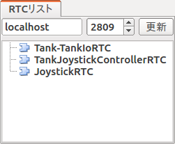
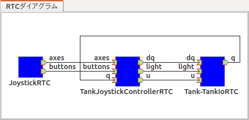

TankJoystickチュートリアル: プロジェクトの作成と実行
====================================================

.. contents::
   :local:
   :depth: 1

概要
----

本チュートリアルでは、OpenRTMの枠組みを用いて、Choreonoidのサンプルモデルのひとつである"Tank"モデルをジョイスティック（ゲームパッド）で操作するサンプルを実現します。Tankモデルは戦車風のモバイルロボットであり、２つのクローラと砲塔・砲身の向きを変える2軸の回転関節で構成されています。砲身の先にはライトとカメラが搭載されています。これらを用いてライトで照らされた環境のカメラ画像を見ながら、環境中をクローラで移動し探索することを想定したモデルとなっています。

本サンプル実行時の画面を以下に示します。中央のシーンビューではロボットに搭載されたカメラの視点で描画を行っています。

.. image:: images/TankJoystickScreenShot.png

本サンプルの実行には４軸以上の操作軸とひとつ以上のボタンを備えたジョイスティックが必要となりますが、ジョイスティックの実物がない場合でも、Choreonoid本体に含まれる「仮想ジョイスティックビュー」を用いてキーボードで操作することが可能です。

本サンプルはChoreonoid本体に付属のOpenRTMサンプルに含まれています。プロジェクトファイルは "OpenRTM-TankJoystick.cnoid" になります。

.. _tankjoystick_openrtm_plugin_samples:

OpenRTMプラグイン・サンプルの導入
---------------------------------

OpenRTMの機能をChoreonoid上で利用可能とするためには、 `OpenRTM-aist <http://openrtm.org/>`_ がOSにインストールされた上で、Choreonoidの :doc:`../install/options` のひとつである「OpenRTMプラグイン」もインストールされている必要があります。Choreonoidをソースコードからビルドしている場合は、ビルド時のCMakeの設定で、以下のオプションをONにするようにしてください。

* ENABLE_CORBA
* BUILD_CORBA_PLUGIN
* BUILD_OPENRTM_PLUGIN

OpenRTMプラグインがインストールされていると、Choreonoid起動時にメッセージビューに ::
  
 OpenRTMプラグインが読み込まれました。

と表示されます。
  
また、本チュートリアルのサンプルはBUILD_OPENRTM_SAMPLESをONにすることでビルドされます。チュートリアルを進める際にもサンプルに含まれるファイルが必要となりますので、このオプションも有効にしておいてください。

シミュレーション世界の構築
--------------------------

まずはシミュレーション対象となる仮想世界を構築し、シミュレーションの基本的な設定を行います。この手順の詳細については :doc:`../simulation/simulation-project` を参照してください。

まずはワールドアイテムを作成してください。次に今回使用するTankモデルをワールドアイテムの小アイテムとして読み込みます。このモデルはChoreonoidのshareディレクトリの model/misc 以下に "tank.body" というモデルファイルとして格納されていますので、これをボディアイテムとして読み込みます。読み込んだアイテムに対してアイテムツリービュー上でチェックを入れて、シーンビューに表示してください。

環境モデルとしてはシンプルな床のモデルを使ってもよいのですが、今回はロボットが実際に稼働する場所の雰囲気を出すために、"Labo1"という研究プラント風のモデルを用いることにします。このモデルはshareディレクトリ以下の "model/Labo1/Labo1.wrl" というファイルになりますので、これもTankモデルと同様にワールドアイテムの小アイテムとして読み込み、チェックをいれてください。

上記のモデルを読み込んだら、モデルに対して :ref:`simulation_setting_initial_status` を行っておきます。Tankモデルのクローラの下面がLabo1の床上に一致するように配置してください。

次に :ref:`simulation_creation_and_configuration_of_simulator_item` を行います。今回は :doc:`../simulation/pseudo-continuous-track` に対応したシミュレータアイテムであれば何でもよいのですが、標準のAISTシミュレータアイテムもこの機能に対応していますので、これを使うことにしましょう。AISTシミュレータアイテムを生成して、ワールドアイテムの小アイテムとして配置してください。プロパティはデフォルトのままでもかまいません。

以上の作業を行うと、アイテムツリービューは以下のようになっているかと思います。 ::

 [ ] - World
 [/]   + Tank
 [/]   + Labo1
 [ ]   + AISTSimulator
 
:ref:`simulation-time-step` も行います。値としてはとりあえず 1000 [fps] を用いることにしましょう。

これでシミュレーションプロジェクトの土台が完成しましたので、適当なファイル名で :ref:`basics_project_save` を行っておきましょう。これ以降の作業についても、プロジェクトの設定が進むたびにプロジェクトファイルを保存しておくとよいでしょう。

.. _tankjoystick_rtsystemitem:

RTシステムアイテムの導入
------------------------

OpenRTMでは、RTコンポーネント（RTC）によってロボットのシステムを構築します。システムは通常複数のRTCによって、それらの有する入出力ポート、サービスポートを接続することで構成されます。ChoreonoidのOpenRTMプラグインでは、そのような接続情報を管理するためのプロジェクトアイテムとして、「RTシステムアイテム」を提供しており、これを用いることでChoreonoidのプロジェクトとしてRTCのシステムを構築することができます。

本サンプルでも複数のRTCを利用しますので、この「RTシステムアイテム」が必要です。メインメニューの「ファイル」-「新規」より「RTシステム」を選択して、このアイテムの生成を行ってください。本アイテムのアイテムツリー内での配置場所はどこでもよいのですが、今回はWorldアイテムの小アイテムとして配置することにします。その場合、アイテムツリーは以下のようになります。 ::

 [ ] - World
 [/]   + Tank
 [/]   + Labo1
 [ ]   + AISTSimulator
 [ ]   + RTSystem

このような配置にすることで、構築するRTシステムがこの仮想世界を対象としたものあることが分かりやすくなるかと思います。

RTC管理用ビューの導入
----------------------------------

RTCを用いたシステムをChoreonoid上で構築するにあたっては、そのためのユーザーインタフェースも必要になります。ChoreonoidのOpenRTMプラグインではこれに対応する以下の３つのビューを提供しています。

* RTCリストビュー

 現在システムに存在するRTCの一覧を表示するビューです。これによって必要なビューが生成できているかを確認したり、操作対象とするRTCを選択したりすることができます。
  
* RTCダイアグラムビュー

 各RTCが有する入出力ポートとそれらの間の接続設定を確認・編集するためのビューです。RTCとそのポートが模式的な図形で表示され、ポート間の接続状況がポート間を結ぶ線として表示されます。このビューは基本的にRTシステムアイテムを編集対象とするものであり、利用にあたってはまずRTシステムアイテムを生成しておく必要があります。

* RTCプロパティビュー

 RTCのプロパティを確認するためのビューです。RTCリストビューで選択したRTCがこのビューの対象となります。
  
Choreonoid上でOpenRTMを用いてシステムを構築する際にはこれらのビューが必要となりますので、まずこれらのビューを表示しておくようにしましょう。 :ref:`basics_show_hide_views` にあるように、メインメニューから「表示」-「ビューの表示」とたどっていきます。すると、OpenRTMプラグインが読み込まれていれば、ここに「RTCリスト」、「RTCダイアグラム」、「RTCプロパティ」の項目があるはずです。それらのチェックを入れることで、ビューを表示することができます。この際ビューはデフォルトで定められた場所に表示されますが、作業がしやすくなるよう必要に応じて :ref:`basics_modify_layout` を行ってください。と言ってもこれらのビューを使う作業はこれからなので、実際に作業を行ってみてから使いやすいレイアウトを考えてもよいかと思います。

ビューを表示したらその状態もプロジェクトファイルに保存しておきましょう。これを行うためには、 :ref:`basics_layout_save` にあるように、メインメニューの「ファイル」-「プロジェクトファイルオプション」-「レイアウト」のチェックを入れておきます。そのようになっていれば、ビューの表示状態とレイアウトもプロジェクトファイルに保存され、プロジェクト読み込み時にそれが再現されることになります。

.. note:: これらのインタフェースは、OpenRTM-aistに含まれる開発ツールのひとつである `RT System Editor <http://www.openrtm.org/openrtm/ja/content/rtsystemeditor-110>`_ と類似の機能を提供するものです。RT System Editor を使う場合はChoreonoidとは別にそのツールを起動し、設定もそれぞれ別々に保存する必要があります。これに対して上記のインタフェースはChoreonoidに統合されたものなので、そのような作業を行う必要はありません。

.. _tankjoystick_introduce_robot_io_rtc:

ロボット入出力用RTCの導入
-------------------------

ロボットシステムをRTコンポーネントを用いて構築する場合、まず必要となるのがロボットに対応するRTCです。これは正確には、ロボットに搭載されているアクチュエータ、エンコーダ、力センサ、加速度センサ、角速度センサ、カメラ、レーザーレンジセンサといった各種デバイスの入出力を担うRTCを指しています。そのようなRTCはそれぞれのデバイスに対して個別に用意されることもあり得ますが、ここではあるロボットに関わる入出力の全てをまとめたRTCがあるものと想定し、これを「ロボット入出力用RTC」と呼ぶことにします。

ChoreonoidのOpenRTMプラグインでは、この「ロボット入出力用RTC」を導入するためのプロジェクトアイテムとして、「BodyIORTCアイテム」を用意しています。このアイテムにより、入出力RTCの動作をシミュレーションの進行と同期するための処理がシミュレーション時に行われます。

実際に今回のロボットモデルに対してBodyIoRTCアイテムを用いて入出力用RTC(BodyIoRTC)を設定してみましょう。まずBodyIoRTCアイテムを生成し、Tankアイテムの小アイテムとしてこれを配置します。アイテムツリーは以下のようになります。 ::

 [ ] - World
 [/]   + Tank
 [ ]     + BodyIoRTC
 [/]   + Labo1
 [ ]   + AISTSimulator
 [ ]   + RTSystem

このようにアイテムツリーにおける親子関係で、BodyIoRTCアイテムの入出力の対象となるロボットモデルを特定することになります。これができていないとBodyIoRTCが機能しませんので、ご注意ください。
 
次に、実際に利用するBodyIoRTCを指定します。これはBodyIoRTCアイテムの「RTCモジュール」プロパティを用いて行います。アイテムツリービュー上でBodyIoRTCアイテムを選択し、プロパティビュー上の「RTCモジュール」プロパティを設定してください。このプロパティでは右端にファイルのアイコンがついており、これをクリックするとファイル選択ダイアログが表示されます。このダイアログはデフォルトではChoreonoidプラグインディレクトリの"rtc"サブディレクトリを開くようになっており、そこに今回利用するRTCモジュールファイルである"TankIoRTC.so"がありますので、これを選択してください。このファイルがない場合は、OpenRTMサンプルが正しくビルド・インストールされていれかご確認ください。

.. note:: ファイルダイアログを使わずに、プロパティの入力欄に直接 "TankIoRTC" と入力してもOKです。このように設定すると、モジュール名に共有ライブラリの拡張子 ".so" を付与した"TankIoRTC.so"というモジュールファイルが「相対パスベース」プロパティで設定されたディレクトリから読み込まれます。「相対パスベース」のデフォルトである「RTCディレクトリ」は、上記の読み込み操作で対象となったディレクトリのことを指しています。

上記の設定を行うと、TankIoRTCのインスタンスが生成されているはずです。これをRTCリストビューで確認してみましょう。RTCリストビュー上で「更新」ボタンを押した際に、以下のように "Tank-TankIoRTC" という表示がでてくればOKです。

.. image:: images/rtclist-tankiortc.png

この表示が出ない場合はRTCの生成がうまくいっていませんので、設定内容やRTCモジュールファイルの存在等を確認してみてくだい。
	   
ここで "Tank-TankIoRTC" というのはデフォルトで与えられたインスタンス名です。この名前は一般的には"対象ロボットのアイテム名"-"RTCのモジュール名" という形式で与えられるのですが、これはBodyIoRTCアイテムの「RTCインスタンス名」プロパティを用いて任意の名前に変更することも可能です。
	   

生成されたRTCの入出力ポートも確認してみましょう。そして、RTCリストビューの"Tank"の部分をマウスでドラッグして、RTCダイアグラムビューの上にドロップしてみてください。するとRTCダイアグラムビュー上で以下のように表示されるかと思います。（RTCダイアグラムビュー上にうまく表示されない場合は、 :ref:`tankjoystick_rtsystemitem` で行ったRTシステムアイテムの生成が正しく行われているかを確認してみてください。）

.. image:: images/rtcdiagram-tankiortc.png

ここに表示されている青い矩形がTankIoRTCのインスタンスを表しています。矩形の下部に表示されているのがインスタンス名で、今回生成したRTCでわることが分かります。また、矩形の側面についている形状はこのRTCが有する入出力ポートを表しています。左側にあるのが入力ポートで、右側にあるのが出力ポートになります。これらのポートの内容は以下のようになっています。

.. list-table::
 :widths: 15,20,25,50
 :header-rows: 1

 * - ポート名
   - 入力／出力
   - 型
   - 内容
 * - u
   - 入力
   - TimedDoubleSeq
   - 関節トルク指令値（砲塔部分の２軸分）
 * - dq
   - 入力
   - TimedDoubleSeq
   - 各クローラの駆動速度指令値
 * - light
   - 入力
   - TimedBooleanSeq
   - ライトのON/OFF
 * - q
   - 出力
   - TimedDoubleSeq
   - 関節角度（砲塔部分の２軸分）
	   
これらのポートにより、今回シミュレーション対象となるTankモデルに対して、OpenRTMの枠組みで入出力を行うことが可能となりました。

なお、入出力用のBodyIoRTCを用意する手段としては、以下の２つがあります。

1. 利用するロボットモデルに合うものを自前で作成する

2. 既存のBodyIoRTCを利用する

今回のサンプルではTankモデル用のBodyIoRTCであるTankIoRTCを用いており、これは上記の1に相当します。そこで、TankIoRTCをどのように作成するかについても解説したいと思いますが、本ドキュメントではそれは一旦脇に置くことにし、以下ではRTCを作成した後の利用方法について解説を進めたいと思います。TankIoRTCの作成については :doc:`tank-joystick-bodyiortc` にまとめていますので、そちらをご参照ください。

上記の方法2については、現在のところまだサポートが十分ではありませんが、今後一般的なロボットモデルに対して汎用的に利用可能なBodyIoRTCを用意したいと思っています。

.. note:: ここで導入したBodyIoRTCアイテムは、 :ref:`simulation_select_controller_item_type` でも紹介したように、Choreonoidの :doc:`../simulation/index` における :ref:`simulation-concept-controller-item` に直接対応するものです。実際にBodyIoRTCアイテムはControllerItemを継承したアイテムとなっています。ただし、BodyIoRTCアイテムの本体であるBodyIoRTCは、ロボットに対する入出力機能のみを提供するものとして設計されており、実際に制御を行う部分は他のRTCになる点には注意が必要です。それについては以下の節で解説していきます。

.. note:: ロボット入出力用RTCを生成するアイテムとして、BodyIoRTCアイテムの他に「BodyRTCアイテム」もあります。これはBodyIoRTCアイテムが導入される以前に標準で使われていたもので、BodyIoRTCアイテムとは少し異なる設計となっています。BodyRTCアイテムの場合、BodyIoRTCのモジュールを用意する必要はなく、それに相当するRTCはBodyRTCアイテム自身が内部で生成します。その際に、どのような入出力ポートを備えるかについては、BodyRTCアイテムにまかせることもできますし、設定ファイルを記述して指定することも可能です。これは状況によっては手軽に使えてよいものなのですが、入出力の内容が少し複雑になってくると、必要とするポートの全てを用意できなかったり、設定が複雑になったりすることもあり、汎用性の面でやや問題がありました。BodyIoRTCアイテムはよりシンプルで汎用性の高いアイテムとして設計されており、今後はこちらを利用することを推奨しています。

制御用RTCの導入
---------------

BodyIoRTCアイテムにより、ロボットの入出力をRTCのポートを介して行うことが可能となりました。ロボットの制御を行うためには、これに加えてロボット制御用のRTCが必要ですので、これを導入しましょう。

本サンプルでは、Tankモデルをジョイスティックを用いて手動で操縦するための"TankJoystickControllerRTC"というRTCを用意しています。この実装内容は :doc:`tank-joystick-controller` を参照していただくとして、ここではこのRTCを用いてTankモデルの制御システムを構築する方法について説明します。

制御用のRTCは、「コントローラRTCアイテム」を用いて導入します。メインメニューの「ファイル」-「新規」より「コントローラRTC」を選択して、このアイテムの生成を行なってください。その際の名前はデフォルトだと"ControllerRTC"となりますが、本サンプルではもうひとつ別のコントローラRTCアイテムを導入しますので、それと区別をするために今回は名前を"TankJoystickController"に変更しておくとよいでしょう。また、アイテムの配置場所はWorldアイテム以下であればOKですが、Tankアイテムの小アイテムとして配置しておくことで、このRTCの制御対象がTankモデルであることが分かりやすくなるかと思います。このようにすると、アイテムツリーは以下のようになります。 ::

 [ ] - World
 [/]   + Tank
 [ ]     + BodyIoRTC
 [ ]     + TankJoystickController
 [/]   + Labo1
 [ ]   + AISTSimulator
 [ ]   + RTSystem

次に、実際に利用する制御用RTCを指定します。これはBodyIoRTCアイテムの時と同様に、作成したアイテムの「RTCモジュール」プロパティを用いて指定してください。今回使用するRTCのモジュールは "TankJoystickControllerRTC.so" というファイルで、これはデフォルトのRTCディレクトリ内に格納されています。プロパティ右端のアイコンで呼び出されるファイル選択ダイアログから選択するか、プロパティに直接 "TankJoystickControllerRTC" と入力して、このモジュールを指定してください。

上記設定により制御用RTCのインスタンスが生成されます。RTCリストビューの「更新」ボタンを押すと、以下のように"TankJoystickControllerRTC"が追加されているはずです。

このRTCも、RTCダイアグラムビューにドラッグしましょう。するとRTCダイアグラムビューには以下のように２つのRTCが表示されることになります。

.. image:: images/rtcdiagram2.png

これにより、TankJoystickControllerRTCのポートも確認できます。これらのポートの内容は以下のようになっています。

.. list-table::
 :widths: 15,20,30,60
 :header-rows: 1

 * - ポート名
   - 入力／出力
   - 型
   - 内容
 * - axes
   - 入力
   - TimedFloatSeq
   - ジョイスティックの各軸の状態
 * - buttons
   - 入力
   - TimedBooleanSeq
   - ジョイスティックの各ボタンの状態
 * - q
   - 入力
   - TimedDoubleSeq
   - 関節角度（砲塔部分の２軸分）
 * - u
   - 出力
   - TimedDoubleSeq
   - 関節トルク指令値（砲塔部分の２軸分）
 * - dq
   - 出力
   - TimedDoubleSeq
   - 各クローラの駆動速度指令値
 * - light
   - 出力
   - TimedBooleanSeq
   - ライトのON/OFF

このRTCはロボットを制御する「コントローラ」の一番メインとなる部分です。その具体的な処理内容は、入力としてジョイスティックの状態を受け取り、それに応じてTankモデルのクローラや砲塔軸への指令値を計算し、その値を出力するというものになっています。

なお、ControllerRTCアイテムには「実行コンテキスト」というプロパティがあります。ここはデフォルトで "Choreonoid Execution Context" となっており、今回の制御用RTCに対してはこの設定のままにしておいてください。このようにすると、制御用RTCの "onExecute" 関数の呼び出しがシミュレーションの進行と同期するようになります。関節アクチュエータのPD制御等、実機においてはリアルタイムで実行しなければならないような制御プログラムに対しては、この実行コンテキストを指定するようにしてください。

制御用RTCと入出力用RTCの接続
----------------------------

上で導入した制御用RTCをコントローラとして機能させるためには、ロボットの入出力用RTCとポートの接続を行う必要があります。この設定もRTCダイアグラムビューを用いて行います。

まず、TankJoystickControllerRTCにおいて"dq"とラベリングされた図形にマウスをもっていき、そこからドラッグしていくと点線が表示されますので、これをTank-TankIoRTCの"dq"とラベリングされた図形までドラッグしてマウスを離してください。すると以下の図のようなダイアログが表示されますので、ここで"OK"をクリックしてください。

すると以下の図のように各"dq"の間が線で結ばれた状態になります。

これによって、コントローラの出力ポート"dq"とロボット側の入力ポート"dq"が接続されました。

同様に、"q", "u", "light" についても同じ名前のポート同士を接続して、以下の図のような状態にしてください。

なお、接続を表す線については、その取り回しも調整することができます。接続線をクリックするとその上にいくつかの四角が表示されますので、これをドラッグすることで調整を行います。この例ではポート"q"については接続直後は他の接続線と重なってしまって見にくいのですが、上の図のように取り回しを調整すると見やすくなります。

ポートの接続を間違ってしまった場合は、その接続の線をクリックしてからDeleteキーを押すことで、接続を解除することができます。

ジョイスティックRTCの導入
-------------------------

これまでの設定で、Tankロボットの制御ができるようになりました。実際にシミュレーションを開始すると、ロボットの砲身が現在の状態を維持するよう制御されます。ただしこれだけではロボットを動かすことができません。今回のシステムはジョイスティックの操作でロボットを動かすようになっているのですが、先ほど導入したTankJoystickControllerRTCにはジョイスティックの状態を読む部分は含まれていません。代わりにジョイスティックの状態を入力するポートが用意されており、ここにジョイスティックの状態を接続することで、制御を行う設計となっています。

このためにはジョイスティックの状態を読み込むRTCが別途必要となります。これを行う"JoystickRTC"を用意していますので、これを導入することにしましょう。このRTCも、ControllerRTCアイテムを用いて導入します。制御用RTCを導入した時と同様に、ControllerRTCアイテムをまず作成し、これをWorldアイテム内に配置します。「RTCモジュール」プロパティには、これまでと同じRTCディレクトリの "JoystickRTC" というモジュールを指定してください。また、ControllerRTCアイテムの名前は "Joystick" などとしておくと分かりやすくてよいでしょう。これを行うとアイテムツリーは以下のようになります。 ::

 [ ] - World
 [/]   + Tank
 [ ]     + BodyIoRTC
 [ ]     + TankJoystickController
 [ ]     + Joystick
 [/]   + Labo1
 [ ]   + AISTSimulator
 [ ]   + RTSystem

また、RTCリストビューは以下のようになるはずです。ここでJoystickRTCのインスタンスが正しく生成されているかを確認してください。

 
TankJoystickControllerRTCとは異なる点として、「実行コンテキスト」プロパティには "PeriodicExecutionContext" を指定します。このようにすると、ジョイスティックの状態値の更新はシミュレーションの進行とは関係なく、実時間における一定周期で行われるようになります。ジョイスティック自体はシミュレーション中の仮想世界の内部に存在するわけではなく、実世界に存在するものなので、こちらの設定のほうがより実態にあったものとなります。

「実行コンテキスト」に加えて、「実行周波数」というプロパティも設定しておきましょう。ここの設定した周期[Hz]でRTCのonExecute関数が呼ばれるようになります。ここに例えば30を設定しておくと、1秒間に30回の頻度でジョイスティックの状態が読み込まれてポートに出力されるようになります。

.. note:: ジョイスティックのRTCについては、実行コンテキストをChoreonoidExecutionContextに設定しても動かないわけではありません。それとは逆に、制御用のTankJoystickControllerRTCの実行コンテキストをPeriodicExecutionContextにしてはいけません。この場合、ロボットの制御が思い通りにできなくなり、シミュレーションが破綻してロボットが飛んでいくといった症状も発生することになります。

最後に、このJoystickRTCをRTCダイアグラムビューにドラッグし、ポートの接続を行ってください。ポートはジョイスティックの各軸の状態を出力する "axes" と、各ボタンの状態を出力する "buttons" があり、これらが TankJoystickControllerRTC の入力ポート "axes" と "buttons" に対応していますので、それらの間の接続を行います。最終的に以下のような接続状態にすればOKです。
	  

ジョイスティックデバイスの導入
------------------------------

ジョイスティックを処理するRTCに加えて、当然ですがジョイスティック自体も用意しておく必要があります。ジョイスティックは様々なものがありますが、プレイステーションやXboxといったゲーム機用のゲームパッドやそれらに類似のものは多くの軸やボタンを備えていて、操作もしやすく、入手も容易なため、そのようなゲームパッドを用意するとよいでしょう。著者はロジクールのF310というゲームパッドを利用しています。通常それらはUSBのインタフェースをもっており、それでPCに接続すると、OSが自動で認識することが多いようです。上記のJoystickRTCは、Linuxのデバイスファイル "/dev/input/js0" を通してジョイスティックにアクセスするようになっています。

.. note:: ジョイスティックハードウェアがOSによって認識されているかどうかについて、Linxuでは "jstest" というコマンドを用いて確認できます。これはUbuntuでは "sudo apt-get install joystick" というコマンドでインストールできます。チェックする際には "jstest /dev/input/js0" などと入力します。この場合、デバイスファイル "/dev/input/js0" として認識されているジョイスティックが正しく認識されていれば、その各軸とボタンの状態が表示されます。もしジョイスティックが認識されていなければ "jstest: No such file or directory" といったエラーメッセージが出ます。

ジョイスティックのハードウェアが無い場合でも、以下の「仮想ジョイスティックビュー」を用いることで、キーボードをジョイスティックの代わりに使うことが可能となります。

.. image:: ../simulation/images/VirtualJoystickView.png

このビューは、メインメニューの「表示」-「ビューの表示」から「仮想ジョイスティックビュー」を選択すると表示されるようになります。RTC管理用ビューと同様に、必要に応じて :ref:`basics_modify_layout` を行なってください。

仮想ジョイスティックビューを導入すると、ジョイスティックのハードウェアが認識されていればそちらを、認識されていなければこちらのビューがジョイスティックとして使われるようになります。

このビューはゲームパッドを模した構成になっており、キーボードのカーソルキーがゲームパッドの十字ボタン、A、B、X、Yのキーがゲームパッドの対応するボタンとして認識されます。また、E、D、S、Fが左側のアナログスティック、I、K、J、Lが右側のアナログスティックに対応しており、それぞれビュー上のボタンで表示されている方向に対応しています。これらはキーボードのホームポジションでそれぞれの軸操作をしやすくなるような配置となっています。

仮想ジョイスティックビューを使用する際には、まずこのビューの領域をマウスでクリックするなどして、このビューへキーボード入力のフォーカスが入るようにしてください。これが出来ていないとキーボードを押してもジョイスティックの入力とはなりませんので、注意が必要です。

.. note:: VirtualBox上にインストールされたUbuntuでジョイスティックを使う場合は注意が必要です。VirtualBox上でGuest Additionsをインストールしていると、"/dev/input/js0" や "/dev/input/js1" のデバイスがマウス統合機能で使われてしまうようなのです。この場合でもジョイスティックRTCは "/dev/input/js0" をジョイスティックとして認識してしまうので、正しく動作しません。この問題を回避するためには、rtc.conf ファイルを使ってデバイスファイルの設定を変えておきます。具体的には、

 HumanInterfaceDevice.JoystickRTC.conf.default.device: /dev/input/js2

 と記述したrtc.confファイルをchoreonoidを実行する際のカレントディレクトリに入れておけばOKです。

シミュレーションの実行
----------------------

以上の設定を行ってシミュレーションを開始すると、RTCダイアグラムビュー上で各RTCの色が青から緑に変化します。これは各RTCがActive状態になったことを示しています。

この状態になると、ジョイスティックによってTankロボットを操縦することができます。片方のアナログスティックで前進・行進・旋回を、もう片方のアナログスティックで砲身の向きを変えることができます。また1番目のボタンでライトの点灯・消灯を切り替えることができます。仮想ジョイスティックビューの場合、キーボードのE、Dで前進・行進、S、Fで旋回、J、Lで砲塔ヨー軸、I、Kで砲塔ピッチ軸、Aでライトの操作を行うことができます。

.. note:: ジョイスティックによっては各軸とロボットの実際の動作が直感的に対応しないかもしれません。その場合は :doc:`tank-joystick-controller` を参考にして、TankJoystickControllerRTC.cpp に記述されている各軸の対応付けを実際のジョイスティックに合うよう修正してみてください。

光源の設定
----------

本サンプルのTankモデルはライトを備えており、そのオン・オフもできるので、せっかくですから暗闇の中をライトで照らすような状況をシミュレーションしてみましょう。

これを行うためには、 :doc:`../basics/sceneview` で使われるデフォルトの光源の設定を変更します。具体的には、シーンビューの :ref:`basics_sceneview_config_dialog` 上に配置されている「ヘッドライド」と「ワールドライト」の項目を編集します。「ヘッドライト」は視点から前方へと照らされるライトで、「ワールドライト」は上方から下向きに照らされるライトです。デフォルトではこれらのライトに一定の照度が与えられていて、常にシーンが明るく照らされて見えるようになっています。これらのライトに対して、照度を弱めるか無効とすることで、シーンを暗闇に近づけていくことができます。設定ダイアログ上でこれらのライトのチェックを外すか、「照度」の値を小さくしてみてください。

同じ設定ダイアログで「追加のライト」という部分がありますが、これはシーンに含まれるモデルが有するライトを有効にするかどうかを切り替えるものです。本サンプルではTankモデルが砲身の部分にライトを備えていますので、「追加のライト」にチェックを入れておくことで、このライトで照らされたシーンを得ることができます。デフォルトではこのチェックが入っており、今回はそのままにしておきます。

以上により暗闇の中をライトで照らすような描画がなされますので、試してみて下さい。この場合、ライトのオン・オフもより分かりやすくなります。

さらにChoreonoidの開発版ではよりリアルな描画を行うための描画エンジンが開発中であり、そちらも試すことができます。これは環境変数の "CNOID_USE_GLSL" に "1" を設定することにより有効化できます。これはChoreonoid起動時にコマンドラインから ::

 CNOID_USE_GLSL=1 choreonoid ...

といった記述で設定することも可能です。

この開発中のエンジンで描画を行うと、まずロボット搭載ライトで照らされる部分とそうでない部分の境界がきちんと出るようになります。さらに、ライトによって発生する影も再現することができます。これを行うためには、上記の設定ダイアログで、「影 1」にチェックを入れ、その隣の「ライト」に 1 を設定します。ここでライトの番号は 0 がワールドライトに対応し、モデルに含まれるライトは1から順にシーンに現れる順に割り振られています。今回の例ではライト1はTankモデルのライトに対応します。

以上の設定を適当に行うと、以下のようなシーンの表示を実現できるかと思います。

.. image:: images/tank-labo1-light-shadow.png

.. note:: 設定ダイアログの「影 2」に別のライト番号を指定してチェックを入れることで、２つの光源からの影を重ねて表示することもできます。例えばワールドライトを適当な照度で有効化して、影2にライト番号0を指定すると、天井のライトによって生成されるような影も表示されるかと思います。

カメラの切り替え
----------------

これまではシーンビューのデフォルトのカメラを用いて表示を行っており、マウス操作によって任意の視点からのシーンを得ることができました。これに対して、ロボットに搭載されたカメラからの視点でシーンを表示することもできますので、これも試してみましょう。 :ref:`basics_sceneview_change_camera` にあるように、 :ref:`basics_sceneview_scenebar` の「描画用カメラ選択コンボ」をクリックして、"Camera - Tank" という項目を選択してください。これでシーンビューの表示がロボット搭載カメラの視点に切り替わります。

この例として、先の図のシーンをロボットのカメラ視点で見たシーンは以下のようになります。

.. image:: images/tank-labo1-robot-camera.png

この視点でジョイスティックを用いた操作を行うことで、実際のロボット運用形態に近いシミュレーションを実現することができます。これはロボットの操作練習等に活用することができると思われます。

ロボット実機への適用
--------------------

今回のロボット操作用のRTCシステムをを実機のロボットへ適用する場合、基本的には「ロボット入出力用RTC」に相当する部分を実機用に用意すればOKです。残りのRTCについては、シミュレーション時のものをほぼそのまま用いることとし、ロボット入出力用RTCの部分だけを入れ替えるわけです。このような流れで、シミュレータ上でロボットの開発やテストを行いつつ、開発した制御用システムをほぼそのまま実機にも適用し、望ましいロボット開発のあり方です。これにより、シミュレータを使用しない場合と比べて、ロボット開発や運用にかかるコストや労力を低減することが可能となります。

		     
