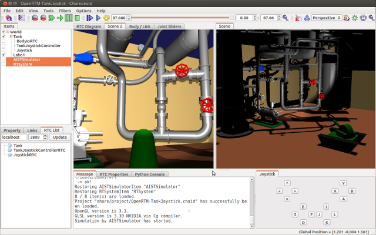
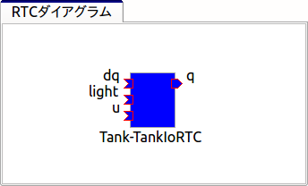

TankJoystickチュートリアル: プロジェクトの作成
==============================================

.. contents::
   :local:
   :depth: 1

概要
----

本チュートリアルでは、OpenRTMの枠組みを用いて、以下の図に示す戦車型ロボットをジョイスティック（ゲームパッド）で操作するサンプルを実現します。このロボットはは２つのクローラと２軸の砲塔で構成されており、クローラによって移動したり砲身の向きを変えたりすることが可能です。砲身の先にはライトとカメラが搭載されており、これらを用いてライトで照らされた環境のカメラ画像を見ながらロボットで探索するという状況のシミュレーションを行うことができます。

本サンプル実行時の画面を以下に示します。中央のシーンビューではロボットに搭載されたカメラの視点で描画を行っています。

本サンプルの実行には４軸以上の操作軸とひとつ以上のボタンを備えたジョイスティックが必要となりますが、ジョイスティックの実物がない場合でも、Choreonoid本体に含まれる「仮想ジョイスティックビュー」を用いてキーボードで操作することが可能です。

本サンプルはChoreonoid本体に付属のOpenRTMサンプルに含まれています。プロジェクトファイルは "OpenRTM-TankJoystick.cnoid" になります。

.. _tankjoystick_openrtm_plugin_samples:

OpenRTMプラグイン・サンプルの導入
---------------------------------

OpenRTMの機能をChoreonoid上で利用可能とするためには、 `OpenRTM-aist <http://openrtm.org/>`_ がOSにインストールされた上で、Choreonoidの :doc:`../install/options` のひとつである「OpenRTMプラグイン」もインストールされている必要があります。Choreonoidをソースコードからビルドしている場合は、ビルド時のCMakeの設定で、以下のオプションをONにするようにしてください。

* ENABLE_CORBA
* BUILD_CORBA_PLUGIN
* BUILD_OPENRTM_PLUGIN

OpenRTMプラグインがインストールされていると、Choreonoid起動時にメッセージビューに ::
  
 OpenRTMプラグインが読み込まれました。

と表示されます。
  
また、本チュートリアルのサンプルはBUILD_OPENRTM_SAMPLESをONにすることでビルドされます。チュートリアルを進める際にもサンプルに含まれるファイルが必要となりますので、このオプションも有効にしておいてください。

シミュレーション世界の構築
--------------------------

まずはシミュレーション対象となる仮想世界を構築し、シミュレーションの基本的な設定を行います。この手順の詳細については :doc:`../simulation/simulation-project` を参照してください。

まずはワールドアイテムを作成してください。次に今回使用するTankモデルをワールドアイテムの小アイテムとして読み込みます。TankモデルはChoreonoidのshareディレクトリの model/misc 以下に "tank.body" というモデルファイルとしてインストールされていますので、これをボディアイテムとして読み込みます。読み込んだアイテムに対してアイテムツリービュー上でチェックを入れて、シーンビューに表示してください。

環境モデルとしてはシンプルな床のモデルを使ってもよいのですが、今回はロボットが実際に稼働する場所の雰囲気を出すために、"Labo1"という研究プラント風のモデルを用いることにします。このモデルはshareディレクトリ以下の "model/Labo1/Labo1.wrl" というファイルになりますので、これもロボットモデルと同様にワールドアイテムの小アイテムとして読み込み、チェックをいれてください。

上記のモデルを読み込んだら、モデルに対して :ref:`simulation_setting_initial_status` を行っておきます。TankモデルがLabo1の床上に一致するように配置してください。

次に :ref:`simulation_creation_and_configuration_of_simulator_item` を行います。今回は :doc:`../simulation/pseudo-continuous-track` に対応したシミュレータアイテムであれば何でもよいのですが、標準のAISTシミュレータアイテムもこの機能に対応していますので、これを使うことにしましょう。AISTシミュレータアイテムを生成して、ワールドアイテムの小アイテムとして配置してください。プロパティはデフォルトのままでもかまいません。

以上の作業を行うと、アイテムツリービューは以下のようになっているかと思います。 ::

 [ ] - World
 [/]   + Tank
 [/]   + Labo1
 [ ]   + AISTSimulator
 
:ref:`simulation-time-step` も行います。値としてはとりあえず 1000 [fps] を用いることにしましょう。

これでシミュレーションプロジェクトの土台が完成しましたので、適当なファイル名で :ref:`basics_project_save` を行っておきましょう。これ以降の作業についても、プロジェクトの設定が進むたびにプロジェクトファイルを保存しておくとよいでしょう。

.. _tankjoystick_rtsystemitem:

RTシステムアイテムの導入
------------------------

OpenRTMでは、RTコンポーネント（RTC）によってロボットのシステムを構築します。システムは通常複数のRTCによって、それらの有する入出力ポート、サービスポートを接続することで構成されます。ChoreonoidのOpenRTMプラグインでは、そのような接続情報を管理するためのプロジェクトアイテムとして、「RTシステムアイテム」を提供しており、これを用いることでChoreonoidのプロジェクトとしてRTCのシステムを構築することができます。

本サンプルでも複数のRTCを利用しますので、この「RTシステムアイテム」が必要です。メインメニューの「ファイル」-「新規」より「RTシステム」を選択して、このアイテムの生成を行ってください。本アイテムのアイテムツリー内での配置場所はどこでもよいのですが、今回はWorldアイテムの小アイテムとして配置することにします。その場合、アイテムツリーは以下のようになります。 ::

 [ ] - World
 [/]   + Tank
 [/]   + Labo1
 [ ]   + AISTSimulator
 [ ]   + RTSystem

このような配置にすることで、構築するRTシステムがこの仮想世界を対象としたものあることが分かりやすくなるかと思います。

RTコンポーネント管理用ビューの導入
----------------------------------

RTCを用いたシステムをChoreonoid上で構築するにあたっては、そのためのユーザーインタフェースも必要になります。ChoreonoidのOpenRTMプラグインではこれに対応する以下の３つのビューを提供しています。

* RTCリストビュー

 現在システムに存在するRTCの一覧を表示するビューです。これによって必要なビューが生成できているかを確認したり、操作対象とするRTCを選択したりすることができます。
  
* RTCダイアグラムビュー

 各RTCが有する入出力ポートとそれらの間の接続設定を確認・編集するためのビューです。RTCとそのポートが模式的な図形で表示され、ポート間の接続状況がポート間を結ぶ線として表示されます。このビューは基本的にRTシステムアイテムを編集対象とするものであり、利用にあたってはまずRTシステムアイテムを生成しておく必要があります。

* RTCプロパティビュー

 RTCのプロパティを確認するためのビューです。RTCリストビューで選択したRTCがこのビューの対象となります。
  
Choreonoid上でOpenRTMを用いてシステムを構築する際にはこれらのビューが必要となりますので、まずこれらのビューを表示しておくようにしましょう。 :ref:`basics_show_hide_views` にあるように、メインメニューから「表示」-「ビューの表示」とたどっていきます。すると、OpenRTMプラグインが読み込まれていれば、ここに「RTCリスト」、「RTCダイアグラム」、「RTCプロパティ」の項目があるはずです。それらのチェックを入れることで、ビューを表示することができます。この際ビューはデフォルトで定められた場所に表示されますが、作業がしやすくなるよう必要に応じて :ref:`basics_modify_layout` を行ってください。と言ってもこれらのビューを使う作業はこれからなので、実際に作業を行ってみてから使いやすいレイアウトを考えてもよいかと思います。

ビューを表示したらその状態もプロジェクトファイルに保存しておきましょう。これを行うためには、 :ref:`basics_layout_save` にあるように、メインメニューの「ファイル」-「プロジェクトファイルオプション」-「レイアウト」のチェックを入れておきます。そのようになっていれば、ビューの表示状態とレイアウトもプロジェクトファイルに保存され、プロジェクト読み込み時にそれが再現されることになります。

.. note:: これらのインタフェースは、OpenRTM-aistに含まれる開発ツールのひとつである `RT System Editor <http://www.openrtm.org/openrtm/ja/content/rtsystemeditor-110>`_ と類似の機能を提供するものです。RT System Editor を使う場合はChoreonoidとは別にそのツールを起動し、設定もそれぞれ別々に保存する必要があります。これに対して上記のインタフェースはChoreonoidに統合されたものなので、そのような作業を行う必要はありません。

ロボット入出力用RTCの導入
-------------------------

ロボットシステムをRTコンポーネントを用いて構築する場合、まず必要となるのがロボットに対応するRTCです。これは正確には、ロボットに搭載されているアクチュエータ、エンコーダ、力センサ、加速度センサ、角速度センサ、カメラ、レーザーレンジセンサといった各種デバイスの入出力を担うRTCを指しています。そのようなRTCはそれぞれのデバイスに対して個別に用意されることもあり得ますが、ここではあるロボットに関わる入出力の全てをまとめたRTCがあるものと想定し、これを「ロボット入出力用RTC」と呼ぶことにします。

ChoreonoidのOpenRTMプラグインでは、この「ロボット入出力用RTC」を導入するためのプロジェクトアイテムとして、「BodyIORTCアイテム」を用意しています。このアイテムにより、入出力RTCの動作をシミュレーションの進行と同期するための処理がシミュレーション時に行われます。

実際にTankモデルに対してBodyIoRTCアイテムを用いて入出力用RTC(BodyIoRTC)を設定してみましょう。まずBodyIoRTCアイテムを生成し、Tankアイテムの小アイテムとしてこれを配置します。アイテムツリーは以下のようになります。 ::

 [ ] - World
 [/]   + Tank
 [ ]     + BodyIoRTC
 [/]   + Labo1
 [ ]   + AISTSimulator
 [ ]   + RTSystem

次に、実際に利用するBodyIoRTCを指定します。これはBodyIoRTCアイテムの「RTCモジュール」プロパティを用いて行います。ここでは本サンプルが提供する "TankIoRTC" というRTCモジュールを用いることにします。プロパティビューを用いて、「RTCモジュール」プロパティに "TankIoRTC" と入力してください。このように設定すると、モジュール名に共有ライブラリの拡張子 ".so" を付与した"TankIoRTC.so"というモジュールファイルが「相対パスベース」プロパティで設定されたディレクトリから読み込まれます。「相対パスベース」はデフォルトで「RTCディレクトリ」となっており、これはChoreonoidのプラグインディレクトリ内の"rtc"というサブディレクトリに対応しています。OpenRTMサンプルが正しくビルド・インストールされていれば、このディレクトリに"TankIoRTC.so"というファイルが存在するはずです。

上記の設定を行うと、TankIoRTCのインスタンスが生成されているはずです。これをRTCリストビューで確認してみましょう。RTCリストビュー上で「更新」ボタンを押した際に、以下のように "Tank-TankIoRTC" という表示がでてくればOKです。

.. image:: images/rtclist-tankiortc.png

この表示が出ない場合はRTCの生成がうまくいっていませんので、設定内容やRTCモジュールファイルの存在等を確認してみてくだい。
	   
ここで "Tank-TankIoRTC" というのはデフォルトで与えられたインスタンス名です。この名前は一般的には"対象ロボットのアイテム名"-"RTCのモジュール名" という形式で与えられるのですが、これはBodyIoRTCアイテムの「RTCインスタンス名」プロパティを用いて任意の名前に変更することも可能です。
	   

生成されたRTCの入出力ポートも確認してみましょう。そして、RTCリストビューの"Tank"の部分をマウスでドラッグして、RTCダイアグラムビューの上にドロップしてみてください。するとRTCダイアグラムビュー上で以下のように表示されるかと思います。（RTCダイアグラムビュー上にうまく表示されない場合は、 :ref:`tankjoystick_rtsystemitem` で行ったRTシステムアイテムの生成が正しく行われているかを確認してみてください。）

ここに表示されている青い矩形がTankIoRTCのインスタンスを表しています。矩形の下部に表示されているのがインスタンス名で、今回生成したRTCでわることが分かります。また、矩形の側面についている形状はこのRTCが有する入出力ポートを表しています。左側にあるのが入力ポートで、右側にあるのが出力ポートになります。これらのポートの内容は以下のようになっています。

.. list-table::
 :widths: 15,20,25,50
 :header-rows: 1

 * - ポート名
   - 入力／出力
   - 型
   - 内容
 * - u
   - 入力
   - TimedDoubleSeq
   - 関節トルク指令値（砲塔部分の２軸に対応）
 * - dq
   - 入力
   - TimedDoubleSeq
   - 各クローラの駆動速度指令値
 * - light
   - 入力
   - TimedBooleanSeq
   - ライトのON/OFF
 * - q
   - 出力
   - TimedDoubleSeq
   - 関節角度
	   
これらのポートにより、今回シミュレーション対象となるTankモデルに対して、OpenRTMの枠組みで入出力を行うことが可能となりました。

なお、入出力用のBodyIoRTCを用意する手段としては、以下の２つがあります。

1. 利用するロボットモデルに合うものを自前で作成する

2. 既存のBodyIoRTCを利用する

今回のサンプルではTankモデル用のBodyIoRTCであるTankIoRTCを用いており、これは上記の1に相当します。そこで、TankIoRTCをどのように作成するかについても解説したいと思いますが、本ドキュメントではそれは一旦脇に置くことにし、以下ではRTCを作成した後の利用方法について解説を進めたいと思います。TankIoRTCの作成については「チュートリアル(2)」にまとめていますので、そちらをご参照ください。

上記の方法2については、現在のところまだサポートが十分ではありませんが、今後一般的なロボットモデルに対して汎用的に利用可能なBodyIoRTCを用意したいと思っています。

.. note:: ここで導入したBodyIoRTCアイテムは、 :ref:`simulation_select_controller_item_type` でも紹介したように、Choreonoidの :doc:`../simulation/index` における :ref:`simulation-concept-controller-item` に直接対応するものです。実際にBodyIoRTCアイテムはControllerItemを継承したアイテムとなっています。ただし、BodyIoRTCアイテムの本体であるBodyIoRTCは、ロボットに対する入出力機能のみを提供するものとして設計されており、実際に制御を行う部分は他のRTCになる点には注意が必要です。それについては以下の節で解説していきます。

.. note:: ロボット入出力用RTCを生成するアイテムとして、BodyIoRTCアイテムの他に「BodyRTCアイテム」もあります。これはBodyIoRTCアイテムが導入される以前に標準で使われていたもので、BodyIoRTCアイテムとは少し異なる設計となっています。BodyRTCアイテムの場合、BodyIoRTCのモジュールを用意する必要はなく、それに相当するRTCはBodyRTCアイテム自身が内部で生成します。その際に、どのような入出力ポートを備えるかについては、BodyRTCアイテムにまかせることもできますし、設定ファイルを記述して指定することも可能です。これは状況によっては手軽に使えてよいものなのですが、入出力の内容が少し複雑になってくると、必要とするポートの全てを用意できなかったり、設定が複雑になったりすることもあり、汎用性の面でやや問題がありました。BodyIoRTCアイテムはよりシンプルで汎用性の高いアイテムとして設計されており、今後はこちらを利用することを推奨しています。

制御用RTCの導入
---------------

操作入力用ジョイスティックRTCの導入
-----------------------------------
