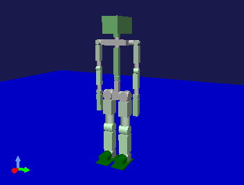
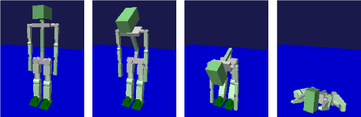

コントローラの導入
==================

.. sectionauthor:: 中岡 慎一郎 <s.nakaoka@aist.go.jp>

.. contents:: 目次
   :local:

.. highlight:: cpp

コントローラの導入
------------------

シミュレーションにおいてロボットの制御を行うためには、シミュレーションプロジェクトにコントローラを導入する必要があります。導入の基本的な流れは以下のようになります。

1. 使用するコントローラアイテムの型を選択する
2. コントローラアイテムの型に適合したコントローラ本体を用意する
3. コントローラアイテムを生成し、ボディアイテムの小アイテムとして配置する
4. コントローラアイテムにコントローラ本体をセットする

これらについて以下で具体的な例を通して解説します。

シミュレーションプロジェクトの準備
----------------------------------

まず、 :doc:`simulation-project` で解説した手順に従って、コントローラ以外の要素が準備されたプロジェクトを作成しておくことにします。

今回は、コントローラによる制御対象となり得るモデルを用意します。 :ref:`bodymodel_samplemodels` の中に "SR1" というロボットモデルがありますので、これを使うことにしましょう。shareディレクトリの "model/SR1/SR1.body" を読み込んでください。

他に床のモデルとシミュレータアイテム、およびそれらをまとめるワールドアイテムを組み込んで、以下のようなプロジェクト構成にします。 ::

 [ ] - World
 [/]   + SR1
 [/]   + Floor
 [ ]   + AISTSimulator

.. images/controller-project1.png

シーンビュー上ではロボットモデルが以下のように表示されているかと思います。

SR1モデルは29個の関節を有する多リンクモデルであり、関節を動かすことで様々なポーズをとることが可能です。デフォルトでは図のような直立したポーズとなっていますが、他のポーズを初期状態としてシミュレーションを開始することも可能です。ポーズの編集方法については :doc:`../handling-models/index` の :doc:`../handling-models/pose-editing` や :doc:`../handling-models/legged-model` を参照してください。

:ref:`simulation-time-step` も忘れずに行っておきましょう。今回もとりあえずタイムステップに 0.001 (1ミリ秒）を設定しておくことにします。

.. _controller-no-controller-case:

コントローラ無しの場合
----------------------

コントローラの効果を明確にするため、まずはこのままコントローラが無い状態でシミュレーションを行ってみましょう。シミュレーションを開始すると、ロボットはどのようになるでしょうか？

図のように、シミュレーション開始直後から床に倒れこんでいくことになります。

コントローラがないので、関節には何も指令がいっておらず、関節トルクを発生しない、力が入っていない状態となっています。一方で、デフォルトの設定で重力はかかるようになっているため、重力に従ってロボットの各リンクが床まで落下していくような動きになります。

このように、コントローラがなければ立っていることも出来ないということで、ロボットに関してはやはりコントローラがなければ始まりません。歩行させたり、作業させたりしようと思えば、それなりのコントローラが必要になるというわけです。

.. _simulation_select_controller_item_type:

コントローラアイテム型の選択
----------------------------

Choreonoidでは、「コントローラアイテム」によってコントローラを導入します。コントローラアイテムは入出力の基盤を定義する抽象アイテム型であり、実際にはこれを継承したアイテム型を用います。また、一般的にはコントローラの本体はコントローラアイテムとは別に実装されるもので、そちらも用意しておく必要があります。

これは、コントローラ本体に関して、任意の実装形式をとれるようにするための仕組みです。実際のところ、ロボットのコントローラの形式には様々なものがあります。ロボットごとに独自のものもあれば、OpenRTMやROSといったミドルウェアの仕様に従って作成される場合もあります。コントローラアイテムは、それら各々の実装形式とChoreonoid上の仮想ロボットとの間の仲介役として機能します。実際に使用したいコントローラ本体の形式に対して、それに対応したコントローラアイテムを用いることで、コントローラ本体を導入するというわけです。

そのためには、使いたいコントローラの形式に対して、それに対応したコントローラアイテムが用意されている必要があります。現在Choreonoid本体に含まれているコントローラアイテムの型としては、以下のようなものがあります。

* **シンプルコントローラアイテム**

 Choreonoid独自のコントローラ実装形式である「シンプルコントローラ」形式に対応したコントローラアイテムです。この形式はコントローラ実装のシンプルさを重視して設計されたものです。他のモジュールとのネットワーク通信等の機能は含まれていませんが、あまり複雑ではないコントローラを効率的に実装することには適しています。

* **BodyIoRTCアイテム**

 ロボット用のミドルウェアである"OpenRTM"との連携を可能にするコントローラアイテムです。これを用いることで、OpenRTMのコンポーネントである「RTコンポーネント」を用いて仮想ロボットを制御することが可能となります。「OpenRTMプラグイン」を導入することで利用可能となります。

* **OpenHRPコントローラアイテム**

 ロボットシミュレータ"OpenHRP"のコントローラ形式に対応したコントローラアイテムです。実際にはOpenHRPバージョン3.0の形式に対応した「OpenHRP3.0コントローラアイテム」と、バージョン3.1の形式に対応した「OpenHRP3.1コントローラアイテム」があります。それぞれのバージョン用のOpenHRPプラグインを導入することで使用可能になります。このコントローラアイテムはOpenHRPの資産に対応するために用意されたもので、今からこの形式のコントローラを用いる必要はありません。

既存のコントローラアイテムが対応していない形式のコントローラを用いるためには、そのためのコントローラアイテムを提供するChoreonoidプラグインを新たに開発する必要があります。

.. なお、近年利用の広まっているROSに関しては、これに対応するためのコントローラアイテムを現在開発中です。

.. note:: コントローラの導入方法としては、コントローラ本体をそのままコントローラアイテム継承型として実装するという方法もあります。この方法では仮想ロボットにアクセスするネイティブのAPIを直接利用することができるため、コントローラの自由度と効率を最大限に高めることが可能です。ただしそのコントローラはChoreonoidでしか使用できず、プラグインとして実装する手間もかかるため、この方法は一般的なものではありません。

コントローラ本体の用意
----------------------

選択したコントローラアイテム型に適合した形式のコントローラ本体を用意します。既存のコントローラを用いてもよいですし、必要であれば新たに開発します。

今回は例としてシンプルコントローラアイテムを用いることにします。この場合、コントローラ本体としてシンプルコントローラの形式で実装されたものを用意します。シンプルコントローラ形式では、C++で "SimpleController" クラスを継承したクラスを定義して、いくつかの仮想関数をオーバーライドすることで制御コードを実装します。これをコンパイルして共有ライブラリ(.so)もしくはダイナミックリンクライブラリ(.DLL)のファイルとしたものが、コントローラの本体になります。実装方法の詳細については :doc:`howto-implement-controller` を参照してください。

Choreonoidにはシンプルコントローラのサンプルがいくつか含まれており、今回はその中のひとつを使います。サンプルはChoreonoidビルド時にCMakeオプションで **BUILD_SIMPLE_CONTROLLER_SAMPLES** が ON になっていると生成されます。このオプションはデフォルトでONになっていますが、そうなっていない場合はONにしてChoreonoidのビルドを行い、シンプルコントローラのサンプルを利用可能としておいてください。

.. _simulation-create-controller-item:

コントローラアイテムの生成
--------------------------

メインメニューの「ファイル」-「新規」から、使用するコントローラアイテム型を選択して生成します。生成したアイテムは、制御対象のボディアイテムの小アイテムとして配置します。あらかじめボディアイテムを選択してからコントローラアイテムを生成してもよいですし、生成後にこの配置になるようドラッグしてもOKです。この配置は、システムがコントローラアイテムの制御対象を特定するために必要な設定となっています。

今回の例では、「新規」メニューから「シンプルコントローラ」を選択してシンプルコントローラアイテムを生成し、下図のようにSR1アイテムの下に配置します。 ::

 [ ] - World
 [/]   + SR1
 [ ]     + SimpleController
 [/]   + Floor
 [ ]   + AISTSimulator

.. images/controller-project2.png

.. _simulation-set-controller-to-controller-item:

コントローラ本体のセット
------------------------

コントローラアイテムにコントローラの本体をセットします。

シンプルコントローラアイテムの場合、「コントローラモジュール」というプロパティにコントローラ本体のファイル名を設定することで、これを行います。

このプロパティの設定においては、ファイル選択のダイアログボックスを利用することも可能です。プロパティの値を編集する際に、値の右側にダイアログボックスのアイコンが表示されます。このアイコンをクリックするとダイアログボックスが開きますので、そこでコントローラのファイルを選択してください。

デフォルトではシンプルコントローラを格納するための標準ディレクトリを開くようになっています。標準ディレクトリは、 :doc:`../install/directories` で紹介した「プラグインディレクトリ」以下の "simplecontroller" というディレクトリになります。シンプルコントローラのサンプルもこのディレクトリ内に格納されます。

例として、SR1モデルを対象としたシンプルコントローラのサンプルである "SR1MinimumController" をセットしてみましょう。これはロボットの現在の姿勢を維持するだけの非常に単純なコントローラです。このファイルは標準ディレクトリ内に格納されている "SR1MinimumController.so" (Windowsの場合は "SR1MinimumController.dll") というファイルになりますので、上記のダイアログからこのファイルを選択してください。するとプロパティの値として "SR1MinimumController" が設定されるかと思います。この状態になっていればOKです。

なお、コントローラモジュールの設定は、ファイル選択用のダイアログボックスを用いずに、直接ファイル名を入力してもOKです。

.. note:: コントローラモジュールの設定において、ファイルの拡張子は省略することが可能です。その場合は稼働しているOSに合わせた拡張子が内部で自動的に付与されます。これによってどのOS上でも有効な設定とすることが可能です。ファイル選択用ダイアログから選択した場合は、上記のように拡張子が省略された形式で入力されます。

.. note:: 実際のファイルは、シンプルコントローラアイテムの「ベースディレクトリ」プロパティで指定したディレクトリ内に格納されているものとなります。プロパティとして「コントローラディレクトリ」と「プロジェクトディレクトリ」が指定可能です。デフォルトは「コントローラディレクトリ」で、この場合シンプルコントローラの標準ディレクトリ内のファイルが読み込まれます。「プロジェクトディレクトリ」の場合は現在読み込んでいるプロジェクトファイルが格納されているディレクトリから読み込まれます。またファイル名をフルパスで指定する場合、ベースディレクトリは「なし」となります。

シミュレーションの実行
----------------------

以上の設定を行った上でシミュレーションを実行してください。設定がうまくできていれば、今度はロボットが崩れ落ちることなく姿勢を維持できるはずです。"SR1MinimumController" に記述されたPD制御のコードにより、姿勢を維持するためのトルク指令が各関節に出力されているからです。

うまくいかない場合は、メッセージビューも確認してみてください。コントローラの設定や稼働に問題があると、シミュレーション開始時にその旨を知らせるメッセージが出力される場合があります。

.. note:: コントローラがひとつだけ設定されたボディアイテムに対しては、 :ref:`simulation-result-item-output` はボディアイテムの小アイテムではなく、コントローラアイテムの小アイテムとなります。これはアイテムツリーを見やすくするためで、結果の再生等の操作はコントローラが無い場合と比べて特に変わるわけではありません。

コントローラのサンプルは他にも用意されています。 :ref:`basics_sample_project` を参考にして、他のサンプルも試してみてください。SR1モデルを対象としたサンプルとしては、歩行を行う "SR1Walk.cnoid" や、箱を持ち上げる "SR1Liftup.cnoid" といったプロジェクトがあり、コントローラによってロボットの動作が変わることを確認できます。
