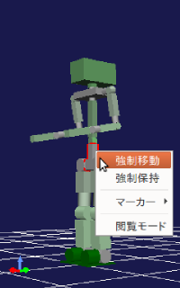

インタラクション機能
====================

.. sectionauthor:: 中岡 慎一郎 <s.nakaoka@aist.go.jp>

.. contents:: 目次
   :local:

.. highlight:: cpp

インタラクション機能とは
------------------------

シミュレーション中の仮想世界のロボットや物体について、力をかけたり移動したりといった働きかけをしたいときがあります。Choreonoidはそのような働きかけをユーザがGUI上でインタラクティブに行うための機能を備えており、これを「インタラクション機能」と呼んでいます。

操作方法
--------

インタラクションの操作はシーンビュー上で行います。

* シミュレーションが進行中
* シーンビューがエディットモード

という状態の時に、以下の操作が有効となります。

引っ張り操作
~~~~~~~~~~~~

モデルに力をかける操作です。シーンビュー上で力をかけたい部位をマウスの左ボタンでドラッグすると、ドラッグした方向に引っ張る力がかかります。力の大きさはドラッグの長さに比例したものとなります。仮想的なゴムひもをつけて、引っ張るようなイメージです。

この操作の際、力の作用点とドラッグ先を結んだ線が表示されますので、これをゴムひもに見立ててもらうと、力のかかり方をイメージしやすいかと思います。

この操作の様子を以下の図に示します。

.. image:: images/interaction-force.png

ここでは、まずロボットの頭部にマウスカーソルを合わせて、ここからドラッグを始めています。ここでは右側にドラッグしていて、ドラッグ先までの線が出ていることが分かります。結果としてこの方向にロボットが引っ張られて、転倒しそうになっています。

キーボード操作を組み合わせることで、力の大きさのスケールを変えることもできます。Shiftキーを押しながらドラッグを行うと、力の大きさが10倍になります。さらにCtrl + Shiftを押しながらドラッグすると、力の大きさが元の100倍になります。モデルを動かそうとしてドラッグしてもうまく動かない場合は、こちらの操作を試してみてください。

なお、ベースとなる力の大きさは、モデルの質量から適当に決めるようになっているのですが、かけたい力に対してこれが小さすぎたり大きすぎたりする場合もあります。ユーザがこの部分を任意に設定することは現状ではできないのですが、今後できるよう改良したいと思います。

強制移動・保持操作
~~~~~~~~~~~~~~~~~~

この操作はモデルのルートリンクに対してのみ有効です。上記の状態で移動させたいモデルのルートリンクを右クリックすると、

* 強制移動
* 強制保持

というメニュー項目が現れます（下図参照）。

「強制移動」を選択すると、この項目にチェックが入り、強制移動モードとなります。この状態でルートリンクをドラッグすると、物理法則を無視してモデルを強制的に移動することができます。例えば下図のようにロボットを床から浮かせて動かすようなこともできます。

.. image:: images/interaction-move2.png

一度ルートリンクをクリックするとドラッグ用のマーカーも表示されますので、そちらをドラッグしてもOKです。その場合モデルを回転させることも可能です。

この操作では、ドラッグを終了すると、再び物理法則に従った挙動に戻ります。例えばロボットをドラッグして床から浮かせていた場合、ドラッグを解除するとロボットが床まで落下することになります。

「強制保持」についても「強制移動」と同様の操作が可能です。ただしドラッグ終了時の挙動が異なっており、ルートリンクの位置はドラッグ時の状態で保持されたままとなります。保持状態を解除するには、メニューのチェックを外すなどして、強制保持モードを解除すればOKです。

シミュレーションと表示の同期について
------------------------------------

冒頭で述べたように、インタラクション操作は進行中のシミュレーションに対してのみ有効なものです。既に終了しているシミュレーション結果の再生時や、振り付け動作の確認時などに適用できるものではありません。今表示されているモデルの挙動が、進行中のシミュレーションによるものなのか、他の機能によるものなのかについて、注意が必要です。

さらに、シミュレーションの進行とその表示が同期している必要があります。ユーザのインタラクション操作はシーンビュー上の表示に対して行い、その内容をシミュレータ内部の物理計算にフィードバックさせているので、両者のタイミングにズレがあると思い通りに操作できないことになります。通常は同期がとれているのですが、タイムバーの「進行中の更新に同期」がオフになっている場合は、その限りではありません。詳しくは :ref:`simulation_playback_ongoing_simulation` を参照してください。

