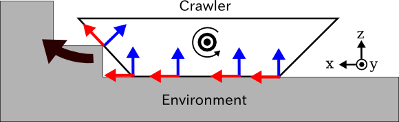

無限軌道の簡易シミュレーション
==============================

.. sectionauthor:: 中岡 慎一郎 <s.nakaoka@aist.go.jp>

.. contents:: 目次
   :local:

.. highlight:: cpp

無限軌道とは
------------

「無限軌道(Continuous Track)」は戦車や重機等でよく用いられている移動機構である「キャタピラー」や「クローラ」といったものの総称として用いています。これらはロボットの移動機構としても広く用いられています。また、ベルトコンベアーといった装置もこの機構の一種であると言えます。

Choreonoidはこの無限軌道機構の簡易的なシミュレーションを行う機能を備えています。これは実際の機構を精密に再現するものではないのですが、比較的平らな地面の上での移動などであれば、ある程度のシミュレーションを行うことができます。以下ではその利用方法について解説します。

無限軌道モデルの作成
--------------------

まず利用するモデルにおいて無限軌道機構を定義しておく必要があります。これは以下のようにして行います。

* 無限軌道の全体をひとつのリンクとしてモデリングする
* このリンクの関節タイプとして"pseudoContinuousTrack"を指定する
* 関節の可動軸パラメータに無限軌道の回転軸を指定する

無限軌道を含むモデルのサンプルとして、"Crawler"というモデルを用意しています。これはshareディレクトリの "model/misc/" 以下にある "crawler.wrl"というファイルで定義されており、以下のような外観をもっています。

.. image:: images/crawler-model.png

モデルの黒い部分が無限軌道に対応しており、左右にひとつずつ、計２つ備えています。以下ではこの部分を「クローラ」と呼ぶことにします。

モデル全体は３つのリンクで構成されており、以下のような関節構造としています。

| + BODY (ルートリンク）
|   + CRAWLER_TRACK_L (左クローラ）
|   + CRAWLER_TRACK_R (右クローラ)

まずBODYというルートリンクを定義しています。これはモデル中心部の緑色の部分に対応します。ルートリンクをクローラにすることはできませんので、このようにまずベースとなるルートリンクを定義してください。

左クローラに対応する "CRAWLER_TRACK_L" はモデルファイルにおいて以下のように定義されています。 ::

 DEF CRAWLER_TRACK_L Joint {
   translation 0.0 0.15 0
   jointType "pseudoContinuousTrack"
   jointAxis 0 1 0
   jointId 0
   children [
     DEF CRAWLER_TRACK_L_LINK Segment {
       ...
     }
   ]
 }

関節タイプを指定する "jointType" フィールドに "pseudoContinuousTrack" を指定しています。これによって、このリンクが無限軌道の簡易シミュレーションの対象であることを示しています。

関節可動軸を指定する "jointAxis" フィールドには、クローラの回転軸を指定します。クローラの回転軸とは、クローラを駆動する内部の車輪を想定した際に、その回転軸に一致するベクトルです。ここでは "0 1 0" を指定し、Y軸と一致させています。

クローラの形状はSegmentノードで記述しています。この部分は、ローカル座標の原点がクローラ内部の点となるようにモデリングする必要があります。ク

ここで定義しているクローラの原点と回転軸は、モデルの前後方向にクローラが動くことを想定したモデリングとなっています。

右クローラに対応する "CRAWLER_TRCK_R" も同様に記述しています。

.. note:: Choreonoidの以前のバージョンでは無限軌道の簡易シミュレーションに対応する関節タイプを"crawler"としていました。このタイプもまだ使うことが出来ますが、今後は"pseudoContinuousTrack"を使うようにしてください。

対応シミュレータアイテム
------------------------

無限軌道の簡易シミュレーションを行うためには、利用するシミュレータアイテムがこれに対応している必要あります。

現在のところ、

* AISTシミュレータアイテム
* ODEシミュレータアイテム
* Bulletシミュレータアイテム

がこの機能に対応しています。

簡易シミュレーションの概要
--------------------------

本機能による無限軌道のシミュレーションは、あくまで簡易的なシミュレーションです。実際の機構とは以下の点で異なります。

* 無限軌道の表面が回らない
* 無限軌道の表面が変形しない

無限軌道による駆動力は、無限軌道の表面と環境との間に力を直接付与することで実現しています。この力は、接触点における相対速度が目標値となるような拘束条件から算出しています。これは実際の無限軌道の駆動メカニズムとは異なりますので注意が必要です。

また、実物の無限軌道ではその表面が環境に合わせて変形することによって安定性や走破性を高めているわけですが、簡易シミュレーションではそのような変形も生じません。結果として、凹凸のある地形での安定性や走破性は実物よりもずっと劣るものとなってしまいます。

接触点に付与する力の向きは、無限軌道の回転軸と接触法線の外積の向きとしています。サンプルモデルのクローラが以下のように環境と接しているとき、これらのベクトルは以下のようになっています。

クローラの回転軸は図の正面側（Y軸方向）に向いたベクトルとなっています。環境との接触点における接触法線を青矢印とすると、回転軸と接触法線の外積をとったベクトルが赤矢印で、正の指令値を入力した際にはこの方向への駆動力が発生します。この結果、クローラ全体は図の左側(X軸方向）に進んで行き、階段も乗り越えていくことになります。

指令値の与え方
--------------

無限軌道の簡易シミュレーションにおいて、無限軌道への指令値は、その駆動速度（接触点で実現すべき相対速度）の大きさとして与えます。この値は、無限軌道に対応する関節の関節速度値として出力すればOKです。

例えば、サンプルモデルのクローラをSimpleControllerを用いて駆動させる場合、まずinitialize()関数にて ::

 io->setJointOutput(JOINT_VELOCITY);

とすることで指令値の出力をできるようにします。  
 
そして、制御ループで以下のような処理を行えばOKです。 ::

 ioBody->joint("CRAWLER_TRACK_L")->dq() = 1.0;
 ioBody->joint("CRAWLER_TRACK_R")->dq() = 1.0;

このようにすると、左右のクローラに同じ駆動力が与えられて、モデル全体が1.0[m/s]の速度で前方に進むことになります。（ここで用いている変数ioBodyはio->body()によって得られる入出力用Bodyオブジェクトです。）

また、以下のように左右に異なる指令値を与えることで、モデルを旋回させることができます。 ::

 ioBody->joint("CRAWLER_TRACK_L")->dq() =  1.0;
 ioBody->joint("CRAWLER_TRACK_R")->dq() = -1.0;

この場合、モデルが右に回転します。

.. note:: Choreonoidの以前のバージョンで用いられていた"crawler"タイプの関節では、上記の速度指令値を関節トルクに対応する変数を介して出力するようになっていました。これについて"pseudoContinuousTrack"においては素直に関節速度として出力するようになりましたので、移行の際にはご注意ください。

シミュレーションサンプル
------------------------

サンプルクローラモデルを動かすサンプルとして、"SampleCrawler.cnoid" というプロジェクトがあります。このプロジェクトでシミュレーションを実行すると、クローラモデルが図のように床の段差を乗り越えながら移動します。

.. image:: images/SampleCrawlerProject.png

ここで使われているコントローラはSimpleController形式で実装されています。ソースファイルは "src/sample/SimpleController/SampleCrawlerController.cpp" になりますので、参考にしてください。

また、"SampleCrawlerJoystick.cnoid"では、USB接続のジョイスティック（ゲームパッド）によってクローラモデルを操作することができます。ジョイスティックのひとつめのアナログスティックについて、その上下左右がクローラモデルの前進、後退、左旋回、右旋回に対応しています。

ジョイスティックを接続していない場合、以下の「仮想ジョイスティックビュー」を用いることでジョイスティックと同様の操作が可能です。

.. image:: images/VirtualJoystickView.png

ジョイスティックのひとつめのアナログスティックがキーボードの"E"、"D"、"S"、"F"に割り当てられており、それぞれスティックの上下左右に対応します。シミュレーションを開始したらこのビューの内部をクリックしてキーボードフォーカスを入れてください。するとこれらのキーを押すことでクローラモデルを操作できます。

このコントローラのソースは "src/sample/SimpleController/SampleCrawlerJoystickController.cpp" になります。
