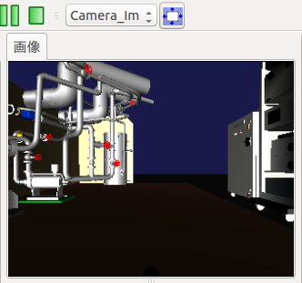

センサ状態の表示
================

.. sectionauthor:: 中岡 慎一郎 <s.nakaoka@aist.go.jp>

.. contents:: 目次
   :local:

.. highlight:: cpp

センサ値の確認方法
------------------

ロボットの状態を確認するために、ロボットに搭載されているセンサの状態値を確認したいことがあります。Choreonoidはこれを行うための機能として、以下の機能を用意しています。

* ボディ状態ビュー
* センサビジュアライザアイテム

これらの機能の対象となるのは、Choreonoid上にボディアイテムとして読み込まれているボディモデルで、そこに格納されているセンサ情報を参照しています。

これらの機能をシミュレーション結果に対して適用するためには、シミュレーションにおけるセンサの状態がボディモデルに出力されるよう、 :ref:`simulation-device-state-recording` を有効にしておく必要があります。
そのようにしておけば、ロボットのコントローラ等には特に手を加えずに、センサの状態表示を簡単に実現できます。
また、カメラやレンジセンサの表示を行うには :ref:`simulation-gl-vision-simulator` が必要です。こちらの結果もボディモデルに出力されるよう、プロパティで :ref:`ビジョンデータの記録 <simulation-gl-vision-simulator-property>` を有効にしておく必要があります。

ボディ状態ビュー
----------------

センサの状態値をそのまま数値で表示するビューとして、「ボディ状態ビュー」が用意されています。

これを使うためには、まずメインメニューの「表示」-「ビューの表示」から「ボディ状態」を選択してビューを表示させてください。このビューは、デフォルトでは何も表示されません。アイテムツリービュー上でなんらかのボディアイテムを選択すると、そのボディモデルが有するセンサ値の一覧を表示するようになります。

例えばSR1サンプルモデルを対象とした場合、以下のように表示されます。

.. image:: images/BodyStateViewSR1.png

初期状態では図のように全ての値が0となっていますが、シミュレーションを開始すると数値が変化します。また、記録しておいたシミュレーション結果の再生時にも対象時刻の状態が表示されます。

なお、このビューの表示対象となるセンサ型は、今のところ力センサ、加速度センサ、レートジャイロセンサの３つとなっています。

センサビジュアライザアイテムアイテム
------------------------------------

センサの状態をシーンビュー上の3DCGを用いて視覚的に表示する機能として、「センサビジュアライザアイテム」が利用可能です。これを用いることで、ロボットの状態を直観的に把握することができます。

利用にあたっては、まずこのアイテムを生成します。下図のように、メインメニューの「ファイル」-「新規」から「センサビジュアライザ」を選択し、生成したアイテムを対象となるボディアイテムの小アイテムとして配置して下さい。

.. image:: images/sensorVisualizerItem.png

すると、ボディモデルが備えているセンサがセンサビジュアライザの小アイテムとして配置されます。現在のところ対応しているセンサは力センサと :ref:`simulation-gl-vision-simulator-sensor` のカメラ、レンジカメラ、レンジセンサとなっています。
アイテム名はセンサ名が割当られます。レンジカメラの場合、画像用（センサ名に"_Image"が付いて表示）と距離画像用の2つのアイテムが生成されます。

この子アイテムにチェックを入れると、センサのデータを可視化することが出来ます。

力センサを可視化した場合は、モデルの現在のセンサ値がシーンビュー上に矢印マーカで表示されます。力センサが有する力・トルクの６軸成分のうち、可視化されるのは力の３軸成分のみとなっており、これを力センサの位置からのベクトルとして矢印マーカで表示します。

以下はSR1の歩行サンプルにおいて、両足首に搭載された力センサを可視化した例です。

.. image:: images/sr1-force-visualizer.png

ここではセンサ可視化のマーカを分かりやすくするため、シーンビューを :ref:`basics_sceneview_wireframe` としています。

マーカの長さについては、センサ可視化アイテムの「表示比率」プロパティで調整できます。この値を、マーカが見やすい長さとなるよう状況に応じて調整してください。

距離画像カメラ、レンジセンサを可視化した場合は、シーンビュー上に点群として表示されます。以下は、サンプルプロジェクトTankVisionSwnsorsでの、それぞれの表示例です。

.. image:: images/tank-range-visualizer.png

カメラの画像は、 画像ビューに表示することが出来ます。アイテムへのチェックは必要ありません。

メインメニューの「表示」-「ビューの生成」から「画像」を選択し、画像ビューを生成します。また、「表示」-「ツールバーの表示」から「画像ビューバー」を選択し、ツールバーに追加します。

画像ビューバーのコンボボックスには、センサビジュアライザによって可視化できるカメラがリストされていますので、まず、画像ビューを選択し（ビュー画面をクリックすると選択状態になります。）コンボボックスからカメラを選択します。
隣のボタンで、ビューに合わせて画像を拡大縮小することが出来ます。

画像ビューはいくつも作成出来ますが、画像ビューバーは一つですので、画像ビューバーでの操作は、選択されている画像ビューに作用することに気を付けてください。以下は、画像ビューバー、画像ビューのカメラ表示例です。

