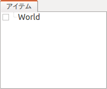
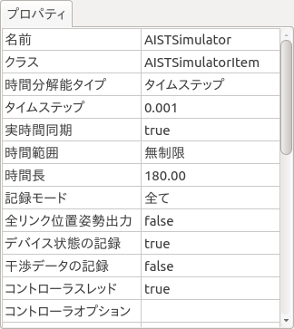

シミュレーションプロジェクトの作成
==================================

.. sectionauthor:: 中岡 慎一郎 <s.nakaoka@aist.go.jp>

.. contents:: 目次
   :local:

.. highlight:: cpp

シミュレーションプロジェクト
----------------------------

Choreonoid上でシミュレーションを行うためには、必要なプロジェクトアイテムの読み込みや生成を行い、シミュレーション用のプロジェクトを用意しておく必要があります。プロジェクトには最低限以下の3種類のプロジェクトアイテムが必要となります。

* シミュレーション対象となる仮想世界を表すワールドアイテム
* シミュレーション対象となるロボットや環境物体のボディアイテム
* シミュレーションを実行するシミュレータアイテム

「ワールドアイテム」はひとつの仮想世界に対応するプロジェクトアイテムで、「ボディアイテム」はロボットや環境物体のモデル(ボディモデル）に対応するアイテムです。これらの詳細は :doc:`../handling-models/index` を参照してください。対象となるボディアイテムの全てをワールドアイテムの小アイテムとして配置することで、シミュレーション対象となる仮想世界を構築します。これは :doc:`../handling-models/collision-detection` で述べた仮想世界の構築と同様の操作になります。

次に、シミュレータアイテムを生成します。これはメインメニューの「ファイル」-「新規」から、希望するシミュレータアイテムを選択して生成してください。これもワールドアイテムの小アイテムとして配置します。そのように配置することで、このシミュレータアイテムがワールドアイテムと関連付けられ、シミュレーション対象となる仮想世界が決定します。

他には、ロボットや環境物体の初期位置の設定や、シミュレーションにおける時間分解能（タイムステップ）の設定を行います。またシミュレータアイテムのプロパティによってもシミュレータの設定を変更することが可能です。

以下では実際にプロジェクトを作成しながら、上記の操作について具体的に解説します。

ワールドアイテムの作成
----------------------

メインメニューの「ファイル」-「新規」-「ワールド」を呼び出します。すると「新しいワールドアイテムの生成」というダイアログが出るので、ここで「生成」ボタンを押して生成します。名前は"World"のままでもよいですし、シミュレーション対象がより分かりやすくなるよう、名前を変更してもかまいません。

アイテムツリービューを確認することで、ワールドアイテムが生成されていることを確認できます。

モデルの読み込み
----------------

次にシミュレーション対象のモデルをボディアイテムとして読み込みます。ここでは :ref:`bodymodel_samplemodels` の中から、直方体モデルと床モデルを読み込んでみましょう。 :ref:`loading_model` で説明した操作方法に従って、サンプルの "box1" モデルと"floor"モデルのファイルを読み込んでください。

その際に以下の図のようにbox1とfloorのアイテムがワールドアイテムの小アイテムとなるように配置してください。ワールドアイテムを選択状態にしてからモデルの読み込みを行ってもよいですし、とりあえずモデルを読み込んでからWorldアイテムのところへドラッグしてもOKです。この位置関係が正しく設定されていないと、シミュレーションがうまく動作しないことになりますので、注意してください。 ::

 [ ] - World
 [/]   + box1
 [/]   + Floor

.. images/simproject-item2.png

アイテムツリーの配置はこのようになります。読み込んだ２つのボディアイテムにチェックを入れて、モデルをシーンビューに表示しましょう。チェックを入れると、シーンビューには以下のように表示されたかと思います。ここで黄色い物体がbox1モデル、青い物体が床モデルです。

.. image:: images/simproject-scene1.png

.. note:: 今回床のモデルとして読み込んだ "floor" モデルは「静的モデル」となっています。静的モデルは、動かない物体として定義されたモデルで、シミュレーション中に他の物体が衝突をして影響を受けることはありますが、それ自体は動きません。一方で、box1モデルの方は動的モデルとして定義されています。動的モデルに対しては、シミュレーション中に発生する内力や外力によって動きが生じます。シミュレーションプロジェクトの作成にあたっては、静的モデルと動的モデルをうまく使い分けるようにしてください。モデルの種類は、ボディアイテムの「静的モデル」プロパティで確認することができます。また、このプロパティを編集することで、モデルの種類を切り替えることも可能です。

.. note:: :doc:`../handling-models/collision-detection` の :ref:`handling-models-collision-detection-for-simulation` で述べたように、ワールドアイテム、ボディアイテムに対する「干渉検出」プロパティの設定はシミュレーションには影響がない点にご注意ください。シミュレーションにおいては、基本的に衝突する可能性のある全ての物体の組み合わせについて干渉検出を行う必要があり、モデルごとに干渉検出を行うかどうか設定することは本来望ましくありません。仮にそのような設定をする場合でも、その設定方法はシミュレータアイテムに依存します。

.. _simulation_setting_initial_status:

初期状態の設定
--------------

モデルを読み込んだ直後のモデルの位置や姿勢に関する状態は、モデルファイルに記述された初期位置か、モデルの原点がグローバル座標の原点に一致する位置となっています。このままでよい場合はよいのですが、通常はモデルの初期状態を設定しなおす必要があります。

今回の例では、box1モデルが床にめり込んだ位置となってしまっています。これを修正し、床の上方からbox1モデルを落下させるような位置に設定してみましょう。 :ref:`model_move` で述べたマウス操作か :ref:`model_body_link_view` を用いて、box1モデルを動かし、図のような位置まで持って行ってください。

.. image:: images/simproject-scene2.png

この位置をシミュレーションの初期状態とするには、そのための操作が必要です。ツールバーのひとつであるシミュレーションバーについて、図に示す「シミュレーション初期状態設定ボタン」を用いてこの操作を行います。

まず、初期状態を設定し直したいモデルのアイテムを、アイテムツリービュー上で選択状態にします。その状態で初期状態設定ボタンを押すと、現在のモデルの状態がシミュレーションの初期状態として登録されます。登録に成功すると、その旨がメッセージビューに表示されます。

なお、仮想世界に存在する全てのボディモデルについて一括して初期状態を設定することも可能です。その場合はあらかじめ全てのモデルの状態を編集した上で、ワールドアイテムを選択してください。その状態で初期状態設定ボタンを押せばOKです。

.. note:: 初期状態設定ボタンによる初期状態の登録は、モデルの位置や姿勢を編集した後に忘れずに行うようにしてください。この操作を忘れると、モデル読み込み時のデフォルトの状態か、前回設定した初期状態でシミュレーションが始まることになります。実はこの操作で設定した初期状態ではなく、現在のモデルの状態（画面上に表示されているもの）でシミュレーションを開始する機能もあるのですが、そちらはシミュレーションの実行や再生に伴い変わってしまうものです。プロジェクトとしては初期状態を固定したいことが普通であり、その場合の使い勝手を考慮してこのような設定方法としています。

現在設定されている初期状態については、以下のボタンを押すことで呼び出すことができます。

.. image:: images/simbar-restore-button.png

この操作についても、ボディアイテムかワールドアイテムを選択しておくことで、対象とするボディモデルを指定します。

.. note:: 今回のbox1は1リンクモデルですので、初期状態としてモデル全体の位置・姿勢を設定すればOKでした。これに対して、関節を有する多リンクモデルの場合、関節角度（または直動関節の並進量）についても初期状態の設定対象となりますので、必要に応じてそちらの設定も行ってください。関節を含む姿勢の編集方法については、 :doc:`../handling-models/index` - :doc:`../handling-models/pose-editing` を参照して下さい。

.. _simulation_creation_and_configuration_of_simulator_item:

シミュレータアイテムの作成と設定
--------------------------------

シミュレーションの実行主体となるシミュレータアイテムを生成します。

ここではChoreonoidの標準のシミュレータアイテムである「AISTシミュレータ」を用いることにしましょう。メインメニューの「ファイル」-「新規」-「AISTシミュレータ」を選択して生成してください。これも以下のようにワールドアイテムの小アイテムとして配置しておきます。 ::

 [ ] - World
 [/]   + box1
 [/]   + Floor
 [ ]   + AISTSimulator

.. images/simproject-item3.png

シミュレータアイテムに対して、そのプロパティを通してシミュレーションの設定を行うことができます。シミュレータアイテムを選択すると、アイテムプロパティビューに以下のように設定項目が表示されます。

今回はこれらのプロパティについてはデフォルトの設定でシミュレーションを行います。（ただし、「実時間同期」が"false"となっていた場合は、これを"true"に変更してください。）

プロパティの詳細については、 :doc:`simulator-items` を参照してください。

.. AISTシミュレータアイテムでは、干渉検出について「異なるボディオブジェクト間の干渉は全て検出し、ボディオブジェクト内の自己干渉については検出しない」という仕様としています。自己干渉を対象外とすることで、シミュレーション速度を向上させることができます。ただしこの仕様は暫定的なもので、実際には自己干渉が必要な場合もありますので、そのような設定にも切り替えられるように今後改良したいと思います。

.. _simulation-time-step:

時間分解能の設定
----------------

シミュレーションでは通常、時間を一定の時間分解能（タイムステップ）で区切って、１回の物理計算ではその分だけ時間が進んだ状態を計算します。この時間分解能を高くすることでシミュレーションの精度や安定性を向上させることができますが、その分シミュレーションにかかる計算時間は長くなってしまいます。シミュレーションの目的や対象モデルの状況、シミュレータアイテムの特性等を考慮しながら、適切な時間分解能を設定する必要があります。

この設定はシミュレータアイテムのプロパティで行います。まず「時間分解能タイプ」を以下の3つの中から選択します。

1. タイムステップ
2. フレームレート
3. タイムバー

「タイムステップ」を選択すると、シミュレータアイテムのプロパティとして「タイムステップ」という項目が設定可能になりますので、ここにタイムステップを秒で設定します。例えば、0.001を設定すると、1回の物理計算で1ミリ秒時間が進むことになります。

「フレームレート」を選択すると、シミュレータアイテムのプロパティとして「フレームレート」という項目が設定可能になります。これは単位時間（1秒）あたり何回物理計算を行うかという値です。例えばここに1000を設定すると、タイムステップとしては1ミリ秒ということになります。

「タイムバー」を選択すると、時間分解能の設定をタイムバーで行うようになります。この場合は :ref:`basics_timebar_config` の説明に従って、タイムバーの設定ダイアログを表示してください。ダイアログ上の「内部フレームレート」の値が、シミュレーションのフレームレートとして使用されます。

時間分解能タイプとして、デファルトでは「タイムステップ」が選択されています。今回はこれを使用することとし、「タイムステップ」プロパティに0.001を設定してください。これにより、1ミリ秒のタイムステップでシミュレーションが行われることになります。

.. note:: シミュレーションがうまくいかない理由として、時間分解能が十分でないのが原因ということもよくありますので、新たなシミュレーションプロジェクトを始めるときに、最初はなるべく細かい値を設定するようにしてください。ここで行っているように、タイムステップで1ミリ秒程度の値を設定すれば、大抵の場合で大丈夫かと思います。

プロジェクトの保存
------------------

以上で今回のシミュレーションプロジェクトを実行する準備が整いました。この状態について、通常はプロジェクトファイルに保存しておきます。そのようにしておけば、上記の操作を何回も繰り返すことなく、次回Choreonoidを使用するときにすぐにシミュレーションを再開できますし、不具合が生じた際の対応もしやすくなります。プロジェクトファイルへの保存方法については、 :ref:`basics_project_save` を参照してください。

シミュレーションの実行
----------------------

シミュレーションバーの以下のボタンを押すことで、シミュレーションを実行できます。

.. image:: ../basics/images/SimulationBar_StartButton.png

今回のシミュレーションでは、box1モデルが重力に従って落下し、床にあたって止まるという結果が得られればOKです。

