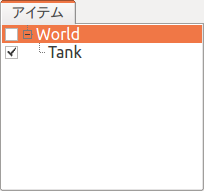
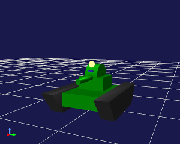
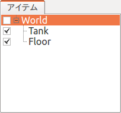
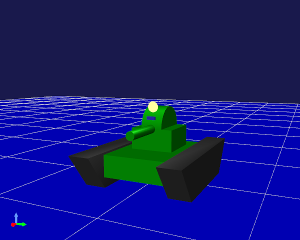
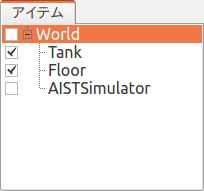
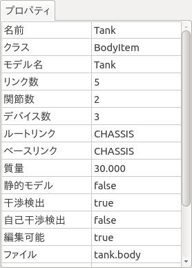

ステップ1: シミュレーションプロジェクトの作成
=============================================

まずはシミュレーション対象となるモデルをChoreonoid上に読み込んで、シミュレーション用のプロジェクトを作成します。この手順の詳細は :doc:`../simulation-project` を参照して下さい。ここでは今回必要な作業を具体的に説明していきます。

.. contents:: 目次
   :local:
   :depth: 2

.. highlight:: sh

Choreonoidの起動
----------------

まずChoreonoidを起動しましょう。

どのように起動してもよいのですが、本チュートリアルでは説明の都合上、コマンドライン端末から起動するものとします。また、説明を簡潔にするため、Choreonoidビルド時にビルドディレクトリ内に生成される実行ファイルを直接実行するものとします。この場合、"make install" によるインストール操作を行う必要はありません。

例えば、ソースディレクトリ直下でビルドした場合は、ソースディレクトリがそのままビルドディレクトリとなりますので、端末上で以下のようにしてChoreonoidを起動します。 ::

 cd [ソースディレクトリ]
 bin/choreonoid

この場合、Choreonoidに付属のモデルファイルや、本チュートリアルで新たに作成するコントローラのファイル等は、Choreonoidのソースディレクトリ内のものが使われるようになります。この方が、ディレクトリがひとつにまとまっていて分かりやすいかと思います。

.. note:: もちろん、"make install" によって"/usr/local"等のディレクトリにインストールされたファイルを使ってもOKですので、必要であればそのようにして下さい。この場合、コントローラの作成時にも"make install"を実行して、使用するコントローラのファイルもインストール先に格納されているものが対象となりますので、その点ご注意下さい。
.. note:: Linuxの基本的な使用方法については、 :doc:`../../tips/howto-use-commands` を参照ください。

ワールドアイテムの作成
----------------------

Choreonoidを起動したら、まずワールドアイテムを作成しましょう。メインメニューの「ファイル」-「新規」から「ワールド」を選択します。すると「新しいワールドアイテムの生成」ダイアログが出ますので、ここで「生成」ボタンを押します。すると以下の図のように、 :ref:`basics_mainwindow_itemtreeview` 上に "World" という名前のアイテムが表示されたかと思います。

.. image:: ../images/simproject-item1.png

ワールドアイテムはひとつの仮想世界に対応するものであり、シミュレーションを実行するにあたって必ず生成しておく必要があります。

Tankモデルの読み込み
--------------------

今回のシミュレーション対象となる、Tankモデルを読み込みます。Tankモデルはその名のとおり戦車風のモデルであり、2軸の砲塔と左右2つのクローラで構成されます。また、ライト（光源）とカメラも備えています。

まず、アイテムツリービュー上で先ほど作成したWorldアイテムをクリックして、選択状態にしておきましょう。このようにしておくことで、新たに読み込むアイテムがWorldの小アイテムとなります。

次にメインメニューの「ファイル」-「読み込み」から「ボディ」を選択します。するとファイル読み込み用のダイアログが表示されますので、ここでモデルファイルを選択します。TankモデルはChoreonoidインストール先の "share/model/tank" ディレクトリに格納されている "tank.body" というファイルに記述されていますので、これを探して読み込んで下さい。この際、ダイアログの左下に表示されている「アイテムツリービューのチェックを入れる」という項目にチェックを入れておくとよいです。

モデルファイルが正常に読み込まれると、アイテムツリービューには以下のように表示されるはずです。

ロボットや環境のモデルはChoreonoid上では :doc:`../../handling-models/bodymodel` と呼ばれており、これはアイテムツリービュー上で「ボディアイテム」として管理されます。今回読み込んだTankモデルに対応するボディアイテムが、アイテムツリービュー上で"Tank"と表示されています。

ここで、TankアイテムはWorldアイテムの一段右側に表示されている（＝Worldアイテムの小アイテムとなっている）ことが重要です。この配置関係をとることで、TankモデルがWorldの仮想世界に所属していると認識されるからです。Tankモデルの読み込み時にWorldアイテムが選択状態となっていれば、この配置になっているはずですが、そうでない場合は、アイテムの :ref:`basics_item_move` 操作（TankモデルをドラッグしてWroldアイテムの位置でドロップする）等を行って、この配置となるようにして下さい。

また、Tankアイテムの左側にチェックが入っているかを確認して下さい。先ほどの読み込みダイアログで「アイテムツリービューのチェックを入れる」が有効になっていれば、上図のようにチェックが入っているはずです。入っていない場合は、この部分をクリックしてチェックを入れるようにして下さい。

Tankアイテムのチェックが入ると、このモデルがシーンビュー上に表示されます。

ここでシーンビューに対する :ref:`basics_sceneview_viewpoint` 操作を行って、Tankモデルが見やすく表示されるようにしておくとよいでしょう。例えばシーンビュー上でマウスのホイールを操作することで、視点を前後に移動させ、モデルを大きく表示することができます。上図もそのような操作を適用したものとなっています。

なお、Tankモデルの簡略版である "SimpleTank" モデルについて、モデルファイルの作成方法を :doc:`../../handling-models/modelfile/modelfile-newformat` にて解説しています。TankモデルについてはSimpleTankの形状を外部のモデリングツールで作成したものに置き換えたものとなっており、その方法は :doc:`../../handling-models/modelfile/tank-blender` にて紹介しています。

.. note:: TankモデルはCOLLADA形式のメッシュファイルを使用しており、その読み込みには「Assimpプラグイン」が必要となります。Assimpプラグインがビルドされていない場合、モデル読み込み時に「"tank.dae"のファイル形式はシーンローダでサポートされていません。」というメッセージが表示され、読み込んだモデルにチェックを入れてもシーンビュー上に表示されません。この場合は、 :ref:`build-ubuntu-install-packages` を再度実行することでAssimpライブラリをインストールしてから、 :ref:`build-ubuntu-cmake` で **BUILD_ASSIMP_PLUGIN** をONにして再度ビルドを行って下さい。これでもうまく表示されない場合は、Tankモデルの簡易版である "share/model/tank/simpletank.body" を読み込むようにして下さい。

.. note:: 本チュートリアルはもともとSimpleTankを対象としていたため、以下の解説ではTankモデルの図がSimpleTankとなっていますが、ご了承ください。モデルの基本的な内容は同じになりますので、どちらのモデルを使用していも問題ありません。
	  

床モデルの読み込み
------------------

Tankモデルを読み込みましたが、このままではシミュレーション実行時にTankが重力によってどこまでも落下していってしまいます。そこでTankモデルを支えるための環境モデルとして、床のモデルも読み込んでおきましょう。

先ほどと同様に、Worldアイテムを選択した状態でメインメニューの「ファイル」-「読み込み」-「ボディ」を選択し、Choreonoidインストール先の "share/model/misc" ディレクトリ内の "floor.body" というファイルを読み込んで下さい。するとアイテムツリービューは以下のようになるかと思います。

tankアイテムと同様に、

* Worldアイテムの小アイテムとなっているか
* Floorアイテムのチェックが入っているか

を確認して下さい。

チェックが入っていれば、シーンビュー上で以下の図のように床のモデル（青い部分）も表示されるかと思います。

これでモデルの準備ができました。

なお、今回は各モデルの初期状態（位置・姿勢）としてデフォルト（読み込み時）のものをそのまま使用していますが、初期状態を変更したい場合は、 :ref:`simulation_setting_initial_status` を参照して下さい。

.. note:: 床のモデルは必ずしもシーンビュー上に表示する必要はありません。今回使用するFloorモデルはZ=0の平面に相当するシンプルなものなので、デフォルトの床グリッドの表示があれば十分かもしれません。その場合はFoorアイテムのチェックを外して、表示をオフとしてもOKです。モデルのアイテムがWorldアイテムの小アイテムとなっていれば、表示のオン／オフに関わらず、シミュレーションにおいては存在するものとみなされます。

シミュレータアイテムの作成
--------------------------

シミュレーションを行うためには、 :ref:`simulation_simulator_item` を作成しておく必要があります。

今回は標準のシミュレータアイテムである "AISTシミュレータ" を使うことにしましょう。メインメニューの「ファイル」-「新規」から「AISTシミュレータ」を選択し、アイテムの生成を行って下さい。

生成したシミュレータアイテムは、モデルのアイテムと同様に、Worldアイテムの小アイテムとして配置しておきます。これにより、シミュレータアイテムのシミュレーション対象となるワールドを明示します。従って、上記のアイテム生成操作を行う際にも、Worldアイテムを選択状態にしておくとよいでしょう。生成したアイテムがアイテムツリービュー上で以下のように表示されていればOKです。

プロパティの設定
----------------

シミュレーションを適切に実行するため、アイテムのプロパティ設定を行います。

まずTankアイテムのプロパティ設定をしましょう。Tankアイテムを選択すると :ref:`basics_mainwindow_item_property_view` 上にこのアイテムのプロパティ一覧が下図のように表示されます。

シミュレーションを行う際に関係するボディアイテムのプロパティとして、「自己干渉検出」があります。これはデフォルトでは false となっており、モデルのリンク同士で衝突が起きてもそこで止まらずにすり抜けていってしまいます。本チュートリアルではTankモデルの砲身と車体との衝突が想定されるため、このプロパティを true として自己干渉検出を有効にしておきましょう。

「自己干渉検出」プロパティの値として false が表示されている箇所をダブルクリックすると、 true か false を選択するコンボボックスが表示されるので、そこで true を選択してください。

シミュレーションを行う際には、シミュレータアイテムのプロパティも適切に設定しておく必要があります。今回はデフォルトの設定でOKですが、 :ref:`simulation-time-step` 、 :ref:`simulation-time-range` 、 :ref:`simulation-realtime-sync` 、 :ref:`simulation-result-recording` 、 :ref:`simulation-device-state-recording` 等の設定を行うことが可能です。

.. _tank-tutorial-step1-save-project:

プロジェクトの保存
------------------

ここまでの作業で、シミュレーションプロジェクトの土台を構築することができました。このタイミングで :ref:`basics_project_save` を行っておくとよいでしょう。

メインメニューの「ファイル」-「名前をつけてプロジェクトを保存」を選択し、表示されるダイアログでディレクトリやファイル名を指定して保存を行って下さい。ファイル名は今回は "step1.cnoid" などとし、本チュートリアルのステップごとにファイル名を分けて保存していくとよいかと思います。また、プロジェクト設定の変更後はこまめに上書き保存をしておくとよいでしょう。これを行うにあたっては、以下の図に示す「プロジェクト保存ボタンが便利です。

.. figure:: ../../basics/images/FileBar_x2.png

.. note:: Choreonoidソースの "sample/tutorial/Tank" 以下には、本チュートリアルのステップごとのプロジェクト内容を保存したファイル step1.cnoid 〜 step6.cnoid が収録されています。

シミュレーションの実行
----------------------

とりあえずこの状態でシミュレーションを実行してみましょう。

以下に示すシミュレーションバーの「シミュレーション開始ボタン」を押して、シミュレーションを開始して下さい。

.. image:: ../../basics/images/SimulationBar_StartButton.png

するとTankモデルの砲身が以下の図のように下向きに落ちていき、車体に当たったところで止まるかと思います。

.. image:: images/nocontroller.png

これは、Tankモデルの砲塔関節を制御する :ref:`simulation_controller` がないからです。この場合、関節はフリーの状態となっているため、ピッチ軸に関しては重力によるモーメントで回転してしまうというわけです。

関節がフリーの状態になっていることは、 :doc:`../interaction` を用いて直接確認することもできます。シーンビューを編集モードにして、砲身部分をマウスでドラッグして引っ張ってみて下さい。砲身を引っ張ることで容易に動かせることが確認できるかと思います。

このように、コントローラがなければ、モデルの姿勢を維持することもできません。 :doc:`../howto-use-controller` の :ref:`controller-no-controller-case` で紹介したように、ヒューマノイドロボットの場合にはロボットの前進が崩れ落ちてしまうほどです。

やはりロボットを動かすにはその制御を行うコントローラが必要ということで、次のステップからはコントローラを作成していきます。

シミュレーションの停止
----------------------

次のステップに移る前に、シミュレーションを停止しておきましょう。以下の「シミュレーション停止ボタン」を押して、シミュレーションを終了させて下さい。

.. image:: ../images/simbar-stop-button.png

今後も、シミュレーション実行後はシミュレーションを終了させて、その後次のプロジェクトの構築を行うようにして下さい。
