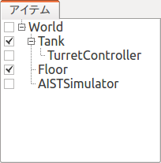

Step 2: コントローラの導入
==========================

Step 1ではコントローラが無かったため、シミュレーションの際にTankモデルの砲身の姿勢を維持することができませんでした。そこでStep 2では姿勢を維持するための最小限のコントローラの作成を通して、コントローラ導入の基本を学ぶことにします。

.. contents:: 目次
   :local:
   :depth: 2

.. highlight:: C++
   :linenothreshold: 5

コントローラの形式について
--------------------------

一般的に、コントローラの実装形式は様々なものがあり得ます。特定のロボットシステムやシミュレータが規定する形式もありますし、OpenRTMやROSといった汎用的なミドルウェアの規定する形式でコントローラを実装することも一般的となっています。

これに関して、本チュートリアルでは、Choreonoid独自の 「シンプルコントローラ（SimpleController）」の形式でコントローラの実装を行います。シンプルコントローラは、C++言語とChoreonoid内部のデータ構造を用いてコントローラを実装するもので、OpenRTMやROSと比べて覚えることが少なくて済み、コードも比較的シンプルなものになるといった利点があります。

ただしこれはChoreonoidの独自形式であるため、汎用性の面ではOpenRTMやROSに劣ります。また、OpenRTMやROSが提供するような通信機能を提供するものでもありません。ChoreonoidはOpenRTMやROSと連携する機能も備えていますので、必要に応じてそれらの機能を用いるようにして下さい。OpenRTMと連携する機能に関しては、 :doc:`ここ <../../openrtm/index>` に解説があります。

コントローラ "TurretController1" の実装
---------------------------------------

シンプルコントローラ形式ではC++のクラスとしてコントローラを実装します。ここでは砲塔(Turret)のピッチ軸を維持するだけの "TurretController1" の実装を行います。このコントローラのソースコードを以下に示します。 ::

 #include <cnoid/SimpleController>
 
 using namespace cnoid;
 
 class TurretController1 : public SimpleController
 {
     Link* joint;
     double qref;
     double qold;
     double dt;
 
 public:
     virtual bool initialize(SimpleControllerIO* io)
     {
         joint = io->body()->link("TURRET_P");
 
         io->setLinkInput (joint, JOINT_ANGLE);
         io->setLinkOutput(joint, JOINT_TORQUE);
 
         qref = qold = joint->q();
 
         dt = io->timeStep();
 
         return true;
     }
 
     virtual bool control()
     {
         // PD gains
         static const double P = 200.0;
         static const double D = 50.0;
 
         double q = joint->q(); // input
         double dq = (q - qold) / dt;
         double dqref = 0.0;
         joint->u() = P * (qref - q) + D * (dqref - dq); // output
         qold = q;
 
         return true;
     }
 };
 
 CNOID_IMPLEMENT_SIMPLE_CONTROLLER_FACTORY(TurretController1)

以下ではまずこのコントローラをシミュレーションプロジェクトに導入し、シミュレーションを行うまでを解説します。その後、コントローラの実装内容について解説したいと思います。

プロジェクトディレクトリの作成
------------------------------

上記のソースコードはテキストエディタ等を用いて入力するとして、これを保存するためのディレクトリを作成しましょう。例えば "tank" というディレクトリを作成し、ここに上記のソースコードを "TurretController1.cpp" というファイル名で保存します。今後もこのチュートリアルに関するファイルはこのディレクトリに格納するものとし、これを *「プロジェクトディレクトリ」* と呼ぶことにします。

なお、Step 1で :ref:`tank-tutorial-step1-save-project` を行ったファイルについても、このディレクトリにまとめて保存するとよいでしょう。

.. note:: ソースコードのファイルはChoreonoid本体の "sample/tutorial/Tank/" 以下に格納されています。自分で入力するのが面倒な場合は、このファイルを利用してもOKです。本チュートリアルで言及する他のファイルについてもこのディレクトリに格納されていますので、必要に応じてご利用下さい。

.. _tank_tutorial_step2_compile:

コントローラのコンパイル方法
----------------------------

コントローラのソースコードをコンパイルするにあたって、主に以下の２通りの方法があります。

1. Choreonoid本体とは別にコンパイルを行う
2. Choreonoid本体と一緒にコンパイルを行う

1の場合、コンパイルを行うためのMakefile等を自前で記述する必要があります。これを行うにあたっては、Makefileの文法を知っている必要がありますし、コントローラが依存しているヘッダファイルやライブラリについてもある程度把握している必要があります。これは初心者には少し敷居が高いですし、慣れていても少し面倒な作業になります。

2の場合は、Choreonoid本体のコンパイルに関する情報を共有することができますので、必要最低限の記述でコンパイルを行うことができます。Choreonoid本体はCMakeというビルドシステムを使ってコンパイルされますので、コントローラについてもCMakeでコンパイルに関する記述を行います。

2の方が手軽ですので、本チュートリアルでは2を採用することにします。ただし、1についても、Choreonoid本体とは独立してコントローラを開発できることは利点にもなりますので、目的に応じて使い分けるとよいかと思います。

さて、2を採用する場合、先ほど作成したプロジェクトディレクトリをChoreonoid本体のビルドシステムに認識させる必要があります。これについても２通りの方法があります。

A. Choreonoidのソースディレクトリ内の "ext" ディレクトリに対象のディレクトリを配置する
B. ChoreonoidのCMakeの設定で "ADDITIONAL_EXT_DIRECTORIES" に対象のディレクトリを指定する

Aを採用する場合は、先ほど作成したプロジェクトディレクトリ "tank" を上記の ext ディレクトリ以下に移動して下さい。話が前後しますが、初めから ext 以下にディレクトリを作成しても、もちろんOKです。

Bを採用する場合は、対象のディレクトリへのパスを、上記の設定項目に指定します。対象ディレクトリが複数ある場合は、セミコロンで区切って入力します。

よくわからない場合は、上記の2とAを採用するとして、

* Choreonoidのソースディレクトリの "ext" ディレクトリ以下にプロジェクトディレクトリ "tank" を作成する
* 前節に掲載した"TurretController1"のソースコードを "TurretController1.cpp" というファイル名で "tank" ディレクトリに保存する

とすればOKです。

CMakeLists.txtの記述
--------------------

次に、プロジェクトディレクトリに "CMakeLists.txt" というテキストファイルを作成し、ここにコントローラのコンパイルに関する設定を記述します。

といっても今回記述すべき内容は非常にシンプルで、以下の一行を記述すればOKです。 ::

 add_cnoid_simple_controller(TankTutorial_TurretController1 TurretController1.cpp)

ここで用いている "add_cnoid_simple_controller" という関数は、Choreonoid本体のCMake記述にて予め定義された関数です。この関数に、生成されるコントローラの名前とソースファイルを与えるだけで、コントローラのコンパイルを行うことができます。

今回コントローラ名に "TankTutorial" というプレフィックスをつけています。これは必須というわけではありませんが、今後他のプロジェクトで開発したコントローラと区別しやすくするためにつけています。

コントローラのコンパイル
------------------------

コンパイルを行いましょう。今回はChoreonoid本体と一緒にコンパイルを行う手法を採っているので、再度Choreonoid本体のコンパイルを行えばOKです。Choreonoidのビルドディレクトリで、 ::

 make

と入力して下さい。（コンパイル方法の詳細は :doc:`../../install/build-ubuntu` の :ref:`install_build-ubuntu_build` を参照して下さい。）

この際 :ref:`tank_tutorial_step2_compile` で述べたAかBの条件を満たしていれば、上記のCMakeLists.txtが検出され、その内容も実行されるというわけです。

コンパイルに成功すると、ビルドディレクトリの "lib/choreonoid-x.x/simplecontroller" （x.xはChoreonoidのバージョン番号）に、

* **TankTutorial_TurretController1.so**

というファイルが生成されるはずです。これがコントローラ本体のファイルとなります。この拡張子からも分かるように、コントローラの実態は共有ライブラリファイルとなります。コントローラが生成されたディレクトリは今後 *「コントローラディレクトリ」* と呼ぶことにします。

コンパイルエラーが出た場合は、エラーメッセージを参考にして、ソースコードやCMakeLists.txtの記述を見直してみて下さい。

コントローラアイテムの生成
--------------------------

作成したシンプルコントローラは、Choreonoid上で「シンプルコントローラアイテム」を用いて導入します。

そこでまずシンプルコントローラアイテムを生成しましょう。メインメニューの「ファイル」-「新規」から「シンプルコントローラ」を選択して生成します。アイテムの名前はなんでもよいですが、コントローラに合わせて "TurretController" とするとよいでしょう。

生成したアイテムは、下図のように、制御対象のTankアイテムの小アイテムとして配置するようにします。

この配置によって、コントローラの制御対象がTankモデルであることを明示します。これを実現するにあたっては、Tankアイテムを選択状態としてからコントローラアイテムの生成を行ってもよいですし、生成後にこの配置になるようドラッグしてもOKです。

.. note:: シンプルコントローラアイテムを利用するためには、Choreonoidビルド時のCMakeオプションで "BUILD_SIMPLE_CONTROLLER_PLUGIN" がONになっている必要があります。デフォルトではONになっていますので問題ないかと思いますが、新規メニューに「シンプルコントローラ」がない場合はこの項目を確認して下さい。

.. _simulation-tank-tutorial-set-controller:

コントローラ本体のセット
------------------------

次に先ほど作成したコントローラの本体をシンプルコントローラアイテムにセットします。

これはシンプルコントローラアイテムの「コントローラモジュール」というプロパティを用いて行います。まず、アイテムツリー上で "TurretController" を選択します。するとこのアイテムのプロパティ一覧がアイテムプロパティビュー上に表示されますので、その中から「コントローラモジュール」というプロパティを探して下さい。

このプロパティの設定は以下のいずれかの方法で行うことができます。

1. ファイルダイアログでファイルを選択して設定する
2. 直接入力する

1の場合は、まずプロパティの右端にあるアイコンをクリックして、ファイルを選択するダイアログを表示します。このダイアログは通常シンプルコントローラ格納用の標準ディレクトリを指しています。そこには先ほど作成した "TankTutorial_TurretController1.so" が格納されているはずですので、これを選択して下さい。

2に示したように、コントローラのファイル名を直接入力することも可能です。この際、フルパスで入力してもよいですが、コントローラ格納用標準ディレクトリからの相対パスで記述してもOKです。また、拡張子 ".so" も省略可能です。従って、今回は単に "TankTutorial_TurretController1" と入力すればOKです。

これでコントローラ本体がシンプルコントローラアイテムにセットされました。これでコントローラを機能させることができます。

ここまで設定できたら、またプロジェクトを保存しておきましょう。ファイル名は "step2.cnoid" として、プロジェクトディレクトリに保存しておくとよいかと思います。

シミュレーションの実行
----------------------

以上の設定を行った上でシミュレーションを実行して下さい。すると、Step 1では重力で下を向いてしまった砲身が、今回は正面を向いたままとなっているはずです。これはコントローラ "TurretController1" によって、姿勢の維持に必要なトルクが砲塔ピッチ軸にかけられているからです。

うまくいかない場合は、メッセージビューも確認してみて下さい。コントローラの設定や稼働に問題があると、シミュレーション開始時にその旨を知らせるメッセージが出力される場合があります。

実装内容の解説
--------------

今回作成したコントローラ "TurretController1" の実装内容は以下のようになっています。

SimpleControllerクラス
~~~~~~~~~~~~~~~~~~~~~~

まず、シンプルコントローラはChoreonoidで定義されている "SimpleController" クラスを継承したクラスとして実装するようになっています。そこでまず ::

 #include <cnoid/SimpleController>

によって、このクラスが定義されているヘッダをインクルードしています。Choreonoidが提供するヘッダファイルはインクルードディレクトリの "cnoid" サブディレクトリに格納されるようになっており、このように cnoid ディレクトリからのパスとして記述します。拡張子は必要ありません。

また、Choreonoidで定義されているクラスは全て "cnoid" という名前空間に所属しています。ここでは ::

 using namespace cnoid;

によって名前区間を省略できるようにしています。

コントローラのクラス定義は、 ::

 class TurretController1 : public SimpleController
 {
     ...
 };

によって行われています。SimpleControllerを継承するかたちでTurretController1を定義していることが分かります。

SimpleControllerクラスではいくつかの関数が仮想（バーチャル）関数として定義されており、継承先でそれらの関数をオーバーライドすることでコントローラの処理内容を実装します。通常以下の２つの関数をオーバーライドします。

* **virtual bool initialize(SimpleControllerIO* io)**
* **virtual bool control()**

initialize関数の実装
~~~~~~~~~~~~~~~~~~~~  
  
initialize関数はコントローラの初期化を行う関数で、シミュレーション開始の直前に１回だけ実行されます。

この関数に引数として与えられるSimpleControllerIO型は、コントローラの入出力に必要な機能をまとめたクラスとなっています。この詳細は :doc:`../howto-implement-controller` の :ref:`simulator-simple-controller-io` をみていただくとして、ここではまず ::

 joint = io->body()->link("TURRET_P");

によって、砲塔ピッチ軸の入出力を行うためのLinkオブジェクトを取得し、joint変数に格納しています。

io->body() によってTankモデル入出力用のBodyオブジェクトを取得し、続けてこのオブジェクトが有するLinkオブジェクトから "TURRET_P" という名前を持つものを取得しています。これは :doc:`Tankモデルの作成 <../../handling-models/modelfile/modelfile-newformat>` において記述した :ref:`砲塔ピッチ軸部 <modelfile_yaml_TURRET_P_description>` に対応するものです。

次に ::

 io->setLinkInput (joint, JOINT_ANGLE);
 io->setLinkOutput(joint, JOINT_TORQUE);

によって、この関節に関して入力と出力を行う値のタイプを指定しています。今回はPD制御を行いますので、関節角度を入力し、関節トルクを出力するという設定にしています。入出力可能な値の詳細については、 :doc:`../howto-implement-controller` の :ref:`simulator-io-by-body-object` をご参照下さい。

他にPD制御に必要な値として、 ::

 qref = qold = joint->q();
  
によって初期関節角度を取得し、それを変数qref、 qoldに代入しています。qrefは目標関節角で、qoldは関節角速度計算用の変数です。また、 ::

 dt = io->timeStep();

によって変数dtにタイムステップを代入しています。これはシミュレーションの物理計算１回あたりに進める内部の時間を表していて、この時間間隔で次の control 関数が呼ばれることになります。
  
最後にinitialize関数の戻り値として true を返して、初期化に成功したことをシステムに伝えています。

control関数の実装
~~~~~~~~~~~~~~~~~

control関数は実際の制御コードを記述する部分で、シミュレーション中に繰り返し実行されます。

ここでは砲塔ピッチ軸に関するPD制御のコードが書かれているだけです。 ::

 static const double P = 200.0;
 static const double D = 50.0;

はPゲイン、Dゲインの値で、 ::

 double q = joint->q(); // input

によって現在関節角を入力し、 ::
   
 double dq = (q - qold) / dt;

によって現在角速度を算出し、 ::

 double dqref = 0.0;
  
で目標角速度は0に設定し、 ::

 joint->u() = P * (qref - q) + D * (dqref - dq); // output

によってPD制御で計算したトルク値を関節に出力し、 ::
   
 qold = q;

によって次回計算用にqoldを更新しています。

このように、入出力はLinkオブジェクトの変数を用いて行うことがポイントです。joint->q()、joint->u() はそれぞれ関節角度、関節トルクの変数に対応しています。

最後に、正常終了を表すtrueを戻り値として返しています。これによって制御ループが継続されます。

ファクトリ関数の定義
~~~~~~~~~~~~~~~~~~~~

シンプルコントローラのクラスを定義したら、そのオブジェクトを生成する「ファクトリ関数」も所定の形式で定義しておく必要があります。これは、シンプルコントローラアイテムが実行時にコントローラの共有ライブラリを読み込んで、そこからコントローラのオブジェクトを生成するために必要となります。

これはマクロを使って、 ::

 CNOID_IMPLEMENT_SIMPLE_CONTROLLER_FACTORY(TurretController1)

と記述することができます。引数としてはこのようにコントローラのクラス名を与えて下さい。
