ステップ3: ゲームパッドによる砲塔の制御
=======================================

ステップ2では最小限の制御を行うコントローラを作成し、コントローラの導入方法を学びました。ステップ3ではもう少し複雑なコントローラを作成してみましょう。

.. contents:: 目次
   :local:
   :depth: 2

.. _simulation-tank-tutorial-gamepad:

ゲームパッドの準備
------------------

.. highlight:: sh

このステップで作成するコントローラは、ゲームパッド（ジョイスティック）を操作することでTankモデルの砲塔を動かすというものです。このための準備として、ゲームパッドを用意してPCに接続しておきます。

実際には、 **ゲームパッドが無くても大丈夫** です。その場合はChoreonoidの「仮想ジョイスティックビュー」をいう機能が代用できますので、次節（:ref:`tank-tutorial-virtual-joystick-view`）に進むようにして下さい。以下はゲームパッドの実機を使う場合の説明になります。

本チュートリアルが想定しているのは、以下に図に示すような構成をもったゲームパッドです。

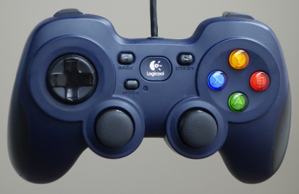

これは `ロジクールのF310 <http://gaming.logicool.co.jp/ja-jp/product/f310-gamepad>`_ という製品ですが、他に同様の構成をもつゲームパッドとして、プレイステーション4用の `DUALSHOCK4 <http://www.jp.playstation.com/ps4/peripheral/cuhzct1j.html>`_ やプレイステーション3用のDUALSHOCK3、 `Xbox用コントローラ <https://www.xbox.com/ja-JP/xbox-one/accessories/controllers/xbox-black-wireless-controller>`_ やXbox360用コントローラを利用することも可能です。

これらのゲームパッドは通常USBを用いてPCに接続します。DUALSHOCK4については、 `USBワイヤレスアダプター <http://www.jp.playstation.com/ps4/peripheral/cuhzwa1j.html>`_ による接続も可能です。

それら以外の機種を使う場合は、軸やボタンの配置が適切でなくなってしまい、操作しにくくなる場合があります。その場合はソースコードに書かれている軸やボタンのID値を変更するようにして下さい。本ステップ最後の :ref:`simulation-tank-tutorial-step3-implementation` にこれに関する解説があります。

ゲームパッドの動作確認
--------------------------

次に、ゲームパッドがOSに認識されているか、軸やボタンの配置はどうなっているか、といったことを確認します。

Ubuntuの場合
~~~~~~~~~~~~~~~~~~

Ubuntuでは、"jstest" というコマンドがあります。ゲームパッドがうまく機能しない場合はこのコマンドで確認するようにして下さい。コマンドラインから ::

 sudo apt-get install joystick
  
を実行することでインストールされ、 ::
   
 jstest /dev/input/js0
  
などと入力することで実行されます。

コマンドの引数はゲームパッドのデバイスファイルを表しています。ここで "js0" というのは最初に接続されたIDが0番のゲームパッドということで、通常はこれを使います。2台目以降のゲームパッドを使いたい場合はjs1、js2といったデバイスを使いますが、その場合はソースコードの変更が必要になりますのでご注意下さい。

.. note:: Dualshock3、4については、最近のLinuxカーネル（当方ではバージョン4.13.0以降で確認）では、一台のゲームパッドに対して2つのデバイスファイルが生成されるようになっており、ひとつ目がタッチパッド部、ふたつ目がその他の軸やボタンに対応しているようです。ひとつ目についてはデフォルトでマウスカーソルを動かすようになっており、Dualshockのタッチパッドに触れるとマウスカーソルが動きます。（これはタッチパッドの絶対座標で動くようになっており、非常に操作しづらいです。）一般的なゲームパッド入力としては、ふたつ目のデバイスファイルを使うようにします。ゲームパッドをひとつだけ接続している場合、 "/dev/input/js1" を使うことになります。なお、ChoreonoidのジョイスティックライブラリはDualshockのこの仕様を自動で認識し、デフォルトで適切なデバイスファイルを読み込むようになっています。

ゲームパッドを接続して、上記のコマンドを実行すると、

.. code-block:: text

 Driver version is 2.1.0.
 Joystick (Logitech Gamepad F310) has 8 axes (X, Y, Z, Rx, Ry, Rz, Hat0X, Hat0Y)
 and 11 buttons (BtnX, BtnY, BtnTL, BtnTR, BtnTR2, BtnSelect, BtnThumbL, BtnThumbR, ?, ?, ?).
 Testing ... (interrupt to exit)
 Axes:  0:     0  1:     0  2:-32767  3:     0  4:     0  5:-32767  6:     0  7:     0 Buttons:  0:off  1:off  2:off  3:off  4:off  5:off  6:off  7:off  8:off  9:off 10:off

といった情報がコンソールに出力されます。ここでゲームパッドの軸やボタンを操作すると出力内容が変わりますので、これで接続状態や軸・ボタンの配置を確認できます。このような出力がされなかったり、ゲームパッドを操作しても出力内容が変わらない場合は、うまく接続されていませんので、接続方法やゲームパッドの状態を確認するようにして下さい。

.. note:: 以下で使用するジョイスティック入力用のJoystickクラスでは、ゲームパッドの機種ごとの軸やボタンの配置（ID値の対応）について、共通の配置に補正する機能を備えています。これによって上記のゲームパッドに関しては同じプログラムが使えるようになるのですが、プログラム内で使われているID値はjstestで出力されるものとは必ずしも一致しませんので、ご注意ください。

.. _tank-tutorial-virtual-joystick-view:

Winodows10の場合
~~~~~~~~~~~~~~~~~~~~~

コントロールパネルを開き、デバイスとプリンターを選択します。下図のように表示されたゲームパッドを右クリックし、ゲームコントローラの設定を開きます。

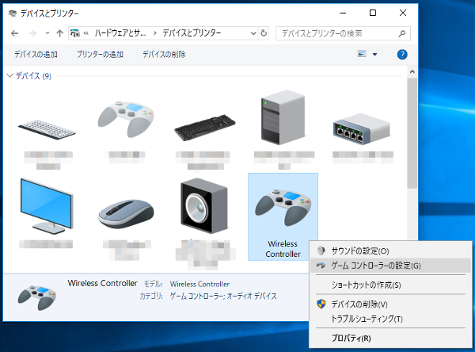

コントローラを選択し、プロパティをクリックするとテスト画面が開きます。ゲームパッドを操作して画面表示が変化することを確認してください。出力内容が変わらない場合は、うまく接続されていませんので、接続方法やゲームパッドの状態を確認するようにして下さい。

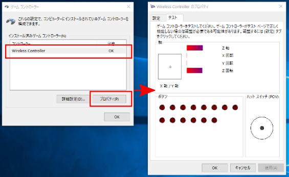

次に、ゲームコントローラの設定に戻り、詳細設定をクリックします。優先デバイスで、使用したいゲームパッドを選択します。複数のゲームパッドを接続している場合は必ず行ってください。

.. image:: images/gamePad3_windows.png

.. note:: 複数のゲームパッドを繋いだり、外したりすると、優先デバイスを指定してもChoreonoidでゲームパッドが認識されなくなる場合があります。そのような場合は、Windowsを再起動し、ゲームパッドを一つだけ接続してみてください。

Windows10でゲームバーを消す
"""""""""""""""""""""""""""""""

Windows10で、Xbox用のゲームパッドを使用する場合、ゲームパッドの真ん中にあるロゴが描かれたボタンを押すと、ゲームバーというアプリが起動してしまうことがあります。以下のように設定することで、起動しないようにすることができます。

Windowsの設定を開き、**ゲーム** を選択します。

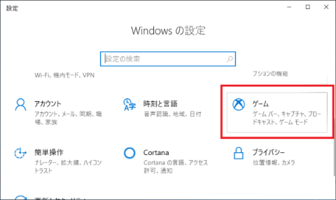

**ゲームバー** を選択し、**コントローラのこのボタンでゲームバーを開きます：** のチェックを外します。

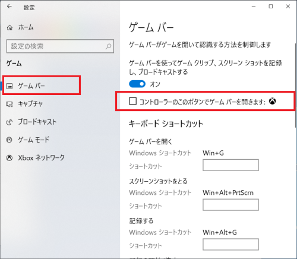

Windows10でPS3のゲームパッドを使う場合
"""""""""""""""""""""""""""""""""""""""""""

PS3用のゲームパッドは、接続しただけでは使用できません。使用するための無料のソフトウェアがいくつかありますが、ここでは、"XInput Wrapper for DS3"というソフトを紹介します。このソフトを使用していただきますと、軸やボタンの設定を変更しなくても、Choreonoidのサンプルを操作することができます。

まず、PS3デームパッドを接続します。デバイスとプリンターに **PLAYSTATION(R)3 Controller** と表示されているかと思います。

"XInput Wrapper for DS3"は、`ここ <https://forums.pcsx2.net/Thread-XInput-Wrapper-for-DS3-and-Play-com-USB-Dual-DS2-Controller>`_ からダウンロードできます。

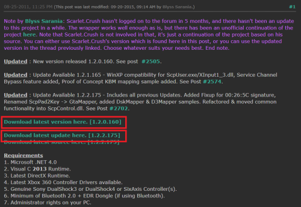

図のように表示されたら、 **Download latest version here.**　をクリックします。

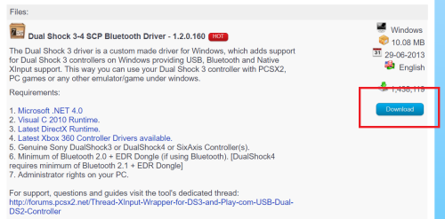

**Download** をクリックします。前のページに戻って、**Download latest update here** もダウンロードします。

.. note:: いくつか必要なライブラリが表示されていますが、Windows10の最新バージョンで、Visual Studio 2015などをインストールしている環境であれば、すでにインストールされているかと思われます。ライブラリが不足している場合は、適宜ご対応をお願いします。

Program Filesフォルダに新規作成で、 **Scarlet.Crush Productions** フォルダを作成します。

ダウンロードした"latest version"のファイルを解凍し、（ファイルは **7z** 形式ですので、解凍用のソフトが必要です。）"ScpServer"内の"bin"の中身を"Scarlet.Crush Productions" にコピーします。

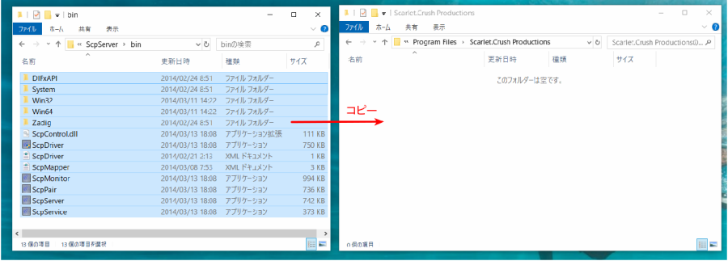

Program Filesフォルダへの書き込みは管理者権限が必要ですので、メッセージが表示されたら、 **続行** を選択します。"latest update"のファイルも解凍し、"bin"の中身を同じようにコピーします。同じ名前のファイルがありますので、updateのファイルで置き換えるようにします。

次に **ScpDriver.exe** ファイルを右クリックし、管理者として実行を選択して起動します。

.. image:: images/WrapperForDS3_7.png

**Configure Service** にチェックをいれ **Install** をクリックします。Windowsセキュリティのメッセージが表示されますが、インストールを続けてください。

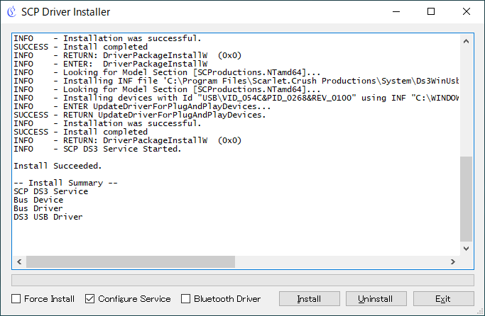

このように表示されたら、終了です。

仮想ジョイスティックビューの準備
--------------------------------

ゲームパッドがない場合は、「仮想ジョイスティックビュー」を使います。これはメインメニューの「表示」-「ビューの表示」から「仮想ジョイスティック」を選択すると表示されます。外観は以下の図のようになっています。

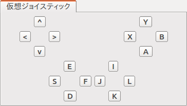

これは通常メインウィンドウ下部のメッセージビューと同じ領域に表示されます。このままではメッセージが見えなくなってしまいますので、メッセージビューと仮想ジョイスティックビューを同時に使えるように :ref:`basics_modify_view_layout` を行っておくとよいでしょう。例えば以下の図のようなレイアウトにします。

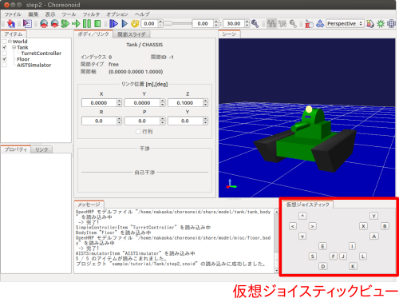

ゲームパッドの実機が接続されているとそちらの入力が優先されますので、仮想ジョイスティックビューを使う場合はゲームパッドは接続しないようにして下さい。

これで準備は完了です。

コントローラのソースコード
--------------------------

.. highlight:: C++
   :linenothreshold: 7

今回作成するコントローラのソースコードを以下に示します。これはステップ2のTurretController1に対して、砲塔ヨー軸の制御とゲームパッド入力による指令値の変更を追加した内容となっています。 ::

 #include <cnoid/SimpleController>
 #include <cnoid/Joystick>
 
 using namespace cnoid;
 
 class TurretController2 : public SimpleController
 { 
     Link* joints[2];
     double q_ref[2];
     double q_prev[2];
     double dt;
     Joystick joystick;
 
 public:
     virtual bool initialize(SimpleControllerIO* io) override
     {
         joints[0] = io->body()->link("TURRET_Y");
         joints[1] = io->body()->link("TURRET_P");
 
         for(int i=0; i < 2; ++i){
             Link* joint = joints[i];
             joint->setActuationMode(Link::JOINT_TORQUE);
             io->enableIO(joint);
             q_ref[i] = q_prev[i] = joint->q();
         }
 
         dt = io->timeStep();
       
         return true;
     }
 
     virtual bool control() override
     {
         static const double P = 200.0;
         static const double D = 50.0;
         static const int axisID[] = { 2, 3 };
 
         joystick.readCurrentState();
 
         for(int i=0; i < 2; ++i){
             Link* joint = joints[i];
             double q = joint->q();
             double dq = (q - q_prev[i]) / dt;
             double dq_ref = 0.0;
 
             double pos = joystick.getPosition(axisID[i]);
             if(fabs(pos) > 0.25){
                 double deltaq = 0.002 * pos;
                 q_ref[i] += deltaq;
                 dq_ref = deltaq / dt;
             }
      
             joint->u() = P * (q_ref[i] - q) + D * (dq_ref - dq);
             q_prev[i] = q;
         }
 
         return true;
     }
 };
 
 CNOID_IMPLEMENT_SIMPLE_CONTROLLER_FACTORY(TurretController2)

コントローラのコンパイル
------------------------

上記のソースコードを入力・保存し、コンパイルを行いましょう。

手順はステップ2で行ったのと同様です。ソースコードを "TurretController2.cpp" というファイル名でプロジェクトディレクトリに保存し、CMakeLists.txt に以下の記述を追加して下さい。

.. code-block:: cmake

 add_cnoid_simple_controller(TankTutorial_TurretController2 TurretController2.cpp)

これでChoreonoid本体のコンパイル操作を行うと、このコントローラも同時にコンパイルされ、コントローラディレクトリ内に "TankTutorial_TurretController2.so" というファイルが生成されます。

コントローラの置き換え
----------------------

今度はこのコントローラをTankモデルのコントローラとして使用するようにしましょう。

ステップ2で作成したプロジェクトがあるかと思いますので、そこのコントローラの設定だけを変えることにします。ステップ2で解説した :ref:`simulation-tank-tutorial-set-controller` を再度行って、今回作成した "TankTutorial_TurretController2.so" のコントローラファイルに置き換えるようにして下さい。

これでコントローラの準備は完了です。この状態でプロジェクトを "step3.cnoid" といったファイル名で保存し直しておくとよいでしょう。

仮想ジョイスティックビューを使用する場合は、必ずビューが表示されている状態でプロジェクトを保存してください。Joystickオブジェクトは、生成時に接続されているJoystickの状態を確認します。プロジェクトファイルに仮想ジョイスティックビューの設定が保存されていれば、プロジェクトの読み込み時に仮想ジョイスティックビューが復元され、その後コントローラが作成され、コントローラが仮想ジョイスティックビューを認識します。また、コントローラアイテムのプロパティで、再読込の項をTrueにすると、シミュレーション開始時に、毎回コントローラを作成し直すように設定出来ます。

砲塔の操作
----------

シミュレーションを実行しましょう。

今回はゲームパッドでTankモデルの砲塔を動かせるはずですので、動かしてみましょう。F310であれば、右下のアナログスティックを砲塔の操作に対応させていますので、この軸を操作して下さい。別の機種の場合は、どの軸が対応しているか、いろいろ動かして試してみて下さい。うまくいかない場合は、ソースコードの軸設定を変更しましょう。これは次節で解説します。

仮想ジョイスティックビューを使う場合は、キーボードで操作します。ビューに表示されているボタンは、それぞれゲームパッドの十字キーやアナログスティックの各軸や、各ボタンに対応しています。この対応関係を下図に示します。

.. image:: images/joystickview-mapping.png

この図とゲームパッドF310を見比べると、F310の主要な軸とボタンに対応していることが分かるかと思います。今回はキーボードの "J"、"L" で砲塔のヨー軸回転、"I"、"K" でピッチ軸回転を操作できることになります。

注意点として、 仮想ジョイスティックビューは **キーボードフォーカスが入っていないと機能しません。** このため、使用の際にはいったんこのビューをマウスでクリックするなどして、フォーカスを入れておく必要があります。操作している最中にシーンビューの視点を変えるなどの操作をした場合、フォーカスはそちらに行ってしまっているので、再度仮想ジョイスティックビューをクリックしてフォーカスを入れなおす必要があります。

Tankモデルの砲塔をうまく動かせましたでしょうか？このように、コントローラ次第で、様々な操作が可能となってきます。外部デバイスからの入力を取り込むことで、コントローラの幅も広がります。

.. _simulation-tank-tutorial-step3-implementation:

実装内容の解説
--------------

今回のTurretController2も、ステップ2で作成したTurretController1と同様に、PD制御で砲塔の軸を制御するというもので、その部分は基本的に変わりません。

ただ、これをベースとして、以下の２点を拡張した点が異なっています。

1. 砲塔ヨー軸に対応する "TURRET_Y" 関節に加えて、ピッチ軸に対応する "TURRET_P" 関節も制御するようにした。
2. PD制御の目標関節角について、モデルの初期角度に固定するのではなく、ゲームパッド（ジョイスティック）からの入力に応じて変化させるようにした。

1については関連する変数を配列化し、forループによってそれぞれに同じ処理を行うようにしただけです。

2についてはChoreonoidが提供する "Joysitick" クラスを用いてジョイスティックからの入力を取得するようにしました。これについて解説しましょう。

まず、 ::

 #include <cnoid/Joystick>

によってJoystickクラスが定義されているヘッダをインクルードしています。

JoystickクラスのオブジェクトはTurretController2のメンバ変数 ::

 Joystick joystick;

として定義しています。コンストラクタはデフォルトのものを使っており、この場合は "/dev/input/js0" のデバイスファイルがジョイスティックの入力元となります。また、このデバイスファイルが存在しない場合、仮想ジョイスティックビューがあればそちらを入力元とします。

ジョイスティックの状態を取得するにあたっては、まず ::

 joystick.readCurrentState();

を実行します。するとデバイスファイルや仮想ジョイスティックビューから、ジョイスティックの現在の状態が読み込まれます。

あとは ::

 joystick.getPosition(軸ID）

によって、軸の状態（どれだけ倒しているか）を -1.0 〜 +1.0 の値として取得できますし、 ::

 joystick.getButtonState(ボタンID)

によって、ボタンが押しているかどうかの値をbool値として取得できます。ボタンについてはステップ5以降のコントローラで利用します。

注意点として、アナログスティックの軸の状態値について、0が中立点となるのですが、スティックを倒していない場合でも常に値が0になるとは限りません。ですので、倒しているかどうかの判定として、一定の閾値をかませることが必要になります。この処理は上記ソースコードのcontrol関数内で ::

 if(fabs(pos) > 0.25){
  
というコードで行っています。
 
ジョイスティックの軸の対応は、control関数内の ::

 static const int axisID[] = { 3, 4 };

で設定しています。ここの3,4がそれぞれ砲塔ヨー軸、ピッチ軸に対応させる軸ID値で、F310の場合は右アナログスティックに対応しています。他のゲームパッドの場合も、jstestコマンドの出力を確認するなどして、適切な軸に対応させて下さい。

実際に目標関節角度を設定している箇所は、control関数内の ::

 double pos = joystick.getPosition(axisID[i]);
 if(fabs(pos) > 0.25){
     double deltaq = 0.002 * pos;
     q_ref[i] += deltaq;
     dq_ref = deltaq / dt;
 }

の部分になります。ここでq_ref[i]が目標関節角、dq_refが目標関節角速度に対応する変数です。あとはこれらの目標値を使って、パート1と同様のPD制御を行っています。
