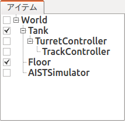
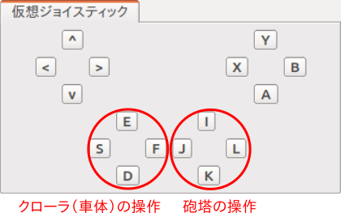

ステップ4: クローラの制御
=========================

ステップ3で砲塔の制御ができるようになりましたので、ステップ4では車体を動かすクローラ部分の制御をできるようにしましょう。

.. contents:: 目次
   :local:
   :depth: 2

.. highlight:: C++
   :linenothreshold: 7

Tankモデルの簡易クローラ
------------------------

Tankモデルの左右のクローラは「簡易クローラ」としてモデリングされています（:ref:`modelfile_yaml_crawlers` 参照）。これはクローラ部と環境との接触点に推力を与えるというもので、履帯の部分が実際にホイールの周りを動いていくというものではないのですが、これを用いることでクローラ風の動きをすることが可能です。ただし、履帯の部分が地形に沿って変形していくようなものではないので、走破性は本物のクローラには及びません。この詳細は :doc:`../pseudo-continuous-track` を参照して下さい。

Tankモデルでは、左クローラに対応するリンクが "TRACK_L"、右クローラに対応するリンクが "TRACK_R" という名前でモデリングされています。これらのリンクは簡易クローラに対応する "pseudoContinuousTrack" タイプの軸が設定されており、それらの軸をゲームパッドで制御できるようにしたいと思います。

簡易クローラのコントローラ
--------------------------

今回作成するコントローラ "TrackController" のソースコードを以下に示します。 ::

 #include <cnoid/SimpleController>
 #include <cnoid/Joystick>
 
 using namespace cnoid;
 
 class TrackController : public SimpleController
 {
     Link* trackL;
     Link* trackR;
     Joystick joystick;
 
 public:
     virtual bool initialize(SimpleControllerIO* io)
     {
         trackL = io->body()->link("TRACK_L");
         trackR = io->body()->link("TRACK_R");
 
         io->enableOutput(trackL);
         io->enableOutput(trackR);
 
         return true;
     }
 
     virtual bool control()
     {
         static const int axisID[] = { 0, 1 };
         
         joystick.readCurrentState();
 
         double pos[2];
         for(int i=0; i < 2; ++i){
             pos[i] = joystick.getPosition(axisID[i]);
             if(fabs(pos[i]) < 0.25){
                 pos[i] = 0.0;
             }
         }
 
         trackL->dq() = -2.0 * pos[1] + pos[0];
         trackR->dq() = -2.0 * pos[1] - pos[0];
 
         return true;
     }
 };
 
 CNOID_IMPLEMENT_SIMPLE_CONTROLLER_FACTORY(TrackController)

これまでと同様に、上記のソースコードを "TrackController.cpp" というファイル名でプロジェクトディレクトリに保存し、同ディレクトリ内のCMakeLists.txtに ::

 add_cnoid_simple_controller(TankTutorial_TrackController TrackController.cpp)   

という記述を追加し、コンパイルを行って下さい。
 
コントローラの導入
------------------

コントローラの導入についても、これまでと同様に…と言いたいところですが、今回作成したコントローラは砲塔を制御する部分がありませんので、このコントローラだけセットしても、砲塔を動かすことができなくなってしまいます。そこで、これまでの砲塔のコントローラを生かしつつ、今回のコントローラを追加で導入したいと思います。

.. note:: もちろん、今回のソースコード自体に砲塔制御のコードも含めておくという手もあります。その場合はこれまでと同様に、シンプルコントローラアイテムの「コントローラモジュール」に、統合したコントローラのファイルを指定すればOKです。本チュートリアルではステップごとに追加される部分を明確にするため、各ステップのコントローラにはあえて追加部分のみを記述しています。また、そのようにコントローラを機能ごとに分けておくことは、開発したコントローラの再利用性を向上させることにもつながります。

コントローラを追加するには、シンプルコントローラアイテムを追加すればOKです。ステップ2で行った :ref:`simulation-tank-tutorial-create-controller-item` と同様の操作でアイテムを生成して下さい。生成するアイテムの名前はコントローラの名前と合わせて、"TrackController" とするとよいでしょう。生成したアイテムの「コントローラモジュール」プロパティには、今回作成したコントローラファイル "TankTutorial_TankController.so" を指定します。

ここで注意が必要なのが、追加したコントローラアイテムの配置です。まず、ひとつ目のコントローラアイテムと同様に、以下のように配置することが考えられます。

.. image:: images/trackcontrolleritem1.png

このように制御対象モデルの小アイテムとして複数のコントローラアイテムを並列に配置した場合、それらは独立したコントローラとしてモデルの制御を行います。具体的には以下の動作となります。

* 各コントローラに渡される SimpleControllerIO型のオブジェクト(IOオブジェクト）はそれぞれ異なるオブジェクトとなる。IOオブジェクトから取得する入出力用Bodyオブジェクトについても異なるものとなる。

* 各コントローラのcontrol関数は並列に実行される。正確には、シミュレータアイテムの「コントローラスレッド」プロパティがtrueとなっている場合、各コントローラのcontrol関数用に別スレッドが割り当てられて、それらが並列実行される。

一方で、今回の2つのコントローラアイテムは以下のように配置することも可能です。

ここでは2つ目のコントローラを１つめのコントローラの小アイテムとして配置しています。この場合、２つのコントローラが一体となって動作します。具体的には以下の動作となります。

* 各コントローラに渡されるIOオブジェクトは、同一オブジェクトの共有となる。従って、IOオブジェクトから得られる入出力用Bodyオブジェクトも共有となる。

* 各コントローラのcontrol関数は直列に実行される。実行順序はツリー内での深さ優先探索順となる。

本チュートリアルで作成するコントローラはどちらの場合でも正常に動作しますが、一般的には後者の一体形式を用いるのが望ましいです。そちらの方が必要なリソースが少なくて済みますし、コントローラ間の連携もしやすくなるからです。本チュートリアルではこの一体形式を用いるものとしますので、本ステップでは２番目の図のようにTurnetControllerの小アイテムとしてTrackControllerを配置するようにしてください。

なお、前者の並列形式についても、複数のコントローラの並列実行が可能という点は利点となります。また、異なるタイプのコントローラアイテムは、この形式でしか利用できません。従って、状況に応じて両形式を使い分けることになります。

クローラの操作
--------------

シミュレーションを実行しましょう。今回はゲームパッドのもう一方（左側）のアナログスティックで、Tankモデルの車体を走らせることができますので、試してみて下さい。スティックを前に倒すと前進、後ろで後退、左で左旋回、右で右旋回となります。

また、TurretControllerも残してありますので、砲塔の制御も引き続き可能となっています。

ゲームパッドの各部位と操作内容の対応を仮想ジョイスティックビューで示すと以下のようになります。

これでTankモデルの全ての軸を操作できるようになりました。

実装内容の解説
--------------

TrackControllerの実装内容について、このコントローラに特有の部分に絞って解説します。

まずintialize関数内の ::

 trackL = io->body()->link("TRACK_L");
 trackR = io->body()->link("TRACK_R");

によって、左右それぞれのクローラに対応する入出力用リンクを取得しています。また、 ::

 io->enableOutput(trackL);
 io->enableOutput(trackR);
  
によってそれぞれのクローラへの出力を有効にしています。

簡易クローラの場合は、出力する指令値はトルクではなく、クローラの表面速度で与えるようになっています。また、入力については特に入力する値はありません。従って、ここでは出力のみを有効化する "enableOutput" 関数を用いています。

control関数内の ::

 static const int axisID[] = { 0, 1 };

は、クローラ軸に対応させるゲームパッドの軸IDの設定です。これについても、 :ref:`simulation-tank-tutorial-gamepad` で述べたもの以外のゲームパッドを用いる場合は、適切な対応となるよう値を修正する必要があるかもしれません。

出力は関節速度を格納する変数dqにセットします。control関数内の ::

 trackL->dq() = -2.0 * pos[1] + pos[0];
 trackR->dq() = -2.0 * pos[1] - pos[0];

によって、軸の状態から各クローラの駆動速度を決定し出力しています。スティックの前後軸については両クローラに対して同じ駆動速度を与え、スティックの左右軸については両クローラに正反対の駆動速度を与えます。このようにすると、前後軸で前進後退、左右軸で旋回という挙動になります。
