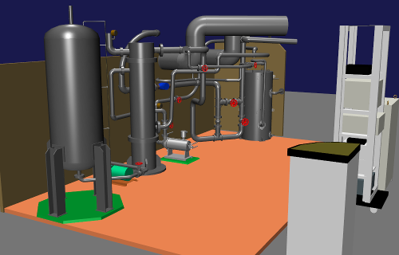
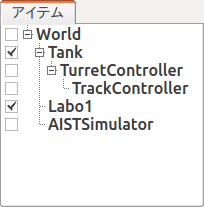
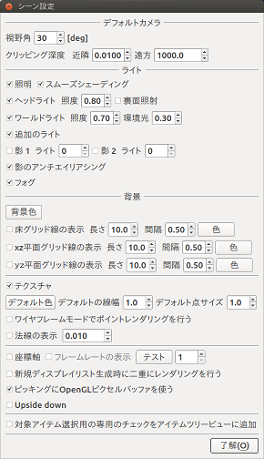
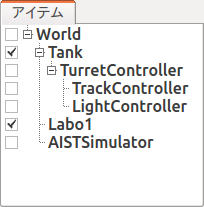

ステップ5: ライトの制御
=======================

Tankモデルはライト（光源）を搭載しています。ステップ5ではこのライトをコントローラから操作できるようにし、デバイスを制御する方法について学びます。

.. contents:: 目次
   :local:
   :depth: 2

.. highlight:: C++
   :linenothreshold: 7

環境設定
--------

ライトを使用するにあたって、その効果をより分かりやすくするための環境設定を行うことにしましょう。

グラフィックス環境の確認
~~~~~~~~~~~~~~~~~~~~~~~~

ライトの効果が正しく描画されるようにするためには、 :doc:`../../install/setup-gpu` が適切に行われている必要があります。なるべく :ref:`setup_gpu_recommended_gpus` を使用するようにし、Ubuntu使用時は :ref:`setup_gpu_ubuntu_gpu_driver` を行い、デフォルトの :ref:`setup_gpu_3d_rendering_engine` である新描画エンジンを用いるようにしてください。

環境モデルの変更
~~~~~~~~~~~~~~~~

これまで使ってきた床のモデルだけだと、ライトが照射されてもあまり代り映えがしません。そこで環境モデルも変更することにしましょう。今回はChoreonoidのサンプルとして用意されている "Labo1" というモデルを使うことにします。これは以下に示すような、研究用プラントを想定したモデルとなっています。

このモデルはChoreonoidのshareディレクトリの "model/Labo1" に "Labo1.body" というファイル名で格納されています。これまで作成してきたプロジェクトに追加して、このモデルを読み込んでください。

読み込んだアイテムのアイテムツリービュー上での配置は、他のモデルと同様にWorldアイテムの小アイテムとします。アイテムのチェックが入っていなければ、チェックを入れてモデルを表示しましょう。シーン内でのモデルの位置はデフォルトのままでOKです。そして、これまで読み込んでいた床のモデルである "Floor" アイテムは削除しておきましょう。アイテムを右クリックするとコンテキストメニューが表示されますので、そこから「カット」を選択することで削除できます。以上の作業を行うと、アイテムツリーは以下のようになっているかと思います。

なお、アイテム間の親子関係が同じであれば、アイテムの並び順はどうなっていてもOKです。なので例えばLabo1がAISTSimulatorの次に配置されたりしていてもかまいません。もし並び順が気になる場合は、アイテムをドラッグすることで並び順だけ変えることもできますので、そこは好きなように設定してください。

シーン設定の変更
~~~~~~~~~~~~~~~~

次にシーンの描画に関わる設定を変更しましょう。これを行うにあたっては、まず以下のシーンバーの「設定ボタン」を押します。

すると以下のような設定ダイアログが表示され、シーン描画に関する各種設定を行うことができます。

まず「床グリッド線の表示」のチェックを外して、グリッド線を表示しないようにしましょう。

次にライティングの設定をしましょう。まず「追加のライト」はオンになっていますでしょうか？ここがオンになっていれば、Tankモデルに搭載されたライトも有効となります。

そして、「ヘッドライト」と「ワールドライト」をオフにしてみましょう。すると下図のように、暗闇の中でTankモデルのライトのみが辺りを照らしているようなシーンになるかと思います。

.. image:: images/tanklightscene.png

これでライトの効果がはっきりと分かりますね。（デフォルトのレンダラを使う場合は、ライトの照射がもう少しぼやっとした感じになります。）

.. ただしここまで暗くしてしまうと、シーンの一部しか見えなくなってしまうため、操作がしづらいかもしれません。そこで先ほどオフにした「ヘッドライト」や「ワールドライト」によるライティングも少し取り入れてみましょう。

.. まず、設定ダイアログで各ライトをひとつずつオンにしてみてください。するとそれぞれシーンが明るくなるかと思いますが、シーンの照らされ方は少し異なるのが分かるかと思います。「ヘッドライト」は視線の方向に向けて照射されるライトとなっており、「ワールドライト」はシーンの上部から下方に照射されるライトとなっています。次に両方のライトをオンにして、各ライトの強さを設定ダイアログの「照度」で調整しましょう。デフォルトの照度だとシーンが明るくなりすぎて雰囲気が出ないので、この値を適当に下げつつ、操作もしやすい明るさに調整してください。

GLSLレンダラを有効にしている場合は、影も表示することができます。これは設定ダイアログの「影1」「影2」のチェックで設定します。それぞれ「ライト」に対象となるライトの番号を入力します。番号は1がTankモデルに搭載されたライト、2がLabo1モデルの天井の照明に対応しますので、それぞれ有効にしてみて、表示がどのように変わるかを確認してください。

.. ヘッドライトとワールドライトの照度を調整し、ワールドライトと

Tankモデル、Labo1モデルのライトによる影を有効にしたシーンの例を、下図に示します。

.. image:: images/lighting-all.png

これでシーンの雰囲気がそれらしくなってきました。ここまでの設定を "step5.cnoid" といった名前のプロジェクトファイルとして保存しておきましょう。

.. note:: 影については使用するGPUやGPUドライバによっては描画されないこともあります。詳しくは :doc:`../../install/setup-gpu` を参照してください。

ライトのコントローラ
--------------------

環境設定が長くなってしまいましたが、本題に入りましょう。今回作成するのは、Tankモデルのライトを操作するためのコントローラで、これを "LightController" とします。このコントローラのソースコードを以下に示します。 ::

 #include <cnoid/SimpleController>
 #include <cnoid/SpotLight>
 #include <cnoid/Joystick>
 
 using namespace cnoid;
 
 class LightController : public SimpleController
 {
     SpotLight* light;
     Joystick joystick;
     bool prevButtonState;
 
 public:
     virtual bool initialize(SimpleControllerIO* io)
     {
         light = io->body()->findDevice<SpotLight>("Light");
         prevButtonState = false;
         return true;
     }
 
     virtual bool control()
     {
         static const int buttonID[] = { 0, 2, 3 };
        
         joystick.readCurrentState();
 
         bool changed = false;
 
         bool currentState = joystick.getButtonState(buttonID[0]);
         if(currentState && !prevButtonState){
             light->on(!light->on());
             changed = true;
         }
         prevButtonState = currentState;
 
         if(joystick.getButtonState(buttonID[1])){
             light->setBeamWidth(std::max(0.1f, light->beamWidth() - 0.001f));
             changed = true;
         } else if(joystick.getButtonState(buttonID[2])){
             light->setBeamWidth(std::min(0.7854f, light->beamWidth() + 0.001f));
             changed = true;
         }
 
         if(changed){
             light->notifyStateChange();
         }
 
         return true;
     }
 };
 
 CNOID_IMPLEMENT_SIMPLE_CONTROLLER_FACTORY(LightController)

これまでと同様に、上記ソースコードを "LightController.cpp" というファイル名でプロジェクトディレクトリに保存します。

CMakeLists.txt に ::

 add_cnoid_simple_controller(TankTutorial_LightController LightController.cpp)

を追加して、コンパイルを行って下さい。

コントローラの導入
------------------

ステップ4で導入したTrackControllerと同様に、LightControllerについても対応するシンプルコントローラアイテムを生成し、これをTurretControllerの小アイテムとして配置するようにしてください。これを行うと、アイテムツリービューは以下のようになります。

このように配置することで、TurretController、TrackController、LightControllerのcontrol関数が順番に呼ばれ、これらが一体となって機能することになります。

ライトの操作
------------

シミュレーションを実行して、ライトの操作ができるようになっていることを確認しましょう。

ライトの操作はゲームパッドもしくは仮想ジョイスティックビューのA、X、Yボタン（プレイステーションのゲームパッドの場合は×、□、△ボタン）に割り当てられています。

まずAボタンでライトのオン・オフを切り替えられます。

また、X、Yボタンで、ライトの照射範囲を変えられます。Xボタンを押すと照射範囲を狭くし、Yボタンを押すと広くします。

これまで実現してきたクローラや砲塔の操作も引き続き可能ですので、Tankモデルを移動させながら、Labo1の様々な箇所をライトで照射してみてください。

なお、シミュレータアイテムのプロパティである「デバイス状態の記録」がtrueになっていれば、ライトの操作についてもシミュレーション結果として記録され、 :ref:`simulation-result-playback` の際に再現されます。このプロパティはデフォルトでtrueになっています。この機能の確認のため、ライトをいろいろと操作した後にシミュレーションを停止して、シミュレーションの再生を行ってみて下さい。

実装内容の解説
--------------

Choreonoidではライトを「デバイス」のひとつとして定義しています。本ステップのポイントは、コントローラからデバイスへ出力を行う方法を知ることにあります。

まず、initialize関数の ::

 light = io->body()->findDevice<SpotLight>("Light");

によって、入出力用Bodyオブジェクトから、SpotLight型で"Light"という名前をもつデバイスオブジェクトを取得し、これをlight変数に格納しています。デバイスに関しても、このオブジェクトを入出力用に使います。TankモデルのLightの定義については、 :doc:`Tankモデルの作成 <../../handling-models/modelfile/modelfile-newformat>` における :ref:`modelfile-tank-spotlight` を参照してください。

control関数では、 ::

 static const int buttonID[] = { 0, 2, 3 };

により、ライトの操作に使うボタンのIDを設定しています。これらのIDが通常A、X、Yボタンに対応します。ボタンの対応がうまくいかない場合は、ここを調整するようにしてください。

Aボタンの状態について、 ::

 bool currentState = joystick.getButtonState(buttonID[0]);

で取得しています。このように、ボタンの状態はgetButtonState関数を用いて取得することができます。そして、 ::

 if(currentState && !prevButtonState){
     light->on(!light->on());
     changed = true;
 }

によって、ボタンが押されたときに、SpotLightデバイスのon関数を用いて、lightオブジェクトのオン・オフ状態を切り替えるようにしています。

なお、入出力用デバイスオブジェクトの状態を変更しただけでは、その内容を出力したことにはなりません。これを行うには、デバイスオブジェクトに対して "notifyStateChange" という関数を実行する必要があります。これによって状態の変化がシミュレータ本体にも検知され、実際にシミュレーションに反映されることになります。

ただしこの関数は、デバイスの複数のパラメータを変化させる場合でも、(一回のcontrol関数呼び出しにおいて）一回実行するだけでOKです。このため、本実装ではまずchangedというbool変数を状態変化があったかどうかのフラグとして利用し、最後の ::

 if(changed){
     light->notifyStateChange();
 }

でまとめて一回実行するようにしています。

ライトの照射範囲を変える操作についても同様です。照射範囲拡大の操作については、 ::

 if(joystick.getButtonState(buttonID[1])){
     light->setBeamWidth(std::max(0.1f, light->beamWidth() - 0.001f));
     changed = true;

によってXボタンの状態を判定し、ボタンが押されていればSpotLightのsetBeamWidth関数で、照射角度の値を減らしています。Yボタンの操作についてもこれと同様です。

デバイスの扱いに関しては、より詳細な解説が :doc:`../howto-implement-controller` の :ref:`simulation-device` 以降の節にもありますので、そちらもご参照下さい。
