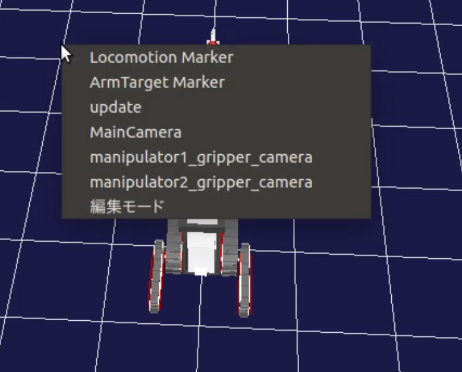
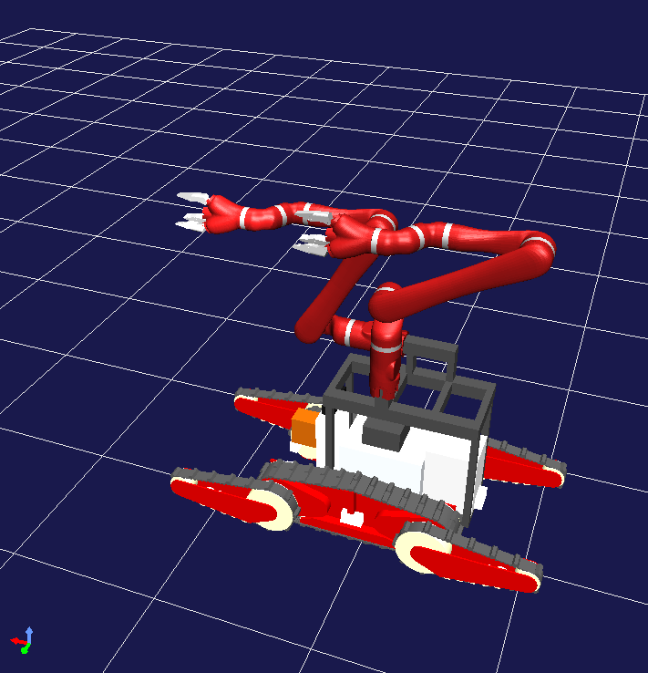
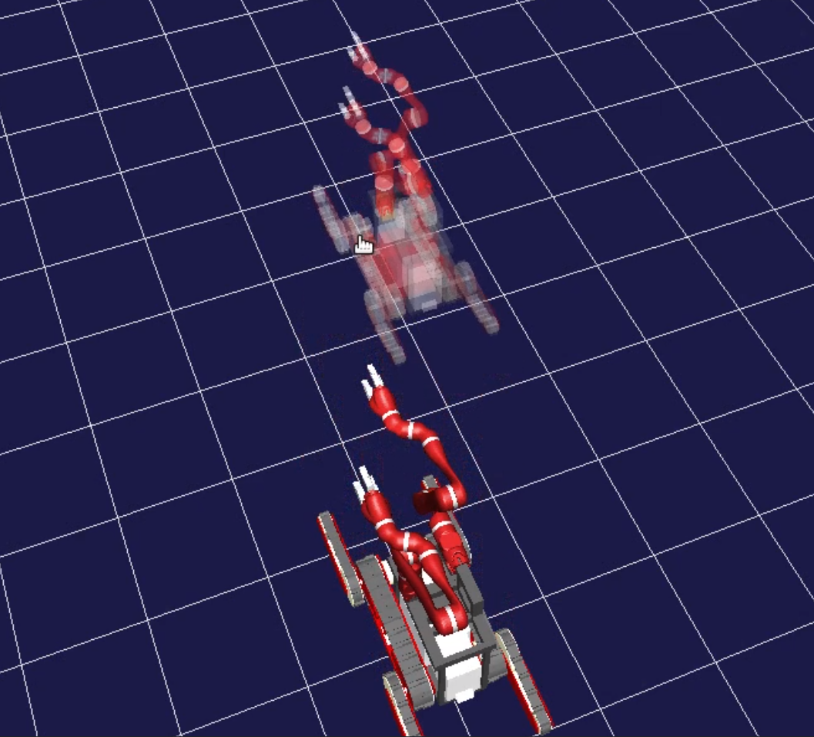
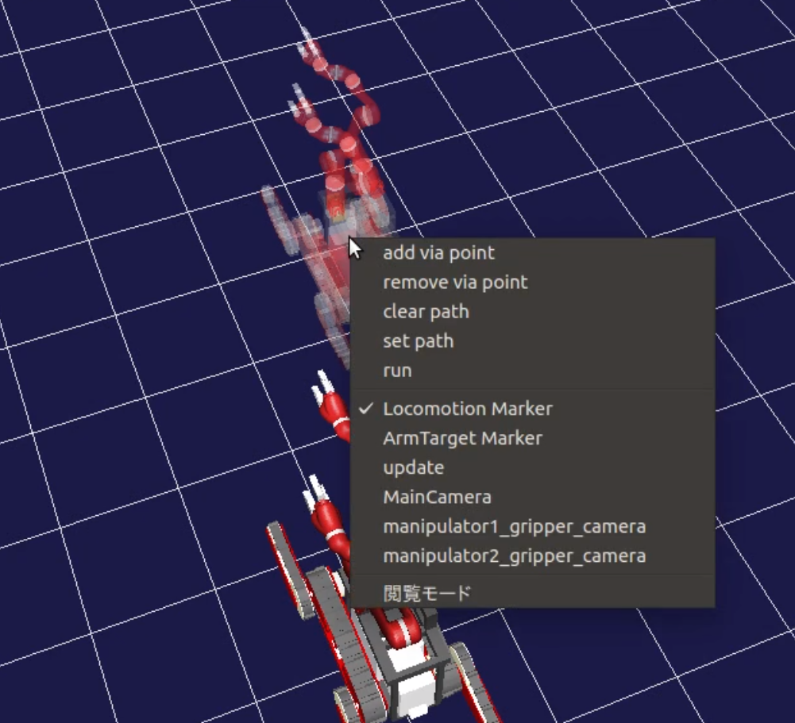
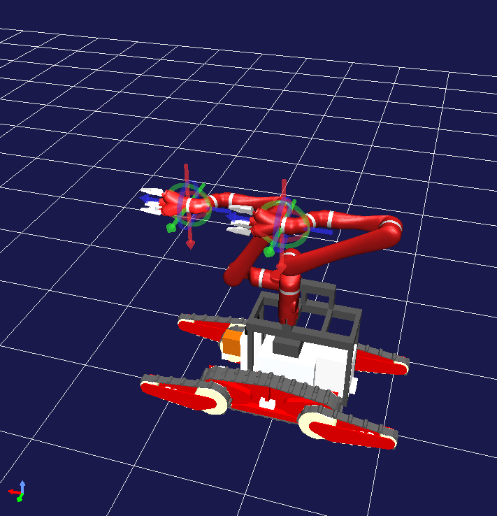
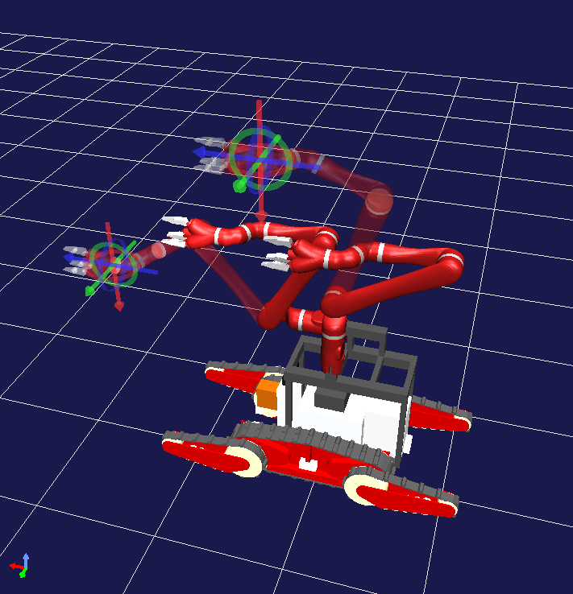
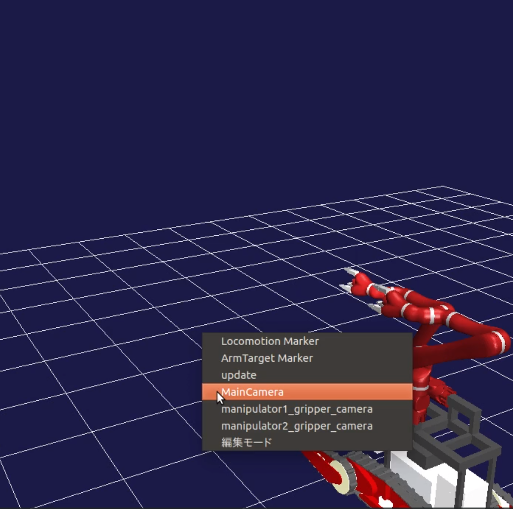

遠隔操作プラグイン(操作マニュアル)
======================================
遠隔操作プラグインは、移動マーカーやアーム操作マーカーを使ってロボットの動作を計画、実行することができます。
また、ジョイスティックによるマニュアル操作についても説明します。

.. contents:: 目次
   :local:

遠隔操作プラグインの導入
------------------------
必要なソースコードは開発者向けリポジトリのTeleoperationPluginとSpiderOperationです。
choreonoid本体側のブランチをTeleoperationPluginに、ext/wrsのブランチをSpiderOperationに替えてください。
CMakeの設定で以下のオプションをONにしてビルドしてください。

* BUILD_TELEOPERATION_PLUGIN
* BUILD_SPIDER_CONTROLLER
* BUILD_WRS

(src/Util/SceneGraph.cpp とsrc/BodyPlugin/SimpleControllerItem.cpp, src/BodyPlugin/SimpleControllerItem.h にも暫定的な修正があります。)

遠隔操作ビューのプロパティの設定
---------------------------------
遠隔操作シミュレーションを行うには、アイテムツリーに遠隔操作用のWolrdを追加しその配下にTeleoperationPluginアイテムを配置します。

サンプルのプロジェクトがsample/WRS2018/にあります(T2-Teleoperation.cnoid, T5-Teleoperation.cnoid)。プロジェクトの設定はそちらを参考にしてください。

ゲームパッドでの操作
--------------------
ゲームパッドを用いたSpiderの操作方法を記述します。３種類の操作モードがあり、Logoマークのボタンを押すごとに切り替わるようになっています。モード切り替え時に現在のモードをメッセージビューに表示します。
(ItemTreeビューでのゲームパッド用シンプルコントローラーの順序で切り替わる)

クローラ操作モード
^^^^^^^^^^^^^^^^^^
Spiderのクローラを操作して移動するためのモードです。初期状態ではこのモードになっています。

.. tabularcolumns:: |p{3.0cm}|p{12.0cm}|

.. list-table:: クローラ操作モードの操作方法
 :widths: 15,85
 :header-rows: 1

 * - キー
   - 動作
 * - 左スティック
   - メインクローラを動かします。上に倒すと前進、下に倒すと後退、左右に倒すと旋回します。
 * - 右スティック
   - 使用しません
 * - 十字キー
   - 使用しません
 * - ×(A)ボタン
   - 後方のサブクローラを下げる
 * - ○(B)ボタン
   - 後方のサブクローラを上げる
 * - □(X)ボタン
   - 前方のサブクローラを下げる
 * - △(Y)ボタン
   - 前方のサブクローラを上げる
 * - L1ボタン
   - 使用しません
 * - R1ボタン
   - 使用しません
 * - L2ボタン
   - 速度を上げます(最大2倍)
 * - R2ボタン
   - 使用しません
 * - 左スティック押し込み
   - 使用しません
 * - 右スティック押し込み
   - 使用しません
 * - SELECTボタン
   - 使用しません
 * - STARTボタン
   - 使用しません
 * - Logoボタン
   - アーム操作(順運動学(FK)モード)に移行

アーム操作(順運動学(FK)モード)
^^^^^^^^^^^^^^^^^^^^^^^^^^^^^^
アームを関節軸で操作するためのモードです。

.. tabularcolumns:: |p{3.0cm}|p{12.0cm}|

.. list-table:: アーム操作(順運動学(FK)モード)の操作方法
 :widths: 15,85
 :header-rows: 1

 * - キー
   - 動作
 * - 左スティック
   - 関節角の操作(左右:関節0, 上下:関節1)
 * - 右スティック
   - 関節角の操作(左右:関節2, 上下:関節3)
 * - 十字キー
   - 関節角の操作(左右:関節4, 上下:関節5)
 * - ×(A)ボタン
   - 使用しません
 * - ○(B)ボタン
   - 使用しません
 * - □(X)ボタン
   - 使用しません
 * - △(Y)ボタン
   - 使用しません
 * - L1ボタン
   - 操作対象切り替え
 * - R1ボタン
   - 操作対象切り替え
 * - L2ボタン
   - グリッパーを開く(アーム操作時のみ)
 * - R2ボタン
   - グリッパーを閉じる(アーム操作時のみ)
 * - 左スティック押し込み
   - 使用しません
 * - 右スティック押し込み
   - 使用しません
 * - SELECTボタン
   - 使用しません
 * - STARTボタン
   - 使用しません
 * - Logoボタン
   - アーム操作(逆運動学(IK)モード)に移行

アーム操作(逆運動学(IK)モード）
^^^^^^^^^^^^^^^^^^^^^^^^^^^^^^
アームの手先の位置姿勢を操作するためのモードです。移動方向は手先のカメラ画面上での方向です。

.. tabularcolumns:: |p{3.0cm}|p{12.0cm}|

.. list-table:: アーム操作(逆運動学(IK)モード）の操作方法
 :widths: 15,85
 :header-rows: 1

 * - キー
   - 動作
 * - 左スティック
   - 上下左右方向への平行移動
 * - 右スティック
   - pitch, yaw方向の回転
 * - 十字キー
   - 上下左右方向への平行移動
 * - ×(A)ボタン
   - Pitch +
 * - ○(B)ボタン
   - Yaw +
 * - □(X)ボタン
   - Yaw -
 * - △(Y)ボタン
   - Pitch -
 * - L1ボタン
   - Roll -
 * - R1ボタン
   - Roll +
 * - L2ボタン
   - 手前に移動
 * - R2ボタン
   - 奥に移動
 * - 左スティック押し込み
   - 右スティック左右方向の回転方向を反転
 * - 右スティック押し込み
   - 右スティック上下方向の回転方向を反転
 * - SELECTボタン
   - 操作対象切り替え
 * - STARTボタン
   - 使用しません
 * - Logoボタン
   - クローラ操作モードに移行

遠隔操作画面での操作
--------------------
Teleoperationビューから行える操作を記述します。

Teleoperationビューの何もないところで右クリックし、メニューを表示させます。

移動マーカー
^^^^^^^^^^^^^
LocomotionMarkerを選択すると、移動マーカーの表示・非表示が切り替わります。また、後述のArmTargetMarketとは排他されており、そちらが表示になると非表示になります。

表示された移動マーカーは編集モード(基本操作のページ参照)でドラッグして移動させることが可能です。向きはキーボードの矢印キーの左右で変えられます。

移動マーカー上で右クリックすると、移動マーカー専用のメニューが表示されます。

* add via point   移動マーカーの位置と向きを移動経路の終端に追加します。移動経路は矢印で表示されます。
* remove via point    最後に追加した位置を削除します。
* clear   移動経路をすべて削除します。
* set path    移動経路を確定します。runの実行前にこの操作を行っておく必要があります。
* run 移動を実行します。

アーム操作マーカー
^^^^^^^^^^^^^^^^^^
ArmTargetMarkerを選択すると、アーム操作マーカーの表示・非表示が切り替わります。LocomotionMarkerとは排他されており、そちらが表示になると非表示になります。

アーム操作マーカーには手先にドラッガーが備えられています。編集モードでドラッガーの位置や向きを変えると、それに合わせてアーム操作マーカーの姿勢が変わります。

ただし、逆運動学が解けないような位置・向きになったときはドラッガーのみが移動します。アーム操作マーカー上で右クリックすると、アーム操作マーカー専用のメニューが表示されます。

* execute manipulation    アーム操作マーカーの姿勢へのアーム姿勢の変更を実行します。
* reset dragger   アーム操作マーカーの手先にドラッガーの位置を戻します。ドラッガーがマーカーから離れてしまったときに使用します。
* reset posture   現在のアームの姿勢にもどします。

update
^^^^^^
この項目を選択すると、シミュレーション中のSpiderの状態をTeleoperationビューのモデルに反映します。移動マーカーとアーム操作マーカーも反映後のモデルに合わせて更新されます。

カメラデバイス
^^^^^^^^^^^^^^
モデルに深度カメラが含まれるとき、そのデバイス名が表示されます。この項目を選択すると、シミュレーション中のSpiderの該当するカメラで環境の計測を行い、点群をTeleoperationビューに表示します。同時にupdateも行います。

