バルブ回しチュートリアル
========================
本項ではバルブ回しのタスクを例にとり、Spiderの操作方法を説明します。

step1. 環境の計測
^^^^^^^^^^^^^^^^^
最初に周囲の環境を計測します。CameraImageビューのカメラ画像を見てもいいですが、次のステップのためカメラで深度を計測することにします。Teleoperationビューの何もないところで右クリックし、メニューを表示させます。メニューのなかのMainCameraをクリックすると、MainCameraで計測した点群がTeleoperationビューに表示されます。

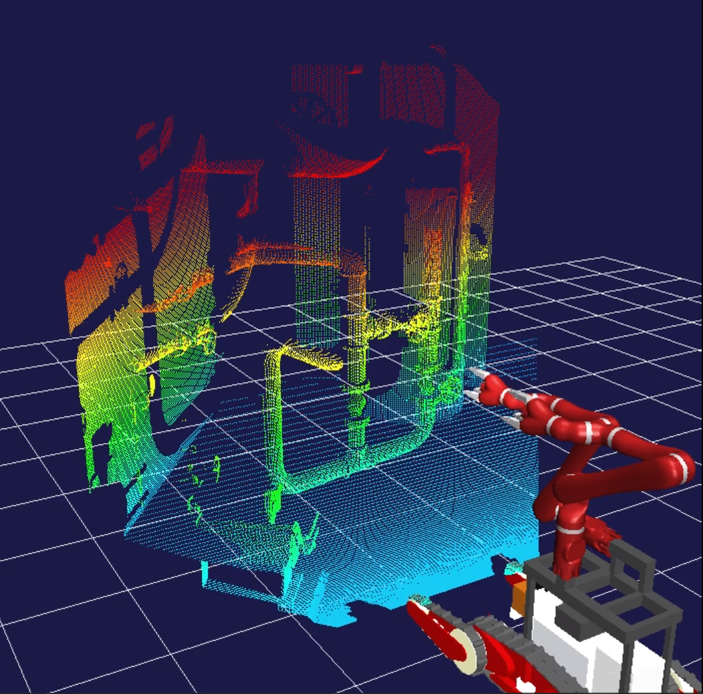

step2. 移動
^^^^^^^^^^^
次に点群の情報を見て、移動先を決めていきます。右クリックメニューでLocomotionMarkerをクリックすると、移動マーカーが表示されます。移動マーカーはドラッグして位置を移動でき、左右の矢印キーで向きを変えることができます。表示されている点群を見ながら、移動先を決めていきます。

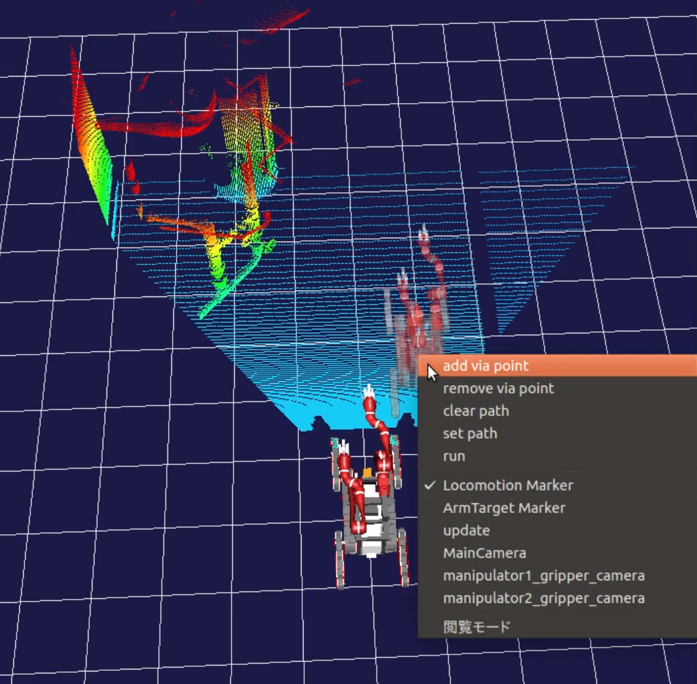

移動先を決めたらマーカー上で右クリックし、移動マーカーの専用メニューからadd via pointを選択して移動先を追加します。移動はこのようにして追加された点を直線的に結ぶようにして行われます。障害物などを迂回する必要がある場合は、そのように移動先を追加してください。移動経路は矢印で表示されていきます。

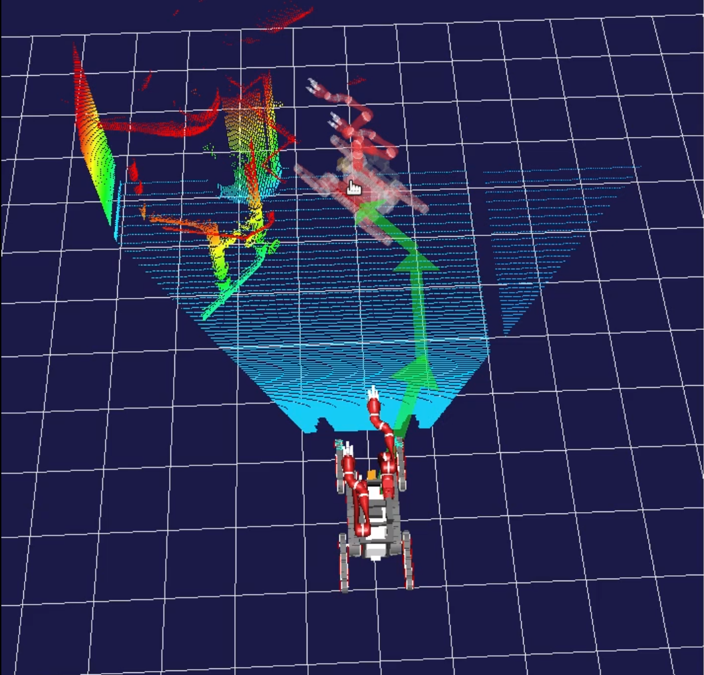

追加する点を間違えた場合は、remove via point(最後に追加した点を削除)やclear(すべて削除)を使用してください。移動経路を指定し終わったら、set pathで経路を確定させ、runで移動を実行します。

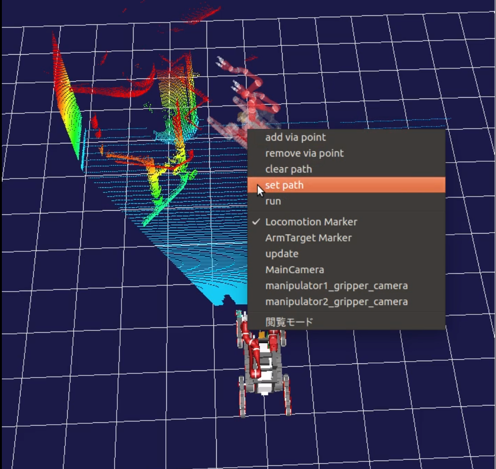
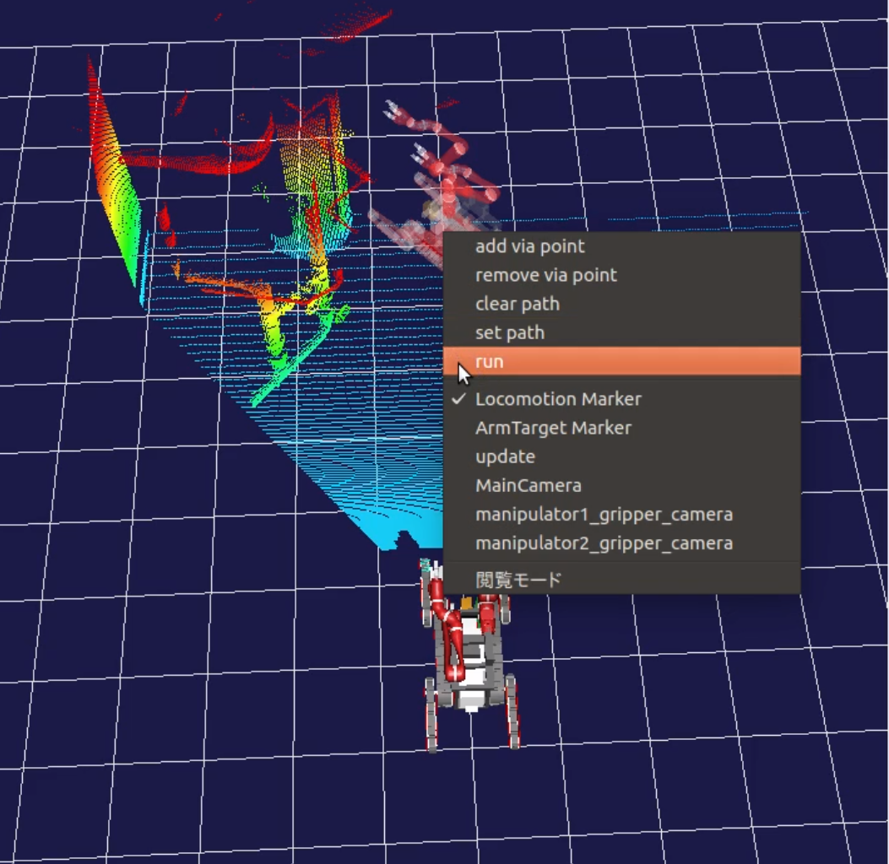

移動が終わったら、step1の操作で移動先の周囲を再計測します。回したいバルブがアームの届く範囲に来るまで、step1と2で移動を繰り返してください。

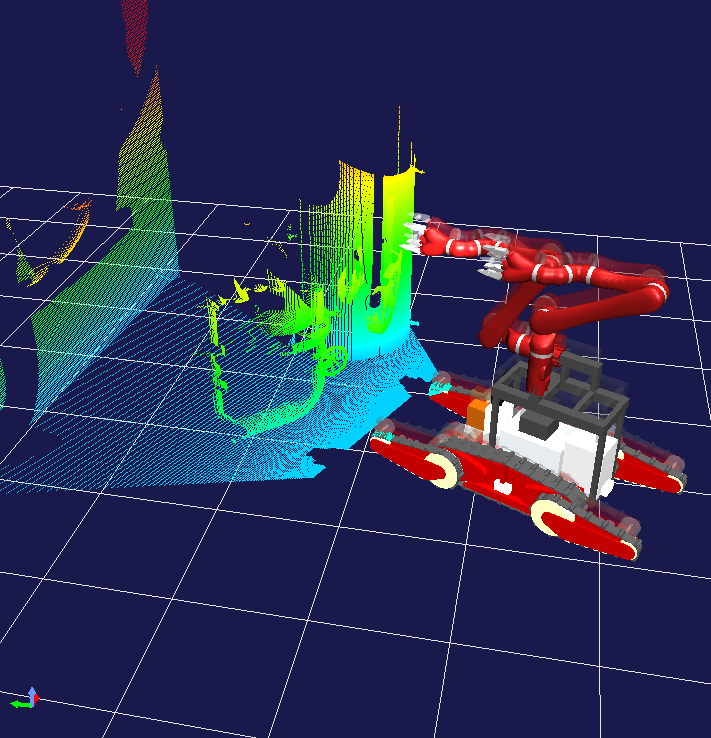

step3. アームをバルブに近づける
^^^^^^^^^^^^^^^^^^^^^^^^^^^^^^
次にバルブの近くまでアームを移動させます。右クリックメニューでArmTargetMarkerをクリックして、アーム操作マーカーを表示させてください。

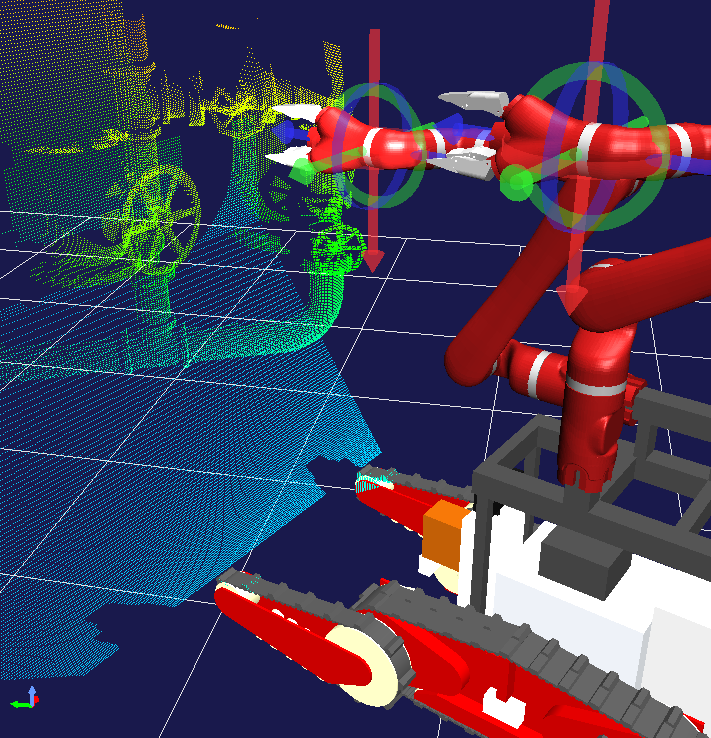

ドラッガーがモデル上に見えると思いますが、半透明のモデルも重ねて表示されています。ドラッガーの軸をドラッグしてみると、半透明のモデルがそれに追随して動きます(ドラッグするには編集モードにする必要があります。また、ドラッグする方向や移動量によっては追随しないときがあります)。点群中のバルブの位置を見ながら、この半透明のモデルがバルブを回せる位置に来るようにドラッガーを移動させます。逆運動学が解けなくなるとモデルからずれていってしまうので、無理のない姿勢を保って動かすようにしましょう。ドラッガーがモデルから離れてしまったときは、メニューのreset draggerでモデル上の位置に戻すことができます。また、reset postureで姿勢をリセットします。

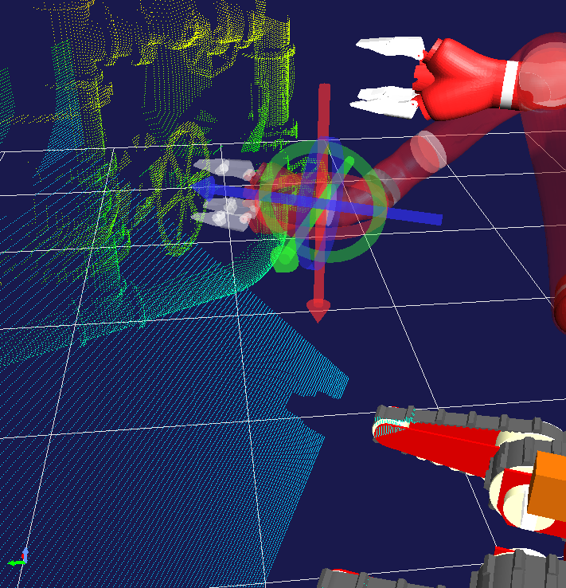

実行前にCameraImageビューのカメラを動かす方の手のカメラにしておきます。CameraImageビューにフォーカスを合わせてからメニューバーのプルダウンメニューで対象のカメラを選択します。アームの位置を決めたら、メニューの execute manipulation で動作を実行します。CameraImageビューの画像を見て動き終わったら再計測し、結果を確認します。

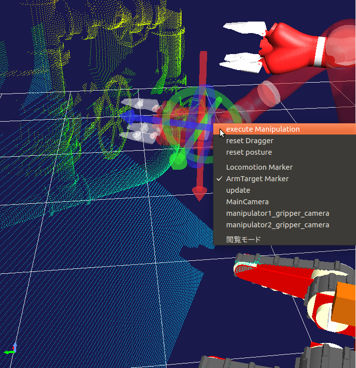
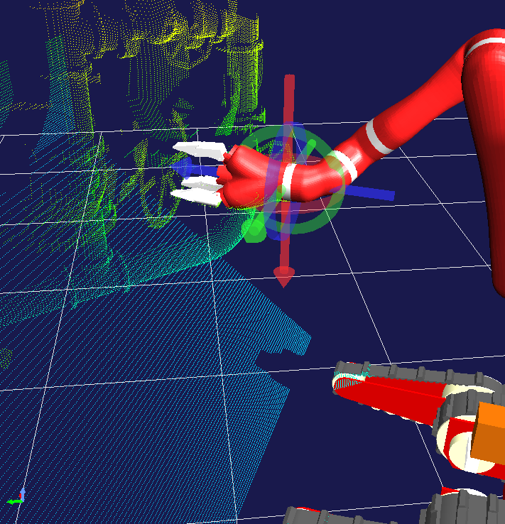

step4. バルブを回す
^^^^^^^^^^^^^^^^^^^^
ここからはゲームパッドを使って操作します。２通りの回し方を紹介します。どちらも最初にバルブに対する手首の位置を調整します。調整のためには、アームを逆運動学で動かすモードが便利です。このモードにするため、ゲームパッドのLogoボタンを押してモードを切り替えてください。メッセージビューに現在のモードが表示されています。ここに IK mode と出るまで(初期状態からは2回)Logoボタンを押してください。アームが2つある場合は操作対象のアームを選択する必要があります。Selectボタンで選択できます。

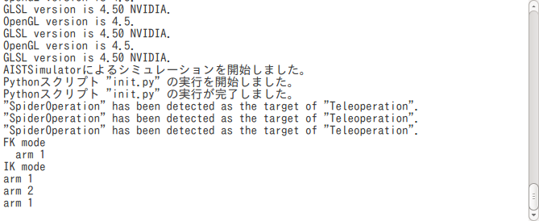

4-1. 指を差し込んで回す方法
^^^^^^^^^^^^^^^^^^^^^^^^^^^
指先をスポークの間に差し込んで、手首を回転させてバルブを回す方法です。最初にカメラの中心がバルブの中心になるように位置と向きを調整します。右スティックを倒すと向きを変えることができます。step3でバルブに正対するようにしておくと、向きを調整する必要がなく楽になります。次に左スティックを倒して位置を調整します。左スティックは十字キーで、右スティックはABXYボタンで代用可能です。スティックからの入力では斜めに入力されてしまうという場合にも利用できます。

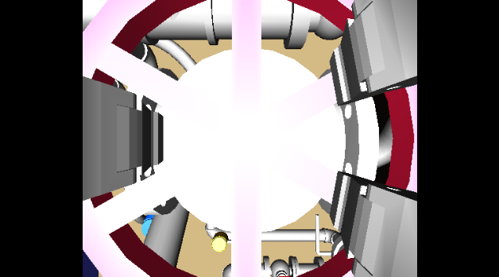

次に指の形を差し込みやすい形に調整します。指の各関節の角度で調整しますので、Logoボタンで順運動学モードに切り替えます。L1/R1ボタンで操作対象をグリッパーに変更します。左右のスティックと十字キーで指の関節を操作できますので、１本の指を折り残りの２本を少し広げるようにしてください。
このようにする理由は指とバルブハンドルのスポークとの干渉を避けるためです。

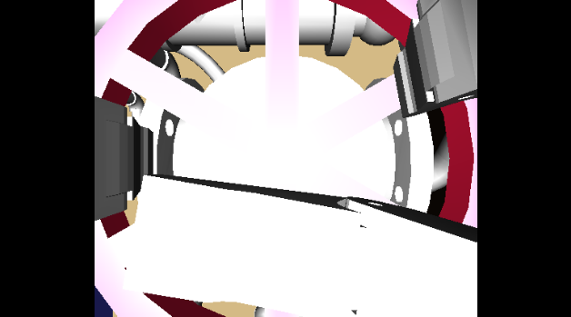

次に２本の指がスポークと干渉しないように手首を回転させます。再び逆運動学モードに切り替えます。L1/R1ボタンが時計周り・反時計周りの回転です。もしくは順運動学モードのままで手首の関節を動かしても同等のことができます。指がスポークの間隙にくるように調整してください。

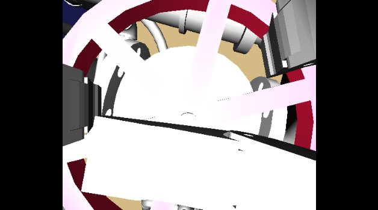

調整したらR2ボタンを押して、奥に押し込みます。ぶつかりそうになった場合は、左スティックなどで微調整してください。

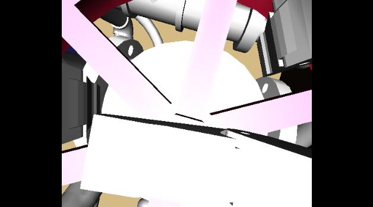

指先がスポークの間に入ったら、L1かR1ボタンで手首を回転させます。指がスポークにかかってバルブが回転します。回転させ終わったらL2ボタンで手首を抜きます。

4-2. ハンドルを掴んで回す方法
^^^^^^^^^^^^^^^^^^^^^^^^^^^^^
指でハンドルを掴んで回す方法です。カメラの中心がハンドル部になるように位置と向きを調整します。

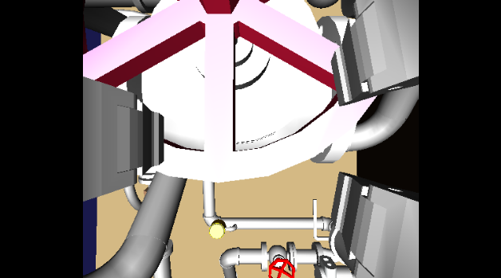

次にハンドルを掴むため、一度指を開きます。Logoボタンで順運動学モードに切り替えて、操作対象をアームにしてください。アーム操作時はL2/R2ボタンで指の開閉ができます。L2ボタンを押して指を広げてください。広げすぎるとスポークと干渉するので調整します。

逆運動学モードにして、ハンドルをつかめるように位置と向きを調整します。ハンドルの外側に指が2本来るようにします。調整したらR2ボタンを押して、奥に押し込みます。ぶつかりそうになった場合は、左スティックなどで微調整してください。

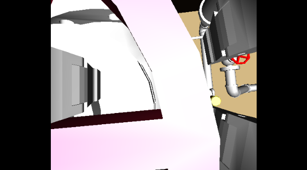

再び順運動学モードにして指を閉じハンドルを掴みます。あまり固く握らないようにします。

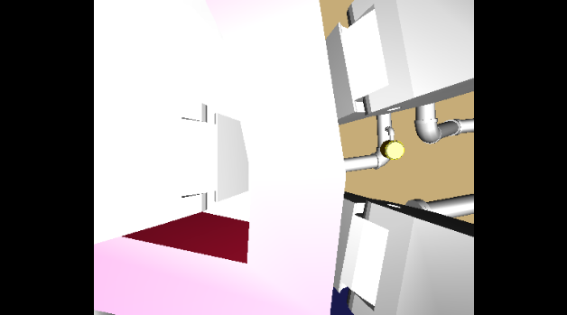

ハンドルを掴んだ手を動かしてハンドルを回します。逆運動学モードにして移動と回転を同時に行います。移動方向と回転方向は掴み方と回す方向によって決めてください。
回転させ終わったら、指を広げて手首を抜きます。

