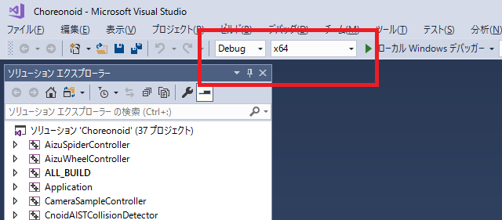
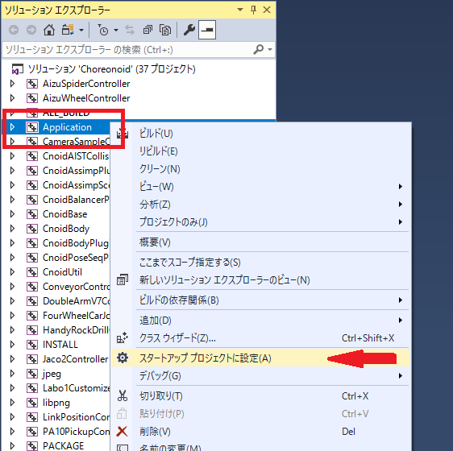
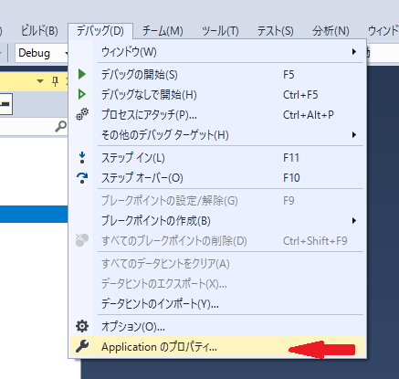
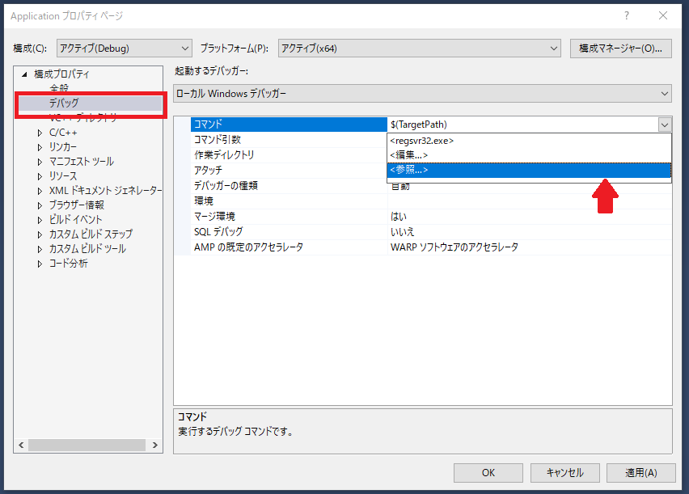
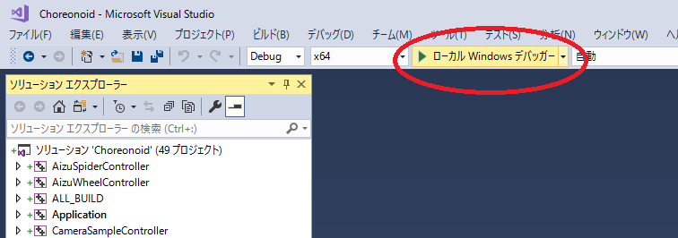
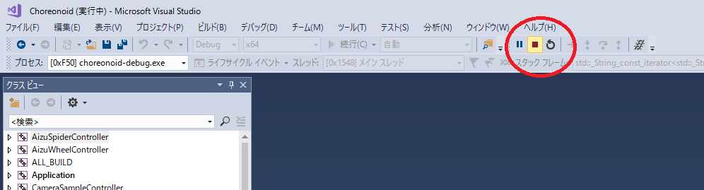
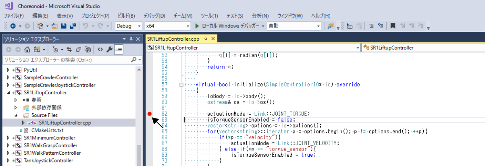
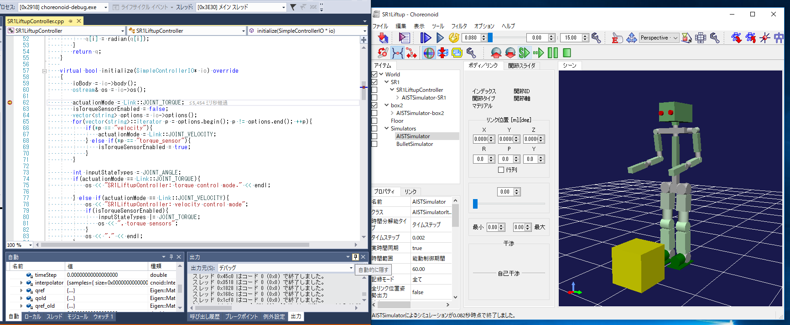

Visual Studioを用いてChoreonoidをデバッグする方法
====================================================

Visual Studioを用いてChoreonoidのプログラムをデバッグする方法について解説します。

.. contents:: 
   :local:
   :depth: 1

デバッグ用のビルド
----------------------

Visual Studio を起動して、choreonoidのソリューションファイルを読み込みます。

   
赤枠部分を **Debug** , **x64** に設定します。:ref:`build-windows-visualstudio` と同じ操作で、ビルド、インストールを行います。

デバッグの設定
-----------------------------

ソリューションエクスプローラを表示し、 **Application** を選択します。右クリックして表示されるメニューから **スタートアップ　プロジェクトに設定** を選びます。

Applicationの表示が、太字になります。

メニューから **デバッグ** - **Applicationのプロパティ...** を選択して、プロパティのページを開きます。

構成プロパティの **デバッグ** を選択し、コマンドの欄をクリックすると右端に表示されるバタンをクリックして図のようなメニューを出します。ここで、 **<参照...>** を選択します。

ファイル選択用のダイアログが開きますので、choreonoidのインストール先にある **choreonoid-debug.exe** を選択します。もちろんファイル選択ダイアログを使わず、空欄に直接入力しても構いません。

コマンド引数の欄に入力すると、choreonoidに引数を渡せます。

OKボタンを押して終了します。

デバッガーの起動と終了
-------------------------

図の赤丸の **ローカルWindowsデバッガー** をクリックします。

   
choreonoidが起動します。

図の赤丸の四角いアイコンをクリックします。

   
choreonoidが終了します。choreonoのメニューで終了させてもいいです。

サンプルのデバッグ
-----------------------

次にサンプルプログラムをデバッグしてみます。

**ソリューションエクスプローラ** で、 **SR1LiftupController** のプロジェクトを展開し、**SR1LiftupController.cpp** をダブルクリックします。

図のようにプログラムが表示されます。ブレイクポイントを設定したい行の左側、図のところをクリックします。

赤い丸印がブレイクポイントが設定された表示です。

この状態で **ローカルWindowsデバッガー** をクリックしてChoreonoidを起動します。

Choreonoidが起動したら、SR1Liftup.cnoidプロジェクトを開き、シミュレーションを実行します。

先ほどブレイクポイントを設定した行でプログラムが止まります。

Choreonoidのウィンドウの下にVisual Studioのウィンドウが隠れている場合は、前面に出してください。

**F10キー** を押すことで１行ずつのプログラムが実行できます。

また **F11キー** で、関数の中に飛んだりもできます。

ブレイクポイントで止まっている時の変数の内容を見たり、設定したりもできます。

詳しくは、Visual Studio のヘルプをご覧ください。
