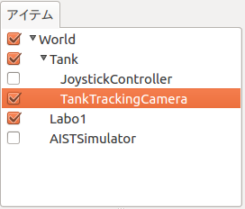
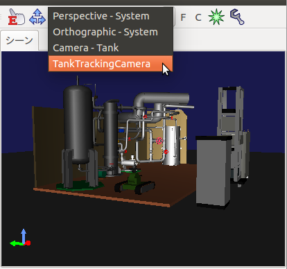
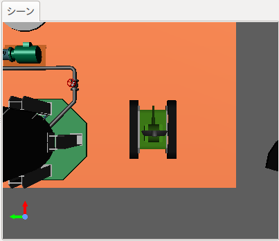
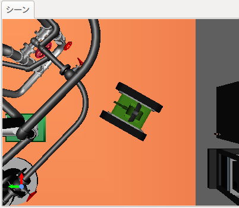
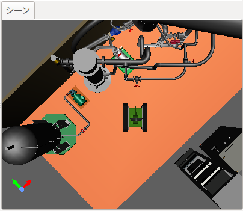

ボディ追尾カメラの使い方
===========================

ボディ追尾カメラは、ロボットの動きに合わせて動くカメラです。シミュレーション時にシーンビューの描画にこのカメラを選択すると、ロボットの移動に合わせてカメラも移動するので、ロボットを追いかけるように表示してくれます。ここでは、このカメラの使い方を説明します。

ボディ追尾カメラアイテムの作成
--------------------------------

メニューから、 **ファイル** ー **新規** ー **ボディ追尾カメラ** と選択してBodyTrackingCameraItemを作成し、
追いかけたいロボットのBodyItemの小アイテムとして、BodyTrakingCameraItem を配置します。アイテムには他のカメラと区別できるように名前をつけておきます。また、アイテムにはチェックを入れておきます。

ボディ追尾カメラの選択
--------------------------

アイテムにチェックを入れると、シーンバーの「描画用カメラ選択コンボ」に先ほど付けた名前のカメラが表示されるようになりますので、これを選択します。シーンビューのカメラの選択については、 :ref:`basics_sceneview_change_camera` をご覧ください。

シーンビューのカメラが切り替わったと思います。マウスを操作して、視点を調整してください。例えば次の図のようにロボットの真上に視点を移動させてみます。視点の調整方法については、 :ref:`basics_sceneview_viewpoint` をご覧ください。

シミュレーションを開始します。ロボットが移動しても、常にロボットの真上から観ているように表示されます。

BodyTrakingCameraItemのプロパティで **姿勢保持** を **True** に設定しておけば、ロボットとの視点の相対的な位置に加えて、姿勢も一定に保たれるように表示されます。

プロパティ
--------------

BodyTrakingCameraItem 特有のプロパティは以下の通りです。

.. tabularcolumns:: |p{3.5cm}|p{11.5cm}|

.. list-table::
 :widths: 25,75
 :header-rows: 1

 * - プロパティ
   - 意味
 * - 名前
   - アイテムの名前です。カメラの名前としても使用されます。
 * - 姿勢保持
   - Trueにすると、ロボットとカメラの相対的な姿勢が一定に保たれます。
 * - カメラ タイプ
   - カメラの種類　Perspective（透視投影）か　Orthographic（正射影）かを選択します。
 * - クリッピング近距離
   - 描画範囲を設定します。視点から見て、この値より近い物体は表示されません。
 * - クリッピング遠距離
   - 描画範囲を設定します。視点から見て、この値より遠い物体は表示されません。
 * - 視野角
   - Perspectiveカメラの視野角を設定します。
   
   

