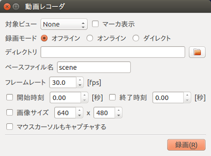
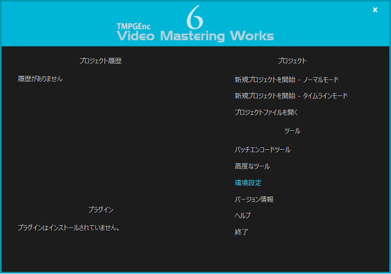
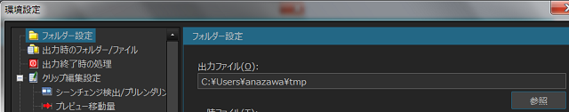
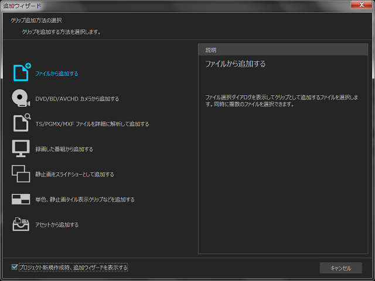
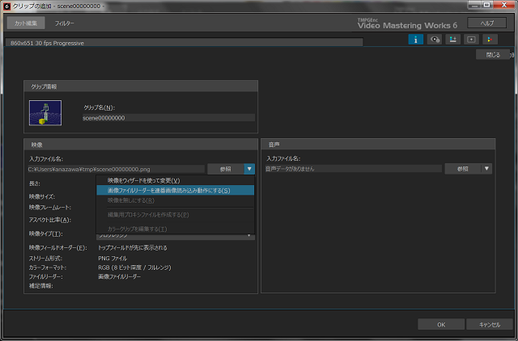
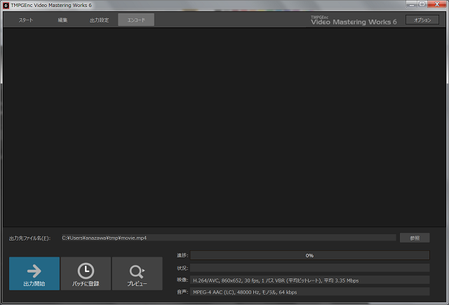

連番画像から動画ファイルを作成する方法
===================

.. contents::
   :local:

   
FFmpegインストール(Ubuntu Linux編)
---------------------------

下記のコマンドを実行し、FFmpegをインストールします。 :: 

 sudo apt-get install ffmpeg

 
TMPGEncインストール(Windows編)
-----------------------

Internet Explorer等のウェブブラウザから下記のURLにアクセスします。

`http://www.pegasys-inc.com/ja/ <http://www.pegasys-inc.com/ja/>`_
 
「ホーム」⇛「製品情報」⇛「ダウンロード」を選択し、「TMPGEnc Video Mastering Works6」の「ダウンロード」ボタンを押下します。
「製品版」の「ダウンロード」をクリックし、「同意する」ボタンを押下するとダウンロードが開始します。
ダウンロードが完了したら、exeファイルを実行しインストールを行います。

動画レコーダバーの表示
-----------

Choreonoidのメニューより、「表示」⇛「ツールバーの表示」⇛「動画レコーダバー」を選択すると、図のような動画レコーダバーを表示されます。

.. image:: images/recorder_bar.png

動画レコーダでの録画方法
------------

動画レコーダバーのレンチマークを選択すると、「動画レコーダ」ウィンドウが表示されます。

下記に記載した項目を設定することで様々な録画をすることが可能となります。

.. list-table::
  :widths: 20, 80
  :header-rows: 1

  * - 項目
    - 内容
  * - 対象ビュー
    - 録画するビューの選択をします。
  * - マーカ表示
    - 選択しているビューに対してマーカを設定します。
  * - 録画モード
    - | オフライン：シミュレーション後に「録画」ボタンを押下するとシミュレーション結果を録画します。
      | オンライン：「録画」ボタンを押下すると待機中となり、シミュレーションを開始すると録画が始まり、シミュレーションを終了すると録画が終わります。
      | ダイレクト：「録画」ボタンを押下すると録画が始まり、再度「録画」ボタンを押下すると録画が終わります。 ※シミュレーションを行っていない状態でも録画されます。
  * - ディレクトリ
    - 連続画像を出力するディレクトリ指定します。
  * - ベースファイル名
    - ベースとなるファイル名を指定します。 ※実際に出力されるファイル名は、"ベースファイル名" + "8桁の連番" + ".png"。
  * - フレームレート
    - 1秒あたりのフレーム数を設定します。デフォルトは、30fpsです。
  * - 開始/終了時刻
    - 開始時刻で指定した時間から録画され、終了時刻で指定した時間までを録画します。
  * - 画像サイズ
    - 画像サイズを設定します。デフォルトは、640✕480です。
  * - マウスカーソルもキャプチャする
    - マウスカーソルもキャプチャされます。

連番画像を動画に変換(Ubuntu Linux編)
-------------------------

連番画像が格納されているディレクトリに移動し、下記のコマンドを実行します。 ::

 ffmpeg -r 30 -i scene%08d.png -r 30 movie.mp4

* "-r <framerate>" で、フレームレートを指定値に変換できます。未指定の場合は、入力ファイルの値を継承します。

* "-i <filename>" で、入力ファイルパスを指定します。

連番画像を動画に変換(Windows編)
--------------------

スタートメニューより、「TMPGEnc」⇛「TMPGEnc Video Mastering Works 6」をクリックします。

.. image:: images/tmpgenc.png

TMPGEnc Video Mastering Works 6が起動したら、「環境設定」をクリックします。

「フォルダー設定」⇛「出力ファイル」に任意のフォルダパスを設定し、「OK」ボタンを押下します。

次に、「新規プロジェクトを開始 - ノーマルモード」をクリックし、「追加ウィザード」ウィンドウが表示されたら、「ファイルから追加する」を選択します。

連番画像を格納したフォルダより連番が最小となる画像を1つ選択します。「クリップの追加」ウィンドウが表示されたら、「映像」⇛「入力ファイル名」の「参照」ボタンの横にある矢印をクリックします。

.. image:: images/tmpgenc_cutediting.png

リストが表示されたら、「画像ファイルリーダーを連番画像読み込み動作にする」を選択し、「OK」ボタンを押下します。

「エンコード」⇛「出力先ファイル名」を任意の名前に変更を行い、「出力開始」ボタンを押下したら動画作成が完了です。

