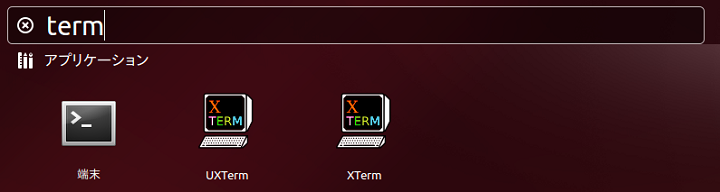
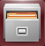

Linuxの基本的な使用方法について
==================

Linuxの端末の起動方法やコマンドラインの使用方法について解説します。

.. contents::
   :local:
   
Linuxの端末起動方法
------------

.. |search_computer| image:: images/search_computer.png

ホーム画面の左端に表示されているランチャーの「コンピュータを検索」 |search_computer| をクリックします。

検索ボックスとアプリケーション等の一覧が表示されるので、検索ボックスに"端末"と入力します。

.. image:: images/search_computer_window2.png

入力した結果「端末」が表示されるので、「端末」をクリックすると、「端末」が起動されます。

.. image:: images/commandline_window.png

基本的なコマンド使用方法とChoreonoidの起動方法
----------------------------

ここでは本マニュアルで使用する最低限のコマンドの使用方法とChoreonoidの起動方法を解説します。

.. list-table::
  :widths: 20, 80
  :header-rows: 1

  * - コマンド
    - 説明
  * - cd
    - | cdとは、change directoryの略で現在のワーキングディレクトリを変更するコマンドです。
      | **cd <ディレクトリ名>** で指定したディレクトリに移動することができます。　※<ディレクトリ名>は、相対パス、絶対パスのどちらも指定可能となります。
      | <ディレクトリ名>には、記号を指定することができ、記号はそれぞれ下記のような意味を持っています。
      | /                          … ルートディレクトリ
      | .                          … 現在のディレクトリ
      | ..                         … 親ディレクトリ
      | ~/                         … ホームディレクトリ
      | ディレクトリ名の指定なし   … ホームディレクトリ
  * - ls
    - | lsとは、listの略でファイルやディレクトリの情報を表示するコマンドです。
      | **ls [オプション]** でファイルやディレクトリ情報を表示できます。　※オプションの指定は任意となります。
      | 例えば、コマンドライン上で"ls -l"と入力すると、ファイルサイズなどのファイルの詳細も同時に表示してくれます。
  * - pwd
    - pwdとは、print working directoryの略で現在のディレクトリの場所を確認するコマンドです。
  * - mkdir
    - | mkdirとは、make directoryの略でディレクトリを作成するコマンドです。
      | **mkdir [オプション] <作成ディレクトリ名>** でディレクトリを作成することができます。 
  * - cp
    - | cpとは、copyの略でファイルやディレクトリをコピーするコマンドです。
      | **cp [オプション] <コピー元ファイル名/ディレクトリ名> <コピー先ファイル名/ディレクトリ名>** でファイルやディレクトリをコピーすることができます。
      | ただし、ディレクトリをコピーする際は、"-r"オプションを指定する必要があります。
  * - mv
    - | mvとは、moveの略でファイルやディレクトリの移動・名前の変更をするコマンドです。
      | **mv [オプション] <変更前ファイル名/ディレクトリ名> <変更後ファイル名/ディレクトリ名>** でファイルやディレクトリの移動やファイル名の変更を行えます。
      | ファイル名を変更する場合、コマンドライン上で"mv file1 file2"と入力することでファイル名を"file1"から"file2"へ変更を行えます。
      | また、ファイルを移動する場合、"mv file2 ~/test"と入力することで、"file2"をホームディレクトリ直下の"test"ディレクトリに移動させることができます。
  * - rm
    - | rmとは、removeの略でファイルやディレクトリを削除するコマンドです。
      | **rm [オプション] <ファイル名/ディレクトリ名>** で指定したファイルやディレクトリを削除することができます。
      | ただし、ディレクトリを削除する際は、"-r"オプションを指定する必要があります。
      | また、削除するファイルやディレクトリには、ワイルド・カードを使用することが可能となっており、コマンドライン上で"rm *.txt"と入力することで、カレントディレクトリ内の拡張子：txtのファイル全てを削除できます。
  * - gedit
    - | geditとは、標準のテキストエディタを起動するコマンドです。
      | geditでは複数のプログラミング言語に対応したハイライト表示を行うことができます。
      | 例えば、本マニュアルでは、YAMLやC++を使用していますが、デフォルトではハイライト設定オフとなっており見づらいので、geditのメニューにある「表示」⇛「ハイライトモード」を選択し、YAMLやC++を選択することでハイライト表示が可能となります。
  * - choreonoid
    - | choreonoidとは、Choreonoidを起動する際に用いるコマンドです。
      | **bin/choreonoid [プロジェクト名(拡張子:cnoid)]** でChoreonoidを起動することができます。　※プロジェクト名の指定は任意となります。 
      | 前提条件として、Choreonoidを起動する際には、まずcdコマンドを使用して"Choreonoid"ディレクトリに移動しておく必要があります。
      | 例えば、ホームディレクトリ直下に"Choreonoid"ディレクトリが存在する場合は、 **cd ~/Choreonoid** と入力すると"Choreonoid"ディレクトリに移動できます。
      | "Choreonoid"ディレクトリに移動したら、コマンドライン上で **"bin/choreonoid"** と入力するとChoreonoidを起動することができます。
      | また、プロジェクトを指定して起動する場合は、コマンドライン上で **"bin/choreonoid share/project/SR1Liftup.cnoid"** と入力することで対象のプロジェクトを起動することができます。
      | ※ここでは、サンプルであるSR1Liftupというプロジェクトを起動しています。

ファイルマネージャーの使用方法
---------------

ここではファイルマネージャーを使用したファイルコピーやテキストエディターを使用したファイルの開き方等を解説します。

.. |directory| image:: images/directory.png
.. |right_menu_copy| image:: images/right_menu_copy.png
.. |right_menu_paste| image:: images/right_menu_paste.png
.. |gedit_activation| image:: images/gedit_activation.png
.. |gedit_open| image:: images/gedit_open.png
.. |choreonoid_activation| image:: images/choreonoid_activation.png

- | ホーム画面の左端に表示されているランチャーの「ファイル」 |file_manager| をクリックするとファイルマネージャーが起動します。
- | ディレクトリの移動は、ディレクトリマーク |directory| をクリックすることで、対象のディレクトリへ移動することができます。
- | ファイル/ディレクトリのコピーは、コピーしたいファイル/ディレクトリを選択し、右クリックするとメニューが表示されるので、「コピー」を選択します。もしくは、コピーしたいファイル/ディレクトリを選択し、"Ctrl+C"でコピーすることができます。 |right_menu_copy|
- | コピーしたファイル/ディレクトリの貼り付けは、貼り付けを行いたいディレクトリに移動し、右クリックするとメニューが表示されるので、「貼り付け」を選択します。もしくは、貼り付けを行いたいディレクトリに移動したら、"Ctrl+V"で貼り付けすることができます。 |right_menu_paste|
- | 標準テキストエディターであるgeditを起動するには、「コンピュータを検索」から"テキストエディター"と入力し表示されたテキストエディターをクリックすると起動します。 |gedit_activation|
- | geditでファイルを開くには、開きたいファイル上で右クリックし、「geditで開く」を選択します。 |gedit_open|
- | Choreonoidを起動するには、choreonoid/bin/ディレクトリ直下にあるchoreonoidをダブルクリックすると、Choreonoidを起動することができます。 |choreonoid_activation|