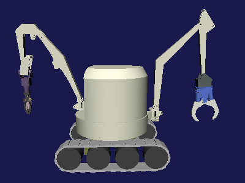
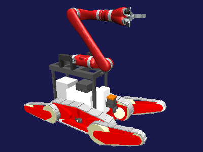

モデルファイルについて
======================

.. contents::
   :local:

ロボットモデルの紹介
~~~~~~~~~~~~~~~~~~~~

プロトタイプでは、`プラットフォームロボット <http://worldrobotsummit.org/download/201707/WRS_Disaster_Robotics_Category_A_standard_robot_platform_for_for_Simulation_Challenge_of_Tunnel_Disaster_Response_and_Recovery_Challenge-doc_jp.pdf>`_  のひとつである「双腕ロボット」（大阪大学開発）を使えるようにしています。（以下ではこれを「双腕重機ロボット」と呼ぶことにします。）このロボットモデルの外観を以下に示します。

このモデルはクローラを使用していますが、クローラについて簡易的なシミュレーションを行うバージョンと、AGX Dynamicsを用いてより実機に近いシミュレーションを行うバージョンを用意しています。モデルのベース名は "DoubleArmV7" としており、これに "Simplified" の "S" または "AGX" の "A" を付与して、

* DoubleArmV7S（簡易クローラ版）
* DoubleArmV7A（AGXクローラ版）

というモデル名にしています。

モデルファイルは、Choreonoidソースの "share/model/DoubleArmV7" 以下に、"DoubleArmV7S.body"、"DoubleArmV7A.body" というファイル名で格納しています。

.. note:: 簡易クローラ版はChoreonoidの標準機能で利用可能で、プロトタイプではAISTシミュレータアイテムを使ってシミュレーションするように設定されています。AGXクローラ版を利用するためには、 :ref:`wrs2018_install_choreonoid` で述べたように、AGX DynamicsとAGX Dynamicsプラグインをインストールしておく必要があります。そちらはAGXシミュレータアイテムを使ってシミュレーションをします。

もうひとつのプラットフォームロボットとして、早稲田大学によって開発された "WAREC-1" も利用可能です。こちらの外観を以下に示します。

.. image:: images/WAREC1.png

このロボットは脚型ロボットの一種で、４脚型のロボットとして使うこともできますし、２脚で立たせてもう一方の２脚をアームとして使うことで、ヒューマノイドロボットのように使うことも可能となっています。

このロボットのモデルファイルは "share/model/WAREC1" 以下に "WAREC1.body" というファイル名で格納されています。ただし現状ではこのモデルを対象とした競技タスクプロトタイプは用意していません。

本競技では上記のプラットフォームロボットが設定されておりますが、ルール上はそれ以外のロボットでも参加可能です。競技タスクプロトタイプでは、会津大学と株式会社アイザックが共同で開発した "Aizu Spider" というロボットのモデルも利用できるようにしました。このロボットのモデルを以下に示します。

このモデルは災害対応ロボットで一般的な構成となっており、メインクローラ２つと、前後のフリッパに搭載されるサブクローラを４つ備えています。またKinova社のJACO2アームを搭載しており、マニピュレーションも行えるようになっています。上の図に示したのはアームをひとつ搭載した単腕版で、プロトタイプでもこれを使用しています。双腕重機ロボットと同様に、クローラについて以下の２つのタイプがあります。

* AizuSpiderSS (簡易クローラ版）
* AizuSpiderSA (AGXクローラ版）

さらにアームの搭載数の違いから、以下のバリエーションモデルも用意されています。

* AizuSpiderNS (アーム無し、簡易クローラ版）
* AizuSpiderNA (アーム無し、AGXクローラ版）
* AizuSpiderDS (双腕、簡易クローラ版）
* AizuSpiderDA (双腕、AGXクローラ版）

これらのモデルのファイルは全てChoreonoidソースの "share/model/AizuSpider" 以下に収録されており、上記のモデル名に拡張子".body"がついたファイル名となっています。

