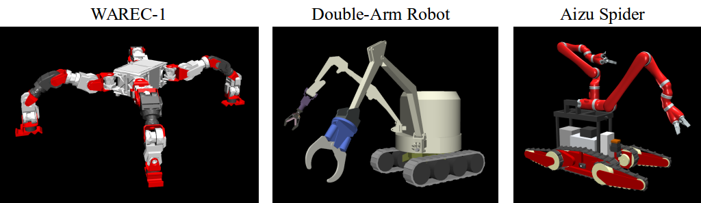
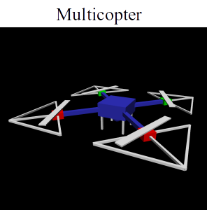
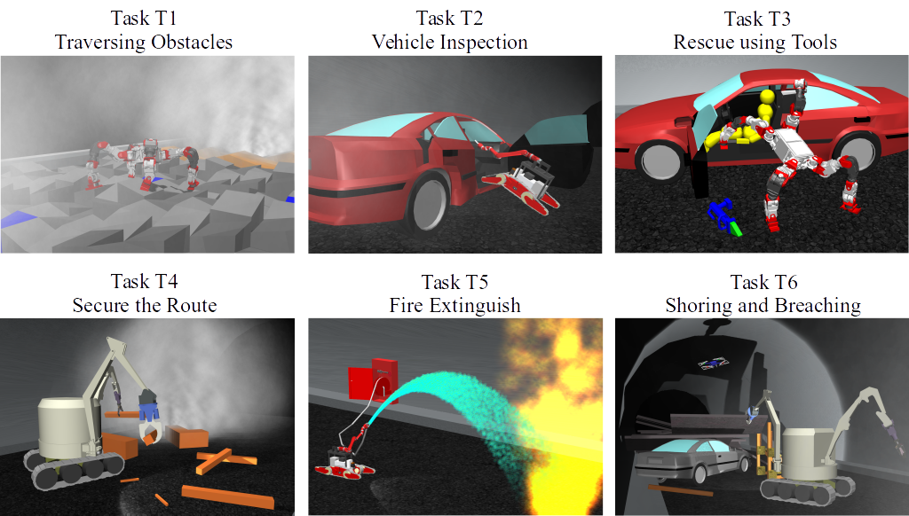
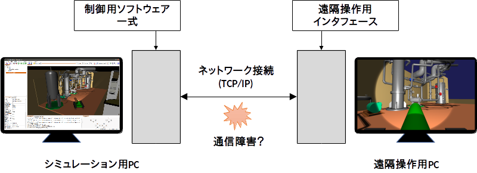

競技会概要
==========

ここではWRS2018のロボット競技会「トンネル事故災害対応・復旧チャレンジ」の概要について紹介します。

.. contents::
   :local:

開催情報
--------

本競技はトンネル内で発生した災害や事故を想定したもので、その状況で必要とされるロボットのタスクの遂行能力を競うものです。競技は全部で6つのタスクから構成され、コンピュータ上でシミュレートされる仮想環境においてロボットがタスクを遂行するものとします。

開催に関する概要は以下のとおりです。

* 日程： 2018年10月17日（水）～21日（日）
* 会場： 東京ビッグサイト
* 参加形態: 参加希望者がチームを構成して書類応募。参加費は無料。書類審査を通過すると参加が可能となる。
* 参加チーム数：全9チーム
* `賞金 <http://worldrobotsummit.org/download/guideline/prize_money_for_the_wrc2018_ja.pdf>`_ ： 1位:1000万円、2位:300万円、3位:100万円

* 競技ルール: `公式英語版 <http://worldrobotsummit.org/download/rulebook-en/rulebook-Tunnel_Disaster_Response_and_Recovery_Challenge.pdf>`_ ( `日本語参考版 <http://worldrobotsummit.org/download/detailed-rules/detailed-rules-tunnel-disaster-response-and-recovery-challenge-ja.pdf>`_ )

* 公式サイト案内ページ: http://worldrobotsummit.org/wrc2018/disaster/

※ 参加チームの応募受付は2018年1月〜3月にかけてWRS公式ページを通して行われました。現在応募は終了しており、参加チームも確定しています。

.. note:: WRSの競技会は今回の2018年大会に加えて、2020年にも開催される予定です。その際にも本競技と同様のシミュレーションによる競技が開催される見込みで、あらためて参加チームを募ることになりますので、興味のある方はその機会での参加もご検討ください。

.. * `渡航費、滞在費を支援 <http://worldrobotsummit.org/download/guideline/support_for_participating_teams_ja.pdf>`_

.. _wrs2018_simulator:

使用シミュレータ
----------------

本競技で使用するシミュレータの情報を以下にまとめます。

* シミュレータ:ソフトウェア: Choreonoid
* Choreonoidバージョン: 次期リリースバージョン（現在の開発版）を使用
* OS: Ubuntu Linux 16.04 64bit版
* 商用物理エンジン "AGX Dynamics" を利用

Choreonoidの次期バージョンは、現在「開発版」として開発・公開されているものです。これは `github上のChoreonoidリポジトリ <https://github.com/s-nakaoka/choreonoid>`_ から取得可能です。

OSはUbntu Linuxを使用します。バージョンは16.04の64ビット版を前提とします。バージョン18.04については、希望チームがあれば対応を検討します。

本競技では物理エンジンとして `AGX Dynamics <http://www.vmc-motion.com/14416057938792>`_ を使用します。AGX Dynamicsは商用の物理エンジンであり、使用にあたってはライセンスが必要となりますが、本競技の参加登録者には参加用のラインセンスが無償で提供されることになっています。ライセンスがあれば、Choreonoid本体に含まれている :doc:`../agxdynamics/index` によって、Choreonoid上で利用することが可能となります。

.. note:: 競技会に参加しない方でも、 `株式会社ブイエムシー <http://www.vmc-motion.com/>`_ が販売している `Choreonoid用のAGX Dynamicsライセンス <http://www.vmc-motion.com/15135605209828>`_ を購入することで、競技のシミュレーションを試すことが可能です。（もちろん、競技以外のシミュレーションにも活用することができます。）あるいは、AGX Dynamicsが無くても、Choreonoid標準の物理エンジンを用いることで、競技の概要を試すことは可能です。ただしその場合、ロボットやタスクのシミュレーションは一部不完全なものとなりますし、シミュレーション速度も遅くなります。

競技会場で使用するシミュレーション用PCは運営側で用意します。PCのスペックは以下を予定しています。

* CPU: Intel Core i7 8700K (6コア12スレッド、基本クロック周波数3.7GHz)
* メモリ: 32GB
* GPU: NVIDIA GeForce GTX 1080 Ti

競技会への参加に向けた開発やテストに関しては、参加者が各自のPCを用いて行う必要があります。これについて、上記と同様のスペックがあれば申し分ありませんが、以下に示す程度のスペックがあれば、概ね問題ないかと思います。

* CPU: Intel Coreシリーズ、AMD Ryzenシリース、コア数4以上、ベース周波数 3GHz程度〜
* GPU: NVIDIA GeForce / Quadro、Intel HD Graphics (CPU内蔵)
* メモリ: 8GB程度

もちろん、CPUやGPUのスペックによって、シミュレーション速度や描画のフレームレート等は変わってきます。また、上記よりスペックが低くてもその分遅くなるということで、動かないわけではありません。

なお、AMD製のGPU（Radeon等）はLinuxのドライバが十分整備されていない場合がありますので、使用は避けてください。

対象ロボット
------------

競技で使用することを想定したロボットとして、以下のようなロボットモデルを用意しています。

各ロボットの概要を以下に示します。

* WAREC-1

 ImPACT-TRCプロジェクトにおいて早稲田大学が中心となって開発したロボットです。このロボットは脚型ロボットの一種ですが、4脚が胴体回りに対称的に構成されているのが特徴です。これによって、4脚型のロボットとして使うこともできますし、2脚で立たせて残りの2脚をアーム的に使うことで、ヒューマノイドロボットのように使うことも可能となっています。そのように、工夫次第で様々な形態で様々なタスクに対応できる可能性を秘めています。

* Double-Arm Robot (双腕建機型ロボット）

 ImPACT-TRCプロジェクトにおいて大阪大学が中心となって開発したロボットです。２本のアームを搭載した建機型のロボットです。２本のアームとそこに取り付けられたエンドエフェクタを用いることで、様々な作業が可能となります。また、建機なので大きな力を必要とする作業もこなすことができます。移動機構としてはクローラを搭載していますので、不整地上の移動も可能です。さらに、２本のアームを活用することで、不整地の踏破能力を高めたり、不安定な足場での作業を安定に行うことも可能となります。

* Aizu Spider

 会津大学と株式会社アイザックが共同で開発したロボットです。クローラ型のロボットで、メインクローラに加えて、前後にフリッパーと呼ばれる補助的なクローラも備えています。さらに作業用のアームも備えています。このような形態のロボットは災害対応ロボットとして近年活用が進んでおり、災害現場での調査や作業に関して大きな可能性を秘めています。本ロボットはアームに関して、アーム無し、単腕、双腕の３つのバリエーションを用意してあります。WRSのタスクに対応することを考えると、双腕タイプを使用するのが現実的です。

WAREC-1とDouble-Arm Robotは、WRS公式の `プラットフォームロボット <http://worldrobotsummit.org/download/201707/WRS_Disaster_Robotics_Category_A_standard_robot_platform_for_for_Simulation_Challenge_of_Tunnel_Disaster_Response_and_Recovery_Challenge-doc_jp.pdf>`_ となっております。Aizu Spiderに関しては、WRS公式というわけではありませんが、元々Choreonoidのサンプルモデルとして提供されているもので、本競技においても活用することが可能です。これらのロボットはいずれも実機のロボットが実際に開発され稼働しています。

本競技ではマルチコプタ（ドローン）を使用することも可能となっています。マルチコプタのモデルとして、日本原子力研究開発機構（JAEA）が開発した以下のサンプルモデルが用意されています。

:doc:`../multicopter/index` を用いることで、このようなマルチコプタモデルの飛行シミュレーションを行うことができます。競技においては、他のロボットと併用し、トンネル内の状況を調査したり、他のロボットの作業において俯瞰視点を提供するといったことが期待されています。

以上のロボットモデルはChoreonoid本体にモデルファイルがバンドルされており、本競技においてそのまま使用することが可能です。これらを本競技の「標準ロボット」と呼ぶことにします。

なお、参加にあたっては標準ロボット以外のロボットモデルを用いることも可能です。標準ロボットの一部を改造してもよいですし、Choreonoidの他のサンプルモデルや、独自のロボットモデルを使用することも可能です。ただし、その場合は競技会運営委員会の審査をパスする必要があります。審査においては、現実に存在するロボットであるか、存在していてもおかしくない構造やスペックであることが基準となります。

タスク概要
----------

本競技は、「トンネル内で災害が発生し、壁面の崩壊や車両の事故によって瓦礫が散乱したり火災が発生し、人が中に入るには危険な状況の中で、ロボットをトンネル内に投入し、トンネル内の状況の調査や、被害者の救出、消火活動等をロボットを用いて行う」という設定となっています。このような設定の下、具体的には以下の図に示すT1〜T6の6つのタスクで競技が構成されます。競技は各タスクごとに分けて行います。

各タスクの概要は以下のようになっています。

* T1: 障害走破

 散乱した瓦礫によって不整地化しているトンネルの中を移動し、内部の調査を行うタスク。ロボットの移動能力が試される。また、火災による煙等で視界が悪くなっていることもあり得る。

* T2: 車両調査

 トンネル内に取り残されている車両の調査を行うタスク。車両内に犠牲者が取り残されていないか、何か異常がないかといったことを、調査する。調査においては、車両のドアを開けたりする作業能力と、内部を調査する視覚認識能力などが試される。

* T3: 道具を使用した車両内の調査と車両からの救助

 事故を起こし、犠牲者が取り残されている車両に対して、犠牲者の救出を行うタスク。事故で開かなくなったドアに対して、油圧スプレッダーを用いてドアをこじ開け、内部の犠牲者を車両から取り出す。犠牲者は傷つけないように丁寧に扱う必要がある。タスクT2よりも高度な作業能力が試される。
 
* T4: 経路の確保

 トンネル内に散乱している障害物を除去し、他の車輌や人が内部に入れるよう、経路の確保を行う。ロボットの作業能力や、動作計画能力が試される。

* T5: 消火作業

 トンネル内で発生している火災に対して、消火栓を用いて消火活動を行う。消火栓の扉を開ける、放水用のノズルをホースの先端に接続する、バルブを開ける、ホースを伸ばす、放水用レバーをオンにする、消火水が火元にあたるようホース先端を操作する、といった一連の作業をこなす必要があり、高度な作業能力が試される。

* T6: ショアリング、ブリーチング

 崩壊した壁面の下に車両が取り残されている状況の中で、車両内の調査を行う。まず調査箇所周辺の崩壊壁面に対して、壁面を支えるための道具を挿入し、壁面が不用意に動かないよう安定化する。この作業をショアリングと言う。次に、ショアリングを行った壁面に対してドリルを用いて穴をあける。この作業をブリーチングと言う。その後、穴からアームを通すなどして、取り残された車両内の調査を行う。このタスクについても、高度な作業能力が試される。 

競技においては、各タスクで得点となるポイントが設定されており、そのポイントをクリアすることで得点が加算されていきます。各タスクごとに制限時間が定められており、その時間内でより多くの点数を獲得し、タスクをクリアすることを目指します。タスクをクリアした場合は、それにかかった時間も得点に加味されます（早く終えたほうが得点が高くなります。）全6タスク分の総得点によって、最終的な競技の順位が決定します。

なお、各タスクについて、は最大２台のロボットを投入し、それらを連携させることができます。また、タスクごとに投入するロボットを変えることも可能です。各タスクの特性にあったロボットを投入することで、より高い得点を獲得しやすくなります。

タスクの詳細や得点のポイント等については、ルールブック ( `公式英語版 <http://worldrobotsummit.org/download/rulebook-en/rulebook-Tunnel_Disaster_Response_and_Recovery_Challenge.pdf>`_ 、 `日本語参考版 <http://worldrobotsummit.org/download/detailed-rules/detailed-rules-tunnel-disaster-response-and-recovery-challenge-ja.pdf>`_ ) をご参照ください。

ロボットのオペレーション
------------------------

シミュレーションPC側では、参加者が用意したロボット制御用ソフトウェア一式をインストールし、実行することができます。制御用ソフトウェアは、基本的にはChoreonoidのコントローラアイテムとして実装します。ただし、コントローラアイテムの外部に制御用のソフトウェアシステムを構築し、そのシステムとコントローラアイテムを接続してもかまいません。その場合、ROSやOpenRTMといったミドルウェアを用いることもできます。いずれにしても、ロボットのオペレーションに関して、シミュレーション用PCは、ロボット実機に搭載される制御用PCに相当するものとなります。

ロボットの制御に使用する環境やロボットの状態は、ロボットに搭載されているセンサ（カメラ、LiDARセンサ、力センサ、加速度センサ、レートジャイロ、etc.）のみから得る必要があります。これはつまり実機と同じ状況で制御を行うということです。シミュレータでは実機とは異なり、任意視点からの映像を取得したり、ロボットのグローバル座標値を取得したりといったことも可能ですが、そのような情報を制御に用いることはできません。

シミュレーション用PC上に構築されるロボットの制御用ソフトウェアが完全に自律動作するものであれば、ロボットのオペレーションをこれで完結させてもOKです。ただし、本競技では高度なタスクも含まれていますので、ロボットのオペレーションを完全に自律化するのは難しいのではないかと思います。

そこで、ロボットのオペレーションにおいては、別途操作用PCを用意し、そこから遠隔操作を行うことも可能とします。これに用いるPCは参加チームが各自用意して持参します。シミュレーション用PCと遠隔操作用PCは、ネットワーク接続され、TCP/IPで通信を行うものとします。もちろん、この通信に関してTCP/IPをベースとしているROSやOpenRTMを用いても結構です。TCP/IPを基盤としていれば、それ以外の通信システムや、独自の通信システムを用いてもOKです。ただし注意点として、シミュレーションPC側の通信対象は、ロボットの制御システムのみを対象とします。遠隔操作用PCから直接シミュレータにアクセスして、本来ロボットでは得られない情報を取得することは禁止となります。

上記の構成を図示すると、以下のようになります。

なお、遠隔操作用PCは複数台用いてもOKです。ただし、操作用PCに使える電源容量は1500Wに限定されていますので、その範囲内での使用になります。また、会場で操作用PCを設置するテーブルのサイズは決まっており、そこに設置可能なものでなければなりません。

また、シミュレーション用PCと遠隔操作用PCとの間では、通信障害が発生することもあります。通信の遅延や、パケットロスなどです。これは実際の災害現場でも発生し得るものです。通信障害が発生している間は、遠隔操作にも支障が生じることになります。この場合、ロボットの動作をなるべく自律化できていた方が、タスク遂行を効率的に進めることができるはずです。実際の競技における通信障害の発生可否や頻度については、競技運営側にて競技の難易度を考慮しながら調整することになります。

競技シミュレーションのサンプルについて
--------------------------------------

本競技のシミュレーションをChoreonoid上で行うサンプルを用意しています。その実行方法や内容について以下の節で解説していきますので、まずはこのサンプルを試してください。これによって、競技の概要や参加に必要な準備のイメージをつかむことができるかと思います。その後、サンプルを修正することで、ご自分のロボットモデルや制御ソフトウェア、遠隔操作システムに対応していくとよいかと思います。

