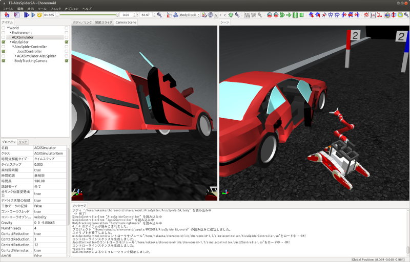
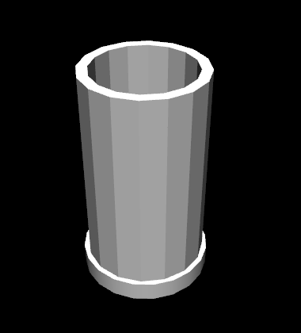
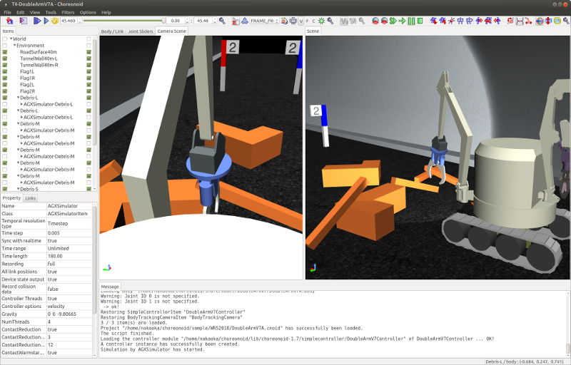
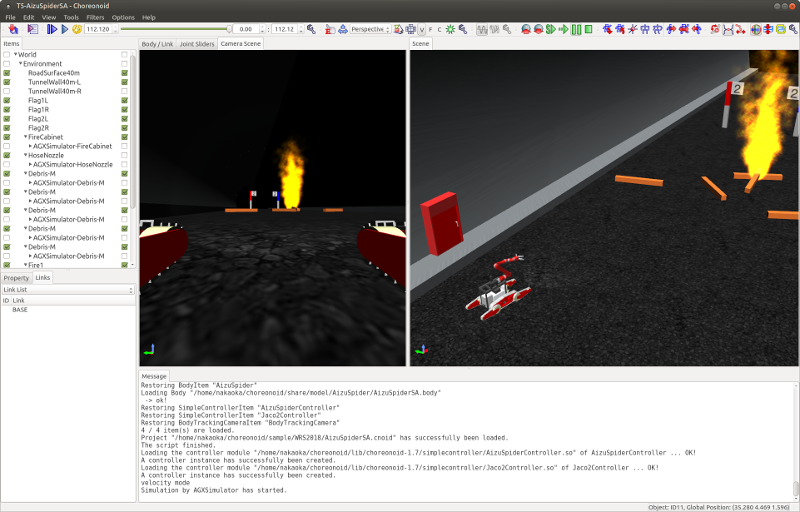
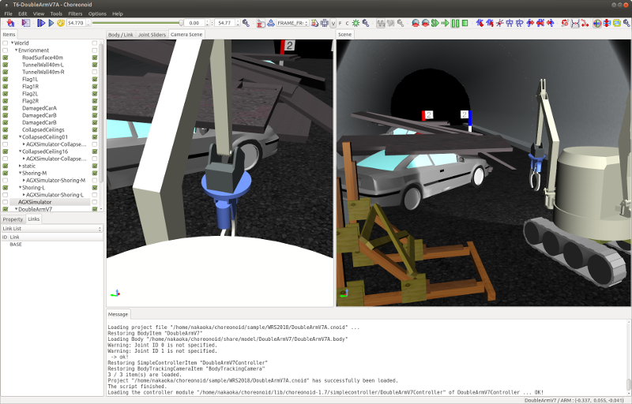

シミュレーションサンプル
========================

ここではWRS2018のシミュレーションサンプルについて紹介します。

.. contents::
   :local:

.. highlight:: sh

概要
----

WRS2018の各タスクは、以下の要素を組み合わせたシミュレーションとして実行されます。

* 環境モデル
* ロボットモデル
* ロボットの制御ソフトウェア
* ロボットの操作インタフェース
* シミュレーション設定

環境モデルについては、タスクT1〜T6について、それぞれ対応するモデルが用意されています。これにロボットを加え、シミュレーションの設定を行うことで、タスクのシミュレーションができるようになります。

ここでロボットについては競技会の参加チームごとに変わってくる部分です。標準ロボットモデルをそのまま使うチームもあるかもしれませんが、それに変更を加えたり、独自のモデルを使用するチームもあるかもしれません。また、ロボットはモデルがあるだけでは動きません。ロボットを動かすための制御ソフトウェアや、遠隔操作を行うための操作インタフェースといった要素も必要です。これについても、競技の結果を大きく左右する重要な要素で、各チームごとに独自のものを構築することになるかと思います。

そのような次第で、競技会において実際に実行されるシミュレーションは、チームごとに異なるものとなるため、それと同じものを予めChoreonoidにバンドルして提供することはできません。

その代わりに、シミュレーションのサンプルとなるものを用意していますので、ここで紹介したいと思います。サンプルを実行して試すことで、本競技が実際にどのようなものであるかを把握することができるかと思います。

ただしサンプル自体は、ロボットの制御ソフトウェアや操作インタフェースにおいて最低限のものとなっています。これだけを用いて高得点を獲得することは難しいでしょうし、そもそも完遂するのが難しいタスクも多いです。ここで紹介するサンプルはあくまでタスクのイメージをつかむためのものであり、実際の競技においてはこれに含まれるものよりもずっと高度な制御ソフトウェアや操作インタフェースが必要になるものと思ってください。そのような部分の開発を競うというのも、本競技会の趣旨のひとつであると言えるでしょう。

プロジェクトの構成と読み込み
----------------------------

シミュレーションサンプルの :ref:`basics_about_project` は、Choreonoidソースの "sample/WRS2018" ディレクトリに格納されています。

これを利用できるようにするためには、Choreonoidのビルド時に **BUILD_WRS2018** をONにするようにしてください。そのようにすることで、以下の処理を行うようになります。

* タスクのシミュレーションで必要となるコントローラがビルドされる。それらのコントローラはロボットを制御するものではなく、タスクの環境モデルの挙動を制御するものとなる。例えば、タスクT5でノズルをホースに接続し、バルブを開けて、ノズルのレバーを引くと、ノズルから消火水が放水されるようになるが、この挙動は "HoseNozzleController" というコントローラの制御によって実現している。

* ビルドディレクトリ内のshareディレクトリに、WRS2018サンプルを格納したディレクトリへのシンボリックリンクが作成される。これにより、ビルドディレクトリ内のChoreonoidからWRS2018のサンプルを実行することが可能となる。（shareディレクトリは、ソースディレクトリ上でビルドを行っている場合は、ソースのshareディレクトリになる。ビルドディレクトリを分けている場合は、ビルドディレクトリのshare/choreonoid-x.xというディレクトリになる。）

* インストール時に、インストール先のshareディレクトリ（インストール先/share/choreonoid-x.x）にWRS2018ディレクトリが作成され、そこにサンプルがインストールされる。これにより、インストールしたChoreonoidからWRS2018のサンプルを実行することが可能となる。

プロジェクトはいくつかのファイルに分けて構成されており、それらをPythonスクリプトで組み合わせて読み込むようになっています。これは、タスクが全部で6つあることに加えて、使用するロボットモデルやシミュレーション設定についても複数用意しており、それらの組み合わせをそのままプロジェクトファイルにしてしまうと、重複する内容を含む膨大な数のプロジェクトファイルが必要となるからです。その場合、何かひとつの要素を修正する際に、多数のプロジェクトファイルで同じ部分を修正する必要が生じ、管理が難しくなってしまいます。

プロジェクトを構成する要素としては以下のようなものがあります。これらは "WRS2018/project" 以下に格納されています。

* タスクの環境モデル

 * タスクT1:
  * T1L.cnoid（大型ロボット用）
  * T1M.cnoid（中型ロボット用）
 * タスクT2: T2.cnoid
 * タスクT3: T3.cnoid
 * タスクT4: T4.cnoid
 * タスクT5: T5.cnoid
 * タスクT6: T6.cnoid

 .. note:: 実際の競技では、予選から準決勝、決勝と進むにつれ、タスクの難易度が向上するようになっていました。上記は予選用のモデルとなっており、準決勝、決勝についてはファイル名にそれぞれ "-2"、"-3" という接尾辞付与したファイルとして格納してあります。

* ロボットモデルと関連する設定

 * AizuSpiderSS (単腕簡易クローラ版）: AizuSpiderSS.cnoid
 * AizuSpiderSA (単腕AGXクローラ版）: AizuSpiderSA.cnoid
 * DoubleArmV7S (簡易クローラ版): DoubleArmV7S.cnoid
 * DoubleArmV7A (AGXクローラ版): DoubleArmV7A.cnoid
 * WAREC-1: WAREC1.cnoid
 * Quadcopter: Quadcopter.cnoid

* シミュレーション設定

 * AIST物理エンジン (AGX Dynamics不要）: AISTSimulator.cnoid
 * AGX Dynamics: AGXSimulator.cnoid

* 画面（ビュー）設定

 * スタンドアロン実行用（複数のシーンビューを用意）: MultiSceneViews.cnoid
 * 遠隔操作実行用（単一のシーンビューを用意）: SingleSceneView.cnoid

これらを組み合わせたプロジェクトを構築するスクリプトとして、以下の形式のファイル名をもつPythonスクリプトを用意しています。それらは "WRS2018/script" 以下に格納しています。

* タスク-ロボットモデル.py

例えば、タスクT1で、簡易クローラ版のAizuSpiderロボットを使うプロジェクトは、

* T1M-AizuSpiderSS.py

というファイル名になります。

プロジェクトに対応するPythonスクリプトは、プロジェクトファイルと同様に、Choreonoid起動時にコマンドライン引数として指定することができます。

例えば :doc:`setup` / :ref:`wrs2018_install_choreonoid` に従ってChoreonoidをビルドした場合は、ソースディレクトリ上で ::

 bin/choreonoid sample/WRS2018/script/T1M-AizuSpiderSS.py

と入力することで、上記のプロジェクトを読み込むことができます。

Choreonoidを/usr/local以下にインストールしていて、インストール先のChoreonoidを使用する場合は、 ::

 choreonoid /usr/local/share/choreonoid-1.6/WRS2018/script/T1M-AizuSpiderSS.py

もしくは ::

 cd /usr/local/share/choreonoid-1.6
 choreonoid WRS2018/script/T1M-AizuSpiderSS.py

などとすることでで実行できます。

なお、スクリプトは予選用のモデルに対して用意しています。準決勝や決勝のモデルについては、各スクリプト内の "WRSUtil.loadProject" の引数を変更することで対応可能です。例えば T1M-AizuSpiderSS.py については、 ::

 import WRSUtil
 WRSUtil.loadProject(
     "MultiSceneViews", "T1M", "AISTSimulator", "AizuSpiderSS")

というスクリプトになっていますが、ここで"T1M"を"T1M-2"に変更すれば、準決勝用のモデルを読み込むことになります。

各スクリプトは実際には "WRS2018/script" 以下に格納されている "generate-sample-projects.py" によって生成されたものですので、そちらを修正して実行することで対応してもOKです。

タスクT1の実行
--------------

まず最初のタスクであるT1（障害走破）のサンプルを試してみましょう。これについて、いくつかのバリエーションがありますので、以下で順番に解説します。また、他のタスクにも共通の内容についてもここで解説します。

AizuSpiderSS版の実行
~~~~~~~~~~~~~~~~~~~~

まずはAGX Dynamicsのライセンスがなくても実行できるサンプルを試しましょう。以下のようにChoreonoidを起動して、AizuSpiderSSモデルを対象としたサンプルを読み込んでみてください。（以下ではソースディレクトリ上でビルドしたChoreonoidを使用するものとします。） ::

 bin/choreonoid sample/WRS2018/script/T1M-AizuSpiderSS.py

すると以下のような画面が表示されるかと思います。

.. image:: images/T1-AizuSpiderSS.png

.. この図は競技開催前の暫定版のタスクモデルなので、現在のモデルに置き換える必要がある。

ここで :ref:`simulation_start_simulation` を行いましょう。すると表示されているAizu Spiderロボットをゲームパッドで操作できるようになります。操作方法については、 :ref:`wrs_sample_controller_aizu_spider` にまとめていますので、そちらをご参照ください。

ロボットをうまく操作して、不整地を乗り越え障害物を避けながらトンネルの先の方に進んでいってください。このタスクでは、開始地点のゲートをくぐってから、トンネルの端のゴールのゲートを通り抜けると、タスクのクリアとなります。

ここで、画面の中央部に表示されているのは、ロボットに搭載されているカメラの画像です。本サンプルでは、このカメラ画像を見ながらロボットの遠隔操作を行うという設定になっています。一方で、画面の右側に表示されているのは、ロボットを斜め後方から見た視点となっています。ただし、これはロボットに搭載されているカメラの視点ではありませんので、ロボットの遠隔操作において使用することはできません。競技において、このような視点はシミュレーション用PCのみで表示し、観客への提示や審判の判定用に活用します。

ここで使用しているロボットモデル "AizuSpiderSS" では、クローラが簡易版となっています。これはChoreonoidに標準の :ref:`simulation_simulator_item` である "AISTシミュレータ" でシミュレーションを行うことが可能であり、本サンプルではそのように設定しています。ただし、動かしていただければ分かるように、クローラのベルト状の部分（履帯）が回転するわけではなく、履帯が動かないまま無理やり進んでいきます。これは :doc:`../simulation/pseudo-continuous-track` を適用したものです。この場合クローラの挙動はあまり実機に近いものとは言えず、環境との接触状況によっては動作が不安定になることもありますが、そこはこのシミュレーション方式の限界ということでご了承ください。今回の競技会でAGX Dynamicsを使用する理由のひとつは、この限界を超えるというところにあります。

なお、AISTシミュレータを使用するサンプルでは、テストのためAISTシミュレータに2つの設定を用意しています。ひとつは "AISTSimulator-Torque" というシミュレータアイテムで、そちらは指令値がトルク値となります。一方、 "AISTSimulator-Position" というシミュレータアイテムも用意しており、こちらはロボットの関節への指令値が位置（関節角度）指令となります。この両者で、制御ソフトウェアの記述方法や、シミュレーションの挙動が多少変わってきます。その詳細はここでは触れませんが、競技会ではAISTシミュレータは使いませんので、あまり気にしなくてもよいかと思います。ただし、シミュレーション実行時にどちらかのアイテムを選択しておく必要がありますので、その点はご注意ください。デフォルトではTorqueの方が選択されています。

シーンエフェクトついて
~~~~~~~~~~~~~~~~~~~~~~

T1のサンプルでは、上の図にもあるように、トンネル内の所々で煙を発生させています。これによってロボットの視界が悪くなることもあるため、競技においてはそのような中でもロボットがタスクを確実に進めるための工夫が求められます。

この煙は、シーンエフェクトと呼ばれるもので、:ref:`wrs2018_install_choreonoid` において BUILD_SCENE_EFFECTS_PLUGIN を ON にし、:doc:`../install/setup-renderer` もされていれば、有効となるものです。煙が表示されない場合はそれらの設定に不備がありますので、再度ご確認ください。シーンエフェクトとしては、他にも炎、水流等があり、他のタスクでも使われます。従って、競技を完全に再現するためには、シーンエフェクト機能が有効になっている必要があります。

ただし、シーンエフェクトを有効にすると、PCの負担も重くなります。シミュレーションを実行するPCのスペックが :ref:`wrs2018_overview_simulator` で提示したものと同等でない場合は、シミュレーションが遅くなったり、表示がスムーズでなくなったりすることがあります。その程度が大きく、参加の準備を進めるにあたって支障となる場合は、シーンエフェクトの機能をオフにしてご利用ください。

.. note:: シーンエフェクトの機能は、SceneEffectsプラグインによって実現しています。これは :ref:`wrs2018_install_choreonoid` においてBUILD_SCENE_EFFECTS_PLUGINをONにしなければビルドされません。ただし、既にビルドされてしまっている場合は、この設定を変えた上で、プラグインのファイルを削除しておく必要があります。プラグインファイルについては :ref:`basics_plugin_files` に説明がありますので、これをご参照の上、該当する "libCnoidSceneEffectsPlugin.so" の削除を行ってください。なお、シーンエフェクトを利用しない場合でも、 :doc:`../install/setup-renderer` はなるべく有効にしておいてください。

遠隔操作について
~~~~~~~~~~~~~~~~

本節で紹介するサンプルは、ロボットの操作も含めて全てシミュレーションを行うChoreonoid上で動作するというもので、 :ref:`wrs2018_overview_operation` で紹介した遠隔操作の構成とはなっていません。まずはタスクやシミュレーションの概要をつかんでいただくため、シンプルで扱いやすい構成としています。

その上で、遠隔操作化したサンプルについて、

* :doc:`teleoperation-rtm`
* :doc:`teleoperation-ros`

で紹介しますので、遠隔操作の構成を実現するにあたってはそちらを参考にしてください。

AizuSpiderSA版の実行
~~~~~~~~~~~~~~~~~~~~

次に、AGX Dynamicsを使用したシミュレーションを紹介します。競技本番はこちらで行うことになります。AGX Dynamicsのライセンスをお持ちで、 :ref:`wrs2018_install_agx` を済ませている方は、こちらも試してみてください。

単腕Aizu SpiderのAGX対応版モデルは "AizuSpiderSA" となります。以下のコマンドでこれに対応するT1のプロジェクトを読み込むことができます。 ::

 bin/choreonoid sample/WRS2018/script/T1M-AizuSpiderSA.py

ロボットの操作方法は簡易版と同じですので、こちらもゲームパッドでロボットを操作してみてください。

AGX版の場合、履帯の部分が実際にホイールのまわりを回転しながら推進するようになります。実際にこれを用いて不整地状の走行などを試していただければ、クローラの挙動がより実物に近くなっていることがお分かりいただけるかと思います。

DoubleArmV7版の実行
~~~~~~~~~~~~~~~~~~~

双腕建機型ロボットDoubleArmV7モデルに対応したサンプルも用意しています。

簡易版、AGX版について、それぞれ

* T1L-DoubleArmV7S.py
* T1L-DoubleArmV7A.py

というPythonスクリプトが対応していますので、これまでと同様の要領で読み込んで実行してみてください。

操作方法については、 :ref:`wrs_sample_controller_doublearmv7` を参照してください。

Aizu Spider と比べるとロボットのサイズがだいぶ大きくなっているのが分かるかと思います。このため不整地上の走行はより容易になるかと思いますが、狭い箇所の通り抜けはより難しくなります。ただし障害物についてはロボットのサイズに応じて調整されることになっています。詳細は :ref:`wrs2018_overview_rules` を参照ください。

WAREC-1版の実行
~~~~~~~~~~~~~~~

WAREC-1モデルに対応したサンプルは、

* T1M-WAREC1.py

になります。

このモデルについては、今のところサンプルコントローラを用意していません。

AizuSpiderやDoubleArmV7はクローラに指令を与えればとりあえず動かすことができますが、WARECの場合脚を統合的に制御して歩行動作などをさせないと動かすことができないため、とりあえず動かせるようにするだけでも、コントローラは複雑になってきます。そのような事情もあり、現状ではサンプルコントローラを提供できておりませんが、ご了承ください。

コントローラが設定されていないため、このサンプルでシミュレーションを開始すると、ロボットが重力で崩れ落ちるようになっています。

WAREC-1に関してはこのような状況のため、サンプルはT1タスクのみ用意しています。

なお、WAREC-1はAizu SpiderやDoubleArmV7 とは異なり、簡易版、AGX版といった区別はありません。サンプルとしては、AISTシミュレータ、AGXシミュレータの両方が読み込まれるようになっており、どちらでもシミュレーションが可能です。AGX Dynamicsがインストールされていれば、デフォルトでAGXシミュレータが選択されるようになっています。

マルチコプタ版の実行
~~~~~~~~~~~~~~~~~~~~

マルチコプタのサンプルとして、クアッドコプタモデルを使用した

* T1L-Quadcopter.py

というシミュレーションプロジェクトを用意しています。

このプロジェクトでも、ゲームパッドで機体を操作することができます。コントローラは :doc:`../multicopter/index` の :ref:`multicopter_plugin_sample_simulation` のものを使用していますので、操作方法についてはそちらの解説を参照してください。

タスクT2〜T6について
--------------------

T2以降のタスクについても、サンプルプロジェクトを用意しています。プロジェクトの読み込みと実行はT1と同じ要領で行ってください。基本的には、T1のプロジェクトの "T1L" または "T1M" の部分をT2〜T6のどれかに置き換えればOKです。(LとMが分かれているのはT1だけで、T2以降は各タスクごとに単一のファイルとなります。）

なお、タスクによってはT1と同じ設定のものが無いものありますが、予めご了承ください。

タスクT2
~~~~~~~~

T2は車両調査のタスクです。 

以下は T2-AizuSpiderSA.py を読み込んでシミュレーションを実行しているところです。

T2では、このようにトンネル内に車両があります。このドアを開けて、車両内部の調査を行います。

ドアはドアノブをつかんで引っ張ることで開けて下さい。サンプルではドアを少し開けた状態としています。本番では最初は完全に閉じた状態となる予定です。なお、AISTシミュレータではドアのヒンジが可動範囲を超えても動いてしまいますが、ご了承ください。AGXシミュレータでは正しく動作します。

実際の競技では、調査対象となる「ターゲットマーカ」が車両内に複数設置される予定です。

「ターゲットマーカー」は以下の図に示すような筒状の物体です。

この筒の中に、「QRコード」が貼られています。

.. image:: images/target-marker2.png

やるべきことは、ターゲットマーカーを見つけ出し、その中をカメラでとらえて、QRコードを解読することです。

実際の災害時にこのようなことを行うことはありませんが、車両内での点検ができたかどうかの判定として、競技ではこのようなマーカーを使用することになっています。

タスクT3
~~~~~~~~

タスクT3は道具を使用した車両内の調査と車両からの救助です。

T3-DoubleArmV7A.py を読み込み、DoubleArmV7でタスクを遂行中の画面を以下に示します。

.. image:: images/T3-DoubleArmV7A.png

一見T2と同様の構成になっていますが、車内には要救助者（ダミーターゲット）が閉じ込められています。ドアは通常の操作では開かなくなっています。油圧スプレッダがトンネル内に置いてありますので、それを操作してドアのロックやヒンジの部分に押し当てることで、ドアを外すことができます。（ただしこのシミュレーションにはAGX Dynamicsが必要となります。）ドアを外したら、邪魔にならないように移動させた上で、ダミーターゲットを車内より搬出するという作業になります。

ダミーターゲットは以下のようなモデルで、ぐったりとした姿勢で運転席に座っています。

.. image:: images/dummy-doll.png

タスクT4
~~~~~~~~

T4は経路の確保を行うタスクです。T4-DoubleArmV7A.py を読み込んで実行している画面を以下に示します。

サンプルでは、トンネル内に障害物がいくつか散らばっているので、それをロボットで押したり持ち上げたりして、これらの障害物を除去する操作を行ってください。

タスクT5
~~~~~~~~

T5は消火作業のタスクです。T5-AizuSpiderSA.py を読み込んで実行している画面を以下に示します。

トンネル内には消火栓が設置されています。消火栓の扉を開けると、中にはホースリール、ノズル、バルブが格納されています。

.. image:: images/FireCabinet2.png

ホースの先端をつかんで引っ張ると、ホースを引き出すことができます。まずはこの操作を試してみてください。ただしホースのシミュレーションにもAGX Dynamicsが必要となりますので、ご注意ください。

タスクとしては、ホースを引き出し、先端をノズルと接続し、バルブを回し、ノズルのレバーを引くと、ノズルから水が出ます。

水がでるようになったら、それを火災が起きている部分にあてるようにします。うまくあたれば炎が小さくなっていきます。完全に消化してゴールゲートをくぐればタスクの完了となります。

タスクT6
~~~~~~~~

T6はショアリングとブリーチングを行うタスクです。T6-DoubleArmV7A.py を読み込んで実行している画面を以下に示します。

このタスクでは、崩落した壁面の（板状の物体）が、車両の上に積み重なっています。まずショアリングとして、木製の支えを所定の壁面の下に挿入し、壁面を安定させます。次にブリーチングとして、壁面に対してドリルを用いて上から穴をあけます。穴が開いたら、その中からカメラを挿入するなどして、車両の内部を調査します。対象となる車両は窓が開いているので、そこからカメラを挿入して調査を行ってください。調査方法はT2と同様に、ターゲットマーカのQRコードを読み取る作業になります。

なお、ドリルによる穴開けについても、AGX Dynamicsが必要となります。
