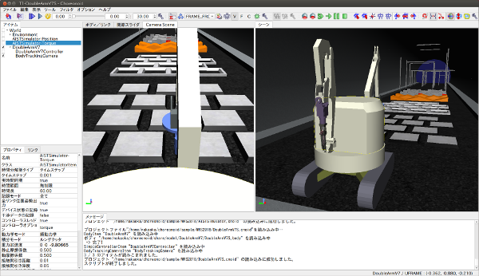
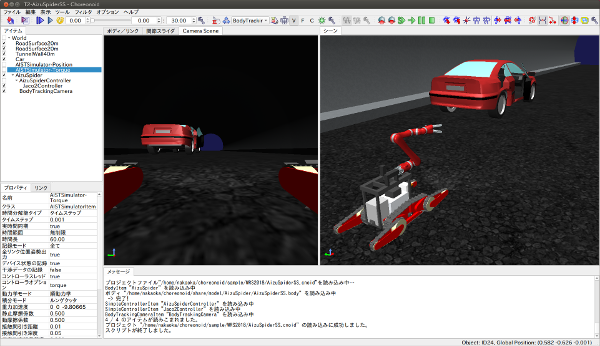

シミュレーションサンプル
========================

ここではWRS2018のシミュレーションサンプルについて紹介します。

.. contents::
   :local:

.. highlight:: sh

概要
----

WRS2018の各タスクは、以下の要素を組み合わせたシミュレーションとして実行されます。

* 環境モデル
* ロボットモデル
* ロボットの制御ソフトウェア
* ロボットの操作インタフェース
* シミュレーション設定

環境モデルについては、タスクT1〜T6について、それぞれ対応するモデルが用意されています。これにロボットを加え、シミュレーションの設定を行うことで、タスクのシミュレーションができるようになります。

ここでロボットについては競技会の参加チームごとに変わってくる部分です。標準ロボットモデルをそのまま使うチームもあるかもしれませんが、それに変更を加えたり、独自のモデルを使用するチームもあるかもしれません。また、ロボットはモデルがあるだけでは動きません。ロボットを動かすための制御ソフトウェアや、遠隔操作を行うための操作インタフェースといった要素も必要です。これについても、競技の結果を大きく左右する重要な要素で、各チームごとに独自のものを構築することになるかと思います。

そのような次第で、競技会において実際に実行されるシミュレーションは、チームごとに異なるものとなるため、それと同じものを予めChoreonoidにバンドルして提供することはできません。

その代わりに、シミュレーションのサンプルとなるものを用意していますので、ここで紹介したいと思います。サンプルを実行して試すことで、本競技が実際にどのようなものであるかを把握することができるかと思います。

ただしサンプル自体は、ロボットの制御ソフトウェアや操作インタフェースにおいて最低限のものとなっています。これだけを用いて高得点を獲得することは難しいでしょうし、そもそも完遂するのが難しいタスクも多いです。ここで紹介するサンプルはあくまでタスクのイメージをつかむためのものであり、実際の競技においてはこれに含まれるものよりもずっと高度な制御ソフトウェアや操作インタフェースが必要になるものと思ってください。そのような部分の開発を競うというのも、本競技会の趣旨のひとつであると言えるでしょう。

プロジェクトの構成と読み込み
----------------------------

シミュレーションサンプルの :ref:`basics_about_project` は、Choreonoidソースの "sample/WRS2018" ディレクトリに格納されています。Choreonoidを :ref:`build-ubuntu_install` すると、shareディレクトリのprojectディレクトリ以下に同じものがインストールされます。

プロジェクトはいくつかのファイルに分けて構成されており、それらをPythonスクリプトで組み合わせて読み込むようになっています。これは、タスクが全部で6つあることに加えて、使用するロボットモデルやシミュレーション設定についても複数用意しており、それらの組み合わせをそのままプロジェクトファイルにしてしまうと、重複する内容を含む膨大な数のプロジェクトファイルが必要となるからです。その場合、何かひとつの要素を修正する際に、多数のプロジェクトファイルで同じ部分を修正する必要が生じ、管理が難しくなってしまいます。

プロジェクトを構成する要素としては以下のようなものがあります。

* タスクの環境モデル

 * タスクT1: T1.cnoid
 * タスクT2: T2.cnoid
 * タスクT3: T3.cnoid
 * タスクT4: T4.cnoid
 * タスクT5: T5.cnoid
 * タスクT6: T6.cnoid

 .. note:: タスクの環境を構成する個々のモデルファイルは、基本的に標準モデルディレクトリの WRS2018 ディレクトリ以下に格納されています。

* ロボットモデルと関連する設定

 * AizuSpiderSS (単腕簡易クローラ版）: AizuSpiderSS.cnoid
 * AizuSpiderSA (単腕AGXクローラ版）: AizuSpiderSA.cnoid
 * DoubleArmV7S (簡易クローラ版): DoubleArmV7S.cnoid
 * DoubleArmV7A (AGXクローラ版): DoubleArmV7A.cnoid
 * WAREC-1: WAREC1.cnoid

* シミュレーション設定

 * AIST物理エンジン (AGX Dynamics不要）: AISTSimulator.cnoid
 * AGX Dynamics: AGXSimulator.cnoid

これらを組み合わせたプロジェクトを構築するスクリプトとして、以下の形式のファイル名をもつPythonスクリプトを用意しています。

* タスク-ロボットモデル.py

例えば、タスクT1で、簡易クローラ版のAizuSpiderロボットを使うプロジェクトは、

* T1-AizuSpiderSS.py

というファイル名になります。

プロジェクトに対応するPythonスクリプトは、Choreonoid起動時に --python オプションによって指定することができます。

例えば :doc:`setup` / :ref:`wrs2018_install_choreonoid` に従ってChoreonoidをビルドした場合は、ソースディレクトリ上で ::

 bin/choreonoid --python sample/WRS2018/T1-AizuSpiderSS.py

と入力することで、上記のプロジェクトを読み込むことができます。

タスクT1の実行
--------------

まずタスクT1の障害走破をみてみましょう。以下のようにChoreonoidを起動して、T1のプロトタイプを読み込んでみてください。（以下ではビルド済みのChoreonoidソースディレクトリ上でコマンドを実行するものとします。） ::

 bin/choreonoid --python sample/WRS2018/T1-DoubleArmV7S.py

すると以下のような画面が表示されるかと思います。

ここで `シミュレーションの開始 <../manuals/latest/simulation/execution-and-playback.html#id3>`_ を行いましょう。すると双腕重機ロボットをゲームパッドで操作できるようになります。ロボットをうまく操作して、不整地を乗り越え障害物を避けながら進んでみてください。

実際の競技では、調査対象となるターゲットマーカが環境中に複数設置される予定です。トンネル内を移動しながら、マーカの内容を読み取っていきます。また、これを遠隔操作で行う必要があります。遠隔操作の場合、ロボットに搭載されたカメラやセンサから得られる情報のみを頼りにタスクを遂行する必要があります。タスク遂行を高速かつ確実に行うためには、ロボットの自律性の向上も鍵になるかと思われます。

ここで読み込んだ "T1-DoubleArmV7S" のプロジェクトは、ロボットモデルのクローラが簡易版となっており、Choreonoidの標準機能のAISTシミュレータアイテムでシミュレーションを行うように設定しています。これにより、AGX Dynamicsのライセンスがなくても実行可能です。ただし、動かしていただければ分かるように、クローラ部は履帯が回転するわけではなく、クローラ部の剛体が無理やり地面に対して推力を発生して動くような仕組みになっています。このシミュレーションはクローラと環境との接触状況によっては動作が不安定になることもあり、不整地の上で動いていると突然ロボットが飛んだり転倒したりといったことも起こりえますが、そこはこのシミュレーション方式の限界ということでご了承ください。

実際の競技ではAISTシミュレータではなくAGXシミュレータでシミュレーションを行うようになっています。このプロトタイプも用意していますので、AGX Dynamicsを利用可能な方はそちらも試してみて下さい。その場合、双腕ロボットモデルであれば、"T1-DoubleArmV7A.py" を読み込みます。 ::

 bin/choreonoid --python sample/WRS2018/T1-DoubleArmV7A.py

ロボットの操作方法は簡易版と同じです。AGX版の場合、履帯の部分が実際にホイールのまわりを回転しながら推進するようになります。実際にこれを用いて不整地状の走行などを試していただければ、クローラの挙動がより実物に近くなっていることがお分かりいただけるかと思います。

次にAizu SpiderモデルでT1を試してみましょう。これまでと同様に、以下のプロジェクトを読み込みます。

* T1-AizuSpiderSS.py (簡易版）
* T1-AizuSpiderSA.py (AGX版）

Aizu Spider もゲームパッドで操作します。

ロボットの大きさが双腕重機ロボットよりも小さいため、不整地上の移動がより難しくなっているのが分かるかと思います。なお、簡易クローラの場合の不具合は、このAizu Spiderモデルでより顕著に出るため、不整地上の移動ではそのような症状が出ないようロボットの操作に気をつける必要があります。AGX版ではそのような不具合はほとんど出ないかと思います。

T2以降のサンプルの紹介
----------------------

タスクT2
~~~~~~~~

T2は車両調査のタスクです。 

プロジェクトファイルは

* T2-DoubleArmV7S.py (双腕重機ロボット、簡易版）
* T2-DoubleArmV7A.py (双腕重機ロボット、AGX版）
* T2-AizuSpiderSS.py（Aizu Spider単腕、簡易版）
* T2-AizuSpiderSA.py（Aizu Spider単腕、AGX版）

を用意しています。 ::

 bin/choreonoid --python sample/WRS2018/T2-AizuSpiderSS.py

などとして、プロジェクトを読み込んでください。すると以下にようにモデルが表示されているかと思います。

ここでトンネル内に車両があります。これのドアを開けて、車内を調査します。

ドアはドアノブを操作して開けるようにしたく思っていますが、その部分は現在開発中です。その代わりにドアを少し開けてありますので、その隙間からハンドを入れることで開けることができるかと思います。ただしAISTシミュレータでは関節可動範囲を設定できないため、ドアのヒンジが可動範囲を超えても動いてしまいます。その部分はAGXシミュレータでは正しく動作します。

タスクT3
~~~~~~~~

タスクT3は道具を使用した車両内の調査と車両からの救助です。

プロジェクトファイルは以下を用意しています。

* T3-DoubleArmV7S.py (双腕重機ロボット、簡易版）
* T3-DoubleArmV7A.py (双腕重機ロボット、AGX版）
* T3-AizuSpiderSS.py（Aizu Spider単腕、簡易版）
* T3-AizuSpiderSA.py（Aizu Spider単腕、AGX版）

一見T2と同様の構成になっていますが、車内には要救助者（ダミーターゲット）が閉じ込められています。実際の競技では、ドアは通常の操作では開かなくなっていますので、まずスプレッダを使用してドアのロックやヒンジを切断し、ドアを移動させた上で、ダミーターゲットを車内より搬出するという作業になります。ただしこの部分は現在開発中です。今回のプロトタイプではT2にダミータゲットが追加されただけの状態となっています。

タスクT4
~~~~~~~~

T4は経路の確保を行うタスクです。

プロジェクトファイルは以下を用意しています。

* T4-DoubleArmV7S.py (双腕重機ロボット、簡易版）
* T4-DoubleArmV7A.py (双腕重機ロボット、AGX版）
* T4-AizuSpiderSS.py（Aizu Spider単腕、簡易版）
* T4-AizuSpiderSA.py（Aizu Spider単腕、AGX版）

プロトタイプでは、トンネル内に障害物がいくつか散らばっているので、それをロボットで押したり持ち上げたりして、これらの障害物を除去する操作を体験してください。双腕重機ロボットでも、Aizu Spiderでも、アームをうまく操作すれば障害物をつかんで持ち上げることも可能ですので、試してみて下さい。。正確な競技内容については、ルールブックをご参照ください。

タスクT5
~~~~~~~~

T5は消火作業のタスクです。

プロジェクトファイルは以下を用意しています。

* T5-DoubleArmV7S.py (双腕重機ロボット、簡易版）
* T5-DoubleArmV7A.py (双腕重機ロボット、AGX版）
* T5-AizuSpiderSS.py（Aizu Spider単腕、簡易版）
* T5-AizuSpiderSA.py（Aizu Spider単腕、AGX版）

このプロジェクトを読み込むと、トンネル内に以下の消火栓が設置されています。

.. image:: images/FireCabinet1.png

この消火栓の扉を開けると以下のようにホースのリールやバルブが入っています。

.. image:: images/FireCabinet2.png

ロボットをうまく操作して、消火栓の扉を開けて、リールを手前に引き出したり、バルブを回したりしてみてください。

このタスクも現在開発中であり、今後リールからホースを取り出せるようにします。消火栓内には今後ノズルも設置され、取り出したホースにノズルを接続し、バルブを回すと消火作業を開始することができます。トンネル内では火災が起きており、その箇所めがけてホースを操作します。ノズルのスイッチを入れると水が出ますので、それをうまく炎に当てて消火作業を行います。

タスクT6
~~~~~~~~

T6はショアリングとブリーチングを行うタスクです。このタスクも開発中で、プロトタイプはまだ用意できていません。
