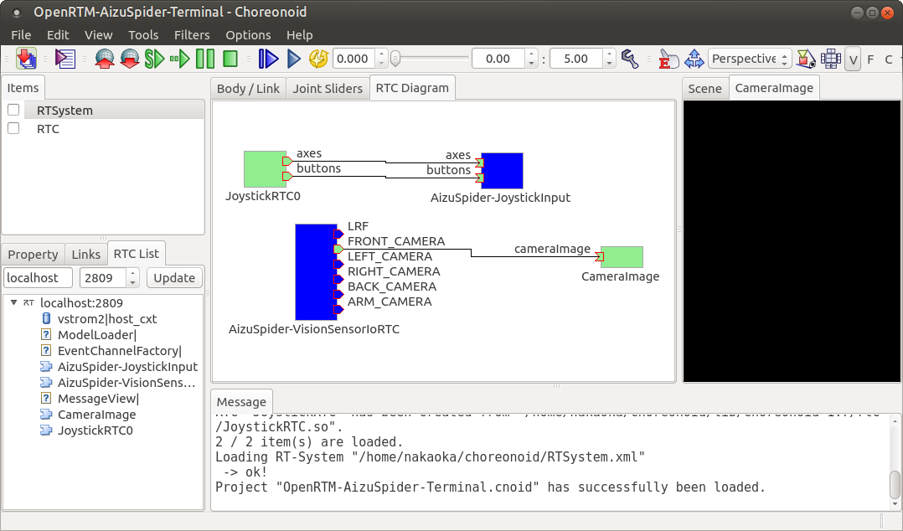

OpenRTMによる遠隔操作サンプル
=============================

:doc:`simulation-samples` では、シミュレータ上で直接ロボットの操作もできるサンプルを紹介しました。しかし、実際の競技ではロボットの操作はシミュレーション用PCとは異なるPC上で行い、遠隔操作とする必要があります。ロボットの操作を遠隔操作可する手段として、ここではOpenRTMを用いたサンプルを紹介します。

.. contents::
   :local:

.. highlight:: sh

OpenRTMの準備
-------------

OpenRTMによる遠隔操作を行うための準備として、まず :ref:`wrs2018_install_openrtm` をしておく必要があります。Choreonoidのビルドにおいても、

 * ENABLE_CORBA
 * BUILD_CORBA_PLUGIN
 * BUILD_OPENRTM_PLUGIN
 * BUILD_OPENRTM_SAMPLES

を有効にして、OpenRTM関連の機能やサンプルをビルドするようにしてください。

:ref:`openrtmplugin_setup_corba` も確認しておいてください。

遠隔操作サンプルの実行
----------------------

OpenRTMによる遠隔操作を行う場合、まずシミュレーションを行うChoreonoid上にRTCを導入し、ロボットの操作に必要な入出力をRTコンポーネント経由でできるようにします。

そのように設定したサンプルを、 :doc:`simulation-samples` で紹介したサンプルに "-RTM" のサフィックスをつけた名前で提供しています。

今のところ、以下のプロジェクトを用意しています。

* T1-AizuSpiderSA-RTM.py
* T1-AizuSpiderSS-RTM.py

:doc:`simulation-samples` で説明したのと同じ要領で、上記のどちらかのプロジェクトを読み込んでください。例えばChoreonoidのソースディレクトリから、 ::

 bin/choreonoid --python samplw/WRS2018/T1-AizuSpiderSA-RTM.py

などとします。

次に、遠隔操作のインタフェースを用意します。本サンプルでは、遠隔操作インタフェースにもChoreonoidを使いますので、これを起動しましょう。そのためのプロジェクトファイルは、

* sample/OpenRTM/OpenRTM-AizuSpider-Terminal.cnoid

になります。シミュレーション用のChoreonoidは起動したまま、2つ目のChoreonoidを起動するようにします。そのためのコマンドライン端末を新たに起動し、先ほどと同様にソースディレクトリから ::

 bin/choreonoid sample/OpenRTM/OpenRTM-AizuSpider-Terminal.cnoid

などと入力します。

遠隔操作側のChoreonoidは、以下のような画面になるかと思います。

画面中央にあるのは、「RTCダイアグラムビュー」と呼ばれるものです。これはOpenRTMの標準ツールである "RT System Editor" と同様の機能を提供するものです。

このダイアグラムの中で、"AizuSpider-JoystickInput" はシミュレーション用のChoreonoidで設定・生成されているRTCです。これはジョイスティックの入力ポートを持っており、ジョイスティックの状態をロボットの制御プログラムに伝えるためのものです。

また、"AizuSpider-VisionSensorIoRTC" というのは、やはりシミュレーション用のChoreonoidで設定・生成されているRTCで、視覚センサのデータを出力するポートを備えています。ロボットが搭載している視覚センサの数だけ出力ポートがあります。ポートの名前はセンサの名前に対応しています。

一方で、"JoystickRTC0" は、遠隔操作側のChoreonoid（つまりこの画面のChoreonoid）で生成されているRTCです。これは名前のとおりジョイスティックに対応するもので、ジョイスティックの状態を出力するRTCとなっています。この出力ポートを "AizuSpider-JoystickInput" の入力ポートに接続することで、ジョイスティックの状態をロボットに伝えられるようになります。

"CameraImage" は、カメラ画像を表示するビューに対応するRTCです。これは画面の右側で "CameraImage" という名前がつけられたビューになります。これも、ポート接続を行うことにより、ロボットのカメラ画像を端末側で表示することが可能となります。

この状態では、まだシミュレーションが開始していない（＝ロボットが動作していない）ため、ロボット側の "AizuSpider-JoystickInput" と "AizuSpider-VisionSensorIoRTC" はアクティベートされておらず、青色で表示されています。一方、端末側の "JoystickRTC0" と "CameraImage" は既に使える状態で、RTCもアクティベート状態となっており、緑色で表示されています。

ではシミュレーションを開始し、遠隔操作を行うことにしましょう。「シミュレーション側のChoreonoid」で、シミュレーション開始の操作を行ってください。（遠隔操作側のChoreonoidで行っても何も起きませんのでご注意ください。）

すると遠隔操作側のChoreonoidは以下のような表示になったかと思います。

.. image:: images/openrtm-terminal2.png

シミュレーションが開始したことで、ロボット側のRTCがアクティブ状態（緑色）となりました。また、CameraImageビューに、ロボットのカメラの画像が表示されているかと思います。ここでゲームパッドを操作すると、ロボットの操作を行うことができます。

PC2台を用いた遠隔通信
---------------------

上で試してもらったのは、シミュレーション（ロボット）側も操作側も同じPC上で動かすものでした。この場合でも両者の間でOpenRTMによる通信は行っておりますが、本来は :ref:`wrs2018_overview_operation` で述べたように、シミュレーション側と操作側を別々のPCとし、それらの間で遠隔通信を行わなければなりません。

これを実現するため、まずChoreonoidが動作するPCを2台用意してください。片方をシミュレーション用PCとし、もう片方を遠隔操作用PCとします。なお、シミュレーションはスペックの高いPCで行うことが望ましいですが、操作側は（今回のサンプルに関しては）高いスペックは必要ないため、2台のPCでスペックに差がある場合は、スペックの高い方のPCをシミュレーション用PCに割り当てるようにします。また、ゲームパッドは遠隔操作用PCに接続しておきます。

次に、通信対象の設定を行います。複数のPCにまたがるRTC同士が通信をするためには、それぞれの居場所を互いに知る必要があります。OpenRTMでは一般的にこれを共有のネームサーバによって実現します。複数のPCで同一のネームサーバを使うようにしていれば、その中に登録されているRTCが実際にどこに存在していても、通信が可能になるわけです。

ネームサーバを共有にするには、片方のPCで使用するネームサーバのアドレスを、もう片方のPCのアドレスにしておきます。このやり方はいろいろとありますが、今回は以下のようにしましょう。まずシミュレーション用PCにおいて、シミュレーション用のChoreonoidを起動するディレクトリに、rtc.confというファイルを作成し、以下のように記述しておきます。 ::

 corba.nameservers: 遠隔操作用PCのホスト名またはIPアドレス

これでシミュレーション用PCで使用するネームサーバが遠隔操作用PCのネームサーバとなり、ネームサーバの共有が達成されます。

各PCは通常DHCPでアドレスを割り当てられることが多いのではないかと思います。その場合は割り当てられたIPアドレスを調べておく必要があります。DHCPの場合、ネットワークに接続する度にアドレスが変わる可能性もありますので、毎回アドレスを確認した方がよいかもしれません。

.. note:: rtc.conf はOpenRTMの設定用のファイルです。カレントディレクトリにこのファイルがあると、そこに記述された設定が適用されます。rtc.confに相当するファイルは他にもありますが、詳細はOpenRTMのマニュアルを参照してください。

あとは上述の操作をシミュレーション用PCと遠隔操作用PCのそれぞれで分けて行えばOKです。先ほどと同じプロジェクトであれば、まずシミュレーション用PCのChoreonoidソースディレクトリにて、 ::

 bin/choreonoid --python samplw/WRS2018/T1-AizuSpiderSA-RTM.py

を実行し、次に遠隔操作用PCのChoreonoidソースディレクトリにて、 ::

 bin/choreonoid sample/OpenRTM/OpenRTM-AizuSpider-Terminal.cnoid

を実行します。

そしてシミュレーション用PCのChoreonoidでシミュレーションを開始してください。

すると先ほどと同様に、遠隔操作用のChoreonoidでカメラ画像を見ながらゲームパッドによる操作ができるはずです。
